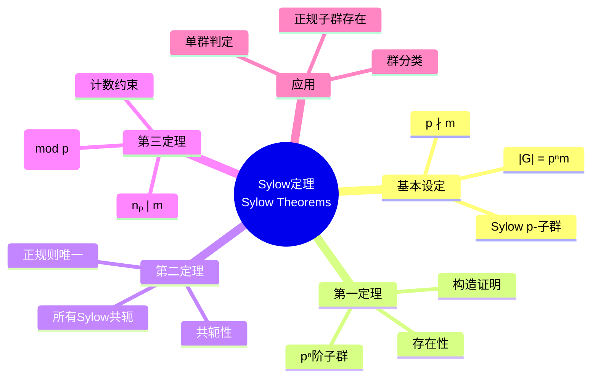
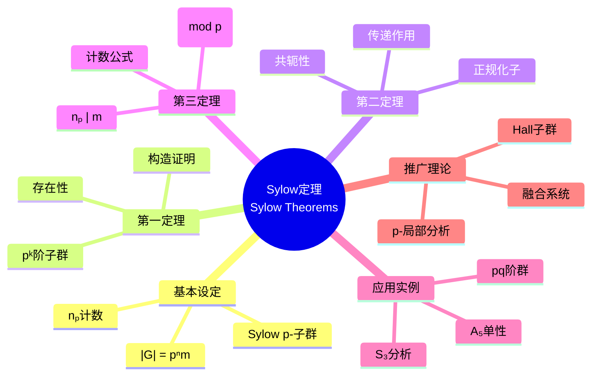

# Sylow定理思维导图

## 中心概念精确定义

**Sylow定理 (Sylow Theorems)**

设 $G$ 是有限群，$|G| = p^n m$，其中 $p$ 是素数，$p \nmid m$。

**Sylow p-子群**：$G$ 的 $p^n$ 阶子群称为 **Sylow p-子群**。

记：
- $\text{Syl}_p(G)$：$G$ 的所有Sylow p-子群的集合
- $n_p = |\text{Syl}_p(G)|$：Sylow p-子群的个数

**Sylow三大定理**：
1. **存在性**：$n_p \geq 1$（Sylow p-子群存在）
2. **共轭性**：所有Sylow p-子群互相共轭
3. **计数**：$n_p \equiv 1 \pmod{p}$ 且 $n_p \mid m$

---

## 核心要素

### 1. p-子群与Sylow p-子群

**p-子群**：阶为 $p^k$（$k \geq 0$）的子群。

**Sylow p-子群**：极大 p-子群，阶恰为 $p^n$（$p$-部分）。

**性质**：
- Sylow p-子群是 p-子群
- 任何 p-子群都含于某Sylow p-子群
- Sylow p-子群是 $p$-群

### 2. Sylow第一定理（存在性）

**定理**：若 $p^k \mid |G|$，则 $G$ 有 $p^k$ 阶子群。

**证明思路**：
1. 考虑 $G$ 的所有 $p^k$ 元子集构成的集合 $X$
2. $G$ 通过左乘作用在 $X$ 上
3. 计数论证：$|X| = \binom{p^n m}{p^k} \not\equiv 0 \pmod{p}$
4. 存在轨道长度不被 $p$ 整除，利用轨道-稳定子定理

**推论**：Sylow p-子群存在。

### 3. Sylow第二定理（共轭性）

**定理**：若 $P, Q$ 是Sylow p-子群，则存在 $g \in G$ 使 $Q = gPg^{-1}$。

**证明要点**：
- 考虑 $Q$ 在 $G/P$（左陪集）上的作用
- 由 $p$-群的不动点定理，存在不动点 $gP$
- 导出 $Q \subseteq gPg^{-1}$，由阶相等得等号

**意义**：
- Sylow p-子群在共轭下唯一
- $n_p = [G : N_G(P)]$
- Sylow p-子群正规 $\Leftrightarrow$ $n_p = 1$

### 4. Sylow第三定理（计数）

**定理**：$n_p \equiv 1 \pmod{p}$ 且 $n_p \mid m$。

**证明**：
- $n_p = [G : N_G(P)]$，故 $n_p \mid |G| = p^n m$
- 由共轭性，$G$ 共轭作用在 $\text{Syl}_p(G)$ 上
- $p$-群作用的不动点定理：$n_p \equiv |\text{Fix}| \pmod{p}$
- 唯一不动点是 $P$ 本身

---

## 性质与定理

### 定理1：Sylow子群的正规化子

**命题**：$n_p = [G : N_G(P)]$，其中 $N_G(P)$ 是 $P$ 的正规化子。

**证明**：由轨道-稳定子定理，$G$ 共轭作用在Sylow p-子群上。

### 定理2：Frattini论断

**命题**：若 $N \trianglelefteq G$，$P \in \text{Syl}_p(N)$，则 $G = N_G(P)N$。

**证明**：对任意 $g \in G$，$gPg^{-1} \subseteq N$ 也是Sylow p-子群，故存在 $n \in N$ 使 $gPg^{-1} = nPn^{-1}$，即 $n^{-1}g \in N_G(P)$。

### 定理3：Burnside正规p-补定理

**命题**：若Sylow p-子群 $P \subseteq Z(N_G(P))$，则 $G$ 有正规p-补（即正规子群 $N$ 使 $G = N \rtimes P$）。

### 定理4：阶为pq的群（p < q）

**命题**：若 $|G| = pq$，$p < q$，$p \nmid (q-1)$，则 $G \cong \mathbb{Z}_{pq}$。

**证明**：由Sylow定理，$n_q \equiv 1 \pmod{q}$ 且 $n_q \mid p$，故 $n_q = 1$。Sylow q-子群正规。类似分析 $n_p$。

### 定理5：15阶群是循环群

**命题**：$|G| = 15 = 3 \times 5$，则 $G \cong \mathbb{Z}_{15}$。

**证明**：$n_5 = 1$（因 $n_5 \equiv 1 \pmod{5}$ 且 $n_5 \mid 3$），Sylow 5-子群 $P_5 \trianglelefteq G$。同理 $n_3 = 1$，$P_3 \trianglelefteq G$。故 $G \cong P_3 \times P_5 \cong \mathbb{Z}_{15}$。

---

## 典型例子

### 例子1：$S_3$ 的Sylow子群

**阶**：$|S_3| = 6 = 2 \times 3$

**Sylow 2-子群**：
- $n_2 \equiv 1 \pmod{2}$，$n_2 \mid 3$ $\Rightarrow$ $n_2 = 1$ 或 $3$
- 实际：$\{(1), (12)\}$，$\{(1), (13)\}$，$\{(1), (23)\}$
- $n_2 = 3$

**Sylow 3-子群**：
- $n_3 \equiv 1 \pmod{3}$，$n_3 \mid 2$ $\Rightarrow$ $n_3 = 1$
- 实际：$A_3 = \{(1), (123), (132)\} \trianglelefteq S_3$

### 例子2：$A_5$ 的单性证明

**命题**：$A_5$ 是单群。

**证明概要**：$|A_5| = 60 = 2^2 \times 3 \times 5$。
- $n_5 \equiv 1 \pmod{5}$，$n_5 \mid 12$ $\Rightarrow$ $n_5 = 6$
- $n_3 \equiv 1 \pmod{3}$，$n_3 \mid 20$ $\Rightarrow$ $n_3 \in \{1, 4, 10\}$
- 实际：$n_3 = 10$，$n_2 = 5$（Klein四元群）
- 假设 $N \trianglelefteq A_5$ 非平凡，分析可能的阶

### 例子3：阶为 $p^2$ 的群

**命题**：$|G| = p^2$，则 $G \cong \mathbb{Z}_{p^2}$ 或 $\mathbb{Z}_p \times \mathbb{Z}_p$。

**证明**：由 $p$-群中心非平凡，$|Z(G)| = p$ 或 $p^2$。
- 若 $|Z(G)| = p^2$，则 $G$ Abel，得结论
- 若 $|Z(G)| = p$，则 $G/Z(G)$ 循环，故 $G$ Abel，矛盾

---

## 关联概念

| 概念 | 关系 | 说明 |
|------|------|------|
| **p-群** | 基础 | Sylow子群是极大 p-群 |
| **有限单群** | 应用 | Sylow理论是证明单性的工具 |
| **群扩张** | 应用 | 用Sylow子群分解群结构 |
| **可解群** | 相关 | Hall定理推广Sylow定理 |
| **组合计数** | 方法 | Sylow定理证明用计数技巧 |
| **群上同调** | 进阶 | 研究群扩张的代数工具 |

---

## 思维导图可视化

---

## 深入学习

### 推荐教材
- Dummit & Foote, *Abstract Algebra*, Chapter 5
- Rose, *A Course on Group Theory*
- Hall, *The Theory of Groups*

### 相关课程
- MIT 18.704 (Seminar in Algebra)
- Harvard Math 122 (Algebra I)

### 进阶主题
- **Hall子群**：可解群中的Sylow推广
- **p-局部分析**：有限单群分类的核心方法
- **融合系统**：从Sylow子群重构群结构

---

*本思维导图完整呈现Sylow定理体系，是有限群论的核心工具，广泛应用于群分类和单群研究。*
