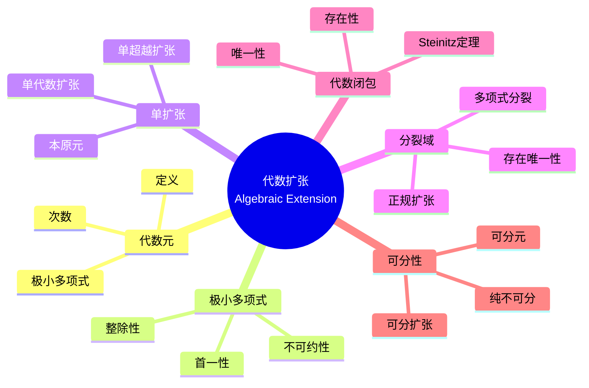

msc_primary: "00A99"
msc_secondary: ['00-XX']
---

# 代数扩张思维导图

## 中心概念精确定义

**代数扩张 (Algebraic Extension)**

设 $F$ 是域，$K/F$ 是域扩张。元素 $\alpha \in K$ 称为**代数元**，若存在非零多项式 $f(x) \in F[x]$ 使 $f(\alpha) = 0$。

**代数扩张**：$K/F$ 是**代数扩张**，若 $K$ 中每个元素都是 $F$ 上的代数元。

**超越元**：不是代数元的元素称为**超越元**。

**超越扩张**：含超越元的扩张。

---

## 核心要素



### 1. 代数元与极小多项式

**极小多项式**：代数元 $\alpha$ 的**极小多项式** $m_{\alpha, F}(x)$ 是满足 $m_{\alpha, F}(\alpha) = 0$ 的次数最低的首一多项式。

**性质**：
- 唯一存在
- 在 $F[x]$ 中不可约
- 整除任何以 $\alpha$ 为根的多项式

**次数**：$[F(\alpha) : F] = \deg(m_{\alpha, F})$

### 2. 单扩张的结构

**单代数扩张**：$F(\alpha) \cong F[x]/(m_\alpha(x))$

**结构**：
- 作为 $F$-向量空间，基为 $\{1, \alpha, \ldots, \alpha^{n-1}\}$，$n = [F(\alpha):F]$
- 域运算由极小多项式确定

**单超越扩张**：$F(\alpha) \cong F(x)$（有理函数域）

### 3. 分裂域

**定义**：多项式 $f(x) \in F[x]$ 的**分裂域**是包含 $f$ 所有根的最小域扩张。

**存在性**：对任意 $f$，分裂域存在。

**唯一性**：在同构意义下唯一。

**例子**：$x^2 + 1 \in \mathbb{R}[x]$ 的分裂域是 $\mathbb{C}$。

### 4. 代数闭包

**代数闭域**：域 $F$ 是**代数闭**的，若 $F[x]$ 中非常数多项式在 $F$ 中有根。

**代数闭包**：$\overline{F}$ 是包含 $F$ 的代数闭代数扩张。

**Steinitz定理**：每个域有代数闭包，在同构意义下唯一。

**例子**：$\mathbb{C}$ 是 $\mathbb{R}$ 的代数闭包；$\overline{\mathbb{Q}}$ 是 $\mathbb{Q}$ 的代数闭包（代数数域）。

---

## 性质与定理

### 定理1：塔律 (Tower Law)

**命题**：$F \subseteq K \subseteq L$，则 $[L:F] = [L:K][K:F]$。

**推论**：
- 有限扩张的有限扩张是有限扩张
- $[K:F] < \infty$ 且 $[L:K] < \infty$ $\Rightarrow$ $[L:F] < \infty$

### 定理2：代数扩张的传递性

**命题**：若 $K/F$ 和 $L/K$ 都是代数扩张，则 $L/F$ 也是代数扩张。

**证明**：设 $\alpha \in L$，则 $\alpha$ 在 $K$ 上代数，设极小多项式系数在 $K$ 的有限生成子域 $K'$ 中，$K'/F$ 有限，故 $\alpha$ 在 $F$ 上代数。

### 定理3：本原元定理（部分）

**命题**：有限可分扩张 $K/F$ 是单扩张。

**特别**：$\mathbb{Q}$ 的有限扩张总有本原元。

### 定理4：代数闭包的性质

**命题**：$\overline{F}$ 满足：
1. $F \subseteq \overline{F}$
2. $\overline{F}/F$ 代数
3. $\overline{F}$ 代数闭

**唯一性**：任意两个代数闭包 $F$-同构。

### 定理5：Lüroth定理

**命题**：$F(x)/F$ 的中间域形如 $F(\varphi(x))$，$\varphi(x) \in F(x)$。

**意义**：单超越扩张的子域仍是单超越的。

---

## 典型例子

### 例子1：$\mathbb{Q}(\sqrt{2})$

**结构**：$x^2 - 2$ 的分裂域

**基**：$\{1, \sqrt{2}\}$，$[\mathbb{Q}(\sqrt{2}):\mathbb{Q}] = 2$

**元素形式**：$a + b\sqrt{2}$，$a, b \in \mathbb{Q}$

### 例子2：$\mathbb{Q}(\sqrt[3]{2})$

**结构**：极小多项式 $x^3 - 2$

**不是分裂域**：不含复根 $\omega \sqrt[3]{2}$，$\omega = e^{2\pi i/3}$

**基**：$\{1, \sqrt[3]{2}, \sqrt[3]{4}\}$

### 例子3：分圆域 $\mathbb{Q}(\zeta_n)$

**定义**：$\zeta_n = e^{2\pi i/n}$ 是本原 $n$ 次单位根

**次数**：$[\mathbb{Q}(\zeta_n):\mathbb{Q}] = \varphi(n)$

**性质**：
- 是 $x^n - 1$ 的分裂域
- 是Abel扩张（Galois群Abel）

---

## 关联概念

| 概念 | 关系 | 说明 |
|------|------|------|
| **Galois理论** | 应用 | 代数扩张的对称性 |
| **分裂域** | 特例 | 多项式的完全分裂 |
| **可分性** | 细化 | 代数扩张的分类 |
| **超越次数** | 推广 | 超越扩张的维数 |
| **赋值论** | 应用 | 局部域的构造 |
| **代数数论** | 应用 | 代数整环的研究 |

---

## 思维导图可视化

```mermaid
mindmap
  root((代数扩张<br/>Algebraic Extension))
    代数元
      极小多项式
      不可约性
      整除性
    单扩张
      F(α)结构
      向量空间基
      运算规则
    分裂域
      多项式分裂
      存在唯一性
      正规性
    代数闭包
      代数闭域
      Steinitz定理
      代数数域
    核心定理
      塔律
      传递性
      本原元定理
    典型例子
      ℚ(√2)
      ℚ(∛2)
      分圆域

```

---

## 深入学习

### 推荐教材
- Dummit & Foote, *Abstract Algebra*, Chapter 13
- Lang, *Algebra*, Chapter 5
- Morandi, *Field and Galois Theory*

### 相关课程
- MIT 18.704 (Seminar in Algebra)
- Harvard Math 122 (Algebra I)

### 进阶主题
- **Galois理论**：代数扩张的群论刻画
- **可分扩张**：特征p域的特殊现象
- **超越理论**：超越元的独立性

---

*本思维导图系统呈现代数扩张理论，从极小多项式到代数闭包，是域论和Galois理论的基础。*
