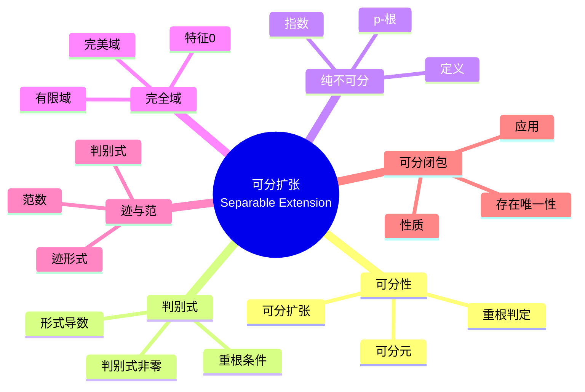
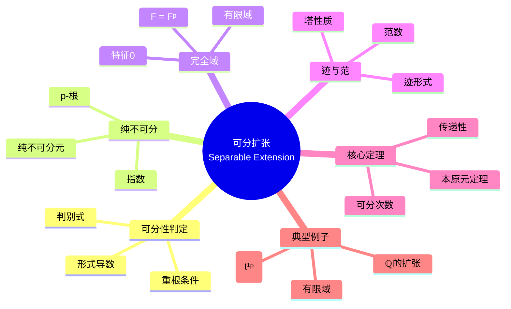

msc_primary: "00A99"
msc_secondary: ['00-XX']
---

# 可分扩张思维导图

## 中心概念精确定义

**可分扩张 (Separable Extension)**

设 $F$ 是域，$K/F$ 是代数扩张。

**可分元**：$\alpha \in K$ 是**可分元**，若其极小多项式 $m_\alpha(x)$ 在代数闭包中无重根。

**可分扩张**：$K/F$ 是**可分扩张**，若 $K$ 中每个元素都是 $F$ 上的可分元。

**不可分扩张**：存在不可分元的扩张。

**纯不可分元**：$\alpha$ 是**纯不可分元**，若极小多项式形如 $x^{p^n} - a$，$a \in F$。

**完全域**：所有代数扩张都可分的域（特征0域或有限域）。

---

## 核心要素

### 1. 可分性的判别

**形式导数**：$f(x) = a_n x^n + \cdots + a_0$，$f'(x) = n a_n x^{n-1} + \cdots + a_1$。

**判别准则**：
- $f$ 有重根 $\Leftrightarrow$ $\gcd(f, f') \neq 1$
- 不可约 $f$ 有重根 $\Leftrightarrow$ $f' = 0$

**特征p情形**：$f' = 0$ 当且仅当 $f(x) = g(x^p)$ 对某个 $g$。

**结论**：
- 特征0：所有代数扩张可分
- 特征p：不可约多项式可能不可分

### 2. 纯不可分扩张

**定义**：$K/F$ 是**纯不可分扩张**，若每个 $\alpha \in K$ 是纯不可分元。

**等价条件**：
- 对任意 $\alpha \in K$，存在 $n$ 使 $\alpha^{p^n} \in F$
- $[K:F]_s = 1$（可分次数为1）

**结构**：纯不可分扩张是 $p^n$-根的一步步添加。

### 3. 完全域

**定义**：域 $F$ 是**完美**的（或**完全**的），若所有代数扩张都可分。

**分类**：
- 特征0域都是完全的
- 特征p域 $F$ 完全当且仅当 $F = F^p$（每个元素都是p次幂）

**例子**：
- 完全：$\mathbb{Q}$，$\mathbb{R}$，$\mathbb{C}$，$\mathbb{F}_q$（有限域），代数闭域
- 不完全：$\mathbb{F}_p(t)$，$\mathbb{F}_p((t))$

### 4. 迹与范数

**迹 (Trace)**：$\text{tr}_{K/F}(\alpha) = [K:F(\alpha)]_i \cdot \sum_{\sigma} \sigma(\alpha)$

**范数 (Norm)**：$N_{K/F}(\alpha) = \left(\prod_{\sigma} \sigma(\alpha)\right)^{[K:F(\alpha)]_i}$

其中求和/积取遍所有 $F$-嵌入 $F(\alpha) \to \overline{F}$。

**性质**：
- $\text{tr}: K \to F$ 是 $F$-线性映射
- $N: K^\times \to F^\times$ 是群同态
- 塔性质：$\text{tr}_{L/F} = \text{tr}_{K/F} \circ \text{tr}_{L/K}$

---

## 性质与定理

### 定理1：可分性的传递性

**命题**：$F \subseteq K \subseteq L$，若 $L/K$ 和 $K/F$ 都可分，则 $L/F$ 可分。

**推论**：可分扩张的塔仍是可分扩张。

### 定理2：本原元定理（完全版）

**命题**：有限可分扩张 $K/F$ 是单扩张。

**证明要点**：中间域有限，避免无限个中间域。

### 定理3：可分与纯不可分分解

**命题**：任意代数扩张 $K/F$ 可分解为可分部分和纯不可分部分：
- $K_s = \{\alpha \in K : \alpha \text{ 可分}\}$ 是 $K/F$ 的极大可分子扩张
- $K/K_s$ 是纯不可分的

**塔**：$F \subseteq K_s \subseteq K$，其中 $K_s/F$ 可分，$K/K_s$ 纯不可分。

### 定理4：可分次数公式

**命题**：$[K:F] = [K:F]_s \cdot [K:F]_i$

其中：
- $[K:F]_s = |\text{Hom}_F(K, \overline{F})|$（可分次数）

- $[K:F]_i = [K:F]/[K:F]_s$（不可分次数，是p的幂）

### 定理5：有限域的完全性

**命题**：有限域 $\mathbb{F}_q$ 是完全域。

**证明**：Frobenius $x \mapsto x^p$ 是自同构，故 $\mathbb{F}_q = \mathbb{F}_q^p$。

---

## 典型例子

### 例子1：特征p的不可分扩张

**设定**：$F = \mathbb{F}_p(t)$，$K = F(t^{1/p}) = F(s)$，$s^p = t$。

**分析**：
- $s$ 的极小多项式是 $x^p - t = (x - s)^p$（在 $K$ 中）
- $x^p - t$ 在 $F[x]$ 不可约（Eisenstein）
- $s$ 是不可分元（重根）

**结论**：$K/F$ 是纯不可分扩张，$[K:F] = p$，$[K:F]_s = 1$。

### 例子2：有限域扩张

**设定**：$\mathbb{F}_{p^n}/\mathbb{F}_p$

**性质**：
- 完全可分（有限域完全）
- Galois群是循环群，生成元为Frobenius $\sigma(x) = x^p$
- $|\text{Gal}| = [\mathbb{F}_{p^n} : \mathbb{F}_p] = n$

### 例子3：$\mathbb{Q}$ 的扩张

**性质**：
- 特征0，所有代数扩张可分
- 任意有限扩张 $K/\mathbb{Q}$ 有本原元
- 迹形式非退化（判别式非零）

---

## 关联概念

| 概念 | 关系 | 说明 |
|------|------|------|
| **Galois扩张** | 组合 | Galois = 正规 + 可分 |
| **本原元定理** | 应用 | 可分扩张都是单扩张 |
| **Frobenius** | 特征p | $x \mapsto x^p$ 决定可分性 |
| **判别式** | 工具 | 判定可分性的计算工具 |
| **微分** | 联系 | 形式导数判别重根 |
| **代数几何** | 应用 | 可分扩张与光滑性 |

---

## 思维导图可视化

---

## 深入学习

### 推荐教材
- Dummit & Foote, *Abstract Algebra*, Chapter 14
- Lang, *Algebra*, Chapter 5
- Morandi, *Field and Galois Theory*

### 相关课程
- MIT 18.704 (Seminar in Algebra)
- Harvard Math 122 (Algebra I)

### 进阶主题
- **Kähler微分**：分性的微分几何视角
- **平展上同调**：特征p代数几何的核心
- **分歧理论**：局部域的可分扩张

---

*本思维导图深入阐述可分扩张理论，从可分性判别到迹与范数，是理解Galois理论和特征p域论的关键。*
