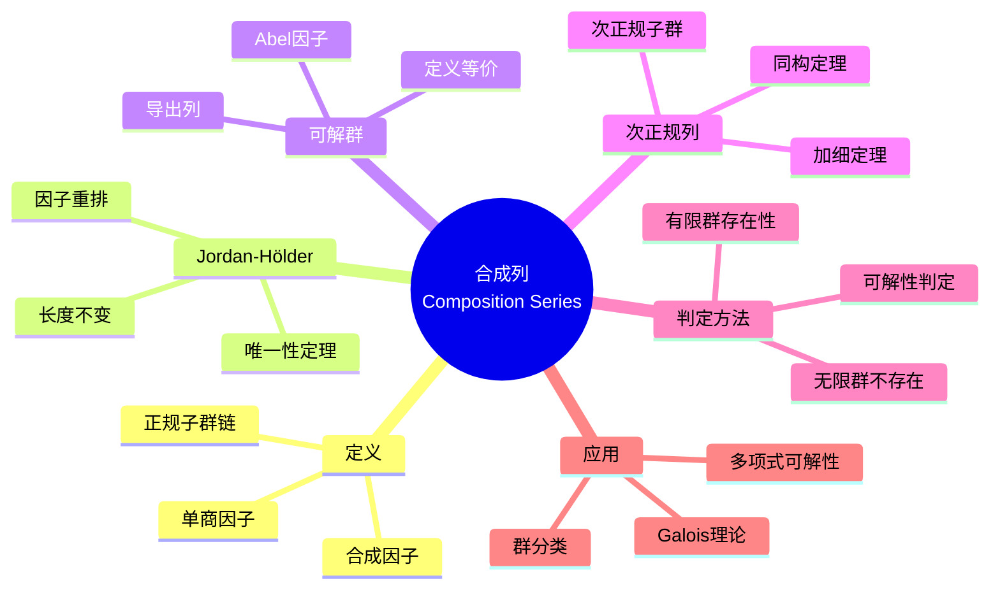
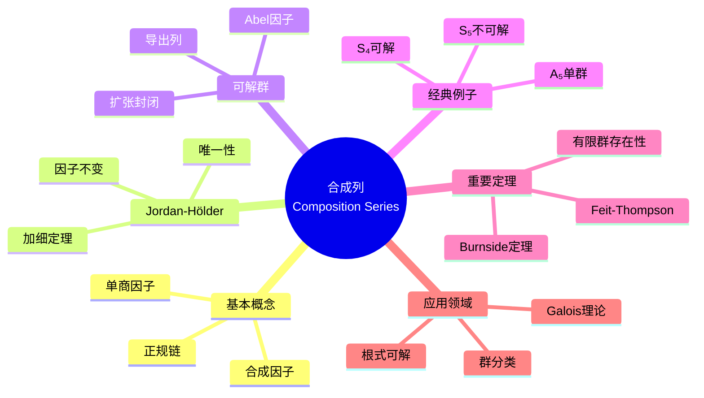

msc_primary: "00A99"
msc_secondary: ['00-XX']
---

# 合成列思维导图

## 中心概念精确定义

**合成列 (Composition Series)**

群 $G$ 的**合成列**是子群链：
$$G = G_0 \triangleright G_1 \triangleright G_2 \triangleright \cdots \triangleright G_n = \{e\}$$

满足：
1. 每个 $G_{i+1}$ 是 $G_i$ 的正规子群
2. 每个商因子 $G_i/G_{i+1}$ 是**单群**（称为**合成因子**）

**Jordan-Hölder定理**：若群 $G$ 有两个合成列，则它们长度相同，且合成因子（不计顺序）相同。

**可解群 (Solvable Group)**：存在合成列使得每个合成因子都是素数阶循环群（或等价地，Abel群）。

---

## 核心要素

### 1. 次正规列与加细

**次正规列**：$G = G_0 \triangleright G_1 \triangleright \cdots \triangleright G_n = \{e\}$
- 只要求 $G_{i+1} \trianglelefteq G_i$（不必在 $G$ 中正规）

**加细**：在相邻项之间插入更多正规子群。

**Schreier加细定理**：任意两个次正规列有等价的加细。

**证明工具**：Zassenhaus引理（蝴蝶引理）。

### 2. Jordan-Hölder定理

**定理**：若
$$G = G_0 \triangleright G_1 \triangleright \cdots \triangleright G_n = \{e\}$$
$$G = H_0 \triangleright H_1 \triangleright \cdots \triangleright H_m = \{e\}$$

是两个合成列，则：
1. $n = m$
2. 存在置换 $\sigma$ 使 $G_i/G_{i+1} \cong H_{\sigma(i)}/H_{\sigma(i)+1}$

**意义**：合成因子是群的"原子结构"，在同构意义下唯一。

### 3. 可解群的理论

**等价定义**：
1. 有合成列且合成因子都是Abel群
2. 导出列（换位子群列）终止于平凡群
3. 存在次正规列，因子都是Abel群

**导出列**：$G^{(0)} = G$，$G^{(i+1)} = [G^{(i)}, G^{(i)}]$

$G$ 可解 $\Leftrightarrow$ 存在 $n$ 使 $G^{(n)} = \{e\}$

### 4. 合成列的存在性

**有限群**：总有合成列。
- 证明：归纳，取极大正规子群

**无限群**：不一定存在。
- $\mathbb{Z}$ 无合成列（因无极大子群）

---

## 性质与定理

### 定理1：有限群必有合成列

**证明**：对 $|G|$ 归纳。若 $G$ 单，则 $G \triangleright \{e\}$ 是合成列。否则取极大正规子群 $N$，由归纳 $N$ 有合成列，拼接得 $G$ 的合成列。

### 定理2：可解群的子群和商群

**命题**：若 $G$ 可解，$H \leq G$，$N \trianglelefteq G$，则：
- $H$ 可解
- $G/N$ 可解

**证明**：导出列限制到子群或投影到商群。

### 定理3：可解群的扩张

**命题**：若 $N \trianglelefteq G$，$N$ 和 $G/N$ 都可解，则 $G$ 可解。

**证明**：拼接 $N$ 和 $G/N$ 的Abel列。

### 定理4：Burnside $p^a q^b$ 定理

**命题**：阶为 $p^a q^b$ 的群可解。

**意义**：非Abel有限单群必被至少三个不同素数整除。

### 定理5：Feit-Thompson定理（奇阶定理）

**命题**：奇数阶有限群可解。

**意义**：证明长达255页，是有限单群分类的基石。

---

## 典型例子

### 例子1：$S_4$ 的合成列

**合成列**：
$$S_4 \triangleright A_4 \triangleright V_4 \triangleright \langle(12)(34)\rangle \triangleright \{e\}$$

**合成因子**：
- $S_4/A_4 \cong \mathbb{Z}_2$
- $A_4/V_4 \cong \mathbb{Z}_3$
- $V_4/\langle(12)(34)\rangle \cong \mathbb{Z}_2$
- $\langle(12)(34)\rangle/\{e\} \cong \mathbb{Z}_2$

**结论**：$S_4$ 可解。

### 例子2：$S_5$ 的不可解性

**事实**：$A_5$ 是单群，$A_5 \trianglelefteq S_5$。

**合成列**：$S_5 \triangleright A_5 \triangleright \{e\}$

**合成因子**：$\mathbb{Z}_2$，$A_5$

**结论**：$S_5$ 不可解（因 $A_5$ 非Abel单群）。

**Galois意义**：5次以上一般多项式无根式解。

### 例子3：$A_5$ 的单性

**命题**：$A_5$ 是非Abel单群。

**证明概要**：
- 共轭类：$1, 15, 20, 12, 12$
- 正规子群的阶必须整除60且是某些共轭类大小之和加1
- 检查所有可能，无真非平凡正规子群

---

## 关联概念

| 概念 | 关系 | 说明 |
|------|------|------|
| **单群** | 基石 | 合成因子是单群 |
| **Galois理论** | 应用 | 可解群 ↔ 根式可解 |
| **Holder计划** | 纲领 | 用单群分类所有有限群 |
| **导出列** | 工具 | 判定可解性的算法 |
| **次正规列** | 推广 | 合成列是极大的次正规列 |
| **有限单群分类** | 目标 | 所有有限单群已分类 |

---

## 思维导图可视化

---

## 深入学习

### 推荐教材
- Dummit & Foote, *Abstract Algebra*, Chapter 3
- Rose, *A Course on Group Theory*
- Rotman, *An Introduction to the Theory of Groups*

### 相关课程
- MIT 18.704 (Seminar in Algebra)
- Harvard Math 122 (Algebra I)

### 进阶主题
- **有限单群分类**：数学史上最大的证明
- **Kegel-Wielandt猜想**：可解群的结构
- **局部可解群**：无限群的可解理论

---

*本思维导图涵盖合成列理论的完整框架，从Jordan-Hölder唯一性定理到可解群理论，连接群论与Galois理论的核心桥梁。*
