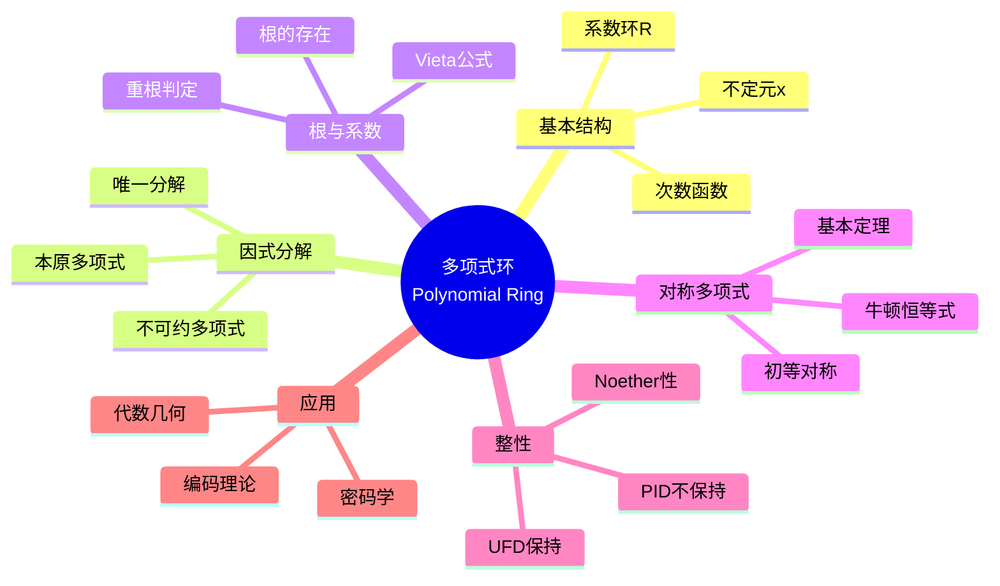
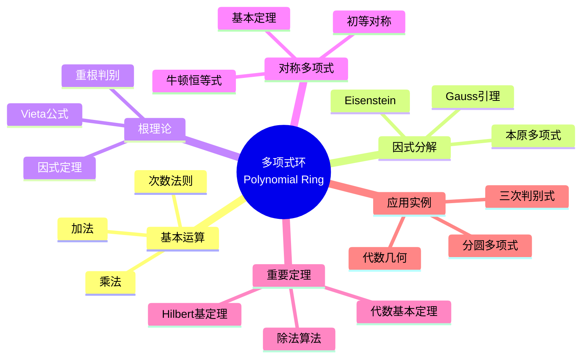

msc_primary: "00A99"
msc_secondary: ['00-XX']
---

# 多项式环思维导图

## 中心概念精确定义

**多项式环 (Polynomial Ring)**

设 $R$ 是交换环，$R[x]$ 是系数在 $R$ 中的多项式构成的环：
$$R[x] = \{a_0 + a_1 x + \cdots + a_n x^n : a_i \in R, n \geq 0\}$$

**运算**：
- **加法**：系数相加
- **乘法**：卷积 $(fg)_k = \sum_{i+j=k} a_i b_j$

**次数**：$\deg(f) = n$（若 $a_n \neq 0$）

**多元多项式环**：$R[x_1, \ldots, x_n] = R[x_1][x_2]\cdots[x_n]$

---

## 核心要素

### 1. 因式分解理论

**本原多项式**：$f \in R[x]$，其系数的最大公因子为1。

**Gauss引理**：$R$ 是UFD，则 $R[x]$ 也是UFD。
- 本原多项式的积仍本原
- 若本原多项式在 $K[x]$（$K = \text{Frac}(R)$）中可约，则在 $R[x]$ 中可约

**Eisenstein判别法**：设 $f = a_n x^n + \cdots + a_0 \in \mathbb{Z}[x]$，若存在素数 $p$ 使：
- $p \nmid a_n$
- $p \mid a_i$（$i = 0, \ldots, n-1$）
- $p^2 \nmid a_0$

则 $f$ 在 $\mathbb{Q}[x]$ 中不可约。

### 2. 根与系数

**根**：$f(a) = 0$ 的 $a \in R$。

**因式定理**：$f(a) = 0$ $\Leftrightarrow$ $(x-a) \mid f(x)$。

**Vieta公式**：若 $f(x) = a_n \prod_{i=1}^n (x - r_i)$，则
- $e_1 = \sum r_i = -a_{n-1}/a_n$
- $e_2 = \sum_{i<j} r_i r_j = a_{n-2}/a_n$
- $\cdots$
- $e_n = \prod r_i = (-1)^n a_0/a_n$

其中 $e_k$ 是**初等对称多项式**。

### 3. 对称多项式

**定义**：$f(x_1, \ldots, x_n)$ 是**对称多项式**，若任意置换变量位置多项式不变。

**初等对称多项式**：
$$e_k = \sum_{1 \leq i_1 < \cdots < i_k \leq n} x_{i_1} \cdots x_{i_k}$$

**基本定理**：任意对称多项式可唯一表示为初等对称多项式的多项式。

**牛顿恒等式**：幂和 $p_k = \sum x_i^k$ 与初等对称多项式的递推关系。

### 4. 形式幂级数

**形式幂级数环**：$R[[x]] = \{\sum_{n=0}^\infty a_n x^n : a_n \in R\}$

**可逆性**：$\sum a_n x^n$ 可逆当且仅当 $a_0$ 在 $R$ 中可逆。

**Laurent级数**：$R((x)) = R[[x]][x^{-1}]$

---

## 性质与定理

### 定理1：Hilbert基定理

**命题**：若 $R$ 是Noether环，则 $R[x]$ 也是Noether环。

**证明**：反证，构造理想的升链。

**意义**：代数集的有限基表示。

### 定理2：域上多项式的除法算法

**命题**：设 $F$ 是域，$f, g \in F[x]$，$g \neq 0$，则存在唯一 $q, r \in F[x]$ 使
$$f = qg + r, \quad \deg(r) < \deg(g)$$

**推论**：$F[x]$ 是Euclid整环，从而是PID和UFD。

### 定理3：代数基本定理

**命题**：$\mathbb{C}[x]$ 中的非常数多项式在 $\mathbb{C}$ 中有根。

**等价表述**：$\mathbb{C}$ 上不可约多项式恰为一次式。

### 定理4：有理根定理

**命题**：设 $f = a_n x^n + \cdots + a_0 \in \mathbb{Z}[x]$，若既约分数 $p/q$ 是根，则 $p \mid a_0$，$q \mid a_n$。

### 定理5：Krull维数

**命题**：$\dim(R[x]) = \dim(R) + 1$（Krull维数）。

**特别**：$\dim(F[x_1, \ldots, x_n]) = n$（$F$ 是域）。

---

## 典型例子

### 例子1：分圆多项式

**定义**：$n$ 次**本原单位根**的极小多项式 $\Phi_n(x)$。

**性质**：
- $x^n - 1 = \prod_{d \mid n} \Phi_d(x)$
- $\Phi_n(x)$ 在 $\mathbb{Q}[x]$ 中不可约
- $\deg(\Phi_n) = \varphi(n)$（Euler函数）

**计算**：$\Phi_1 = x-1$，$\Phi_2 = x+1$，$\Phi_3 = x^2+x+1$，$\Phi_4 = x^2+1$

### 例子2：$\mathbb{Z}[x]$ 不是PID

**反例**：理想 $(2, x)$ 不是主理想。

**证明**：若 $(2, x) = (f)$，则 $f \mid 2$ 且 $f \mid x$，得 $f = \pm 1$，但 $1 \notin (2, x)$。

### 例子3：三次多项式的判别式

**判别式**：$\Delta = \prod_{i<j} (r_i - r_j)^2 = a_n^{2n-2} \prod_{i<j} (r_i - r_j)^2$

**三次**：$f = x^3 + px + q$，则 $\Delta = -4p^3 - 27q^2$

**意义**：$\Delta > 0$：三个不同实根；$\Delta < 0$：一个实根两个复根；$\Delta = 0$：重根。

---

## 关联概念

| 概念 | 关系 | 说明 |
|------|------|------|
| **UFD/PID** | 环论 | 多项式环的整性 |
| **代数几何** | 应用 | 代数簇 = 多项式零点集 |
| **Galois理论** | 联系 | 根的对称性与域扩张 |
| **结式/判别式** | 工具 | 判定多项式有公根 |
| **Gröbner基** | 计算 | 多元多项式理想计算 |
| **编码理论** | 应用 | BCH码、Reed-Solomon码 |

---

## 思维导图可视化

---

## 深入学习

### 推荐教材
- Dummit & Foote, *Abstract Algebra*, Chapter 9
- Cox, Little & O'Shea, *Ideals, Varieties, and Algorithms*
- Lang, *Algebra*, Chapter 5

### 相关课程
- MIT 18.704 (Seminar in Algebra)
- Harvard Math 122 (Algebra I)

### 进阶主题
- **Gröbner基**：多元多项式的"标准形"
- **结式与判别式**：多项式方程组求解
- **D-模**：微分算子与多项式的结合

---

*本思维导图全面呈现多项式环的理论体系，从因式分解到对称多项式，是交换代数和代数几何的基础。*
