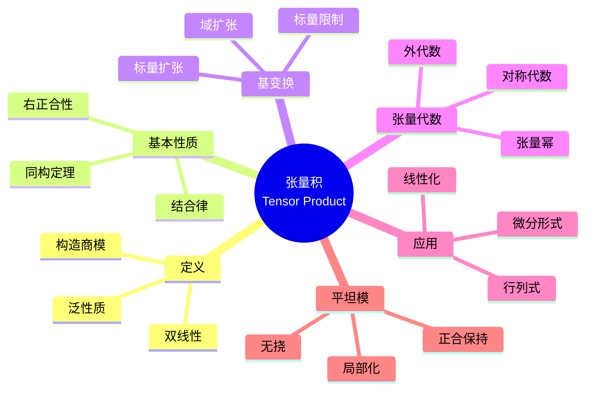
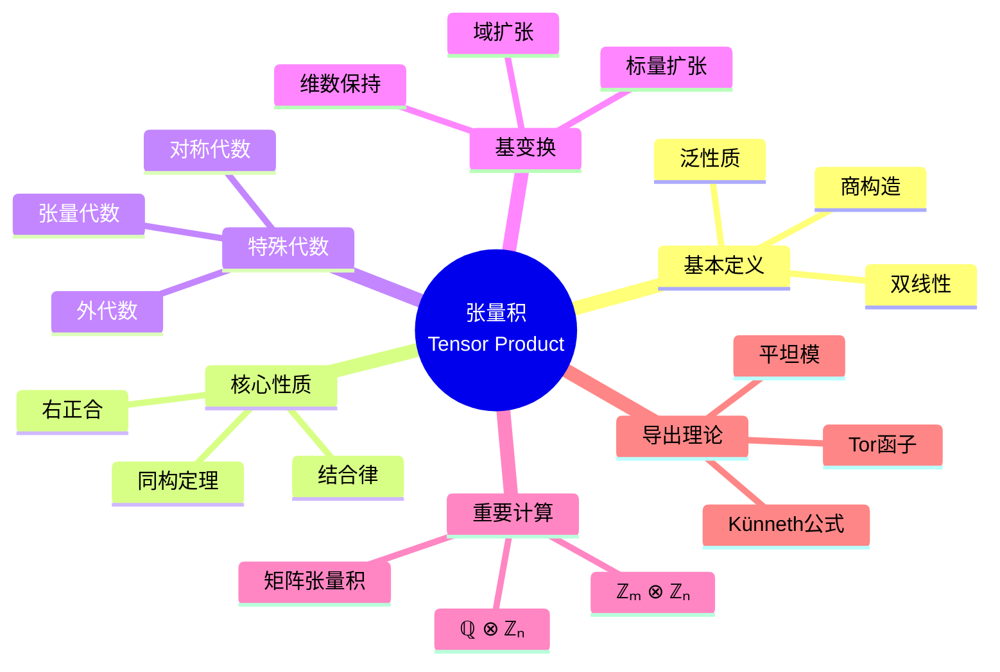

msc_primary: "00A99"
msc_secondary: ['00-XX']
---

# 张量积思维导图

## 中心概念精确定义

**张量积 (Tensor Product)**

设 $R$ 是环，$M$ 是右 $R$-模，$N$ 是左 $R$-模。$M$ 与 $N$ 的**张量积** $M \otimes_R N$ 是Abel群，配备双线性映射 $\otimes: M \times N \to M \otimes_R N$，满足泛性质：

对任意Abel群 $A$ 和 $R$-双线性映射 $f: M \times N \to A$，存在唯一群同态 $\tilde{f}: M \otimes_R N \to A$ 使 $f = \tilde{f} \circ \otimes$。

**构造**：$M \otimes_R N = F(M \times N) / \sim$，其中 $\sim$ 由双线性关系生成：
- $(m_1 + m_2, n) \sim (m_1, n) + (m_2, n)$
- $(m, n_1 + n_2) \sim (m, n_1) + (m, n_2)$
- $(mr, n) \sim (m, rn)$

---

## 核心要素



### 1. 泛性质

**核心图表**：

```

M × N ──→ M ⊗ N
    ↘     ↓
      A

```

**意义**：双线性映射 $M \times N \to A$ 等同于线性映射 $M \otimes N \to A$。

**唯一性**：张量积在同构意义下唯一。

### 2. 基本性质

**同构定理**：
- $R \otimes_R M \cong M$
- $M \otimes_R N \cong N \otimes_{R^{op}} M$
- $(M \oplus M') \otimes N \cong (M \otimes N) \oplus (M' \otimes N)$
- $(M \otimes_R N) \otimes_S P \cong M \otimes_R (N \otimes_S P)$（结合律）

**右正合性**：$M \otimes_R -$ 是右正合函子。
- 短正合 $0 \to A \to B \to C \to 0$ 诱导 $M \otimes A \to M \otimes B \to M \otimes C \to 0$
- 左边不一定正合

### 3. 基变换

**标量扩张**：设 $\varphi: R \to S$ 是环同态，$M$ 是 $R$-模，则
$$M_S = S \otimes_R M$$
是 $S$-模（通过左乘在 $S$ 上）。

**域扩张**：$K/F$ 域扩张，$V$ 是 $F$-向量空间，则 $V_K = K \otimes_F V$ 是 $K$-向量空间。

**维数**：$\dim_K(V_K) = \dim_F(V)$。

### 4. 张量代数与外代数

**张量代数**：$T(M) = \bigoplus_{n=0}^\infty M^{\otimes n}$

**对称代数**：$S(M) = T(M) / \langle m \otimes m' - m' \otimes m \rangle$

**外代数**：$\Lambda(M) = T(M) / \langle m \otimes m \rangle$

**应用**：
- 对称代数 $\leftrightarrow$ 多项式环
- 外代数 $\leftrightarrow$ 微分形式

---

## 性质与定理

### 定理1：向量空间的张量积

**命题**：设 $V, W$ 是 $F$-向量空间，基分别为 $\{v_i\}$，$\{w_j\}$，则 $\{v_i \otimes w_j\}$ 是 $V \otimes W$ 的基。

**维数**：$\dim(V \otimes W) = \dim(V) \cdot \dim(W)$。

### 定理2：Hom-张量伴随

**命题**：$(M \otimes_R N, A) \cong \text{Hom}_R(M, \text{Hom}_\mathbb{Z}(N, A))$（伴随同构）

**意义**：$-\otimes N$ 是 $\text{Hom}(N, -)$ 的左伴随。

### 定理3：平坦模的刻画

**命题**：$M$ 是平坦模当且仅当 $M \otimes_R -$ 是正合函子。

**例子**：
- 自由模平坦
- 投射模平坦
- $\mathbb{Q}$ 作为 $\mathbb{Z}$-模平坦

### 定理4：Tor函子

**定义**：$\text{Tor}_n^R(M, N)$ 是 $M \otimes_R -$ 的左导出函子。

**计算**：取 $N$ 的投射分解，张量后取同调。

**应用**：测量张量积的非正合性。

### 定理5：Künneth公式

**命题**：复形 $C, D$ 有正合列
$$0 \to \bigoplus_{i+j=n} H_i(C) \otimes H_j(D) \to H_n(C \otimes D) \to \bigoplus_{i+j=n-1} \text{Tor}(H_i(C), H_j(D)) \to 0$$

---

## 典型例子

### 例子1：$\mathbb{Z}_m \otimes_\mathbb{Z} \mathbb{Z}_n$

**计算**：$\mathbb{Z}_m \otimes \mathbb{Z}_n \cong \mathbb{Z}_{\gcd(m,n)}$

**证明**：用投射分解或直接计算。

**意义**：挠模的张量积反映最大公因子。

### 例子2：$\mathbb{Q} \otimes_\mathbb{Z} \mathbb{Z}_n$

**计算**：$\mathbb{Q} \otimes \mathbb{Z}_n = 0$

**原因**：$\frac{a}{b} \otimes \bar{k} = \frac{na}{nb} \otimes \bar{k} = \frac{a}{nb} \otimes n\bar{k} = \frac{a}{nb} \otimes 0 = 0$

### 例子3：矩阵的张量积 (Kronecker积)

**定义**：$A \otimes B$ 是分块矩阵 $(a_{ij}B)$。

**性质**：
- $(A \otimes B)(C \otimes D) = AC \otimes BD$
- $\det(A \otimes B) = \det(A)^n \det(B)^m$
- $\text{tr}(A \otimes B) = \text{tr}(A)\text{tr}(B)$

---

## 关联概念

| 概念 | 关系 | 说明 |
|------|------|------|
| **多线性代数** | 基础 | 张量积是多线性的线性化 |
| **平坦模** | 应用 | 张量保持正合性 |
| **Tor函子** | 导出 | 张量积的左导出 |
| **表示论** | 应用 | 表示的张量积 |
| **微分几何** | 应用 | 张量场、微分形式 |
| **量子力学** | 应用 | 态空间的张量积 |

---

## 思维导图可视化



---

## 深入学习

### 推荐教材
- Dummit & Foote, *Abstract Algebra*, Chapter 10
- Lang, *Algebra*, Chapter 16
- Greub, *Multilinear Algebra*

### 相关课程
- MIT 18.704 (Seminar in Algebra)
- Harvard Math 122 (Algebra I)

### 进阶主题
- **导出张量积**：导出范畴中的张量积
- **模的张量范畴**：融合范畴
- **同调代数**：Tor与Ext的系统研究

---

*本思维导图全面呈现张量积理论，从泛性质到外代数，连接多线性代数与同调代数，是现代数学的核心工具。*
