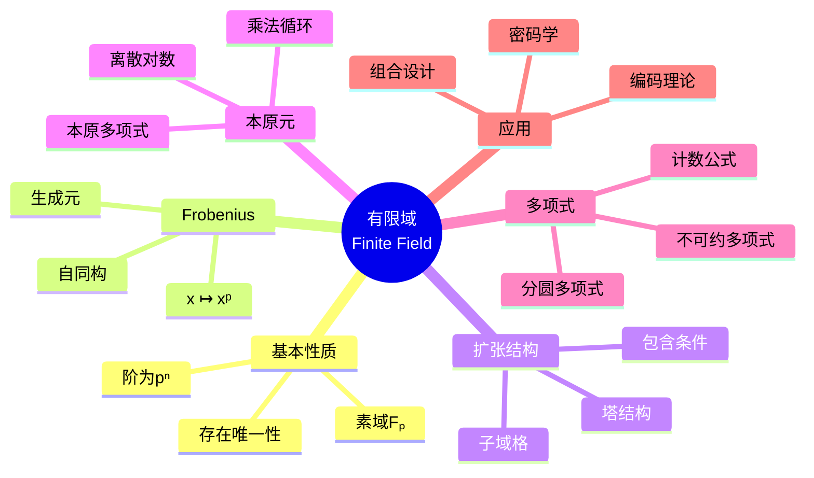
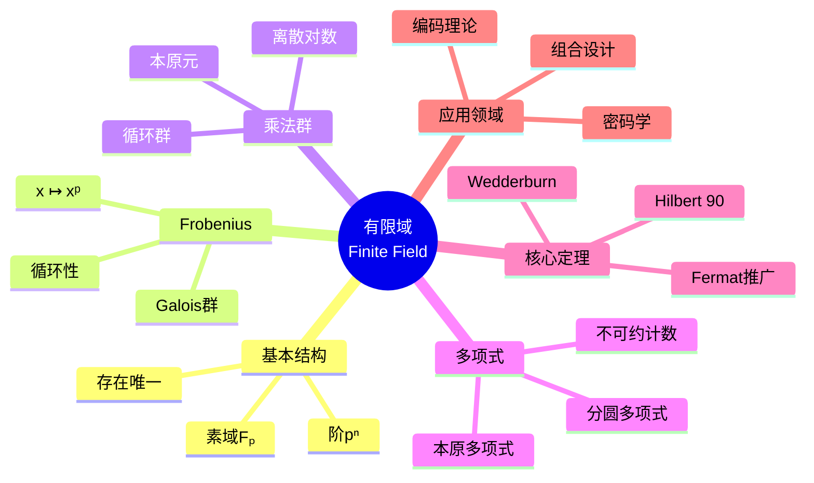

# 有限域思维导图

## 中心概念精确定义

**有限域 (Finite Field)**

**定理**：有限域的阶必为 $q = p^n$，其中 $p$ 是素数，$n \geq 1$。

**存在唯一性**：对每个 $q = p^n$，存在唯一的（同构意义下）$q$ 元域，记作 $\mathbb{F}_q$ 或 $GF(q)$。

**构造**：$\mathbb{F}_q \cong \mathbb{F}_p[x]/(f(x))$，其中 $f(x)$ 是 $\mathbb{F}_p$ 上 $n$ 次不可约多项式。

**乘法群**：$\mathbb{F}_q^\times$ 是 $q-1$ 阶循环群。

---

## 核心要素

### 1. 基本结构

**素域**：$\mathbb{F}_p \cong \mathbb{Z}/p\mathbb{Z}$，$p$ 为素数。

**扩张**：$\mathbb{F}_{p^n}/\mathbb{F}_p$ 是 $n$ 次扩张。

**塔结构**：$\mathbb{F}_p \subseteq \mathbb{F}_{p^d} \subseteq \mathbb{F}_{p^n}$ 当且仅当 $d \mid n$。

**子域格**：子域与 $n$ 的因子格同构。

### 2. Frobenius自同构

**定义**：$\sigma: \mathbb{F}_q \to \mathbb{F}_q$，$\sigma(x) = x^p$。

**性质**：
- 域自同构（保持加法和乘法）
- 固定 $\mathbb{F}_p$
- $\sigma^n = \text{id}$（在 $\mathbb{F}_{p^n}$ 上）

**Galois群**：$\text{Gal}(\mathbb{F}_{p^n}/\mathbb{F}_p) = \{\text{id}, \sigma, \sigma^2, \ldots, \sigma^{n-1}\} \cong \mathbb{Z}/n\mathbb{Z}$

### 3. 乘法群与本原元

**定理**：$\mathbb{F}_q^\times$ 是循环群。

**本原元**：$\mathbb{F}_q^\times$ 的生成元称为**本原元**。

**本原多项式**：$\mathbb{F}_p$ 上 $n$ 次不可约多项式 $f(x)$ 若其根是本原元，则称**本原多项式**。

**离散对数**：给定本原元 $g$，任意 $a \in \mathbb{F}_q^\times$ 唯一写成 $g^k$，$k$ 称为 $a$ 关于基 $g$ 的**离散对数**。

### 4. 不可约多项式

**计数**：$\mathbb{F}_p$ 上 $n$ 次首一不可约多项式的个数为
$$I_p(n) = \frac{1}{n} \sum_{d \mid n} \mu\left(\frac{n}{d}\right) p^d$$

其中 $\mu$ 是Möbius函数。

**分圆多项式**：$\Phi_n(x)$ 在 $\mathbb{F}_p$ 上的分解由 $p$ 模 $n$ 的阶决定。

---

## 性质与定理

### 定理1：Wedderburn小定理

**命题**：有限除环是域。

**意义**：有限非交换除环不存在。

### 定理2：Fermat小定理的推广

**命题**：对所有 $a \in \mathbb{F}_q$，$a^q = a$。

**证明**：$a = 0$ 显然；$a \neq 0$ 时 $a^{q-1} = 1$（因乘法群阶为 $q-1$）。

**意义**：$\mathbb{F}_q$ 是 $x^q - x$ 的分裂域。

### 定理3：迹与范数（有限域情形）

**迹**：$\text{tr}_{\mathbb{F}_{p^n}/\mathbb{F}_p}(a) = a + a^p + a^{p^2} + \cdots + a^{p^{n-1}} \in \mathbb{F}_p$

**范数**：$N_{\mathbb{F}_{p^n}/\mathbb{F}_p}(a) = a \cdot a^p \cdot a^{p^2} \cdots a^{p^{n-1}} = a^{(p^n-1)/(p-1)} \in \mathbb{F}_p$

**性质**：
- 迹是 $\mathbb{F}_p$-线性满射
- 范数是乘法满射

### 定理4：Hilbert定理90（有限域情形）

**命题**：$H^1(\text{Gal}(\mathbb{F}_{p^n}/\mathbb{F}_p), \mathbb{F}_{p^n}^\times) = 0$

等价表述：若 $N_{\mathbb{F}_{p^n}/\mathbb{F}_p}(a) = 1$，则存在 $b$ 使 $a = b^{1-\sigma} = b/b^p$。

### 定理5：本原元存在性

**命题**：$\mathbb{F}_q$ 中本原元的个数为 $\varphi(q-1)$。

**应用**：构造 $\mathbb{F}_q$ 的具体表示。

---

## 典型例子

### 例子1：$\mathbb{F}_4 = \mathbb{F}_{2^2}$

**构造**：$\mathbb{F}_2[x]/(x^2 + x + 1)$，设 $\alpha$ 是 $x^2 + x + 1 = 0$ 的根。

**元素**：$\{0, 1, \alpha, \alpha + 1\}$

**乘法**：$\alpha^2 = \alpha + 1$，$\alpha^3 = 1$，故 $\alpha$ 是本原元。

**Frobenius**：$\sigma(0) = 0$，$\sigma(1) = 1$，$\sigma(\alpha) = \alpha^2 = \alpha + 1$

### 例子2：$\mathbb{F}_9 = \mathbb{F}_{3^2}$

**构造**：$\mathbb{F}_3[x]/(x^2 + 1)$（$x^2 + 1$ 在 $\mathbb{F}_3$ 上不可约）

**元素**：$a + b\alpha$，$a, b \in \mathbb{F}_3$，$\alpha^2 = -1 = 2$

**本原元**：$1 + \alpha$ 的阶为8，是本原元。

### 例子3：BCH码的构造

**应用**：有限域用于构造纠错码。

**BCH码**：基于 $\mathbb{F}_{2^m}$，可设计纠正多个错误的循环码。

**原理**：利用有限域的代数结构设计码的生成多项式。

---

## 关联概念

| 概念 | 关系 | 说明 |
|------|------|------|
| **Galois理论** | 应用 | $\mathbb{F}_{p^n}/\mathbb{F}_p$ 是循环Galois扩张 |
| **编码理论** | 应用 | BCH码、Reed-Solomon码的基础 |
| **密码学** | 应用 | AES、椭圆曲线密码 |
| **组合设计** | 应用 | 有限几何、正交数组 |
| **代数几何** | 联系 | 有限域上的代数曲线 |
| **数论** | 联系 | 局部域、zeta函数 |

---

## 思维导图可视化

---

## 深入学习

### 推荐教材
- Dummit & Foote, *Abstract Algebra*, Chapter 14
- Lidl & Niederreiter, *Finite Fields*
- Mullen & Panario, *Handbook of Finite Fields*

### 相关课程
- MIT 18.704 (Seminar in Algebra)
- Harvard Math 122 (Algebra I)

### 进阶主题
- **Weil猜想**：有限域上代数簇的zeta函数
- **椭圆曲线**：有限域上的椭圆曲线与密码学
- **代数几何码**：Goppa码与代数曲线

---

*本思维导图系统阐述有限域理论，从基本结构到应用领域，是编码理论、密码学和组合数学的基石。*
