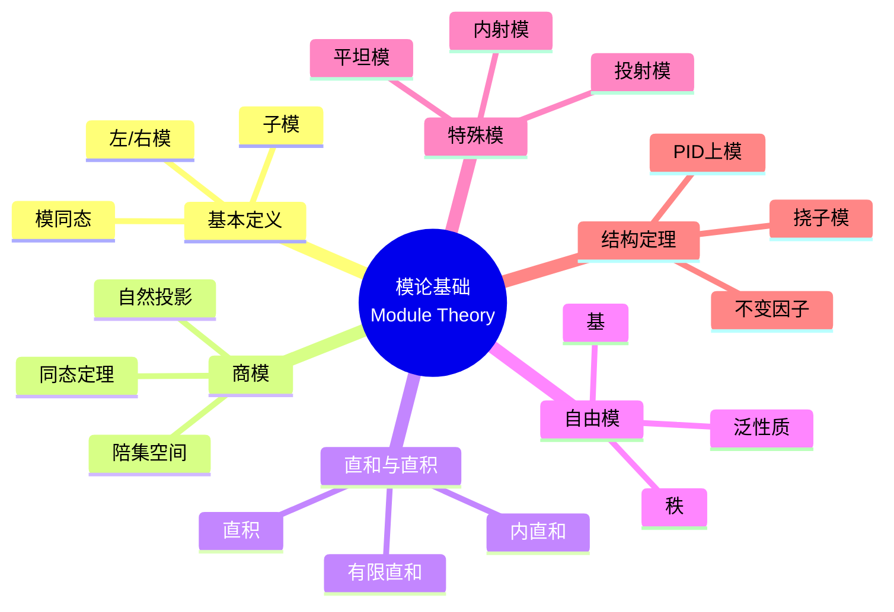
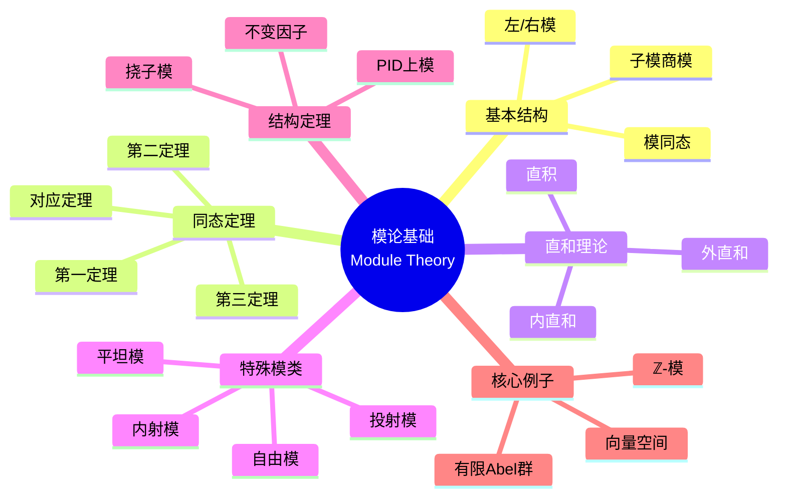

msc_primary: "00A99"
msc_secondary: ['00-XX']
---

# 模论基础思维导图

## 中心概念精确定义

**模 (Module)**

设 $R$ 是环（含幺），**左 $R$-模**是Abel群 $(M, +)$ 配以数乘 $R \times M \to M$，满足：

1. $r(m_1 + m_2) = rm_1 + rm_2$
2. $(r_1 + r_2)m = r_1 m + r_2 m$
3. $(r_1 r_2)m = r_1(r_2 m)$
4. $1_R \cdot m = m$

**右模**：类似定义，数乘为 $M \times R \to M$。

**$R$-模同态**：$f: M \to N$ 满足 $f(rm) = rf(m)$，$f(m_1 + m_2) = f(m_1) + f(m_2)$。

---

## 核心要素

### 1. 子模与商模

**子模**：$N \subseteq M$ 是子模，若对加法和 $R$-数乘封闭。

**商模**：$M/N = \{m + N : m \in M\}$，数乘 $r(m+N) = rm + N$。

**同态基本定理**：
- 第一定理：$M/\ker(f) \cong \text{Im}(f)$
- 第二定理：$(N + P)/N \cong P/(N \cap P)$
- 第三定理：$(M/N)/(P/N) \cong M/P$
- 对应定理：$M$ 含 $N$ 的子模与 $M/N$ 的子模一一对应

### 2. 直和与直积

**直和**：$M \oplus N = \{(m, n) : m \in M, n \in N\}$

**内直和**：$M = N \oplus P$（内）若 $M = N + P$ 且 $N \cap P = \{0\}$。

**直积**：$\prod_{i \in I} M_i$，所有序列 $(m_i)_{i \in I}$。

**区别**：有限直和 = 有限直积；无限时不同。

### 3. 自由模

**定义**：$M$ 是**自由模**，若存在基 $B \subseteq M$（线性无关且生成 $M$）。

**性质**：
- $R^n$ 是自由模（标准基）
- 任意模是自由模的商
- 交换环上自由模的秩唯一

**泛性质**：自由模 $F(B)$ 满足：任意映射 $B \to M$ 唯一延拓为模同态 $F(B) \to M$。

### 4. 特殊模类型

**投射模**：$P$ 是投射模，若正合列 $0 \to A \to B \to P \to 0$ 分裂。

等价：$P$ 是自由模的直和项。

**内射模**：$E$ 是内射模，若正合列 $0 \to E \to B \to C \to 0$ 分裂。

**平坦模**：$M$ 是平坦模，若 $-\otimes M$ 是正合函子。

---

## 性质与定理

### 定理1：PID上有限生成模结构

**命题**：设 $R$ 是PID，$M$ 是有限生成 $R$-模，则
$$M \cong R^r \oplus R/(d_1) \oplus \cdots \oplus R/(d_k)$$

其中 $d_1 \mid d_2 \mid \cdots \mid d_k$。

**特别**：$R = \mathbb{Z}$ 时即有限生成Abel群结构定理。

### 定理2：模的直和分解

**命题**：若 $M = \bigoplus_{i \in I} M_i$，则：
- 任意 $m \in M$ 唯一写成有限和 $m = \sum m_i$，$m_i \in M_i$
- 每个 $M_i$ 是 $M$ 的子模

### 定理3：投射模的刻画

**命题**：以下条件等价：
1. $P$ 是投射模
2. $\text{Hom}(P, -)$ 是正合函子
3. $P$ 是某自由模的直和项
4. 任意满同态 $B \to P$ 有截面

### 定理4：Baer判别法

**命题**：$E$ 是内射模当且仅当对任意理想 $I \subseteq R$，任意同态 $I \to E$ 可延拓为 $R \to E$。

### 定理5：平坦性判别

**命题**：$M$ 平坦当且仅当对任意有限生成理想 $I$，$I \otimes M \to M$ 是单射。

---

## 典型例子

### 例子1：Abel群 = $\mathbb{Z}$-模

**对应**：Abel群 $A$ 与 $\mathbb{Z}$-模结构一一对应。
- 子群 = 子模
- 商群 = 商模
- 直和 = 直和

**意义**：模论是Abel群论的推广。

### 例子2：域上的模 = 向量空间

**对应**：设 $F$ 是域，$F$-模即 $F$-向量空间。
- 子模 = 子空间
- 自由模 = 有基（所有模都自由）

**关键**：域是域，所有模自由。

### 例子3：$\mathbb{Z}_6$ 作为 $\mathbb{Z}$-模

**结构**：$\mathbb{Z}_6 \cong \mathbb{Z}_2 \oplus \mathbb{Z}_3$（中国剩余定理）

**子模**：对应于6的因子，有 $\{0\}$，$\mathbb{Z}_2$，$\mathbb{Z}_3$，$\mathbb{Z}_6$

**不是自由模**：有挠元素。

---

## 关联概念

| 概念 | 关系 | 说明 |
|------|------|------|
| **线性代数** | 特例 | 域上模 = 向量空间 |
| **Abel群** | 特例 | $\mathbb{Z}$-模 = Abel群 |
| **表示论** | 应用 | 群表示 = 群代数上的模 |
| **同调代数** | 发展 | 投射/内射分解 |
| **代数几何** | 应用 | 层是模的局部化 |
| **同调维数** | 不变量 | 投射/内射/平坦维数 |

---

## 思维导图可视化

---

## 深入学习

### 推荐教材
- Dummit & Foote, *Abstract Algebra*, Chapter 10, 12
- Lang, *Algebra*, Chapter 3
- Atiyah & Macdonald, *Introduction to Commutative Algebra*

### 相关课程
- MIT 18.704 (Seminar in Algebra)
- Harvard Math 122 (Algebra I)

### 进阶主题
- **同调代数**：Ext与Tor函子，导出函子
- **局部化**：模的局部化与层论
- **模范畴**：Abel范畴，伴随函子

---

*本思维导图系统梳理模论基础理论，从子模商模到PID上结构定理，是代数学从线性代数向抽象理论过渡的桥梁。*
