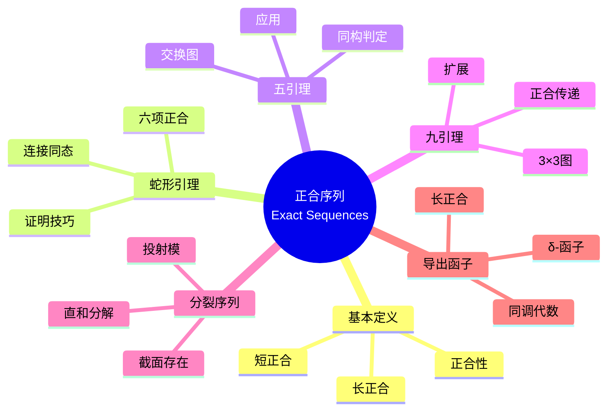
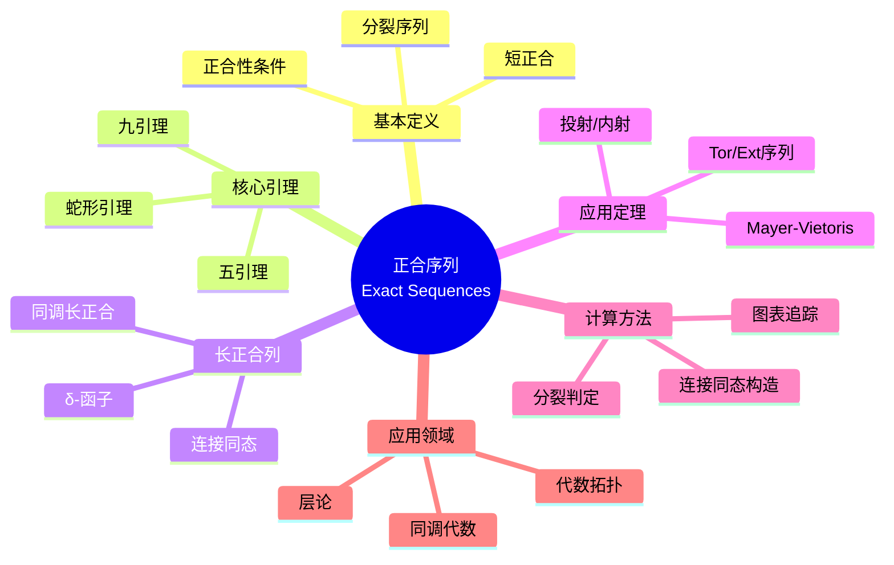

msc_primary: "00A99"
msc_secondary: ['00-XX']
---

# 正合序列思维导图

## 中心概念精确定义

**正合序列 (Exact Sequence)**

设 $R$ 是环，$R$-模同态序列
$$\cdots \to M_{i-1} \xrightarrow{f_{i-1}} M_i \xrightarrow{f_i} M_{i+1} \to \cdots$$

称为**正合**的，若对所有 $i$ 有 $\text{Im}(f_{i-1}) = \ker(f_i)$。

**短正合序列**：
$$0 \to A \xrightarrow{f} B \xrightarrow{g} C \to 0$$

满足：
- $f$ 单射（$0 \to A$ 正合于 $A$）
- $\text{Im}(f) = \ker(g)$
- $g$ 满射（$C \to 0$ 正合于 $C$）

**分裂**：短正合序列**分裂**若存在 $s: C \to B$ 使 $g \circ s = \text{id}_C$，或等价地 $B \cong A \oplus C$。

---

## 核心要素



### 1. 短正合序列的性质

**基本性质**：
- $0 \to A \to B \to 0$ 正合 $\Rightarrow$ $A \cong B$
- $0 \to A \to B \to C$ 正合 $\Rightarrow$ $A \hookrightarrow B$（嵌入）
- $A \to B \to C \to 0$ 正合 $\Rightarrow$ $C \cong B/A$（若 $A \to B$ 单）

**分裂判定**：短正合序列 $0 \to A \to B \to C \to 0$ 分裂当且仅当：
- 存在 $s: C \to B$ 使 $gs = \text{id}_C$，或
- 存在 $r: B \to A$ 使 $rf = \text{id}_A$

**意义**：$B \cong A \oplus C$（非典范同构）。

### 2. 蛇形引理 (Snake Lemma)

**设定**：交换图，行正合

```

A → B → C → 0
↓     ↓     ↓
0 → A' → B' → C'

```

**结论**：存在**连接同态** $\delta: \ker(C \to C') \to \text{coker}(A \to A')$ 使六列正合：
$$\ker(f_A) \to \ker(f_B) \to \ker(f_C) \xrightarrow{\delta} \text{coker}(f_A) \to \text{coker}(f_B) \to \text{coker}(f_C)$$

**应用**：构造长正合序列，连接同调群。

### 3. 五引理 (Five Lemma)

**设定**：交换图，行正合

```

A → B → C → D → E
↓     ↓     ↓     ↓     ↓
A' → B' → C' → D' → E'

```

**结论**：若两端竖射是同构，则中间也是同构。

**四引理**：弱形式，单边条件。

**应用**：证明同调群同构。

### 4. 九引理 (Nine Lemma)

**设定**：$3 \times 3$ 交换图

**结论**：若三行、两列正合，则第三列也正合。

**推广**：横竖正合的传递性。

---

## 性质与定理

### 定理1：正合序列的函子性

**命题**：若 $F$ 是正合函子，则将正合序列映为正合序列。
- 左正合函子保持左正合
- 右正合函子保持右正合

**例子**：$\text{Hom}(P, -)$ 正合 $\Leftrightarrow$ $P$ 投射；$\text{Hom}(-, I)$ 反变正合 $\Leftrightarrow$ $I$ 内射。

### 定理2：长正合序列的构造

**命题**：短正合序列 $0 \to A_\bullet \to B_\bullet \to C_\bullet \to 0$ 的链复形诱导同调长正合列：
$$\cdots \to H_n(A) \to H_n(B) \to H_n(C) \xrightarrow{\partial} H_{n-1}(A) \to \cdots$$

**意义**：连接同态 $\partial$ 由蛇形引理给出。

### 定理3：投射模与分裂

**命题**：短正合序列 $0 \to A \to B \to P \to 0$ 分裂当 $P$ 投射。

**对偶**：$0 \to I \to B \to C \to 0$ 分裂当 $I$ 内射。

### 定理4：Tor与Ext的长正合列

**命题**：$0 \to A \to B \to C \to 0$ 诱导：
$$\cdots \to \text{Tor}_1(M, C) \to M \otimes A \to M \otimes B \to M \otimes C \to 0$$

$$0 \to \text{Hom}(C, N) \to \text{Hom}(B, N) \to \text{Hom}(A, N) \to \text{Ext}^1(C, N) \to \cdots$$

### 定理5：Mayer-Vietoris序列

**命题**：拓扑空间 $X = U \cup V$，则有同调长正合列：
$$\cdots \to H_n(U \cap V) \to H_n(U) \oplus H_n(V) \to H_n(X) \to H_{n-1}(U \cap V) \to \cdots$$

---

## 典型例子

### 例子1：$\mathbb{Z}$-模的正合序列

**序列**：$0 \to \mathbb{Z} \xrightarrow{\times 2} \mathbb{Z} \to \mathbb{Z}_2 \to 0$

**验证**：
- $\times 2$ 单射
- $\ker(\pi) = 2\mathbb{Z} = \text{Im}(\times 2)$
- $\pi$ 满射

**分裂性**：不分裂（$\text{Ext}^1(\mathbb{Z}_2, \mathbb{Z}) \neq 0$）。

### 例子2：Künneth公式

**设定**：拓扑空间 $X \times Y$

**公式**：分裂短正合序列
$$0 \to \bigoplus_{i+j=n} H_i(X) \otimes H_j(Y) \to H_n(X \times Y) \to \bigoplus_{i+j=n-1} \text{Tor}(H_i(X), H_j(Y)) \to 0$$

### 例子3：蛇形引理的标准应用

**设定**：计算 $H_n$ 与 $H_{n-1}$ 的连接。

**步骤**：
1. 构造短正合序列的链复形
2. 应用蛇形引理
3. 得到连接同态

---

## 关联概念

| 概念 | 关系 | 说明 |
|------|------|------|
| **同调代数** | 基础 | 正合序列是同调代数的核心 |
| **导出函子** | 应用 | 构造长正合序列 |
| **同调群** | 目标 | 链复形的同调是正合性的度量 |
| **代数拓扑** | 应用 | 拓扑不变量的计算 |
| **层论** | 进阶 | 层的正合性与上同调 |
| **导出范畴** | 发展 | 同调代数的范畴化 |

---

## 思维导图可视化



---

## 深入学习

### 推荐教材
- Hilton & Stammbach, *A Course in Homological Algebra*
- Weibel, *An Introduction to Homological Algebra*
- Rotman, *An Introduction to Homological Algebra*

### 相关课程
- MIT 18.704 (Seminar in Algebra)
- Harvard Math 122 (Algebra I)

### 进阶主题
- **导出范畴**：同调代数的现代框架
- **谱序列**：计算复杂正合序列的工具
- **模型范畴**：同调代数的公理化

---

*本思维导图系统阐述正合序列理论，从蛇形引理到长正合序列，是同调代数与代数拓扑的核心工具。*
