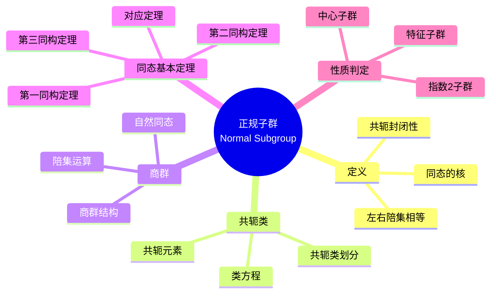
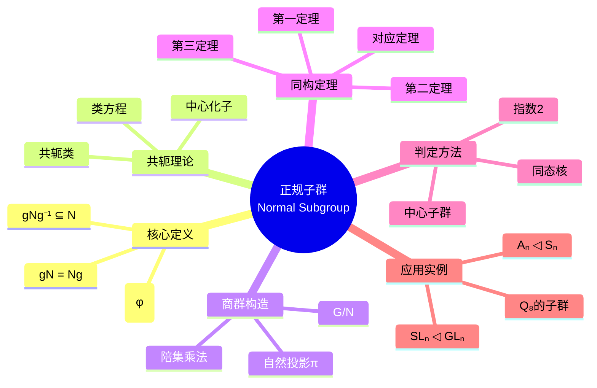

msc_primary: "00A99"
msc_secondary: ['00-XX']
---

# 正规子群思维导图

## 中心概念精确定义

**正规子群 (Normal Subgroup)**

设 $G$ 是一个群，$N$ 是 $G$ 的子群。若对任意 $g \in G$ 和 $n \in N$，都有 $gng^{-1} \in N$，则称 $N$ 是 $G$ 的**正规子群**，记作 $N \trianglelefteq G$。

等价定义：

- $gNg^{-1} = N$ 对所有 $g \in G$ 成立
- $gN = Ng$ 对所有 $g \in G$ 成立（左陪集等于右陪集）
- $N$ 是 $G$ 到某群的某个同态的核

---

## 核心要素

### 1. 共轭类 (Conjugacy Classes)

**定义**：元素 $a, b \in G$ 称为**共轭**的，若存在 $g \in G$ 使得 $b = gag^{-1}$。

**关键性质**：

- 共轭是等价关系，将 $G$ 划分为不相交的共轭类
- 单位元 $\{e\}$ 总是单独的共轭类
- Abel群中每个元素自成一类

**类方程 (Class Equation)**：
$$|G| = |Z(G)| + \sum_{i} [G : C_G(g_i)]$$

其中 $Z(G)$ 是中心，$C_G(g_i)$ 是中心化子。

### 2. 商群 (Quotient Group)

**构造**：若 $N \trianglelefteq G$，则商集 $G/N = \{gN : g \in G\}$ 构成群。

**运算定义**：$(gN)(hN) = (gh)N$

**自然同态**：$\pi: G \to G/N$，$\pi(g) = gN$

- 核：$\ker(\pi) = N$
- 满同态

### 3. 同态基本定理 (Fundamental Homomorphism Theorems)

**第一同构定理**：若 $\varphi: G \to H$ 是同态，则
$$G/\ker(\varphi) \cong \text{Im}(\varphi)$$

**第二同构定理（钻石定理）**：若 $H \leq G$，$N \trianglelefteq G$，则
$$HN/N \cong H/(H \cap N)$$

**第三同构定理**：若 $N \trianglelefteq G$，$K \trianglelefteq G$，$N \subseteq K$，则
$$(G/N)/(K/N) \cong G/K$$

**对应定理**：$N \trianglelefteq G$ 时，$G$ 的包含 $N$ 的子群与 $G/N$ 的子群一一对应。

---

## 性质与定理

### 定理1：正规子群的判定准则

**命题**：设 $N \leq G$，以下条件等价：

1. $N \trianglelefteq G$
2. $gNg^{-1} \subseteq N$ 对所有 $g \in G$
3. $gNg^{-1} = N$ 对所有 $g \in G$
4. $gN = Ng$ 对所有 $g \in G$
5. $N$ 是某同态的核

**证明要点**：$(1) \Rightarrow (2)$ 由定义；$(2) \Rightarrow (3)$ 用 $g^{-1}$；$(3) \Rightarrow (4)$ 直接；$(4) \Rightarrow (1)$ 显然；$(1) \Leftrightarrow (5)$ 由商群构造。

### 定理2：指数2子群必正规

**命题**：若 $[G : H] = 2$，则 $H \trianglelefteq G$。

**证明**：指数2意味着只有两个陪集：$H$ 和 $G \setminus H$。对任意 $g \notin H$，有 $gH = G \setminus H = Hg$，故正规。

### 定理3：中心的正规性

**命题**：中心 $Z(G) = \{z \in G : zg = gz, \forall g \in G\}$ 是正规子群。

**证明**：对 $z \in Z(G)$，$gzg^{-1} = zgg^{-1} = z \in Z(G)$。

### 定理4：单群的刻画

**命题**：群 $G$ 是单群当且仅当 $G$ 没有非平凡正规子群。

### 定理5：正规子群的交与积

**命题**：

- 任意多个正规子群的交仍是正规子群
- 若 $N, M \trianglelefteq G$，则 $NM \trianglelefteq G$
- 若 $N \trianglelefteq G$，$H \leq G$，则 $N \cap H \trianglelefteq H$

---

## 典型例子

### 例子1：交错群 $A_n$

**命题**：$A_n \trianglelefteq S_n$，且 $[S_n : A_n] = 2$。

**说明**：$A_n$ 是偶置换构成的子群。因指数为2，故正规。商群 $S_n/A_n \cong \mathbb{Z}/2\mathbb{Z}$。

**意义**：这是构造指数为2的正规子群的标准例子。

### 例子2：特殊线性群 $SL_n(F)$

**命题**：$SL_n(F) \trianglelefteq GL_n(F)$，且 $GL_n(F)/SL_n(F) \cong F^\times$。

**证明**：考虑行列式同态 $\det: GL_n(F) \to F^\times$，其核恰为 $SL_n(F)$。

**同构**：由第一同构定理即得。

### 例子3：四元数群 $Q_8$

**结构**：$Q_8 = \{\pm 1, \pm i, \pm j, \pm k\}$

**正规子群**：

- $\{1, -1\} \trianglelefteq Q_8$
- $\{1, -1, i, -i\} \trianglelefteq Q_8$（同理 $j, k$）

**特点**：$Q_8$ 的所有子群都正规，但 $Q_8$ 不是Abel群。

---

## 关联概念

| 概念 | 关系 | 说明 |
|------|------|------|
| **特征子群** | 强化 | 在所有自同构下不变，必为正规子群 |
| **换位子群** | 导出 | $[G,G]$ 是使商群为Abel的最小正规子群 |
| **群同态** | 应用 | 正规子群 = 同态的核 |
| **单群** | 对立 | 无非平凡正规子群的群 |
| **可解群** | 应用 | 通过正规子群列定义 |
| **合成列** | 应用 | 正规子群构成的极大链 |

---

## 思维导图可视化

---

## 深入学习

### 推荐教材

- Dummit & Foote, *Abstract Algebra*, Chapter 3
- Artin, *Algebra*, Chapter 2
- Lang, *Algebra*, Chapter 1

### 相关课程

- MIT 18.704 (Seminar in Algebra)
- Harvard Math 122 (Algebra I)

### 进阶主题

- **特征子群**：比正规性更强的条件
- **次正规子群列**：可解群的理论基础
- **Holder计划**：用单群分类所有有限群

---

*本思维导图涵盖正规子群的完整理论体系，从基本定义到高级应用，适合代数学进阶学习。*
