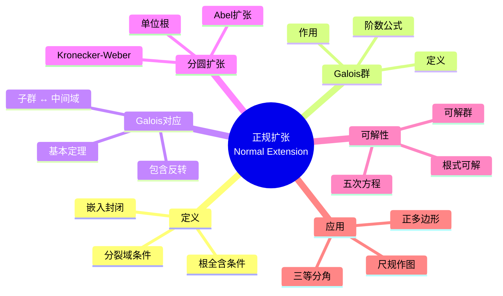
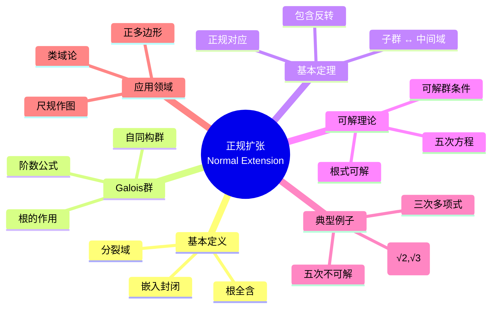

msc_primary: "00A99"
msc_secondary: ['00-XX']
---

# 正规扩张思维导图

## 中心概念精确定义

**正规扩张 (Normal Extension)**

域扩张 $K/F$ 称为**正规扩张**，若满足以下等价条件之一：

1. $K$ 是 $F[x]$ 中一族多项式的分裂域
2. $F[x]$ 中任何在 $K$ 中有根的不可约多项式在 $K$ 中完全分裂
3. 任何 $F$-嵌入 $\sigma: K \to \overline{F}$ 满足 $\sigma(K) = K$

**Galois扩张**：正规且可分的代数扩张。

**Galois群**：$\text{Gal}(K/F) = \{\sigma \in \text{Aut}(K) : \sigma|_F = \text{id}_F\}$

---

## 核心要素

### 1. 正规扩张的等价刻画

**分裂域条件**：$K$ 是某多项式族的分裂域。

**根条件**：不可约多项式有根则全根在 $K$。

**嵌入条件**：$F$-嵌入都是自同构。

**例子**：
- $\mathbb{Q}(\sqrt{2})/\mathbb{Q}$：正规（$x^2-2$ 的分裂域）
- $\mathbb{Q}(\sqrt[3]{2})/\mathbb{Q}$：不正规（缺复根）

### 2. Galois群

**定义**：保持 $F$ 不动的 $K$ 的自同构群。

**阶数**：若 $K/F$ 是有限Galois扩张，则 $|\text{Gal}(K/F)| = [K:F]$。

**作用**：Galois群作用在根集上，是置换表示。

### 3. Galois对应（基本定理）

**定理**：设 $K/F$ 是有限Galois扩张，则：

1. **一一对应**：中间域 $\{E : F \subseteq E \subseteq K\}$ $\leftrightarrow$ 子群 $\{H : H \leq \text{Gal}(K/F)\}$
   - $E \mapsto \text{Gal}(K/E)$
   - $H \mapsto K^H$（不动域）

2. **包含反转**：$E_1 \subseteq E_2$ $\Leftrightarrow$ $\text{Gal}(K/E_2) \leq \text{Gal}(K/E_1)$

3. **正规子群 ↔ 正规扩张**：$H \trianglelefteq \text{Gal}(K/F)$ $\Leftrightarrow$ $K^H/F$ 正规，此时 $\text{Gal}(K^H/F) \cong \text{Gal}(K/F)/H$

4. **次数对应**：$[E:F] = [\text{Gal}(K/F) : \text{Gal}(K/E)]$

### 4. 分圆扩张与Abel扩张

**分圆域**：$\mathbb{Q}(\zeta_n)/\mathbb{Q}$ 是Galois扩张，Galois群 $\cong (\mathbb{Z}/n\mathbb{Z})^\times$。

**Abel扩张**：Galois群是Abel群的扩张。

**Kronecker-Weber定理**：$\mathbb{Q}$ 的任意Abel扩张都含于某分圆域。

---

## 性质与定理

### 定理1：正规扩张的传递性

**命题**：塔 $F \subseteq K \subseteq L$，若 $L/F$ 正规，则 $L/K$ 正规。

**注意**：$K/F$ 不一定正规。

### 定理2：合成域的正规性

**命题**：若 $K_1/F$ 和 $K_2/F$ 都正规，则 $K_1 K_2/F$ 正规。

### 定理3：多项式的Galois群

**命题**：设 $f \in F[x]$ 可分，分裂域为 $K$，则 $\text{Gal}(K/F)$ 同构于根的置换群中保持代数关系的子群。

**特别**：$n$ 次多项式的Galois群是 $S_n$ 的子群。

### 定理4：本原元定理

**命题**：有限可分扩张 $K/F$ 是单扩张，即存在 $\alpha$ 使 $K = F(\alpha)$。

### 定理5：根式可解的Galois刻画

**命题**：多项式方程根式可解当且仅当其Galois群可解。

**推论**：
- 次数 $\leq 4$：总有根式解（$S_n$ 可解，$n \leq 4$）
- 次数 $\geq 5$：一般无根式解（$S_n$ 不可解，$n \geq 5$）

---

## 典型例子

### 例子1：$\mathbb{Q}(\sqrt{2}, \sqrt{3})/\mathbb{Q}$

**Galois群**：$\cong \mathbb{Z}_2 \times \mathbb{Z}_2$（Klein四元群）

**元素**：$\{\text{id}, \sigma_2, \sigma_3, \sigma_6\}$，$\sigma_2(\sqrt{2}) = -\sqrt{2}$，$\sigma_3(\sqrt{3}) = -\sqrt{3}$

**Galois对应**：
- 子群 $\{\text{id}, \sigma_2\}$ ↔ 中间域 $\mathbb{Q}(\sqrt{3})$
- 子群 $\{\text{id}, \sigma_3\}$ ↔ 中间域 $\mathbb{Q}(\sqrt{2})$
- 子群 $\{\text{id}, \sigma_6\}$ ↔ 中间域 $\mathbb{Q}(\sqrt{6})$

### 例子2：三次多项式的Galois群

**设定**：$f(x) = x^3 + ax + b$，判别式 $\Delta = -4a^3 - 27b^2$

**Galois群**：
- $\Delta > 0$：$A_3 \cong \mathbb{Z}_3$
- $\Delta < 0$：$S_3$（阶6）

### 例子3：五次方程不可解

**设定**：一般五次多项式 $f(x) = x^5 + a_4 x^4 + \cdots + a_0$

**Galois群**：$S_5$

**不可解性**：$S_5$ 不可解（因 $A_5$ 单非Abel），故一般五次方程无根式解。

---

## 关联概念

| 概念 | 关系 | 说明 |
|------|------|------|
| **可分扩张** | 组合 | Galois = 正规 + 可分 |
| **根式扩张** | 应用 | 方程可解性的判定 |
| **尺规作图** | 应用 | 可作图条件 = 2的幂次扩张 |
| **类域论** | 发展 | Abel扩张的完整理论 |
| **逆Galois问题** | 未解 | 哪些群是Galois群？ |
| **微分Galois理论** | 推广 | 微分方程的Galois理论 |

---

## 思维导图可视化

---

## 深入学习

### 推荐教材
- Dummit & Foote, *Abstract Algebra*, Chapter 14
- Morandi, *Field and Galois Theory*
- Cox, *Galois Theory*

### 相关课程
- MIT 18.704 (Seminar in Algebra)
- Harvard Math 122 (Algebra I)

### 进阶主题
- **类域论**：局部与整体类域论
- **高维Galois理论**：基本群与平展上同调
- **p-进Galois表示**：现代数论核心

---

*本思维导图全面呈现正规扩张与Galois理论，从基本定义到根式可解性定理，是代数学最美妙的理论之一。*
