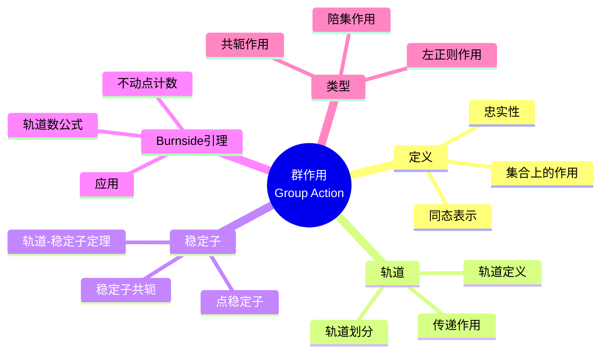
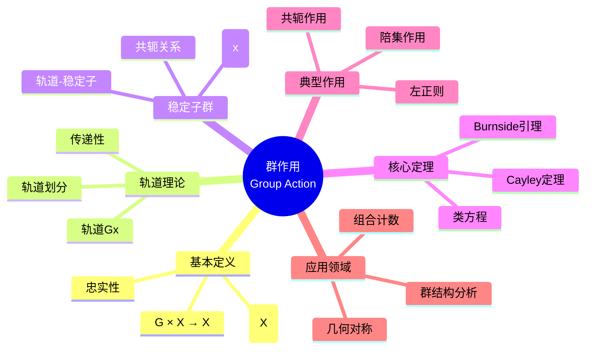

# 群作用思维导图

## 中心概念精确定义

**群作用 (Group Action)**

设 $G$ 是一个群，$X$ 是一个集合。$G$ 在 $X$ 上的**作用**是一个映射 $G \times X \to X$，记为 $(g, x) \mapsto g \cdot x$，满足：

1. **单位元作用**：$e \cdot x = x$ 对所有 $x \in X$
2. **相容性**：$(gh) \cdot x = g \cdot (h \cdot x)$ 对所有 $g, h \in G$，$x \in X$

等价定义：群同态 $\rho: G \to \text{Sym}(X)$，其中 $\rho(g)(x) = g \cdot x$。

**忠实作用**：若 $\ker(\rho) = \{e\}$，称作用**忠实**。

**传递作用**：若对任意 $x, y \in X$，存在 $g \in G$ 使 $g \cdot x = y$，称作用**传递**。

---

## 核心要素

### 1. 轨道 (Orbits)

**定义**：$x \in X$ 的**轨道**为
$$G \cdot x = \{g \cdot x : g \in G\}$$

**性质**：

- 轨道构成 $X$ 的划分
- 作用传递 $\Leftrightarrow$ 只有一个轨道
- $|G \cdot x| = [G : G_x]$（轨道-稳定子定理）

**轨道分解**：$X = \bigsqcup_{i} G \cdot x_i$（不交并）

### 2. 稳定子 (Stabilizers)

**点稳定子**：对 $x \in X$，定义
$$G_x = \{g \in G : g \cdot x = x\}$$

**性质**：

- $G_x \leq G$（是子群）
- 若 $y = g \cdot x$，则 $G_y = gG_xg^{-1}$（共轭关系）

**集合稳定子**：对子集 $Y \subseteq X$，
$$G_Y = \{g \in G : g \cdot y = y, \forall y \in Y\}$$

### 3. 轨道-稳定子定理 (Orbit-Stabilizer Theorem)

**定理**：设 $G$ 作用在 $X$ 上，$x \in X$，则
$$|G \cdot x| = [G : G_x] = \frac{|G|}{|G_x|}$$

**证明**：建立双射 $G/G_x \to G \cdot x$，$gG_x \mapsto g \cdot x$。

**推论**：若作用传递，则 $|X| = [G : G_x]$。

### 4. Burnside引理

**定理**：设有限群 $G$ 作用在有限集 $X$ 上，则轨道数为
$$|X/G| = \frac{1}{|G|} \sum_{g \in G} |X^g|$$

其中 $X^g = \{x \in X : g \cdot x = x\}$ 是 $g$ 的不动点集。

**证明**：计数集合 $\{(g, x) : g \cdot x = x\}$ 两种方式。

---

## 性质与定理

### 定理1：Cayley定理

**命题**：每个群 $G$ 都同构于某个对称群的子群。

**证明**：$G$ 通过左乘作用在自己上，得到忠实表示 $G \hookrightarrow S_{|G|}$。

**意义**：抽象群可具体实现为置换群。

### 定理2：轨道分解与类方程

**类方程**：$G$ 通过共轭作用在自己上，
$$|G| = |Z(G)| + \sum_{i} [G : C_G(g_i)]$$

其中求和取遍非平凡共轭类的代表元。

### 定理3：Cauchy定理（群作用证明）

**命题**：若素数 $p \mid |G|$，则 $G$ 有 $p$ 阶元。

**证明思路**：考虑 $G^p$ 中满足 $g_1 g_2 \cdots g_p = e$ 的 $p$-元组，用循环群作用计数。

### 定理4：Sylow定理（存在性）

**命题**：若 $p^n \mid |G|$，则 $G$ 有 $p^n$ 阶子群。

**证明要点**：考虑 $G$ 的所有 $p^n$ 元子集上的作用。

### 定理5：p-群的中心非平凡

**命题**：若 $|G| = p^n$，则 $Z(G) \neq \{e\}$。

**证明**：由类方程，$|G| \equiv |Z(G)| \pmod{p}$，故 $p \mid |Z(G)|$。

---

## 典型例子

### 例子1：对称群 $S_n$ 的自然作用

**作用**：$S_n$ 在 $\{1, 2, \ldots, n\}$ 上的自然置换作用。

**性质**：

- 传递作用
- 点稳定子 $S_{n-1}$（固定某点的置换）
- 忠实作用

**应用**：Cayley定理的特例。

### 例子2：二面体群 $D_n$ 的几何作用

**作用**：$D_n$（正 $n$ 边形的对称群）作用在顶点集上。

**轨道**：

- 顶点：一个轨道（传递）
- 边：一个轨道
- 对角线：可能多个轨道

**稳定子**：顶点稳定子是反射子群，阶为2。

### 例子3：共轭作用与类方程

**作用**：$G$ 通过共轭作用在自己上：$g \cdot x = gxg^{-1}$。

**轨道**：共轭类
**稳定子**：中心化子 $C_G(x)$

**应用**：证明 $p$-群有非平凡中心；分析群的结构。

---

## 关联概念

| 概念 | 关系 | 说明 |
|------|------|------|
| **置换表示** | 等价 | 群作用 = 到对称群的同态 |
| **齐性空间** | 实例 | 传递作用的空间形如 $G/H$ |
| **G-集** | 范畴 | 群作用的范畴化视角 |
| **不动点** | 工具 | Burnside引理的核心概念 |
| **Frobenius群** | 应用 | 特殊传递作用的群 |
| **组合计数** | 应用 | Pólya计数理论的基础 |

---

## 思维导图可视化

---

## 深入学习

### 推荐教材

- Dummit & Foote, *Abstract Algebra*, Chapter 4
- Alperin & Bell, *Groups and Representations*
- Rotman, *Introduction to Group Theory*

### 相关课程

- MIT 18.704 (Seminar in Algebra)
- Harvard Math 122 (Algebra I)

### 进阶主题

- **表示论**：线性群作用（矩阵表示）
- **G-模**：群作用的模论视角
- **拓扑群作用**：连续群作用与轨道空间

---

*本思维导图系统梳理群作用的理论体系，从基础概念到高级应用，是理解群论结构分析的核心工具。*
