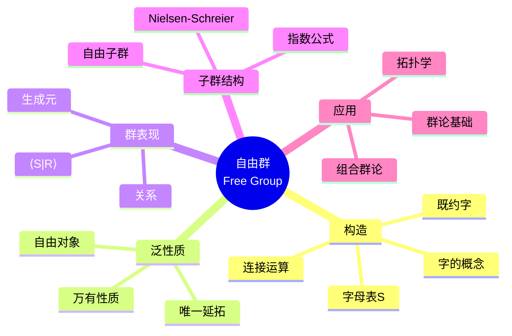
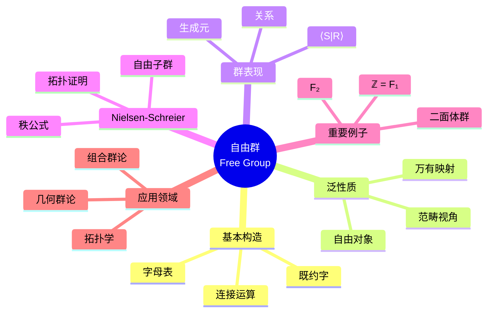

msc_primary: "00A99"
msc_secondary: ['00-XX']
---

# 自由群思维导图

## 中心概念精确定义

**自由群 (Free Group)**

设 $S$ 是一个集合（字母表），$S^{-1}$ 是其形式逆元集。$S$ 上的**自由群** $F(S)$ 是所有**既约字**（reduced words）构成的群。

**字 (Word)**：有限序列 $w = s_1^{\epsilon_1} s_2^{\epsilon_2} \cdots s_n^{\epsilon_n}$，其中 $s_i \in S$，$\epsilon_i \in \{1, -1\}$。

**既约字**：不出现 $ss^{-1}$ 或 $s^{-1}s$ 邻接的字。

**群运算**：字的连接后再约化。

**泛性质**：对任意群 $G$ 和映射 $f: S \to G$，存在唯一同态 $\tilde{f}: F(S) \to G$ 使 $\tilde{f}|_S = f$。

---

## 核心要素



### 1. 字的运算与约化

**连接**：$w_1 = s_1 \cdots s_n$，$w_2 = t_1 \cdots t_m$，则 $w_1 \cdot w_2 = s_1 \cdots s_n t_1 \cdots t_m$

**初等约化**：删去 $ss^{-1}$ 或 $s^{-1}s$ 子串

**既约形式**：通过有限次初等约化得到的唯一既约字

**字的长度**：既约字中的字母个数，记 $\ell(w)$

### 2. 泛性质（万有性质）

**定理**：$F(S)$ 满足以下泛性质：

对任意群 $G$ 和任意映射 $\varphi: S \to G$，存在唯一的群同态 $\tilde{\varphi}: F(S) \to G$ 使得下图交换：

```

S ──→ F(S)
│       │
↓       ↓
G ═════ G

```

**意义**：
- 自由群是“最自由”的群，无额外关系
- 所有群都是自由群的商
- 范畴论视角：自由函子是遗忘函子的左伴随

### 3. 群的表现 (Group Presentation)

**定义**：$G = \langle S \mid R \rangle$，其中：
- $S$：生成元集
- $R$：关系集（$F(S)$ 的子集）
- $G \cong F(S)/\langle\langle R \rangle\rangle$

**平凡关系**：$ss^{-1} = e$（隐含）

**有限表现**：$S$ 和 $R$ 都有限。

### 4. Nielsen-Schreier定理

**定理**：自由群的子群是自由群。

**指数公式**：若 $F$ 是秩为 $n$ 的自由群，$H \leq F$ 指数为 $k$，则 $H$ 的秩为
$$\text{rank}(H) = k(n-1) + 1$$

**证明方法**：
- Nielsen变换（组合方法）
- 覆盖空间（拓扑方法）

---

## 性质与定理

### 定理1：自由群的唯一性

**命题**：若 $F(S) \cong F(T)$，则 $|S| = |T|$。

**证明**：考虑 $F(S)/[F(S), F(S)] \cong \mathbb{Z}^{(S)}$，秩由基数决定。

**秩**：$|S|$ 称为自由群的**秩**。

### 定理2：自由群是挠自由的

**命题**：自由群无有限阶非单位元。

**证明**：若 $w^n = e$，则 $w$ 的既约形式必为空字，故 $w = e$。

### 定理3：自由群的可解性判定

**命题**：自由群 $F_n$（$n \geq 2$）不可解。

**证明**：$F_n$ 含自由子群同构于 $F_2$，而 $F_2$ 含非Abel自由子群，导出列不终止。

### 定理4：字问题与表现

**命题**：有限表现的群，字问题不一定可解（Novikov-Boone定理）。

**意义**：自由群本身字问题可解，但加关系后可能不可解。

### 定理5：自由积与自由群

**命题**：$\mathbb{Z} * \mathbb{Z} * \cdots * \mathbb{Z}$（$n$ 份）$\cong F_n$

**推广**：自由积 $G * H$ 是包含 $G$ 和 $H$ 的“最自由”群。

---

## 典型例子

### 例子1：无限循环群 $\mathbb{Z}$

**结构**：$\mathbb{Z} \cong F(\{a\}) = \langle a \rangle$

**元素**：$a^n$（$n \in \mathbb{Z}$）

**性质**：
- 唯一的秩1自由群
- Abel自由群

### 例子2：秩2自由群 $F_2$

**表现**：$F_2 = \langle a, b \rangle$

**元素**：既约字如 $a^2 b^{-1} a b^3 a^{-2} \cdots$

**子群**：含同构于 $F_\infty$ 的子群（如换位子群）

**应用**：双曲几何、动力系统的基本群。

### 例子3：二面体群的表现

**表现**：$D_n = \langle r, s \mid r^n = s^2 = e, srs = r^{-1} \rangle$

**意义**：由生成元和关系完全刻画。

**通用覆盖**：$D_n$ 是自由群 $F(\{r, s\})$ 商去关系正规闭包。

---

## 关联概念

| 概念 | 关系 | 说明 |
|------|------|------|
| **群表现** | 核心 | 用生成元和关系描述群 |
| **van Kampen定理** | 应用 | 计算基本群的工具 |
| **Cayley图** | 可视化 | 自由群的Cayley图是树 |
| **拓扑学** | 应用 | 图的基本群是自由群 |
| **自动机群** | 进阶 | 计算机科学视角 |
| **几何群论** | 发展 | 几何化研究群结构 |

---

## 思维导图可视化



---

## 深入学习

### 推荐教材
- Magnus, Karrass & Solitar, *Combinatorial Group Theory*
- Lyndon & Schupp, *Combinatorial Group Theory*
- Stillwell, *Classical Topology and Combinatorial Group Theory*

### 相关课程
- MIT 18.704 (Seminar in Algebra)
- Harvard Math 122 (Algebra I)

### 进阶主题
- **字问题**：群论中不可判定性的来源
- **双曲群**：Gromov的非正曲率群
- **辫群**：自由群的变形与推广

---

*本思维导图全面阐述自由群理论，从基本构造到Nielsen-Schreier定理，连接代数、拓扑与组合数学的核心纽带。*
