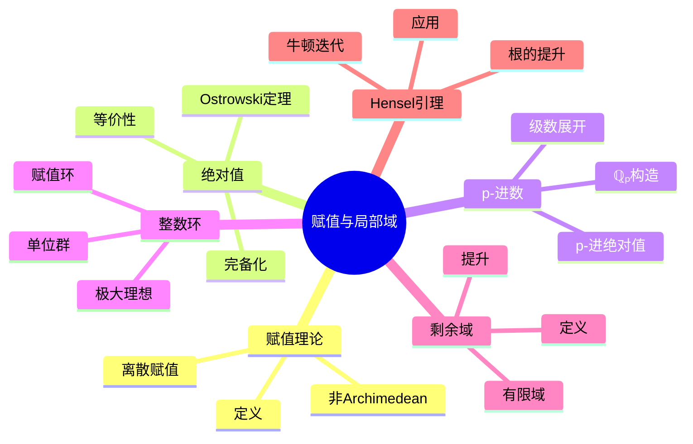
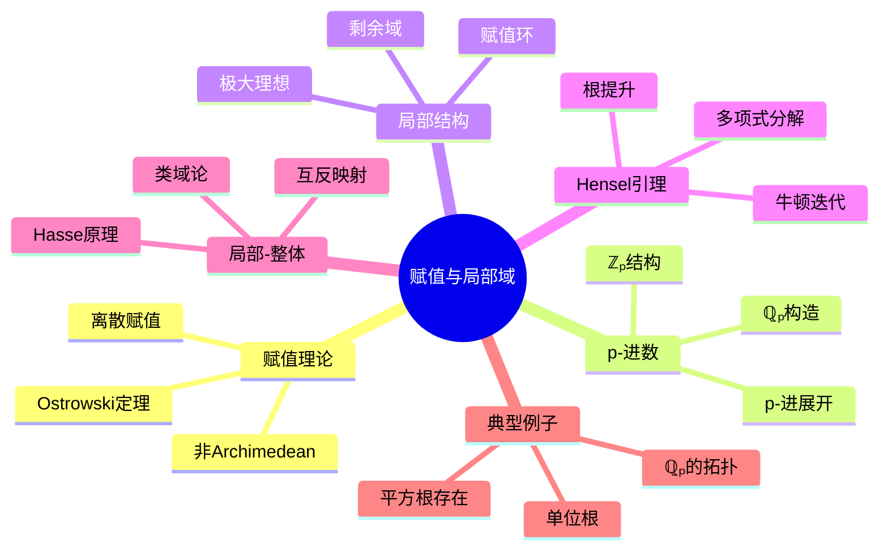

# 赋值与局部域思维导图

## 中心概念精确定义

**赋值 (Valuation)**

域 $K$ 上的**赋值**是映射 $v: K \to \mathbb{R} \cup \{\infty\}$，满足：

1. $v(x) = \infty$ $\Leftrightarrow$ $x = 0$
2. $v(xy) = v(x) + v(y)$
3. $v(x + y) \geq \min\{v(x), v(y)\}$（非Archimedean三角不等式）

**离散赋值**：$v(K^\times) \cong \mathbb{Z}$ 的赋值。

**绝对值**：$|x|_v = c^{-v(x)}$（$c > 1$），满足 $|x + y|_v \leq \max\{|x|_v, |y|_v\}$。

**局部域**：关于离散赋值完备的域，且剩余域有限（等价于 $\mathbb{R}$，$\mathbb{C}$ 或 $p$-进数域的有限扩张）。

---

## 核心要素

### 1. 赋值的等价类

**Ostrowski定理**：$\mathbb{Q}$ 上的绝对值（在等价意义下）恰有：
- 平凡绝对值
- Archimedean绝对值：$|x|_\infty = |x|$（通常绝对值）
- p-进绝对值：$|x|_p = p^{-v_p(x)}$（对每个素数 $p$）

**乘积公式**：对所有 $x \in \mathbb{Q}^\times$，
$$\prod_{v \leq \infty} |x|_v = 1$$

其中 $v$ 遍历所有位（place）。

### 2. p-进数域 $\mathbb{Q}_p$

**构造**：$\mathbb{Q}$ 关于 $|\cdot|_p$ 的完备化。

**p-进展开**：$x \in \mathbb{Q}_p^\times$ 唯一写成
$$x = \sum_{n=N}^\infty a_n p^n$$

其中 $a_n \in \{0, 1, \ldots, p-1\}$，$a_N \neq 0$，$v_p(x) = N$。

**p-进整数**：$\mathbb{Z}_p = \{x \in \mathbb{Q}_p : |x|_p \leq 1\} = \{x : v_p(x) \geq 0\}$

**单位**：$\mathbb{Z}_p^\times = \{x : |x|_p = 1\}$

### 3. 赋值环与剩余域

**赋值环**：$\mathcal{O}_v = \{x \in K : v(x) \geq 0\}$

**性质**：
- 是局部环
- 极大理想 $\mathfrak{m}_v = \{x : v(x) > 0\}$
- 单位群 $\mathcal{O}_v^\times = \{x : v(x) = 0\}$

**剩余域**：$k_v = \mathcal{O}_v / \mathfrak{m}_v$

**例子**：$\mathbb{Q}_p$ 的剩余域是 $\mathbb{F}_p$。

### 4. Hensel引理

**命题**：设 $f(x) \in \mathcal{O}_v[x]$，若 $\bar{f}(x) \in k_v[x]$ 有单根 $\bar{\alpha}$，则 $f(x)$ 在 $\mathcal{O}_v$ 中有根 $\alpha$ 提升 $\bar{\alpha}$。

**等价形式**：Newton迭代在完备非Archimedean域中收敛。

**应用**：求根、分解多项式。

---

## 性质与定理

### 定理1：局部域的分类

**命题**：局部域（非Archimedean）恰为：
- 有限域的Laurent级数域 $\mathbb{F}_q((t))$
- $p$-进数域的有限扩张

**特征**：特征相等或特征0。

### 定理2：完备化与稠密性

**命题**：$K$ 在 $\hat{K}$（完备化）中稠密。

**性质**：完备域的闭包是自身。

### 定理3：$\mathbb{Z}_p$ 的结构

**命题**：
- $\mathbb{Z}_p$ 是紧拓扑环
- $\mathbb{Z}_p \cong \varprojlim \mathbb{Z}/p^n\mathbb{Z}$（逆向极限）
- $\mathbb{Z}_p^\times \cong \mu_{p-1} \times (1 + p\mathbb{Z}_p)$（$p > 2$）

其中 $\mu_{p-1}$ 是 $p-1$ 次单位根群。

### 定理4：局部-整体原理（Hasse原理）

**命题**：二次型在有理数域上有解当且仅当在 $\mathbb{R}$ 和所有 $\mathbb{Q}_p$ 上有解。

**注意**：对高次型不成立。

### 定理5：局部类域论

**命题**：局部域 $K$ 的Abel扩张与 $K^\times$ 的闭子群一一对应。

**互反映射**：Artin映射 $\psi_K: K^\times \to \text{Gal}(K^{ab}/K)$。

---

## 典型例子

### 例子1：$\mathbb{Q}_p$ 中的开球

**性质**：$\mathbb{Q}_p$ 中开球 $B(a, r) = \{x : |x - a|_p < r\}$ 既开又闭（clopen）。

**拓扑**：$\mathbb{Q}_p$ 是完全不连通局部紧域。

### 例子2：$\mathbb{Q}_p$ 中的单位根

**$p > 2$**：$\mathbb{Q}_p$ 中单位根恰为 $p-1$ 次单位根，由Teichmüller提升给出。

**$p = 2$**：$\mathbb{Q}_2$ 中单位根只有 $\pm 1$。

### 例子3：Hensel引理的应用

**问题**：$f(x) = x^2 - 2$ 在 $\mathbb{Q}_7$ 中是否有解？

**解答**：$\bar{f}(x) = x^2 - 2$ 在 $\mathbb{F}_7$ 中，$3^2 = 9 \equiv 2$，故有根 $\bar{3}$。

因 $\bar{f}'(3) = 6 \not\equiv 0$，根是单的，由Hensel引理，$\sqrt{2} \in \mathbb{Q}_7$。

---

## 关联概念

| 概念 | 关系 | 说明 |
|------|------|------|
| **代数数论** | 基础 | 数域的局部化研究 |
| **类域论** | 应用 | 局部与整体类域论 |
| **算术几何** | 应用 | 代数簇的局部-整体原理 |
| **分析** | 工具 | p-进分析、测度与积分 |
| **表示论** | 应用 | p-进群表示 |
| **编码理论** | 应用 | p-进编码 |

---

## 思维导图可视化

---

## 深入学习

### 推荐教材
- Serre, *Local Fields*
- Neukirch, *Algebraic Number Theory*
- Gouvêa, *p-adic Numbers: An Introduction*

### 相关课程
- MIT 18.785 (Number Theory I)
- Harvard Math 223 (Algebraic Number Theory)

### 进阶主题
- **刚性解析几何**：p-进解析空间的理论
- **完美胚空间 (Perfectoid Spaces)**：现代p-进几何
- **朗兰兹纲领**：局部与整体朗兰兹对应

---

*本思维导图全面呈现赋值论与局部域理论，从p-进数构造到类域论应用，是代数数论和现代算术几何的基础。*
