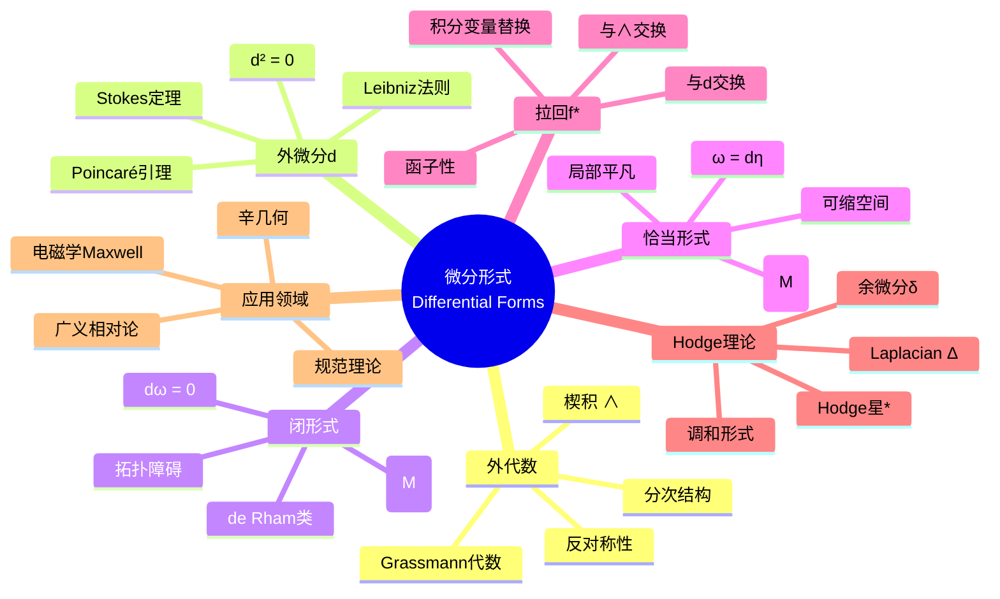

msc_primary: "00A99"
msc_secondary: ['00-00']
---

# 微分形式 (Differential Forms)

## 中心概念精确定义

**微分形式**是定义在光滑流形上的反对称协变张量场，是外代数与微分几何的交汇点。一个$k$-形式$\
omega$在流形$M$的每一点$p$处给出一个交替多重线性映射$\omega_p: T_pM \times \cdots \times T_pM \to \mathbb{R}$。

形式化地，$k$-形式是光滑截面$\omega \in \Gamma(\Lambda^k T^*M)$，其中$\Lambda^k T^*M$是余切丛的$k$次外幂。局部坐标$(x^1, \ldots, x^n)$下，$k$-形式可表示为：
$$\omega = \sum_{i_1 < \cdots < i_k} \omega_{i_1\cdots i_k} dx^{i_1} \wedge \cdots \wedge dx^{i_k}$$

微分形式统一了向量分析中的梯度、旋度和散度，为流形上的积分理论提供自然框架。

---

## 核心要素

### 1. 外代数 (Exterior Algebra)

**外积（楔积）**：$\wedge: \Omega^k(M) \times \Omega^l(M) \to \Omega^{k+l}(M)$

- **反对称性**：$\alpha \wedge \beta = (-1)^{kl} \beta \wedge \alpha$
- **结合律**：$(\alpha \wedge \beta) \wedge \gamma = \alpha \wedge (\beta \wedge \gamma)$
- **双线性**：对加法和数乘分配

**Grassmann代数**：$\Omega^*(M) = \bigoplus_{k=0}^n \Omega^k(M)$构成分次交换代数，其中$\Omega^0(M) = C^\infty(M)$，$\Omega^n(M)$由体积形式生成。

### 2. 外微分 (Exterior Derivative)

**定义**：$d: \Omega^k(M) \to \Omega^{k+1}(M)$是唯一的满足以下条件的线性算子：

1. **$d^2 = 0$**：两次外微分为零（Poincaré引理的核心）
2. **Leibniz法则**：$d(\alpha \wedge \beta) = d\alpha \wedge \beta + (-1)^k \alpha \wedge d\beta$
3. **与函数微分一致**：$df$是通常的微分

**局部表达式**：
$$d\omega = \sum_{i_1 < \cdots < i_k} d\omega_{i_1\cdots i_k} \wedge dx^{i_1} \wedge \cdots \wedge dx^{i_k}$$

### 3. 闭形式与恰当形式

**闭形式（Closed Forms）**：$\omega \in \Omega^k(M)$满足$d\omega = 0$

- 全体$k$-闭形式构成子空间$Z^k(M) = \ker(d: \Omega^k \to \Omega^{k+1})$
- 闭形式的楔积仍是闭形式

**恰当形式（Exact Forms）**：$\omega = d\eta$对某个$\eta \in \Omega^{k-1}(M)$

- 全体$k$-恰当形式构成子空间$B^k(M) = \text{im}(d: \Omega^{k-1} \to \Omega^k)$
- 由$d^2 = 0$知：恰当形式必为闭形式，$B^k(M) \subseteq Z^k(M)$

**de Rham上同调群**：$H^k_{dR}(M) = Z^k(M) / B^k(M)$度量闭形式与恰当形式的差异

### 4. 拉回与推进

**拉回（Pullback）**：光滑映射$f: M \to N$诱导$f^*: \Omega^k(N) \to \Omega^k(M)$

$$(f^*\omega)_p(v_1, \ldots, v_k) = \omega_{f(p)}(df_p(v_1), \ldots, df_p(v_k))$$

- 与楔积交换：$f^*(\alpha \wedge \beta) = f^*\alpha \wedge f^*\beta$
- 与外微分交换：$f^* \circ d = d \circ f^*$

### 5. 内积与李导数

**内积（Interior Product）**：$i_X: \Omega^k(M) \to \Omega^{k-1}(M)$

$$(i_X\omega)(Y_1, \ldots, Y_{k-1}) = \omega(X, Y_1, \ldots, Y_{k-1})$$

**Cartan魔法公式**：
$$\mathcal{L}_X = d \circ i_X + i_X \circ d$$

其中$\mathcal{L}_X$是沿向量场$X$的李导数。

### 6. Hodge星算子

**定义**：在定向Riemann流形$(M, g)$上，$*: \Omega^k(M) \to \Omega^{n-k}(M)$满足：

$$\alpha \wedge *\beta = \langle \alpha, \beta \rangle_g \, d\text{vol}_g$$

- $*^2 = (-1)^{k(n-k)}$在$k$-形式上
- 诱导余微分$\delta = (-1)^{n(k+1)+1} * d *$

---

## 性质与定理

### 定理1：Poincaré引理

若$M$是可缩开集（如$\mathbb{R}^n$中的星形区域），则$H^k_{dR}(M) = 0$对$k \geq 1$。

**意义**：局部上，闭形式都是恰当的。拓扑障碍是全局现象。

### 定理2：Stokes定理（微分形式版本）

对带边流形$M$和$(n-1)$-形式$\omega$：
$$\int_M d\omega = \int_{\partial M} \omega$$

**统一性**：包含经典Green定理、Gauss定理、Stokes定理作为特例。

### 定理3：de Rham定理

$$H^k_{dR}(M) \cong H^k(M; \mathbb{R})$$

微分同调与奇异上同调同构，连接分析与拓扑。

### 定理4：Frobenius定理（微分形式表述）

分布$\mathcal{D}$可积当且仅当对生成理想$I(\mathcal{D})$，$dI \subseteq I$。

### 定理5：Cartan结构方程

对联络形式$\omega$和曲率形式$\Omega$：

- 第一结构方程：$d\theta + \omega \wedge \theta = \Theta$（挠率）
- 第二结构方程：$d\omega + \omega \wedge \omega = \Omega$

---

## 典型例子

### 例子1：电磁学中的微分形式

在$\mathbb{R}^{3,1}$中：

- 电磁场$F = E_i dx^i \wedge dt + B_i \epsilon^i_{jk} dx^j \wedge dx^k$是2-形式
- Maxwell方程：$dF = 0$（Bianchi恒等式），$d*F = *J$（场方程）

几何化电磁理论，自然容纳规范不变性。

### 例子2：辛几何中的辛形式

辛流形$(M, \omega)$上，$\omega$是闭的非退化2-形式：

- $d\omega = 0$（闭性）
- $\omega^n \neq 0$（非退化，$\dim M = 2n$）

哈密顿力学：$i_{X_H}\omega = dH$，流保持$\omega$。

### 例子3：体积形式与定向

定向流形上的体积形式：
$$d\text{vol}_g = \sqrt{\det g_{ij}} \, dx^1 \wedge \cdots \wedge dx^n$$

积分$\int_M f \, d\text{vol}_g$定义了$L^2$内积，用于Hodge理论。

---

## 关联概念

| 概念 | 关系 | 应用领域 |
|------|------|----------|
| **de Rham上同调** | 核心工具 | 拓扑学、代数几何 |
| **向量丛** | 取值形式 | 规范理论、指标定理 |
| **联络理论** | 协变外微分 | 微分几何、物理 |
| **辛几何** | 闭2-形式 | 经典力学、动力系统 |
| **复几何** | $(p,q)$-形式 | 代数几何、弦理论 |
| **指标定理** | 特征形式 | 拓扑量子场论 |

---

## Mermaid 思维导图

---

## 学术参考

**Princeton MAT 355**: Differential forms as the unifying language of vector calculus on manifolds.

**MIT 18.905 (Algebraic Topology I)**: Integration of forms and de Rham cohomology.

**经典文献**：

- Spivak, M. *Calculus on Manifolds*
- Bott & Tu, *Differential Forms in Algebraic Topology*
- Lee, J.M. *Introduction to Smooth Manifolds*

---

*生成日期：2026年4月 | MSC2020: 58A10, 58A12, 53C65*
