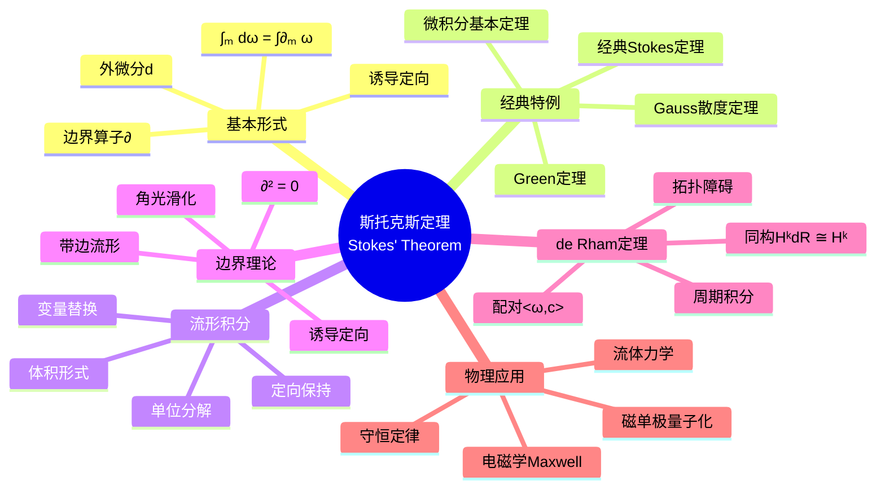

msc_primary: "00A99"
msc_secondary: ['00-XX']
---

# 斯托克斯定理 (Stokes' Theorem)

## 中心概念精确定义

**斯托克斯定理**是微分几何的巅峰定理，统一了微积分基本定理、Green定理、Gauss散度定理和经典Stokes定理。其最一般形式表述为：

> 设$M$是$n$维定向紧带边光滑流形，$\omega \in \Omega^{n-1}(M)$是光滑$(n-1)$-形式，则：
> $$\int_M d\omega = \int_{\partial M} \omega$$

其中：
- $d\omega$是$\omega$的外微分
- $\partial M$是$M$的边界（带诱导定向）
- 两边积分分别在$M$和$\partial M$上关于诱导定向进行

该定理揭示了**外微分**（解析运算）与**边界算子**（拓扑运算）之间的深刻对偶关系：$\langle d\omega, M \rangle = \langle \omega, \partial M \rangle$。

---

## 核心要素

### 1. 流形上的积分

**体积形式与定向**：在定向流形$(M, \mathfrak{o})$上，$n$-形式$\omega$的积分定义为：

$$\int_M \omega = \sum_\alpha \int_{\phi_\alpha(U_\alpha)} (\phi_\alpha^{-1})^*(\rho_\alpha \omega)$$

利用单位分解$\{\rho_\alpha\}$和坐标卡$\{(U_\alpha, \phi_\alpha)\}$化为欧氏积分。

**积分的基本性质**：
- **线性性**：$\int_M (a\omega + b\eta) = a\int_M \omega + b\int_M \eta$
- **定向反转**：$\int_{-M} \omega = -\int_M \omega$
- **变量替换**：$\int_N f^*\omega = \int_M \omega$（对保向微分同胚$f: N \to M$）

### 2. 边界算子

**带边流形**：$M$的边界$\partial M$由边界点组成，局部同胚于半空间$\mathbb{H}^n = \{x^n \geq 0\}$。

**诱导定向（ outward normal first ）**：若$(v_1, \ldots, v_{n-1})$是$T_p(\partial M)$的基，选取外法向量$n$使得$(n, v_1, \ldots, v_{n-1})$给出$M$的定向，则$(v_1, \ldots, v_{n-1})$定义$\partial M$的诱导定向。

**边界的基本性质**：
- $\partial(\partial M) = \emptyset$（边界的边界为空）
- $\partial(M \times N) = \partial M \times N \cup M \times \partial N$
- 对$\omega \in \Omega^k(\partial M)$，存在扩张$\tilde{\omega} \in \Omega^k(M)$（局部）

### 3. 外微分与积分配对

**配对观点**：积分定义配对$\Omega^k(M) \times C_k(M) \to \mathbb{R}$，其中$C_k(M)$是$k$-链群。

**对偶关系**：外微分$d$与边界$\partial$通过Stokes定理互为形式伴随：
$$\langle d\omega, c \rangle = \langle \omega, \partial c \rangle$$

这恰是链复形与de Rham复形之间的对偶性。

### 4. 特殊形式的Stokes定理

**0-形式（微积分基本定理）**：$M = [a, b] \subset \mathbb{R}$，$\omega = f$：
$$\int_a^b df = f(b) - f(a)$$

**1-形式（经典Stokes/Green）**：$M \subset \mathbb{R}^2$或曲面：
$$\iint_M \left(\frac{\partial Q}{\partial x} - \frac{\partial P}{\partial y}\right) dxdy = \oint_{\partial M} Pdx + Qdy$$

**2-形式（Gauss散度定理）**：$M \subset \mathbbmathbb{R}^3$：
$$\iiint_M \nabla \cdot \mathbf{F} \, dV = \iint_{\partial M} \mathbf{F} \cdot d\mathbf{S}$$

### 5. 链上的积分

**光滑链**：奇异链$c = \sum_i n_i \sigma_i$，其中$\sigma_i: \Delta^k \to M$是光滑映射。

**链上的积分**：
$$\int_c \omega = \sum_i n_i \int_{\Delta^k} \sigma_i^*\omega$$

**推广的Stokes定理**：
$$\int_c d\omega = \int_{\partial c} \omega$$

### 6. 周期与de Rham同调

**周期（Period）**：对闭形式$\omega \in Z^k(M)$和$k$-闭链$z \in Z_k(M)$，周期定义为：
$$\text{Per}(\omega, z) = \int_z \omega$$

**de Rham定理**：积分配对诱导同构：
$$H^k_{dR}(M) \cong \text{Hom}(H_k(M; \mathbb{Z}), \mathbb{R})$$

---

## 性质与定理

### 定理1：Stokes定理的逆（Poincaré引理）

若对某区域$U$中所有闭链$c$有$\int_c \omega = 0$，则在$U$上$\omega$是恰当的。

### 定理2：同伦不变性

若$f_0, f_1: M \to N$同伦，则对闭形式$\omega$：
$$\int_M f_0^*\omega - \int_M f_1^*\omega = \int_{\partial M} \eta$$

对闭流形，$\int_M f_0^*\omega = \int_M f_1^*\omega$。

### 定理3：Gauss-Bonnet-Chern（推广）

对紧定向Riemann曲面$(M^2, g)$：
$$\int_M K \, dA = 2\pi \chi(M)$$

曲率积分等于Euler示性数，Stokes定理用于局部曲率形式。

### 定理4：超曲面积分公式

对函数$f$和超曲面$\Sigma = \partial \Omega$：
$$\int_\Omega \Delta f \, dV = \int_\Sigma \frac{\partial f}{\partial n} \, dA$$

### 定理5：守恒律的积分形式

流形上的守恒方程$dJ = 0$导出：对任意闭区域$\Omega$，$\int_{\partial \Omega} J = 0$。

---

## 典型例子

### 例子1：复变函数的Cauchy定理

对全纯函数$f(z)$，$f(z)dz$是闭1-形式（Cauchy-Riemann方程）。由Stokes定理：
$$\oint_\gamma f(z)dz = \iint_D d(f(z)dz) = 0$$

这是复分析中围道积分理论的拓扑基础。

### 例子2：涡旋定理与Helmholtz定理

流体速度场$\mathbf{u}$，涡量$\boldsymbol{\omega} = \nabla \times \mathbf{u}$：
$$\int_S \boldsymbol{\omega} \cdot d\mathbf{A} = \oint_{\partial S} \mathbf{u} \cdot d\mathbf{r}$$

涡通量等于环量，Kelvin环量定理是Stokes定理的动力学推论。

### 例子3：Dirac磁单极子的量子化

在$S^2$上，磁单极子矢势$A$有奇点。两个重叠区域上$\oint_{S^1} (A_2 - A_1) = \int_{D} F$，由Stokes定理和波函数单值性导出磁荷量子化：
$$eg = \frac{n\hbar}{2}$$

---

## 关联概念

| 概念 | 关系 | 应用领域 |
|------|------|----------|
| **微分形式** | 定理的核心对象 | 整体分析 |
| **de Rham上同调** | 闭/恰当形式的分类 | 代数拓扑 |
| **奇异同调** | 对偶理论 | 代数拓扑 |
| **指标定理** | 曲率积分公式 | 数学物理 |
| **规范理论** | 拓扑荷的计算 | 量子场论 |
| **辛几何** | Liouville定理 | 经典力学 |

---

## Mermaid 思维导图

---

## 学术参考

**Princeton MAT 355**: Integration on manifolds, Stokes' theorem as the culmination of differential form theory.

**MIT 18.905**: Integration of differential forms and de Rham's theorem via Stokes' theorem.

**经典文献**：
- Spivak, M. *Calculus on Manifolds* (第5章)
- Lee, J.M. *Introduction to Smooth Manifolds* (第16章)
- Bott & Tu, *Differential Forms in Algebraic Topology*

---

*生成日期：2026年4月 | MSC2020: 58C35, 58A10, 53C65*
