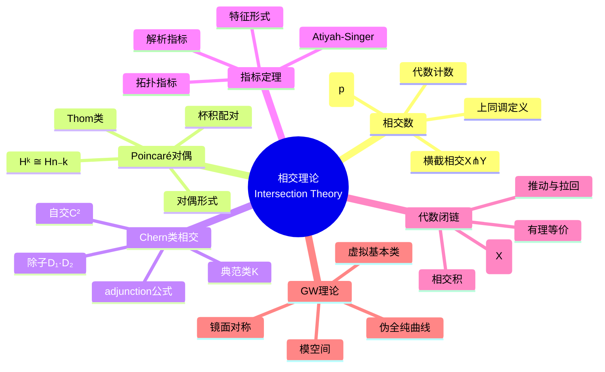

msc_primary: "00A99"
msc_secondary: ['00-00']
---

# 相交理论 (Intersection Theory)

## 中心概念精确定义

**相交理论**研究子流形（或子簇）的相交行为的拓扑与代数不变量。在光滑紧定向流形$M$中，两个子流形$X$和$Y$的**相交**$X \cap Y$的拓扑信息由**相交数**编码。

**代数计数**：若$X \pitchfork Y$（横截相交），则：
$$X \cdot Y = \sum_{p \in X \cap Y} \epsilon(p)$$

其中$\epsilon(p) = \pm 1$由定向决定。

**上同调实现**：
$$X \cdot Y = \int_M \eta_X \wedge \eta_Y = \langle [X], [Y] \rangle$$

其中$\eta_X, \eta_Y$是Poincaré对偶形式，$\langle , \rangle$是杯积配对。

**核心思想**：相交理论是代数的、拓扑的，且与几何实现无关。

---

## 核心要素

### 1. 相交数

**横截相交**：$X \pitchfork Y$若对所有$p \in X \cap Y$：
$$T_pX + T_pY = T_pM$$

**相交符号**：在横截点$p$：
$$\epsilon(p) = \text{sign}(\det(T_pX \oplus T_pY \xrightarrow{\cong} T_pM))$$

**上同调定义**：对任意代表同调类的子流形：
$$X \cdot Y = \langle \text{PD}(X) \cup \text{PD}(Y), [M] \rangle$$

### 2. Poincaré对偶

**定理**：对紧定向$n$-维流形$M$：
$$H^k(M) \cong H_{n-k}(M), \quad \alpha \mapsto \alpha \frown [M]$$

**杯积配对**：
$$H^k(M) \times H^{n-k}(M) \to \mathbb{R}, \quad (\alpha, \beta) \mapsto \int_M \alpha \wedge \beta$$

非退化（Poincaré对偶性）。

**Thom类**：子流形$X^k \subset M^n$的Thom类$\tau_X \in H^{n-k}(N_X, N_X \setminus X)$，限制于$M$给出Poincaré对偶。

### 3. Chern类与相交

**除子相交**：复流形上，除子（余维1子簇）$D_1, D_2$的相交数：
$$D_1 \cdot D_2 = \int_M c_1(\mathcal{O}(D_1)) \wedge c_1(\mathcal{O}(D_2)) \wedge \omega^{n-2}$$

**自相交**：曲面上曲线$C$的自相交数：
$$C^2 = C \cdot C = \int_M c_1(N_C) = 2g - 2 - K \cdot C$$

**adjunction公式**：
$$2g(C) - 2 = C^2 + K_X \cdot C$$

### 4. 指标定理

**Atiyah-Singer指标定理**：椭圆算子$D: \Gamma(E) \to \Gamma(F)$：
$$\text{ind}(D) = \dim \ker D - \dim \ker D^* = \int_M \text{ch}(E - F) \wedge \hat{A}(TM)$$

**亏格公式**：
- **Todd亏格**：$\chi(X, \mathcal{O}) = \int_M \text{Td}(TX)$
- **Hirzebruch符号差**：$\sigma(M) = \int_M L(p_1, \ldots)$
- **$\hat{A}$亏格**：spin流形上，$\hat{A}(M) = \int_M \hat{A}(TM)$

### 5. 代数闭链

**代数闭链**：代数簇$X$上的形式和$Z = \sum n_i [Z_i]$，$Z_i$是子簇。

**有理等价**：$Z \sim_{\text{rat}} 0$若$Z$是某变分的边界。

**Chow群**：$A_k(X) = \{\text{codim } k \text{ 闭链}\}/\sim_{\text{rat}}$

**相交积**：$A_k(X) \times A_l(X) \to A_{k+l}(X)$。

### 6. 伪全纯曲线

**Gromov-Witten理论**：辛流形$(M, \omega)$上伪全纯曲线的模空间：
$$\overline{\mathcal{M}}_{g,n}(M, A)$$

**GW不变量**：
$$\langle \alpha_1, \ldots, \alpha_n \rangle_{g,n,A} = \int_{[\overline{\mathcal{M}}]^{\text{vir}}} \text{ev}_1^*\alpha_1 \cup \cdots \cup \text{ev}_n^*\alpha_n$$

**镜面对称**：Calabi-Yau 3- folds的GW不变量对应B模型的周期积分。

---

## 性质与定理

### 定理1：Bezout定理

$\mathbb{C}P^n$中$d_1, \ldots, d_n$次超曲面的交点数（横截时）：
$$\#(X_1 \cap \cdots \cap X_n) = d_1 \cdots d_n$$

### 定理2：Thom可横截性

一般扰动使相交横截。

### 定理3：Lefschetz超平面定理

$X \subset \mathbb{C}P^N$光滑射影，$H$超平面，则：
$$\pi_i(X \cap H) \to \pi_i(X)$$

对$i < \dim(X \cap H)$是同构。

### 定理4：Riemann-Roch-Hirzebruch

紧复流形上全纯向量丛$E$：
$$\chi(X, E) = \int_X \text{ch}(E) \wedge \text{Td}(TX)$$

### 定理5：Gromov紧性定理

辛流形上有界能量的伪全纯曲线序列有收敛子序列（到稳定映射）。

---

## 典型例子

### 例子1：射影平面上的曲线相交

$\mathbb{C}P^2$中$d_1$次和$d_2$次曲线相交：
$$C_1 \cdot C_2 = d_1 d_2$$

**自相交**：直线$L \subset \mathbb{C}P^2$，$L^2 = 1$。

### 例子2：复环面的相交

$T^2 = \mathbb{C}/\Lambda$，$a, b$是1-闭链：
$$a \cdot b = \det([a], [b])$$

（基本周期的行列式）

### 例子3：指标定理与指标计算

**Dirac算子**：$D: \Gamma(S^+) \to \Gamma(S^-)$在K3曲面上：
$$\text{ind}(D) = \frac{c_1^2 + c_2}{24} = 2$$

（$\hat{A}(K3) = 2$）

---

## 关联概念

| 概念 | 关系 | 应用领域 |
|------|------|----------|
| **上同调论** | Poincaré对偶 | 代数拓扑 |
| **特征类** | Chern类计算 | 微分几何 |
| **指标定理** | 拓扑公式 | 数学物理 |
| **代数几何** | Chow环 | 枚举几何 |
| **辛几何** | GW理论 | 弦理论 |
| **Floer理论** | Lagrange相交 | 低维拓扑 |

---

## Mermaid 思维导图

---

## 学术参考

**Princeton MAT 355**: Intersection theory on manifolds via Poincaré duality.

**MIT 18.905**: Intersection pairing and the cup product in cohomology.

**经典文献**：
- Griffiths & Harris, *Principles of Algebraic Geometry* (第0章)
- Fulton, W. *Intersection Theory*
- McDuff & Salamon, *J-holomorphic Curves and Symplectic Topology*

---

*生成日期：2026年4月 | MSC2020: 14C17, 55N45, 57R20*
