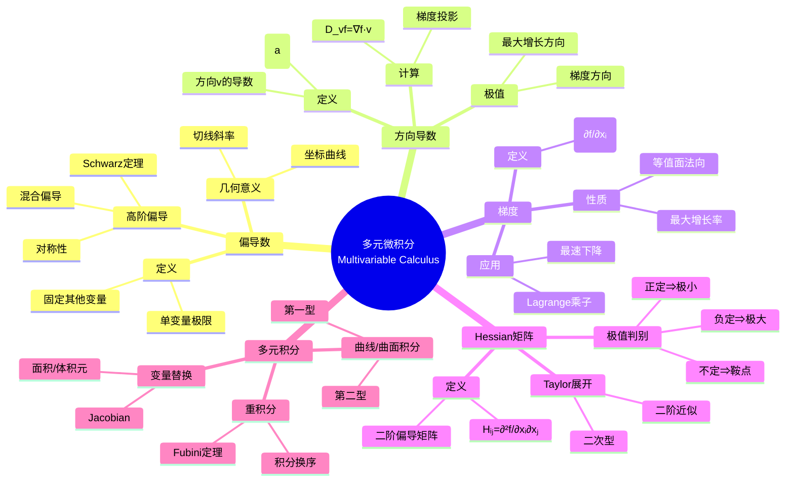

# 多元微积分 (Multivariable Calculus)

## 中心概念精确定义

**多元微积分**是研究多元函数微分与积分的数学分支，将单变量分析推广到高维空间。

> **偏导数**：设 $f: \mathbb{R}^n \to \mathbb{R}$，在点 $\mathbf{a}$ 处关于第 $i$ 个变量的偏导数：
> $$\frac{\partial f}{\partial x_i}(\mathbf{a}) = \lim_{h \to 0} \frac{f(\mathbf{a} + h\mathbf{e}_i) - f(\mathbf{a})}{h}$$

> **梯度**：$\nabla f = \left(\frac{\partial f}{\partial x_1}, \ldots, \frac{\partial f}{\partial x_n}\right)$

> **Hessian矩阵**：$H_f = \left(\frac{\partial^2 f}{\partial x_i \partial x_j}\right)_{n \times n}$

---

## Mermaid 思维导图



---

## 核心要素详解

### 1. 偏导数与可微性

**偏导数存在 $\nRightarrow$ 连续**：

**经典反例**：
$$f(x,y) = \begin{cases} \frac{xy}{x^2+y^2} & (x,y) \neq (0,0) \\ 0 & (x,y) = (0,0) \end{cases}$$

在原点偏导数存在但函数不连续。

**可微性定义**：$f$ 在 $\mathbf{a}$ 可微，如果存在线性映射 $L$ 使得：
$$f(\mathbf{a} + \mathbf{h}) = f(\mathbf{a}) + L(\mathbf{h}) + o(\|\mathbf{h}\|)$$

此时 $L(\mathbf{h}) = \nabla f(\mathbf{a}) \cdot \mathbf{h}$

**可微的充分条件**：偏导数连续 $\Rightarrow$ 可微

### 2. 方向导数

**定义**：方向 $\mathbf{v}$（$\|\mathbf{v}\| = 1$）上的方向导数：
$$D_{\mathbf{v}}f(\mathbf{a}) = \lim_{t \to 0} \frac{f(\mathbf{a} + t\mathbf{v}) - f(\mathbf{a})}{t}$$

**计算公式**（若 $f$ 可微）：
$$D_{\mathbf{v}}f(\mathbf{a}) = \nabla f(\mathbf{a}) \cdot \mathbf{v} = \|\nabla f(\mathbf{a})\| \cos\theta$$

**极值性质**：
- 最大方向导数：$\|\nabla f\|$，方向为梯度方向
- 最小方向导数：$-\|\nabla f\|$，方向为负梯度方向
- 零方向导数：垂直于梯度的方向

### 3. 梯度与等值面

**几何意义**：
- 梯度 $\nabla f(\mathbf{a})$ 垂直于等值面（线）$f(\mathbf{x}) = f(\mathbf{a})$
- 梯度指向函数值增长最快的方向
- 梯度大小等于最大增长率

**最速下降法**：迭代格式 $\mathbf{x}_{k+1} = \mathbf{x}_k - \alpha \nabla f(\mathbf{x}_k)$

### 4. Hessian 矩阵与极值

**Hessian矩阵**：
$$H_f(\mathbf{a}) = \begin{pmatrix} \frac{\partial^2 f}{\partial x_1^2} & \cdots & \frac{\partial^2 f}{\partial x_1 \partial x_n} \\ \vdots & \ddots & \vdots \\ \frac{\partial^2 f}{\partial x_n \partial x_1} & \cdots & \frac{\partial^2 f}{\partial x_n^2} \end{pmatrix}$$

**Schwarz定理**：若二阶偏导连续，则 $\frac{\partial^2 f}{\partial x_i \partial x_j} = \frac{\partial^2 f}{\partial x_j \partial x_i}$，即Hessian对称。

**极值判别法**（设 $\nabla f(\mathbf{a}) = 0$）：
- $H_f(\mathbf{a})$ 正定 $\Rightarrow$ $\mathbf{a}$ 是严格极小值点
- $H_f(\mathbf{a})$ 负定 $\Rightarrow$ $\mathbf{a}$ 是严格极大值点
- $H_f(\mathbf{a})$ 不定 $\Rightarrow$ $\mathbf{a}$ 是鞍点
- $H_f(\mathbf{a})$ 半定 $\Rightarrow$ 需更高阶判别

### 5. 链式法则

**多元链式法则**：设 $\mathbf{x} = \mathbf{x}(\mathbf{t})$，则：
$$\frac{\partial f}{\partial t_i} = \sum_{j=1}^n \frac{\partial f}{\partial x_j} \frac{\partial x_j}{\partial t_i}$$

矩阵形式：$D(f \circ \mathbf{x}) = Df \cdot D\mathbf{x}$

### 6. 重积分与变量替换

**Fubini定理**：若 $f$ 在 $R = [a,b] \times [c,d]$ 上可积，则：
$$\iint_R f(x,y)\,dA = \int_a^b \left(\int_c^d f(x,y)\,dy\right)dx = \int_c^d \left(\int_a^b f(x,y)\,dx\right)dy$$

**变量替换公式**：设 $\mathbf{x} = \mathbf{\phi}(\mathbf{u})$，则：
$$\int_{\phi(D)} f(\mathbf{x})\,d\mathbf{x} = \int_D f(\mathbf{\phi}(\mathbf{u})) |\det D\mathbf{\phi}|\,d\mathbf{u}$$

**Jacobian行列式**：$J = \det D\mathbf{\phi} = \det\left(\frac{\partial x_i}{\partial u_j}\right)$

---

## 关键性质与定理

### 定理1：Clairaut/Schwarz 定理

**定理**：若 $f$ 的混合偏导数 $f_{xy}$ 和 $f_{yx}$ 在某开集上连续，则：
$$\frac{\partial^2 f}{\partial x \partial y} = \frac{\partial^2 f}{\partial y \partial x}$$

即求导顺序可交换。

### 定理2：反函数定理

**定理**：设 $f: \mathbb{R}^n \to \mathbb{R}^n$ 是 $C^1$ 映射，若 $\det Df(\mathbf{a}) \neq 0$，则存在邻域使 $f$ 是微分同胚，且：
$$D(f^{-1})(f(\mathbf{a})) = [Df(\mathbf{a})]^{-1}$$

### 定理3：Lagrange 乘子法

**定理**：设 $f, g_1, \ldots, g_m$ 是 $C^1$ 函数，$\mathbf{a}$ 是 $f$ 在约束 $g_i(\mathbf{x}) = 0$ 下的极值点，且 $\nabla g_i(\mathbf{a})$ 线性无关，则存在 $\lambda_1, \ldots, \lambda_m$ 使得：
$$\nabla f(\mathbf{a}) = \sum_{i=1}^m \lambda_i \nabla g_i(\mathbf{a})$$

### 定理4：Green/Stokes/Gauss 定理

**Green定理**（二维）：
$$\oint_C P\,dx + Q\,dy = \iint_D \left(\frac{\partial Q}{\partial x} - \frac{\partial P}{\partial y}\right)dA$$

**Stokes定理**（三维曲面）：
$$\oint_{\partial S} \mathbf{F} \cdot d\mathbf{r} = \iint_S (\nabla \times \mathbf{F}) \cdot d\mathbf{S}$$

**Gauss定理**（散度定理）：
$$\iiint_V (\nabla \cdot \mathbf{F})\,dV = \oiint_{\partial V} \mathbf{F} \cdot d\mathbf{S}$$

---

## 典型例子

### 例子1：计算方向导数

设 $f(x,y,z) = x^2y + yz^3$，求在点 $(1,2,-1)$ 沿方向 $\mathbf{v} = (1,1,1)/\sqrt{3}$ 的方向导数。

**解**：
- $\nabla f = (2xy, x^2+z^3, 3yz^2)$
- $\nabla f(1,2,-1) = (4, 0, 6)$
- $D_{\mathbf{v}}f = \nabla f \cdot \mathbf{v} = (4,0,6) \cdot (1,1,1)/\sqrt{3} = \frac{10}{\sqrt{3}}$

### 例子2：极值判别

求 $f(x,y) = x^3 - 3x + y^3 - 3y$ 的极值点。

**解**：
- 驻点：$\nabla f = (3x^2-3, 3y^2-3) = 0$ $\Rightarrow$ $(\pm 1, \pm 1)$ 四个点
- Hessian：$H = \begin{pmatrix} 6x & 0 \\ 0 & 6y \end{pmatrix}$
- $(1,1)$：$H$ 正定，极小值
- $(-1,-1)$：$H$ 负定，极大值
- $(1,-1), (-1,1)$：$H$ 不定，鞍点

### 例子3：极坐标下的积分

计算 $\displaystyle\iint_D e^{-x^2-y^2}\,dA$，$D$ 为单位圆盘。

**解**：令 $x = r\cos\theta$，$y = r\sin\theta$，$J = r$：
$$\int_0^{2\pi} \int_0^1 e^{-r^2} r\,dr\,d\theta = 2\pi \cdot \left[-\frac{1}{2}e^{-r^2}\right]_0^1 = \pi(1 - e^{-1})$$

---

## 关联概念网络

### 相似概念

| 概念 | 关系 | 说明 |
|------|------|------|
| **Fréchet导数** | 推广 | Banach空间中的微分 |
| **Gâteaux导数** | 弱化 | 方向导数的推广 |
| **Sobolev空间** | 应用 | 偏微分方程中的函数空间 |

### 对偶概念

| 概念 | 对偶关系 | 说明 |
|------|----------|------|
| **梯度 ↔ 散度** | 向量微积分 | $\nabla \cdot$ 是 $\nabla$ 的对偶 |
| **旋度 ↔ 梯度** | 正交分解 | Helmholtz分解 |

### 推广概念

```
多元微积分 → 流形上的微积分
      ↓
   微分形式
      ↓
   外微分几何
      ↓
   代数拓扑
```

---

## 课程对齐

### MIT 18.02/18.022
- **Topics**: Partial derivatives, gradient, multiple integrals
- **Key**: Chain rule, optimization, change of variables, vector calculus

### Princeton MAT 201/202
- **Text**: Hubbard & Hubbard, *Vector Calculus, Linear Algebra, and Differential Forms*
- **Emphasis**: Linear algebra viewpoint, differential forms

---

## 总结

多元微积分将单变量分析的核心概念推广到高维空间。偏导数、方向导数和梯度提供了研究函数局部变化的工具，而Hessian矩阵则刻画了曲面的弯曲性质和极值行为。重积分、变量替换公式和三大积分定理（Green、Stokes、Gauss）构成了多元积分学的骨架，在物理和工程中有着广泛应用。

---

*创建日期：2026年4月*  
*相关概念：[隐函数定理](隐函数定理.md)、[微分形式](微分形式.md)、[Sobolev空间](Sobolev空间.md)*
