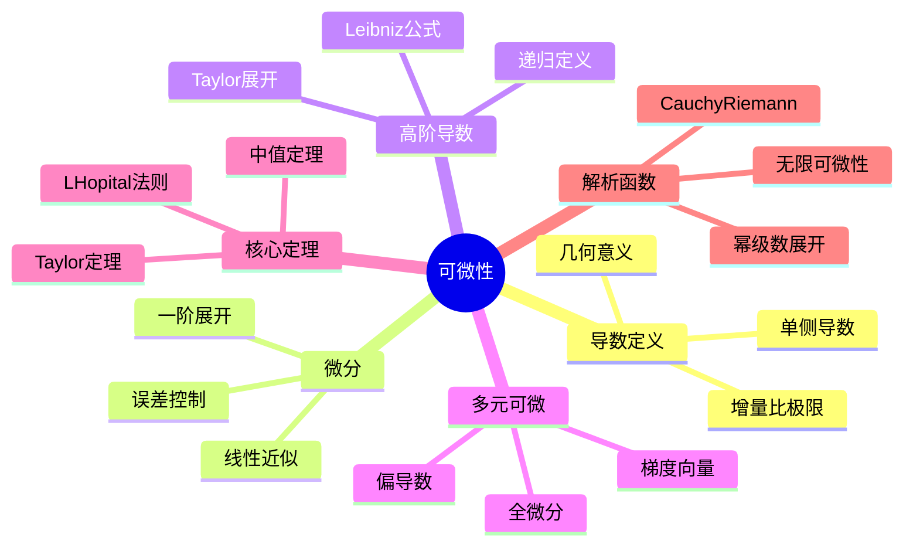

# 可微性 思维导图

## 中心概念

### 精确定义

**可微性**（可导性）刻画函数在某点处"局部线性"的性态。函数 $f$ 在点 $a$ 可微定义为极限 $\lim_{h \to 0} \frac{f(a+h) - f(a)}{h}$ 存在，此极限值称为 $f$ 在 $a$ 处的**导数**，记作 $f'(a)$。

### 直观理解

导数是函数在某点处的"瞬时变化率"。几何上，它是函数图像在该点切线的斜率。可微性意味着函数在该点可以很好地用线性函数近似——这是微分学的核心思想。

---

## 第一层分支：核心要素

### 导数定义

- **增量比极限**：$f'(a) = \lim_{h \to 0} \frac{f(a+h) - f(a)}{h}$
- **等价形式**：$f'(a) = \lim_{x \to a} \frac{f(x) - f(a)}{x - a}$
- **单侧导数**：左导数 $f'_-(a)$ 和右导数 $f'_+(a)$
- **可微条件**：左、右导数存在且相等

### 微分

- **定义**：$df = f'(x)dx$，其中 $dx = \Delta x$
- **线性近似**：$f(x + \Delta x) \approx f(x) + f'(x)\Delta x$
- **误差控制**：$f(x + h) = f(x) + f'(x)h + o(h)$
- **几何意义**：用切线代替曲线

### 高阶导数

- **二阶导数**：$f''(x) = (f'(x))'$，刻画"变化率的变化率"
- **n阶导数**：递归定义 $f^{(n)}(x) = (f^{(n-1)}(x))'$
- **记号**：$\frac{d^n y}{dx^n}$ 或 $y^{(n)}$
- **物理意义**：加速度是位移的二阶导数

### 多元函数可微性

- **偏导数**：$\frac{\partial f}{\partial x_i} = \lim_{h \to 0} \frac{f(x+he_i) - f(x)}{h}$
- **全微分**：$df = \sum_{i=1}^n \frac{\partial f}{\partial x_i} dx_i$
- **可微条件**：偏导数存在且连续 $\Rightarrow$ 可微
- **梯度向量**：$\nabla f = (\frac{\partial f}{\partial x_1}, \ldots, \frac{\partial f}{\partial x_n})$

### 解析函数

- **定义**：可展开为收敛幂级数的函数
- **复变函数**：复可微 $\Leftrightarrow$ 解析（Cauchy-Riemann条件）
- **实变函数**：解析性要求远高于可微性
- **特征**：解析函数在其定义域内无限次可微

---

## 第二层分支：性质与定理

### 重要性质

#### 1. 可微与连续的关系

- **可微必连续**：$f$ 在 $a$ 可微 $\Rightarrow$ $f$ 在 $a$ 连续
- **连续不必可微**：如 $f(x) = |x|$ 在 $x=0$
- **几何解释**：连续是"连通"，可微是"光滑"

#### 2. 求导法则

- **线性法则**：$(af + bg)' = af' + bg'$
- **乘积法则（Leibniz法则）**：$(fg)' = f'g + fg'$
- **商法则**：$(\frac{f}{g})' = \frac{f'g - fg'}{g^2}$
- **链式法则**：$(f \circ g)'(x) = f'(g(x)) \cdot g'(x)$
- **反函数求导**：$(f^{-1})'(y) = \frac{1}{f'(x)}$，其中 $y = f(x)$

#### 3. 高阶导数公式

- **Leibniz公式**：$(fg)^{(n)} = \sum_{k=0}^n C_n^k f^{(k)} g^{(n-k)}$
- **常见函数的高阶导数**：
  - $(e^x)^{(n)} = e^x$
  - $(\sin x)^{(n)} = \sin(x + \frac{n\pi}{2})$
  - $(x^a)^{(n)} = a(a-1)\cdots(a-n+1)x^{a-n}$

### 核心定理

#### 1. 微分中值定理（MVT）

- **Rolle定理**：$f(a) = f(b)$ 且满足条件 $\Rightarrow$ $\exists c \in (a,b)$，$f'(c) = 0$
- **Lagrange中值定理**：$\exists c \in (a,b)$，使得 $f'(c) = \frac{f(b) - f(a)}{b - a}$
- **Cauchy中值定理**：$\exists c \in (a,b)$，使得 $\frac{f'(c)}{g'(c)} = \frac{f(b) - f(a)}{g(b) - g(a)}$
- **几何意义**：曲线上存在一点切线平行于弦

#### 2. Taylor定理

- **带Lagrange余项**：$f(x) = \sum_{k=0}^n \frac{f^{(k)}(a)}{k!}(x-a)^k + \frac{f^{(n+1)}(\xi)}{(n+1)!}(x-a)^{n+1}$
- **带Peano余项**：$f(x) = \sum_{k=0}^n \frac{f^{(k)}(a)}{k!}(x-a)^k + o((x-a)^n)$
- **Maclaurin展开**：$a = 0$ 时的Taylor展开
- **应用**：近似计算、误差估计、极限计算

#### 3. L'Hôpital法则

- **$\frac{0}{0}$ 型**：$\lim \frac{f}{g} = \lim \frac{f'}{g'}$（满足条件）
- **$\frac{\infty}{\infty}$ 型**：同上
- **其他不定式**：$0 \cdot \infty$, $\infty - \infty$, $1^\infty$, $0^0$, $\infty^0$ 转化为上述形式
- **条件**：分子分母可导，分母导数非零，右边极限存在

---

## 第三层分支：例子与应用

### 典型例子

#### 1. 基本初等函数的导数

- **幂函数**：$(x^a)' = ax^{a-1}$
- **指数函数**：$(a^x)' = a^x \ln a$，特别地 $(e^x)' = e^x$
- **对数函数**：$(\ln x)' = \frac{1}{x}$
- **三角函数**：$(\sin x)' = \cos x$，$(\cos x)' = -\sin x$
- **反三角函数**：$(\arcsin x)' = \frac{1}{\sqrt{1-x^2}}$

#### 2. 连续但不可微的例子

- **Weierstrass函数**：处处连续但处处不可微
- **$f(x) = x \sin\frac{1}{x}$**（补充 $f(0)=0$）：在 $0$ 连续但不可微
- **尖点**：$f(x) = |x|$ 在 $x=0$ 形成"尖点"

### 反例

#### 1. 可微但不连续可微

- $f(x) = x^2 \sin\frac{1}{x}$（$x \neq 0$），$f(0) = 0$
- 性质：处处可微，但导数在 $0$ 不连续

#### 2. 偏导存在但不可微

- $f(x,y) = \frac{xy}{\sqrt{x^2+y^2}}$（$(x,y) \neq (0,0)$），$f(0,0) = 0$
- 在 $(0,0)$ 偏导数存在但函数不可微

### 应用场景

#### 1. 函数性态分析

- **单调性**：$f' > 0$ $\Rightarrow$ 严格递增
- **极值点**：$f'(x_0) = 0$（必要条件），$f''(x_0) > 0$（极小值充分条件）
- **凹凸性**：$f'' > 0$ $\Rightarrow$ 下凸（凸函数）
- **拐点**：凹凸性改变的点

#### 2. 最优化理论

- **Fermat定理**：极值点处导数为零（驻点）
- **凸优化**：凸函数的局部极小 = 全局极小
- **约束优化**：Lagrange乘数法
- **梯度下降**：$x_{n+1} = x_n - \eta \nabla f(x_n)$

#### 3. 物理应用

- **运动学**：$s'(t) = v(t)$（速度），$v'(t) = a(t)$（加速度）
- **牛顿第二定律**：$F = ma = m\frac{d^2x}{dt^2}$
- **热传导方程**：$\frac{\partial u}{\partial t} = k \frac{\partial^2 u}{\partial x^2}$
- **波动方程**：$\frac{\partial^2 u}{\partial t^2} = c^2 \frac{\partial^2 u}{\partial x^2}$

---

## 第四层分支：关联概念

### 相似概念

#### 方向导数

- **定义**：沿方向 $v$ 的变化率
  $$D_v f(x) = \lim_{t \to 0} \frac{f(x + tv) - f(x)}{t}$$
- **与梯度关系**：$D_v f = \nabla f \cdot v$（$v$ 为单位向量）
- **最速上升方向**：梯度方向

#### Gateaux导数与Fréchet导数

- **Gateaux导数**：方向导数的推广
- **Fréchet导数**：最强的可微概念，要求线性逼近误差是高阶无穷小
- **关系**：Fréchet可微 $\Rightarrow$ Gateaux可微，反之不成立

### 对偶概念

#### 积分（微积分基本定理）

- **第一形式**：$\frac{d}{dx}\int_a^x f(t)dt = f(x)$
- **第二形式**：$\int_a^b F'(x)dx = F(b) - F(a)$
- **本质**：微分与积分互为逆运算

#### Sobolev空间

- **弱导数**：通过分部积分定义的广义导数
- **Sobolev空间 $W^{k,p}$**：$k$ 阶弱导数属于 $L^p$ 的函数空间
- **应用**：偏微分方程弱解理论

### 推广概念

#### 流形上的微分

- **切向量**：曲线在某点的"速度向量"
- **余切向量**：对偶空间中的元素
- **外微分**：微分形式的外微分运算 $d: \Omega^k \to \Omega^{k+1}$
- **de Rham上同调**：用微分形式刻画拓扑性质

#### 变分法

- **泛函导数**：$\frac{\delta J}{\delta y}$
- **Euler-Lagrange方程**：极值必要条件
- **应用**：力学、几何光学、最小曲面

---

## Mermaid思维导图

---

**参考章节**：数学分析I - 第3章 微分学
**关联文件**：连续性-思维导图.md、级数-思维导图.md
