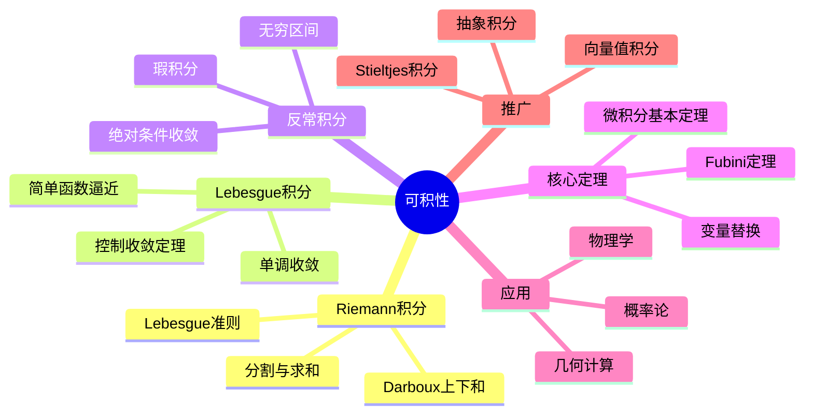

msc_primary: "00A99"
msc_secondary: ['00-00']
---

# 可积性 思维导图

## 中心概念

### 精确定义

**可积性**研究函数在区间上"面积"的可定义性。Riemann可积要求函数能用阶梯函数任意精度逼近；Lebesgue可积基于测度论，允许更广泛的函数类，核心思想是将值域分割而非定义域分割。

### 直观理解

积分是"连续求和"的过程。Riemann积分通过分割区间、取代表值、求和取极限来定义曲线下面积；Lebesgue积分则问"函数取某值的范围有多大"，更适合处理极限和交换运算。

---

## 第一层分支：核心要素

### Riemann积分

- **分割**：$P: a = x_0 < x_1 < \cdots < x_n = b$
- **Riemann和**：$S(f,P,\xi) = \sum_{i=1}^n f(\xi_i)\Delta x_i$
- **可积定义**：$\lim_{\|P\| \to 0} S(f,P,\xi)$ 存在且与分点和代表元选取无关

- **Darboux和**：上积分 $U(f,P) = \sum M_i \Delta x_i$，下积分 $L(f,P) = \sum m_i \Delta x_i$

### Riemann可积的判别条件

- **充要条件**：上、下Darboux积分相等，或$\forall \epsilon > 0$，存在分割使 $U(f,P) - L(f,P) < \epsilon$
- **Lebesgue准则**：有界函数Riemann可积 $\Leftrightarrow$ 不连续点为零测集
- **充分条件**：连续函数、单调函数、有限个间断点的有界函数

### Lebesgue积分

- **简单函数**：可测集的指示函数的线性组合
- **非负可测函数积分**：$\int f = \sup\{\int s : s \leq f, s \text{ 为简单函数}\}$
- **一般可测函数**：$f = f^+ - f^-$，$\int f = \int f^+ - \int f^-$（要求至少一个有限）
- **可积函数空间**：$L^1 = \{f: \int |f| < \infty\}$

### Lebesgue可积的性质

- **绝对可积性**：$f$ 可积 $\Leftrightarrow$ $|f|$ 可积

- **可数可加性**：互不相交可测集上的积分可求和
- **绝对连续性**：$\mu(E) \to 0$ 时，$\int_E f \to 0$
- **控制收敛定理**：$|f_n| \leq g$，$g$ 可积，$f_n \to f$ a.e. $\Rightarrow$ $\int f_n \to \int f$

### 反常积分

- **无穷区间**：$\int_a^{+\infty} f(x)dx = \lim_{b \to +\infty} \int_a^b f(x)dx$
- **瑕积分**：$\int_a^b f(x)dx$，$f$ 在某点无界
- **绝对收敛**：$\int |f|$ 收敛
- **条件收敛**：$\int f$ 收敛但 $\int |f|$ 发散（如 $\int_1^{\infty} \frac{\sin x}{x}dx$）

---

## 第二层分支：性质与定理

### 重要性质

#### 1. 积分的基本性质

- **线性性**：$\int (af + bg) = a\int f + b\int g$
- **单调性**：$f \leq g$ $\Rightarrow$ $\int f \leq \int g$
- **区间可加性**：$\int_a^c = \int_a^b + \int_b^c$
- **绝对值不等式**：$|\int f| \leq \int |f|$

#### 2. Riemann积分与Lebesgue积分的关系

- **包含关系**：Riemann可积 $\Rightarrow$ Lebesgue可积，且积分值相等
- **本质区别**：Lebesgue积分在极限交换方面更灵活
- **Lebesgue优越性**：处理逐项积分、积分号下求导更自然

### 核心定理

#### 1. 微积分基本定理

- **第一形式**：若 $f$ 连续，则 $F(x) = \int_a^x f(t)dt$ 可导，且 $F'(x) = f(x)$
- **第二形式（Newton-Leibniz公式）**：若 $F' = f$ 连续，则 $\int_a^b f(x)dx = F(b) - F(a)$
- **本质**：微分与积分互为逆运算

#### 2. 积分收敛定理（Lebesgue理论）

- **单调收敛定理**：$0 \leq f_n \nearrow f$ $\Rightarrow$ $\int f_n \nearrow \int f$
- **Fatou引理**：$\int \liminf f_n \leq \liminf \int f_n$
- **控制收敛定理**：$|f_n| \leq g \in L^1$，$f_n \to f$ a.e. $\Rightarrow$ $\int f_n \to \int f$

- **重要性**：是Lebesgue积分理论的核心优势

#### 3. Fubini定理与Tonelli定理

- **Fubini定理**：$f \in L^1(X \times Y)$ $\Rightarrow$ 累次积分可交换且等于重积分
- **Tonelli定理**：非负可测函数的重积分与累次积分相等
- **应用**：多重积分的计算、概率论中的联合分布

#### 4. 变量替换公式

- **公式**：$\int_{\phi(a)}^{\phi(b)} f(x)dx = \int_a^b f(\phi(t))\phi'(t)dt$
- **Lebesgue形式**：$\int_E f(y)dy = \int_{\phi^{-1}(E)} f(\phi(x))|J_\phi(x)|dx$

- **Jacobian行列式**：描述变换对体积元的缩放

---

## 第三层分支：例子与应用

### 典型例子

#### 1. Riemann可积的例子

- **连续函数**：闭区间上的连续函数必Riemann可积
- **单调函数**：闭区间上的单调函数必Riemann可积
- **分段连续函数**：有限个第一类间断点的有界函数

#### 2. Riemann不可积但Lebesgue可积

- **Dirichlet函数**：$D(x) = \begin{cases} 1 & x \in \mathbb{Q} \\ 0 & x \notin \mathbb{Q} \end{cases}$
  - Riemann不可积（处处不连续）
  - Lebesgue可积，$\int D = 0$（$\mathbb{Q}$ 为零测集）

#### 3. 反常积分例子

- **收敛**：$\int_1^{\infty} \frac{1}{x^p}dx$（$p > 1$ 收敛），$\int_0^1 \frac{1}{x^p}dx$（$p < 1$ 收敛）
- **条件收敛**：$\int_1^{\infty} \frac{\sin x}{x}dx = \frac{\pi}{2}$
- **Gamma函数**：$\Gamma(s) = \int_0^{\infty} x^{s-1}e^{-x}dx$（$s > 0$）

### 反例

#### 1. Lebesgue可积但无原函数

- **Volterra函数**：导数有界但Riemann不可积，其不定积分是连续函数，但不是某个Riemann可积函数的不定积分

#### 2. 原函数存在但不可积

- $F(x) = x^2 \sin\frac{1}{x^2}$，$F'(x)$ 无界，在含0区间上非Riemann可积

### 应用场景

#### 1. 几何应用

- **曲线弧长**：$L = \int_a^b \sqrt{1 + (f'(x))^2}dx$
- **旋转体体积**：圆盘法 $V = \pi \int_a^b f(x)^2 dx$
- **旋转曲面面积**：$S = 2\pi \int_a^b f(x)\sqrt{1 + (f'(x))^2}dx$

#### 2. 概率论

- **期望**：$E[X] = \int X dP$ 或 $\int x f(x)dx$
- **概率密度**：$P(X \in A) = \int_A f(x)dx$
- **特征函数**：$\varphi(t) = E[e^{itX}] = \int e^{itx}f(x)dx$

#### 3. 物理学

- **功**：$W = \int F \cdot ds$
- **质心**：$\bar{x} = \frac{\int x \rho(x)dx}{\int \rho(x)dx}$
- **转动惯量**：$I = \int r^2 dm$
- **概率守恒**：量子力学中的归一化条件 $\int |\psi|^2 = 1$

---

## 第四层分支：关联概念

### 相似概念

#### Stieltjes积分

- **定义**：$\int_a^b f(x)d\alpha(x)$，关于函数 $\alpha$ 的积分
- **离散情形**：退化为求和
- **概率论应用**：分布函数的期望 $E[X] = \int x dF(x)$

#### 曲线积分与曲面积分

- **第一型曲线积分**：$\int_C f ds$，对弧长的积分
- **第二型曲线积分**：$\int_C Pdx + Qdy$，对坐标的积分
- **曲面积分**：推广到曲面上的积分

### 对偶概念

#### 微分（微积分基本定理）

- **微分是积分的逆**：$\frac{d}{dx}\int_a^x f = f(x)$
- **积分是微分的逆**：$\int_a^b F' = F(b) - F(a)$
- **微分形式**：$\int_M d\omega = \int_{\partial M} \omega$（Stokes定理）

### 推广概念

#### 抽象积分理论

- **测度空间**：$(X, \mathcal{A}, \mu)$
- **抽象Lebesgue积分**：关于一般测度的积分
- **Radon-Nikodym定理**：绝对连续测度的密度函数

#### 向量值积分

- **Bochner积分**：Banach空间值函数的积分
- **Pettis积分**：弱积分概念
- **应用**：演化方程、向量值随机过程

#### 非交换积分

- **von Neumann代数上的迹**：非交换测度论
- **谱测度**：自伴算子的函数演算
- **量子概率**：非交换概率论的基础

---

## Mermaid思维导图

---

**参考章节**：数学分析I/II - 第4章 积分学
**关联文件**：可微性-思维导图.md、测度-思维导图.md
