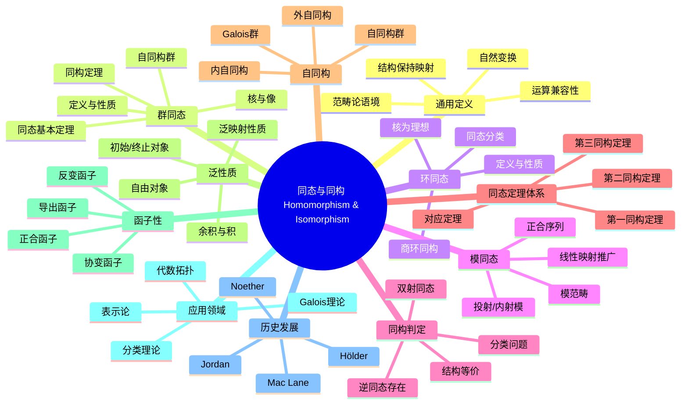

msc_primary: "00A99"
msc_secondary: ['00-00']
---

# 同态与同构 思维导图

## 中心概念
同态是保持代数结构（群、环、模等）的映射，同构是双射的同态。它们是代数中分类和比较代数结构的基本工具。

## 核心分支

### 定义与公理
- **同态定义**: 映射 $\varphi: A \to B$ 保持运算结构，即 $\varphi(a \cdot_A b) = \varphi(a) \cdot_B \varphi(b)$
- **同构定义**: 双射的同态，存在逆同态
- **范畴论**: 同态 = 态射；同构 = 可逆态射
- **自然变换**: 函子间的结构保持映射

### 基本性质
- **核与像**: $\ker \varphi = \{a : \varphi(a) = e\}$，$\text{Im}\,\varphi = \{\varphi(a) : a \in A\}$
- **结构保持**: 子结构映射到子结构，正规子结构映射到正规子结构
- **同构等价**: 同构是等价关系（自反、对称、传递）
- **分类意义**: 同构的代数结构在代数上视为相同

### 重要例子
- **群同态**: 行列式映射 $\det: GL_n \to F^\times$
- **环同态**: 求值映射 $\text{ev}_a: R[x] \to R$, $f \mapsto f(a)$
- **模同态**: 线性变换 $T: V \to W$
- **典范投影**: $\pi: G \to G/N$, $g \mapsto gN$
- **包含映射**: 子结构到母结构的嵌入

### 核心定理
- **第一同构定理**: $A/\ker \varphi \cong \text{Im}\,\varphi$
- **第二同构定理**: $HN/N \cong H/(H \cap N)$（钻石同构）
- **第三同构定理**: $(A/B)/(C/B) \cong A/C$
- **对应定理**: 子群与商群的子群一一对应
- **Jordan-Hölder定理**: 合成列的唯一性（证明思路：Schreier加细）

### 相关概念
- **父概念**: 映射、运算、代数结构
- **子概念**: 单同态、满同态、自同态、自同构、内自同构
- **相邻概念**: 商结构、正规子结构、正合序列

### 应用领域
- **分类理论**: 代数结构的同构分类
- **Galois理论**: 域扩张与群的对应
- **代数拓扑**: 同调群、同伦群
- **表示论**: 群表示的同构分类

### 历史发展
- **早期发展**: Jordan (1870)《Traité des substitutions》研究置换群同态
- **关键发展**:
  - 1889：Hölder建立合成列理论
  - 1920年代：Noether抽象化同态理论
  - 1945：Eilenberg-Mac Lane创立范畴论
- **现代研究**: 导出范畴、同调代数

### 参考资源
- **推荐教材**: Aluffi《Algebra: Chapter 0》、Mac Lane《Categories for the Working Mathematician》
- **相关论文**: Eilenberg-Mac Lane《General Theory of Natural Equivalences》
- **在线资源**: nLab（范畴论维基）

---

**概念链接**: [[群]] [[环]] [[模]] [[范畴论]] [[同调代数]]
