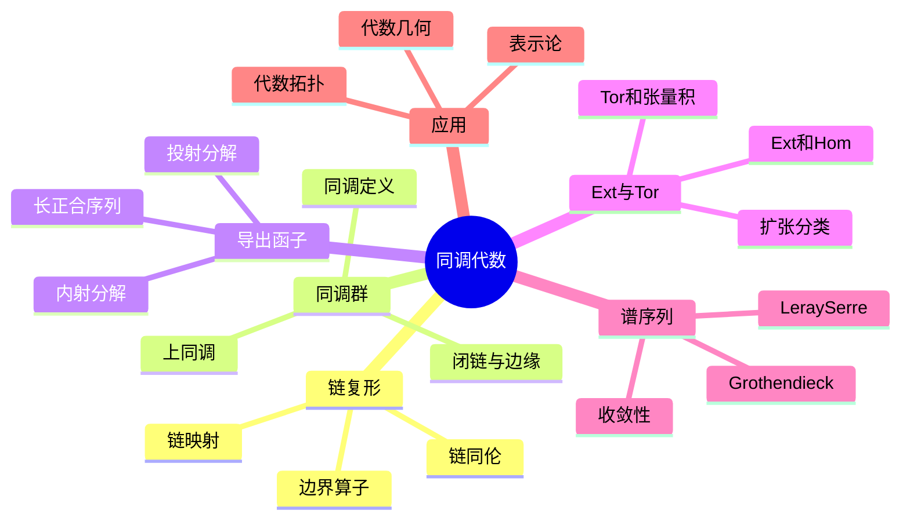

# 同调代数 思维导图

## 中心概念

### 精确定义
**同调代数**通过代数方法（链复形、同调群、导出函子）研究数学对象的"洞"和"连通性"。核心思想是将几何或代数问题转化为线性代数问题——通过构造链复形，其同调群刻画了对象的拓扑或代数不变量。

### 直观理解
同调代数是"代数化的拓扑学"。如同拓扑学研究空间的洞，同调代数研究代数结构（模、层等）的"缺陷"。它提供了统一的框架处理：拓扑空间的同调群、群的上同调、层的上同调、导出范畴等。

---

## 第一层分支：核心要素

### 链复形
- **定义**：模的序列 $\cdots \to C_{n+1} \xrightarrow{\partial_{n+1}} C_n \xrightarrow{\partial_n} C_{n-1} \to \cdots$，满足 $\partial_n \circ \partial_{n+1} = 0$
- **链映射**：$f: C_\bullet \to D_\bullet$，与边界算子交换
- **链同伦**：$f \simeq g$ 若存在 $h_n: C_n \to D_{n+1}$ 使 $f - g = \partial h + h\partial$
- **上链复形**：$C^\bullet$，微分 $d^n: C^n \to C^{n+1}$

### 同调群
- **闭链**：$Z_n = \ker \partial_n$
- **边缘链**：$B_n = \operatorname{im} \partial_{n+1}$
- **同调群**：$H_n = Z_n / B_n$
- **上同调群**：$H^n = Z^n / B^n = \ker d^n / \operatorname{im} d^{n-1}$
- **意义**："洞"的代数计数

### 导出函子
- **左导出函子**（$L_nF$）：用投射分解计算
- **右导出函子**（$R^nF$）：用内射分解计算
- **长正合序列**：短正合序列诱导同调长正合列
- **连接同态**：$\partial: L_nF(C) \to L_{n-1}F(A)$

### Ext与Tor
- **$\operatorname{Tor}_n^R(M,N)$**：$M \otimes_R -$ 的左导出函子
- **$\operatorname{Ext}_R^n(M,N)$**：$\operatorname{Hom}_R(M,-)$ 的右导出函子（或 $\operatorname{Hom}_R(-,N)$ 的右导出）
- **$\operatorname{Tor}_1$**：张量积的挠部分
- **$\operatorname{Ext}^1$**：扩张的分类

---

## 第二层分支：性质与定理

### 重要性质

#### 1. 长正合序列
- **来源**：短正合序列 $0 \to A \to B \to C \to 0$
- **形式**：$\cdots \to H_n(A) \to H_n(B) \to H_n(C) \xrightarrow{\partial} H_{n-1}(A) \to \cdots$
- **应用**：Mayer-Vietoris序列、相对同调

#### 2. 泛系数定理
- **形式**：$H_n(C; G) \cong H_n(C) \otimes G \oplus \operatorname{Tor}(H_{n-1}(C), G)$
- **上同调形式**：$H^n(C; G) \cong \operatorname{Hom}(H_n(C), G) \oplus \operatorname{Ext}(H_{n-1}(C), G)$
- **意义**：一般系数同调与整系数同调的关系

#### 3. Künneth公式
- **形式**：$H_*(X \times Y) \cong H_*(X) \otimes H_*(Y) \oplus \operatorname{Tor}(H_*(X), H_*(Y))$
- **意义**：积空间的同调用因子空间的同调表示
- **上同调形式**：涉及 cup 积

### 核心定理

#### 1. 同调代数基本定理
- **蛇引理**：交换图中特定序列的正合性
- **五引理**：五个对象的同构传递
- **九引理**：$3 \times 3$ 图表的正合性

#### 2. 导出函子的性质
- **$L_0F \cong F$**（$F$ 右正合）或 $L_0F = 0$（$F$ 左正合）
- **$R^0F \cong F$**（$F$ 左正合）
- **维数位移**：$L_{n+1}F$ 与 $L_nF$ 的关系
- **平衡性**：$\operatorname{Tor}$ 和 $\operatorname{Ext}$ 对两个变量的对称性

#### 3. 谱序列
- **概念**：逐次逼近同调群的工具
- **Leray-Serre谱序列**：纤维丛的同调
- **Leray谱序列**：层上同调
- **Grothendieck谱序列**：导出函子的复合
- **收敛**：$E_\infty^{p,q} \Rightarrow H^{p+q}$

#### 4. 导出范畴
- **动机**：复形同伦范畴不足以刻画拟同构
- **构造**：局部化拟同构
- **三角范畴**：具有好正合三角的范畴
- **t-结构**：提取"自然"的Abel子范畴
- **perverse层**：t-结构的重要例子

---

## 第三层分支：例子与应用

### 典型例子

#### 1. 拓扑同调
- **奇异同调**：$H_n^{\text{sing}}(X; G)$
- **胞腔同调**：CW复形的计算
- **de Rham上同调**：光滑流形，$H_{dR}^n(M) \cong H^n(M; \mathbb{R})$
- **Čech上同调**：层的上同调

#### 2. 群上同调
- **定义**：$H^n(G; M) = \operatorname{Ext}_{\mathbb{Z}[G]}^n(\mathbb{Z}, M)$
- **低维解释**：
  - $H^0$：不变元
  - $H^1$：交叉同态
  - $H^2$：群扩张的分类
- **环面群的上同调**：$H^*(T^n)$

#### 3. Lie代数上同调
- **Chevalley-Eilenberg复形**：利用外代数
- **Whitehead引理**：半单Lie代数的 $H^1$ 和 $H^2$
- **应用**：形变理论

#### 4. Hochschild同调
- **定义**：代数的"非交换微分形式"
- **循环同调**：Connes的周期性算子
- **应用**：非交换几何、代数K理论

### 反例

#### 1. 非导出正合性
- **张量积**：非左正合，需用 $\operatorname{Tor}$ 修正
- **Hom**：非右正合，需用 $\operatorname{Ext}$ 修正

#### 2. 导出范畴的非平凡性
- **复杂复形**：同调平凡但复形不平凡
- **例子**：没有零调的投射分解

### 应用场景

#### 1. 代数拓扑
- ** obstruction理论**：扩张、提升的障碍在上同调群中
- **示性类**：Stiefel-Whitney、Chern、Pontryagin类
- **流形分类**： surgery理论、配边理论

#### 2. 代数几何
- **层上同调**：$H^i(X, \mathcal{F})$
- **Serre对偶**：$H^i(X, \mathcal{F}) \cong H^{n-i}(X, \mathcal{F}^* \otimes \omega_X)^*$
- **Riemann-Roch定理**：Euler示性数的计算
- **导出范畴**：Fourier-Mukai变换

#### 3. 表示论
- **扩张**：$\operatorname{Ext}^1$ 分类模的扩张
- **互反律**：群表示的上同调解释
- **Kazhdan-Lusztig理论**：Hecke代数与表示的关联

#### 4. 数论
- **Galois上同调**：$H^*(G_K, M)$
- **Tate对偶**：局部域的上同调对偶
- **类域论**：上同调形式
- **BSD猜想**：椭圆曲线的秩与 $L$-函数

#### 5. 数学物理
- **BRST量子化**：鬼场与同调
- **拓扑场论**：同调不变量
- **镜像对称**：导出范畴的等价
- **弦理论**：导出范畴与D-膜

---

## 第四层分支：关联概念

### 相似概念

#### K理论
- **Grothendieck群**：$K_0$，投射模的形式差
- **高阶K理论**：Quillen的Q构造、BGL
- **与同调的关系**：Hurewicz映射、Atiyah-Hirzebruch谱序列
- **应用**：指标定理、代数数论

#### 非交换几何
- **循环同调**：Hochschild同调的改进
- **Chern特征**：$K$-理论到循环同调
- **指标定理**：Connes的noncommutative index theorem

### 对偶概念

#### 上同调运算
- **Steenrod运算**：$Sq^i$，$P^i$
- **杯积**：$H^p \times H^q \to H^{p+q}$
- **cap积**：$H_p \times H^q \to H_{p-q}$
- **Poincaré对偶**：$H^k(M) \cong H_{n-k}(M)$（可定向闭流形）

### 推广概念

#### 高阶范畴论
- **无穷范畴**：$(\infty,1)$-范畴
- **导出代数几何**：用交换微分分次代数代替交换环
- **稳定同伦范畴**：谱的范畴

####  motivic同调
- **动机**：混合 motive 的理论
- ** motivic 上同调**：代数簇的普遍上同调理论
- **Voevodsky理论**：用层论构造
- **Bloch-Kato猜想**：现已证明（Voevodsky）

#### 同伦类型论
- **univalent基础**：用同伦论重构数学基础
- **类型作为空间**：$=$ 解释为道路空间
- **高阶归纳类型**：自由构造空间

---

## Mermaid思维导图

---

**参考章节**：同调代数 - 全章  
**关联文件**：模结构-思维导图.md、范畴论-思维导图.md
