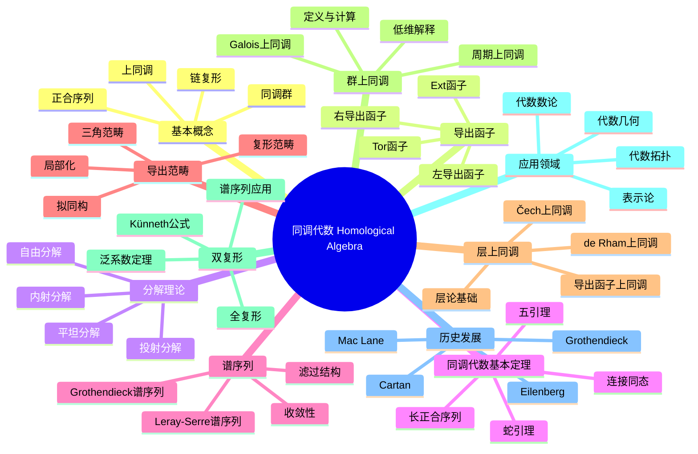

# 同调代数 思维导图

## 中心概念
同调代数是研究代数对象（模、复形等）的同调性质的数学分支，通过同调群和上同调群提取代数结构的深层不变量，是现代代数和代数几何的核心工具。

## 核心分支

### 定义与公理
- **链复形**: 模的序列 $\cdots \to C_{n+1} \xrightarrow{d_{n+1}} C_n \xrightarrow{d_n} C_{n-1} \to \cdots$ 满足 $d_n \circ d_{n+1} = 0$
- **同调群**: $H_n(C) = \ker d_n / \text{Im}\, d_{n+1}$
- **正合序列**: $\text{Im}\, d_{n+1} = \ker d_n$
- **导出函子**: 左/右正合函子的同调延拓

### 基本性质
- **长正合序列**: 短正合列诱导同调长正合序列
- **自然性**: 函子性保证图表交换
- **同伦不变性**: 链同伦映射诱导相同的同调映射
- **连接同态**: 边界映射 $\partial: H_n(C'') \to H_{n-1}(C')$

### 重要例子
- **Tor函子**: $\text{Tor}_n^R(M,N) = L_n(- \otimes_R N)(M)$
- **Ext函子**: $\text{Ext}_R^n(M,N) = R^n\text{Hom}_R(M,-)(N)$
- **群上同调**: $H^n(G,M) = \text{Ext}_{\mathbb{Z}[G]}^n(\mathbb{Z}, M)$
- **层上同调**: $H^n(X, \mathcal{F}) = R^n\Gamma(X, -)(\mathcal{F})$

### 核心定理
- **长正合序列定理**: 短正合列诱导同调长正合序列（证明思路：蛇引理迭代）
- **五引理**: 五个正合行组成的交换图中，若外四映射是同构则中间也是
- **蛇引理**: 构造连接同态的基本引理
- **谱序列收敛**: 双复形的谱序列收敛到全复形同调
- **Grothendieck谱序列**: 复合函子的导出函子谱序列

### 相关概念
- **父概念**: 模论、范畴论、同伦论
- **子概念**: 导出范畴、三角范畴、t-结构、 perverse sheaf
- **相邻概念**: 代数拓扑、层论、代数几何

### 应用领域
- **代数拓扑**: 奇异同调、上同调环、对偶性
- **代数几何**: 层上同调、相交理论、 motive理论
- **代数数论**: Galois上同调、类域论、Iwasawa理论
- **表示论**: 扩张理论、Ext群计算

### 历史发展
- **创立者**: Samuel Eilenberg 和 Saunders Mac Lane (1940年代)
- **关键发展**:
  - 1942：群扩张的函子解释
  - 1956：Cartan-Eilenberg《Homological Algebra》出版
  - 1957：Grothendieck引入Abel范畴和导出函子
  - 1980年代：导出范畴的三角结构
- **现代研究**: 高阶范畴、A_∞代数、矩阵因子化

### 参考资源
- **推荐教材**: Weibel《An Introduction to Homological Algebra》、Gelfand-Manin《Methods of Homological Algebra》
- **相关论文**: Grothendieck《Sur quelques points d'algèbre homologique》
- **在线资源**: Stacks Project、Kerodon

---

**概念链接**: [[模]] [[范畴论]] [[导出范畴]] [[层]] [[代数拓扑]]
