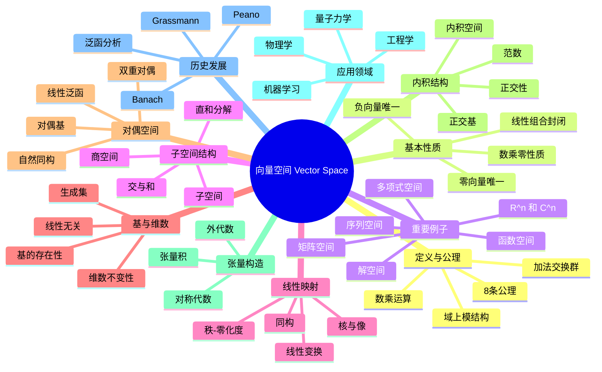

msc_primary: "00A99"
msc_secondary: ['00-XX']
---

# 向量空间 思维导图

## 中心概念
向量空间（线性空间）是域上的模，是配备了加法和数乘运算的集合，满足八条公理，是线性代数研究的核心对象。

## 核心分支

### 定义与公理
- **形式化定义**: 四元组 $(V, F, +, \cdot)$，$V$ 是集合，$F$ 是域，$+$ 是向量加法，$\cdot$ 是数乘
- **公理系统**: $(V,+)$ 交换群；$1 \cdot v = v$；$a(bv) = (ab)v$；$(a+b)v = av + bv$；$a(v+w) = av + aw$
- **等价定义**: 域 $F$ 上的幺作用模

### 基本性质
- **零向量唯一**: 加法单位元唯一，记为 $\mathbf{0}$
- **负向量唯一**: 每个向量有唯一加法逆元
- **数乘零性质**: $0v = \mathbf{0}$，$a\mathbf{0} = \mathbf{0}$，$(-1)v = -v$
- **线性组合封闭**: 子空间对线性组合封闭

### 重要例子
- **坐标空间** $\mathbb{R}^n$, $\mathbb{C}^n$: 最基本的有限维例子
- **多项式空间** $F[x]$: 无限维，基为 $\{1, x, x^2, \ldots\}$
- **函数空间** $F^X$: 从集合 $X$ 到域 $F$ 的函数
- **矩阵空间** $M_{m \times n}(F)$: 维数为 $mn$
- **序列空间** $\ell^p$, $c_0$: 泛函分析中的Banach空间
- **解空间**: 线性齐次方程组的解构成子空间

### 核心定理
- **基存在定理**: 每个向量空间都有基（Zorn引理）
- **维数定理**: 有限维空间中所有基元素个数相同
- **秩-零化度定理**: $\dim \ker T + \dim \text{Im}\, T = \dim V$
- **同构定理**: 有限维空间同构当且仅当维数相同
- **Hahn-Banach定理**: 范数空间的延拓定理（泛函分析）

### 相关概念
- **父概念**: 模、Abel群、代数
- **子概念**: 赋范空间、Banach空间、Hilbert空间、拓扑向量空间
- **相邻概念**: 线性映射、矩阵、张量

### 应用领域
- **物理学**: 力、速度作为向量；量子态空间
- **工程学**: 结构分析、信号处理、控制系统
- **机器学习**: 特征空间、嵌入空间、PCA
- **量子力学**: Hilbert空间表示量子态

### 历史发展
- **创立者**: Hermann Grassmann (1844)《线性扩张论》
- **关键发展**:
  - 1888：Peano给出向量空间的公理化定义
  - 1920-1930：Banach创立泛函分析
  - 1930年代：Bourbaki学派推广到模论
- **现代研究**: 无限维空间、非交换几何

### 参考资源
- **推荐教材**: Friedberg《Linear Algebra》、Hoffman-Kunze《Linear Algebra》
- **相关论文**: Grassmann《Ausdehnungslehre》、Banach《Théorie des Opérations Linéaires》
- **在线资源**: 3Blue1Brown线性代数系列

---

**概念链接**: [[线性映射]] [[特征值]] [[模]] [[张量代数]] [[泛函分析]]
