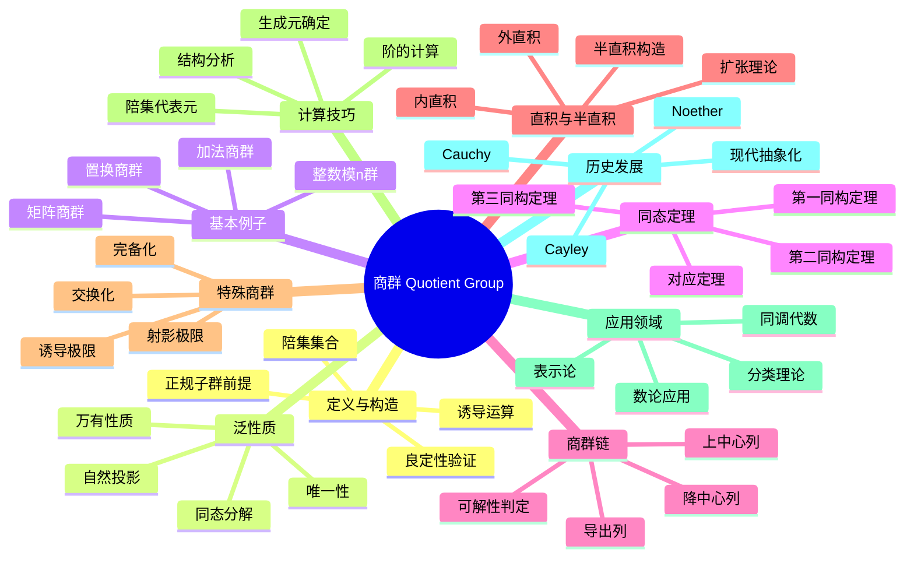

msc_primary: "00A99"
msc_secondary: ['00-00']
---

# 商群 思维导图

## 中心概念

商群是通过正规子群对群进行"模运算"得到的代数结构，将群元素按照正规子群的陪集进行等价分类，保持群运算的结构。

## 核心分支

### 定义与构造

- **前提**: 需要正规子群 $N \trianglelefteq G$
- **定义**: $G/N = \{gN : g \in G\}$，即所有左陪集的集合
- **运算**: $(gN)(hN) = (gh)N$，由 $N$ 的正规性保证良定
- **单位元**: $N = eN$ 是商群的单位元

### 泛性质

- **自然投影**: $\pi: G \to G/N$，$\pi(g) = gN$ 是满同态
- **万有性质**: 任何满足 $N \subseteq \ker \varphi$ 的同态 $\varphi: G \to H$ 唯一地通过 $G/N$
- **同态分解**: 任何同态 $\varphi: G \to H$ 可分解为 $G \to G/\ker \varphi \cong \text{Im}\,\varphi \hookrightarrow H$

### 重要例子

- **整数模n**: $\mathbb{Z}/n\mathbb{Z} = \{0, 1, \ldots, n-1\}$，加法群
- **交换化**: $G/[G,G]$ 是 $G$ 的最大交换商群
- **矩阵商群**: $GL_n(F)/SL_n(F) \cong F^\times$
- **置换商群**: $S_n/A_n \cong \mathbb{Z}/2\mathbb{Z}$（$n \geq 2$）

### 核心定理

- **第一同构定理**: $G/\ker \varphi \cong \text{Im}\,\varphi$
- **第二同构定理**: $HN/N \cong H/(H \cap N)$（$H \leq G$，$N \trianglelefteq G$）
- **第三同构定理**: $(G/N)/(M/N) \cong G/M$（$N \trianglelefteq M \trianglelefteq G$）
- **Lagrange定理推论**: $|G/N| = [G:N] = |G|/|N|$

### 相关概念

- **父概念**: [[群]]、[[正规子群]]
- **子概念**: [[同态定理]]、[[群扩张]]、[[导出列]]
- **相邻概念**: [[子群]]、[[群同态]]、[[群同构]]

### 应用领域

- **分类理论**: 通过商群简化群结构分析
- **同调代数**: 商模、Ext群、Tor群的基础
- **表示论**: 诱导表示、商表示
- **数论应用**: 类群、理想类群的结构

### 历史发展

- **Cauchy (1840s)**: 陪集概念的原型
- **Cayley (1854)**: 群论的系统化，商群思想萌芽
- **Noether (1920s)**: 同态定理的系统阐述
- **现代**: 范畴论框架下的商对象理论

---

**概念链接**: [[群]] [[正规子群]] [[子群]] [[群同态]] [[群同构]]
