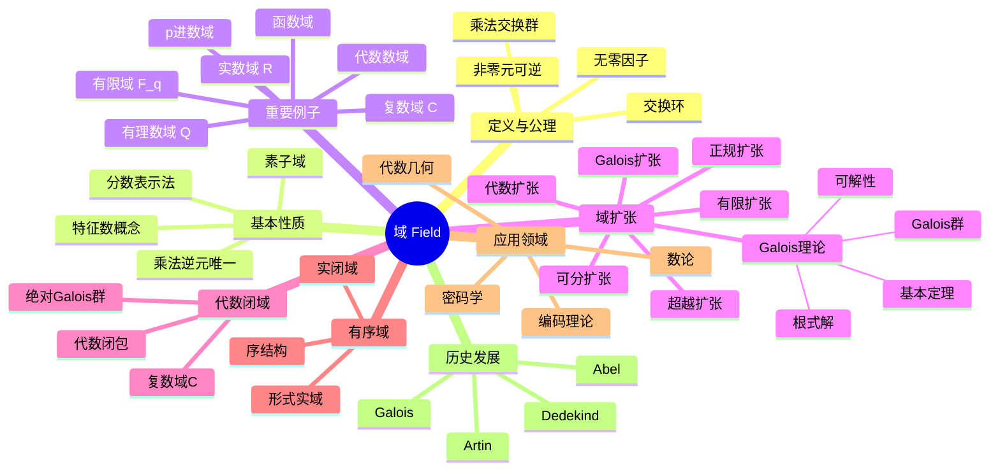

msc_primary: "00A99"
msc_secondary: ['00-00']
---

# 域 思维导图

## 中心概念
域是交换的除环，即每个非零元素都有乘法逆元的交换环。域是代数学中进行"四则运算"的基本代数结构。

## 核心分支

### 定义与公理
- **形式化定义**: 交换环 $(F, +, \cdot)$ 满足 $F^\times = F \setminus \{0\}$ 关于乘法构成交换群
- **公理系统**: 域公理 = 环公理 + 乘法交换律 + 非零元可逆
- **等价定义**: 整环中每个非零元可逆；无非零真理想的交换环

### 基本性质
- **乘法逆元唯一**: 每个 $a \neq 0$ 有唯一逆元 $a^{-1}$
- **分数表示法**: $a/b := ab^{-1}$，满足分数运算规则
- **特征数**: 最小的 $n$ 使 $n \cdot 1 = 0$（或0表示特征为0）
- **素子域**: 最小的子域，同构于 $\mathbb{Q}$（特征0）或 $\mathbb{F}_p$（特征 $p$）

### 重要例子
- **有理数域** $\mathbb{Q}$: 特征为0的素域
- **实数域** $\mathbb{R}$: 完备有序域
- **复数域** $\mathbb{C}$: 代数闭域，$\mathbb{R}$ 的代数闭包
- **有限域** $\mathbb{F}_q$: $q = p^n$ 个元素，特征为 $p$
- **代数数域**: $\mathbb{Q}$ 的有限扩张，如 $\mathbb{Q}(\sqrt{2})$
- **函数域**: 代数曲线上的有理函数域
- **p进数域** $\mathbb{Q}_p$: $p$ 进完备化

### 核心定理
- **域扩张基本定理**: 若 $[K:F]$ 有限，则 $K$ 是 $F$ 上的向量空间
- **本原元定理**: 有限可分扩张是单扩张（证明思路：构造本原元）
- **Galois理论基本定理**: Galois扩张的中间域与Galois群的子群一一对应
- **代数基本定理**: $\mathbb{C}$ 是代数闭域（复分析证明）
- **Wedderburn定理**: 有限除环必为域（证明思路：计数论证）

### 相关概念
- **父概念**: 交换环、整环、除环
- **子概念**: 代数闭域、实闭域、有序域、赋范域、局部域
- **相邻概念**: 群、向量空间、Galois理论

### 应用领域
- **编码理论**: Reed-Solomon码、BCH码基于有限域
- **密码学**: 椭圆曲线密码、AES使用有限域运算
- **代数几何**: 函数域与代数曲线的对应
- **数论**: 代数数域的算术性质

### 历史发展
- **早期发展**: 解方程的需要催生域的概念
- **关键里程碑**:
  - 1824：Abel证明五次方程无根式解
  - 1832：Galois创立Galois理论
  - 1871：Dedekind形式化域的概念
  - 1920-1940：Artin发展抽象Galois理论
- **现代研究**: 代数函数域、算术几何、类域论

### 参考资源
- **推荐教材**: Morandi《Field and Galois Theory》、Lang《Algebra》
- **相关论文**: Artin《Galois Theory》、Steinitz《Algebraische Theorie der Körper》
- **在线资源**: LMFDB（L-函数与模形式数据库）

---

**概念链接**: [[环]] [[向量空间]] [[Galois理论]] [[代数数论]] [[同态与同构]]
