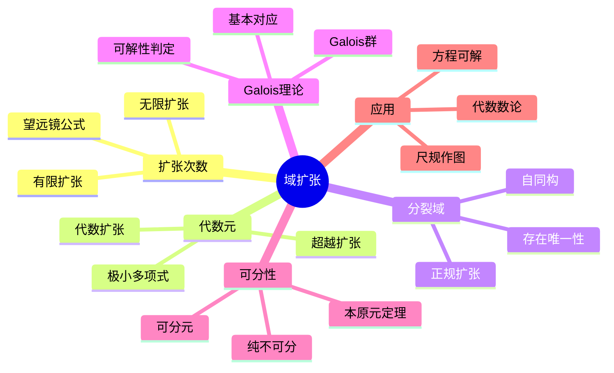

# 域扩张 思维导图

## 中心概念

### 精确定义

**域扩张** $K/F$ 是域的包含关系 $F \subseteq K$，其中 $F$ 称为基域，$K$ 称为扩域。域扩张是研究多项式根的抽象框架，是代数方程可解性理论、代数几何和数论的核心工具。

### 直观理解

域扩张是通过向基域"添加"新的元素来构造更大的域。如同从有理数 $\mathbb{Q}$ 添加 $\sqrt{2}$ 得到 $\mathbb{Q}(\sqrt{2})$，域扩张使得原本在基域中无解的方程获得解。

---

## 第一层分支：核心要素

### 扩张次数

- **定义**：$[K:F] = \dim_F K$，将 $K$ 看作 $F$-线性空间的维数
- **望远镜公式**：$F \subseteq K \subseteq L$ 时，$[L:F] = [L:K][K:F]$
- **有限扩张**：$[K:F] < \infty$
- **无限扩张**：$[K:F] = \infty$

### 代数元与超越元

- **代数元**：$\alpha \in K$ 是某个 $F[x]$ 中非零多项式的根
- **超越元**：不是代数元
- **极小多项式**：代数元 $\alpha$ 的次数最低的首一多项式
- **代数扩张**：所有元素都是代数元
- **超越扩张**：至少有一个超越元

### 单扩张

- **结构**：$F(\alpha) = \{f(\alpha)/g(\alpha) : f, g \in F[x], g(\alpha) \neq 0\}$
- **代数单扩张**：$F(\alpha) \cong F[x]/(m_\alpha(x))$，$[F(\alpha):F] = \deg m_\alpha$
- **超越单扩张**：$F(\alpha) \cong F(x)$，无限扩张

### 分裂域

- **定义**：$f(x) \in F[x]$ 在 $K$ 上完全分解为一次因式，且 $K$ 由根生成
- **存在性**：任何多项式有分裂域
- **唯一性**：在同构意义下唯一
- **正规扩张**：$K/F$ 是多项式 $f$ 的分裂域

---

## 第二层分支：性质与定理

### 重要性质

#### 1. 代数扩张的基本性质

- **传递性**：$L/K$ 代数，$K/F$ 代数 $\Rightarrow$ $L/F$ 代数
- **有限扩张是代数**：$[K:F] < \infty$ $\Rightarrow$ $K/F$ 代数
- **代数扩张的复合**：代数元的和、差、积、商仍是代数元

#### 2. 代数闭包

- **代数闭域**：每个非常数多项式有根（如 $\mathbb{C}$）
- **代数闭包**：$\overline{F}$，包含 $F$ 的最小代数闭域
- **存在唯一性**：在同构意义下唯一

### 核心定理

#### 1. Galois理论基本定理

- **Galois扩张**：可分正规扩张
- **Galois群**：$\operatorname{Gal}(K/F) = \{\sigma \in \operatorname{Aut}(K) : \sigma|_F = \operatorname{id}\}$
- **对应定理**：子群 $\leftrightarrow$ 中间域
  - $H \subseteq \operatorname{Gal}(K/F)$ 对应 $K^H = \{x \in K : \sigma(x) = x, \forall \sigma \in H\}$
  - 正规子群对应正规扩张
- **次数关系**：$|\operatorname{Gal}(K/F)| = [K:F]$

#### 2. 可分扩张

##### 可分元与可分扩张

- **可分元**：极小多项式无重根
- **可分扩张**：所有元素可分
- **完全域**：特征0域或有限域都是完全的（所有代数扩张可分）
- **不可分扩张**：仅存在于特征 $p$ 的域

##### 本原元定理

- **内容**：有限可分扩张是单扩张
- **即**：$K = F(\alpha)$ 对某 $\alpha$
- **例子**：$\mathbb{Q}(\sqrt{2}, \sqrt{3}) = \mathbb{Q}(\sqrt{2} + \sqrt{3})$

#### 3. 正规扩张

- **定义**：$K/F$ 是某族多项式的分裂域
- **等价刻画**：$\sigma(K) = K$ 对所有 $F$-嵌入 $\sigma: K \to \overline{F}$
- **正规闭包**：包含 $K$ 的最小正规扩张

#### 4. 可分闭包与惯性域

- **可分闭包**：$F^{sep} = \{\alpha \in \overline{F} : \alpha \text{ 在 } F \text{ 上可分}\}$
- **纯不可分扩张**：$\alpha^{p^n} \in F$ 对所有 $\alpha$
- **分解**：任何代数扩张可分解为可分扩张后接纯不可分扩张

---

## 第三层分支：例子与应用

### 典型例子

#### 1. 经典扩张

- **$\mathbb{Q}(\sqrt{2})/\mathbb{Q}$**：次数2，Galois群 $\mathbb{Z}/2$
- **$\mathbb{Q}(\sqrt[3]{2})/\mathbb{Q}$**：次数3，非正规
- **$\mathbb{Q}(\zeta_n)/\mathbb{Q}$**：分圆扩张，Galois群 $(\mathbb{Z}/n)^*$

#### 2. 有限域

- **结构**：$\mathbb{F}_{p^n}$，唯一 $p^n$ 元域
- **扩张**：$\mathbb{F}_{p^n}/\mathbb{F}_p$ 是Galois扩张
- **Galois群**：循环群，由Frobenius生成

#### 3. 代数数域

- **定义**：$\mathbb{Q}$ 的有限扩张
- **整数环**：$\mathcal{O}_K$，代数整数的集合
- **判别式**：衡量扩张的"分歧"
- **Dedekind域**：整数环是Dedekind整环

### 反例

#### 1. 不可分扩张

- **$\mathbb{F}_p(t^{1/p})/\mathbb{F}_p(t)$**：纯不可分，极小多项式 $x^p - t = (x - t^{1/p})^p$
- **Artin-Schreier扩张**：$x^p - x - a = 0$

#### 2. 非单扩张

- **$\mathbb{F}_p(t,s)/\mathbb{F}_p(t^p, s^p)$**：无限多个中间域

### 应用场景

#### 1. 方程可解性

- **根式可解**：方程根可用根式表示
- **Galois判定**：$f$ 根式可解 $\Leftrightarrow$ $\operatorname{Gal}(f)$ 可解
- **Abel-Ruffini定理**：一般五次以上方程根式不可解

#### 2. 尺规作图

- **可构造数**：$\mathbb{Q}$ 的2-次扩张塔
- **古典问题**：
  - 三等分角：不可（$\cos 20^\circ$ 满足 $8x^3 - 6x - 1 = 0$）
  - 倍立方：不可（$\sqrt[3]{2}$ 不是2的幂次扩张）
  - 化圆为方：不可（$\pi$ 超越）
- **正多边形构造**：Galois群是2-群

#### 3. 代数几何

- **函数域**：代数簇的函数域
- **有理映射**：域的嵌入对应有理映射
- **分歧理论**：覆盖空间的分歧点

#### 4. 密码学

- **椭圆曲线**：有限域上的代数曲线
- **离散对数**：$\mathbb{F}_{p^n}^*$ 中的困难问题
- **配对**：Weil配对、Tate配对

---

## 第四层分支：关联概念

### 相似概念

#### 超越扩张

- **超越基**：极大代数无关集
- **超越次数**：超越基的元素个数
- **纯超越扩张**：$F(x_1, \ldots, x_n)$
- **Lüroth定理**：$F(x)/F$ 的中间域是纯超越的

#### 赋值论

- **赋值**：域到有序群的映射
- **完备化**：关于赋值的完备化
- **Hensel引理**：完备域上的多项式根提升

### 对偶概念

#### 域的逆向限制

- **逆向极限**：逆系统的极限
- **应用**：$p$-adic数 $\mathbb{Q}_p$ 的构造

### 推广概念

#### 交换代数

- **整扩张**：$R \subseteq S$，$S$ 中元素在 $R$ 上整
- **Galois群**：$\operatorname{Aut}(S/R)$
- **分歧理论**：素理想在扩张中的行为

#### 非交换Galois理论

- **除环扩张**：非交换情形
- **问题**：Galois对应不完全成立

#### 无限Galois理论

- **Krull拓扑**：Galois群上的 profinite 拓扑
- **闭子群对应**：闭子群对应中间域
- **绝对Galois群**：$G_F = \operatorname{Gal}(\overline{F}/F)$

#### 微分Galois理论

- **微分域**：带导子的域
- **Picard-Vessiot扩张**：线性微分方程的解域
- **微分Galois群**：保持微分结构的自同构群

---

## Mermaid思维导图

---

**参考章节**：抽象代数 - 第4章 域论与Galois理论
**关联文件**：环结构-思维导图.md、群结构-思维导图.md
