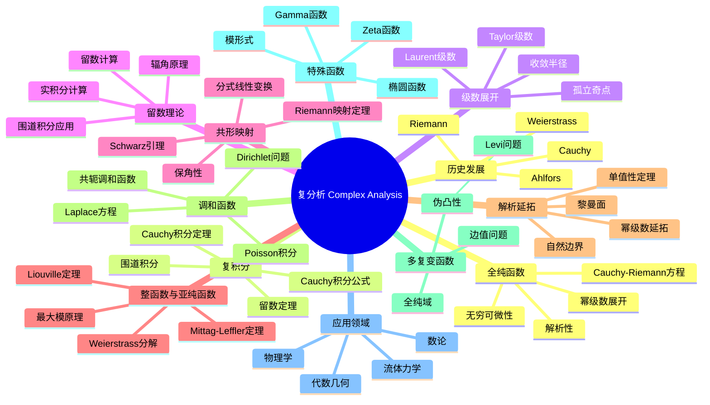

msc_primary: "00A99"
msc_secondary: ['00-XX']
---

# 复分析 思维导图

## 中心概念
复分析研究复变函数的理论，是全纯函数的微积分。它拥有比实分析更优美的性质（如Cauchy积分定理、解析延拓），是数学各分支（数论、代数几何、物理）的核心工具。

## 核心分支

### 定义与公理
- **全纯函数**: $f'(z)$ 存在（复可微）
- **Cauchy-Riemann方程**: $u_x = v_y$，$u_y = -v_x$（$f = u + iv$）
- **解析函数**: 局部可展开为幂级数的函数
- **复积分**: $\int_\gamma f(z)dz = \int_a^b f(\gamma(t))\gamma'(t)dt$

### 基本性质
- **全纯 = 解析**: 复可微蕴含无穷可微和幂级数展开
- **唯一性定理**: 两个全纯函数在聚点集相等则恒等
- **最大模原理**: 非常数全纯函数模不在内部取极大
- **Liouville定理**: 有界整函数必为常数

### 重要例子
- **整函数**: $e^z$，$\sin z$，$\cos z$，多项式
- **亚纯函数**: $\tan z$，$\frac{1}{z}$，$\Gamma(z)$
- **多值函数**: $\log z$，$\sqrt{z}$，$z^\alpha$
- **椭圆函数**: Weierstrass ℘函数，Jacobi椭圆函数
- **模形式**: Eisenstein级数，判别式函数 $\Delta$

### 核心定理
- **Cauchy积分定理**: $\oint_\gamma f(z)dz = 0$（$f$ 全纯，$\gamma$ 可缩）（证明思路：Green定理或同伦）
- **Cauchy积分公式**: $f(a) = \frac{1}{2\pi i}\oint_\gamma \frac{f(z)}{z-a}dz$
- **留数定理**: $\oint_\gamma f(z)dz = 2\pi i \sum \text{Res}(f, a_k)$
- **Riemann映射定理**: 单连通真子域双全纯等价于单位圆盘
- **Weierstrass分解定理**: 整函数表示为无穷乘积

### 相关概念
- **父概念**: 实分析、多元微积分
- **子概念**: 黎曼面、多复变函数、Teichmüller理论
- **相邻概念**: 代数几何、数论、微分几何

### 应用领域
- **数论**: 解析数论、模形式、L-函数
- **代数几何**: 黎曼面、复流形
- **物理学**: 量子力学、统计力学、流体力学
- **工程**: 信号处理、控制理论

### 历史发展
- **创立者**: Augustin-Louis Cauchy (1789-1857) 建立复积分理论
- **关键发展**:
  - 1851：Riemann《博士论文》引入几何观点
  - 1870年代：Weierstrass建立解析函数论
  - 1907：Poincaré-Koebe单值化定理
  - 1935：Ahlfors《Complex Analysis》
- **现代发展**: 多复变函数、复动力系统

### 参考资源
- **推荐教材**: Ahlfors《Complex Analysis》、Stein-Shakarchi《Complex Analysis》
- **相关论文**: Riemann《Grundlagen für eine allgemeine Theorie der Functionen》(1851)
- **在线资源**: Complex Analysis Project (可视化工具)

---

**概念链接**: [[实分析]] [[黎曼面]] [[代数几何]] [[数论]] [[偏微分方程]]
