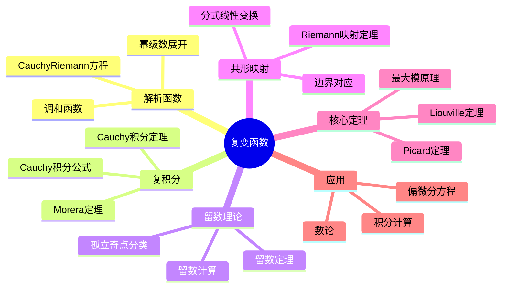

# 复变函数 思维导图

## 中心概念

### 精确定义
**复变函数**是定义在复平面（或复流形）上的函数 $f: \mathbb{C} \to \mathbb{C}$。当 $f$ 在一点可微（复可微）时，称为**全纯（解析）函数**。复可微比实可微强得多——Cauchy-Riemann方程要求实部和虚部满足特定的偏微分关系。

### 直观理解
复变函数是定义在二维平面上的映射，但保持角度（共形）和方向。全纯函数具有惊人的刚性——局部性质决定整体行为。复分析是分析学中最优美、最和谐的分支之一，揭示了深层的代数、几何与分析的统一。

---

## 第一层分支：核心要素

### 解析函数
- **复可微**：$f'(z) = \lim_{h \to 0} \frac{f(z+h) - f(z)}{h}$ 存在（$h \in \mathbb{C}$）
- **Cauchy-Riemann方程**：$f = u + iv$，$\frac{\partial u}{\partial x} = \frac{\partial v}{\partial y}$，$\frac{\partial u}{\partial y} = -\frac{\partial v}{\partial x}$
- **调和函数**：$u, v$ 满足 $\Delta u = \Delta v = 0$
- **幂级数展开**：局部可展开为收敛幂级数（与复可微等价）

### 复积分
- **路径积分**：$\int_\gamma f(z)dz$
- **Cauchy积分定理**：单连通区域内全纯函数沿闭路积分为零
- **Cauchy积分公式**：$f^{(n)}(a) = \frac{n!}{2\pi i} \oint_\gamma \frac{f(z)}{(z-a)^{n+1}}dz$
- **Morera定理**：积分定理的逆

### 留数
- **孤立奇点**：可去奇点、极点、本性奇点
- **留数**：$\operatorname{Res}(f, a) = \frac{1}{2\pi i} \oint_{|z-a|=\epsilon} f(z)dz$

- **计算**：极点阶数与Laurent展开
- **留数定理**：$\oint_\gamma f(z)dz = 2\pi i \sum \operatorname{Res}(f, a_k)$

### 共形映射
- **定义**：保持角度和方向的解析映射
- **导数非零**：$f'(z) \neq 0$ 保证局部共形
- **Riemann映射定理**：单连通真子域共形等价于单位圆盘
- **Schwarz引理**：单位圆盘到自身的映射

---

## 第二层分支：性质与定理

### 重要性质

#### 1. 全纯函数的基本性质
- **无限可微**：全纯 $\Rightarrow$ 无限次复可微
- **零点的孤立性**：非零全纯函数的零点孤立
- **唯一延拓**：连通开集上全纯函数由任意小开集上的值唯一决定
- **最大模原理**：非常数全纯函数模不在内部取最大
- **Liouville定理**：有界整函数必为常数

#### 2. 解析延拓
- **直接延拓**：沿曲线的幂级数延拓
- **单值性**：单连通区域上的延拓是单值的
- **多值函数**：如 $\log z$，$z^\alpha$，需要Riemann面
- **自然边界**：无法延拓的边界

### 核心定理

#### 1. Cauchy理论
- **Cauchy定理**：$\oint_\gamma f(z)dz = 0$（单连通区域内）
- **Cauchy积分公式**：函数值由边界值决定
- **导数公式**：积分表示各阶导数
- **Cauchy估计**：$|f^{(n)}(a)| \leq \frac{n! M}{R^n}$（$M = \sup_{|z-a|=R}|f(z)|$）

#### 2. Laurent级数与奇点分类
- **Laurent展开**：$f(z) = \sum_{n=-\infty}^{\infty} c_n (z-a)^n$
- **可去奇点**：主要部分为零
- **极点**：主要部分有限项
- **本性奇点**：主要部分无限项（Casorati-Weierstrass）
- **Picard定理**：本性奇点邻域像为全平面（可能除一点）

#### 3. Riemann映射定理
- **内容**：任何单连通真子域 $D \subsetneq \mathbb{C}$ 共形等价于单位圆盘
- **唯一性**：规范化后唯一
- **边界对应**：光滑边界对应光滑边界（Carathéodory定理）
- **应用**：共形映射求解边值问题

#### 4. 辐角原理与Rouché定理
- **辐角原理**：$\frac{1}{2\pi i} \oint_\gamma \frac{f'(z)}{f(z)}dz = N - P$（零点数 - 极点数）
- **Rouché定理**：$|f| > |g|$ 在 $\gamma$ 上 $\Rightarrow$ $f$ 与 $f+g$ 在 $\gamma$ 内零点数相同

- **应用**：代数基本定理、零点定位

---

## 第三层分支：例子与应用

### 典型例子

#### 1. 初等函数
- **指数函数**：$e^z = e^x(\cos y + i\sin y)$，周期 $2\pi i$
- **三角函数**：$\sin z$，$\cos z$（无界）
- **双曲函数**：$\sinh z$，$\cosh z$
- **对数函数**：$\log z = \ln|z| + i\arg z$（多值）

- **幂函数**：$z^\alpha = e^{\alpha \log z}$（多值）

#### 2. 特殊函数
- **Gamma函数**：$\Gamma(z) = \int_0^\infty t^{z-1}e^{-t}dt$（亚纯延拓）
- **Riemann zeta函数**：$\zeta(s) = \sum_{n=1}^\infty \frac{1}{n^s}$，解析延拓到 $\mathbb{C} \setminus \{1\}$
- **椭圆函数**：双周期全纯函数（除极点外）
- **模形式**：在上半全纯，满足模变换

#### 3. 共形映射的例子
- **分式线性变换**：$w = \frac{az+b}{cz+d}$，保持圆/直线
- **Joukowsky变换**：$w = \frac{1}{2}(z + \frac{1}{z})$，机翼剖面
- **指数映射**：$w = e^z$，带形 $\to$ 角形

### 反例

#### 1. 实可微但非全纯
- $f(z) = \bar{z} = x - iy$：满足Cauchy-Riemann仅在孤立点
- $f(z) = |z|^2 = x^2 + y^2$：仅在 $z=0$ 可微

#### 2. 本性奇点的性态
- $e^{1/z}$ 在 $z=0$：任意邻域像为 $\mathbb{C} \setminus \{0\}$
- **Casorati-Weierstrass**：本性奇点邻域像稠密

### 应用场景

#### 1. 积分计算
- **实积分**：$\int_{-\infty}^\infty \frac{P(x)}{Q(x)}dx$
- **Fourier型积分**：$\int_{-\infty}^\infty f(x)e^{iax}dx$
- **主值积分**：$\int_{-\infty}^\infty \frac{\sin x}{x}dx = \pi$
- **特殊积分**：$\int_0^\infty \frac{\sin x}{x}dx$，$\int_0^\infty e^{-x^2}dx$

#### 2. 偏微分方程
- **调和函数**：Laplace方程 $\Delta u = 0$ 的解
- **Dirichlet问题**：边值问题求解
- **共形映射法**：将复杂区域映射为简单区域
- **Schwarz反射原理**：对称区域的延拓

#### 3. 信号处理
- **Z变换**：离散时间信号的复分析工具
- **系统稳定性**：极点位置分析
- **滤波器设计**：Hurwitz判据

#### 4. 数论
- **素数定理**：基于zeta函数的解析性质
- **Dirichlet定理**：算术级数中的素数
- **模形式与椭圆曲线**：Fermat大定理证明

---

## 第四层分支：关联概念

### 相似概念

#### 调和分析
- **Poisson核**：调和函数的边界表示
- **Hilbert变换**：共轭调和函数
- **Hardy空间**：单位圆盘上的全纯函数空间
- **Bergman空间**：区域上的平方可积全纯函数

#### 拟共形映射
- **定义**：保持角度但有界的畸变
- **Beltrami方程**：$\frac{\partial f}{\partial \bar{z}} = \mu \frac{\partial f}{\partial z}$
- **应用**：Teichmüller理论、动力系统

### 对偶概念

#### 反全纯函数
- **定义**：$\frac{\partial f}{\partial z} = 0$（对 $z$ 不依赖，只依赖 $\bar{z}$）
- **性质**：共轭映射，保持角度但反向

### 推广概念

#### 多复变函数论
- **全纯函数**：多复变量的全纯函数
- **Hartogs现象**：与单复变本质不同
- **伪凸域**：Levi问题与 $\bar{\partial}$-Neumann问题
- **层论方法**：Oka-Cartan理论

#### Riemann面
- **定义**：一维复流形
- **分类**：亏格分类
- **Abel积分**：Riemann面上的积分
- **模空间**：Riemann面的参数空间

#### 复几何
- **复流形**：多维度情形
- **Kähler几何**：复结构、辛结构、Riemann度规相容
- **Hodge理论**：上同调的分解
- **层上同调**：复流形的解析工具

---

## Mermaid思维导图

---

**参考章节**：复变函数 - 全章  
**关联文件**：可微性-思维导图.md、流形-思维导图.md
