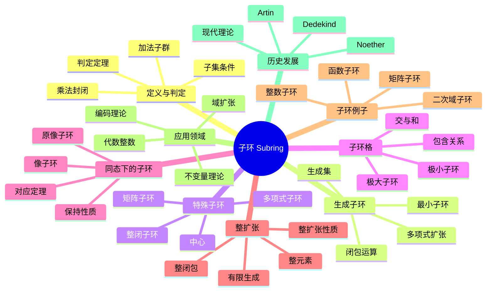

msc_primary: "00A99"
msc_secondary: ['00-XX']
---

# 子环 思维导图

## 中心概念
子环是环的子结构，是环的一个非空子集，在环的加法和乘法下本身也构成环。子环是研究环结构的基本工具。

## 核心分支

### 定义与判定
- **定义**: 设 $R$ 是环，$S \subseteq R$ 非空，若 $(S, +, \cdot)$ 也是环，则称 $S$ 是 $R$ 的子环
- **判定条件**: $S \neq \emptyset$；$a, b \in S \Rightarrow a - b \in S$；$a, b \in S \Rightarrow ab \in S$
- **子域**: 若 $R$ 是域，$S$ 也是域，则称 $S$ 是子域
- **单位元**: 子环可能有不同的单位元

### 生成子环
- **生成子环**: $R$ 的子集 $X$ 生成的子环是包含 $X$ 的最小子环
- **多项式扩张**: $R[a]$ 表示添加元素 $a$ 生成的子环
- **扩张塔**: $R \subseteq R[a_1] \subseteq R[a_1, a_2] \subseteq \cdots$
- **有限生成**: $R[x_1, \ldots, x_n]$ 是有限生成的

### 特殊子环
- **中心**: $Z(R) = \{r \in R : \forall s \in R, rs = sr\}$
- **整闭子环**: 所有整元素构成的子环
- **常数子环**: 多项式环中的常数多项式
- **对角子环**: 矩阵环中的对角矩阵

### 子环格
- **交的性质**: 任意子环的交仍是子环
- **和的性质**: $S + T = \{s + t : s \in S, t \in T\}$ 不一定是子环
- **子环格**: 子环按包含关系形成格
- **极大子环**: 不被其他真子环包含的子环

### 核心定理
- **对应定理**: 若 $I$ 是 $R$ 的理想，则 $R$ 的含 $I$ 的子环与 $R/I$ 的子环一一对应
- **整扩张性质**: 整扩张保持许多环论性质
- **Noether正规化**: 有限生成代数的子环结构
- **整闭包存在**: 每个子环有唯一的整闭包

### 重要例子
- **整数子环**: $\mathbb{Z} \subset \mathbb{Q} \subset \mathbb{R} \subset \mathbb{C}$
- **代数整数**: $\mathcal{O}_K$ 是数域 $K$ 中的代数整数环
- **多项式子环**: $R[x^2] \subset R[x]$
- **上三角矩阵**: $T_n(R) \subset M_n(R)$

### 相关概念
- **父概念**: [[环]]
- **子概念**: [[整扩张]]、[[整闭包]]、[[域扩张]]
- **相邻概念**: [[理想]]、[[子域]]、[[环同态]]

### 应用领域
- **域扩张**: 通过子环构造域扩张
- **代数整数**: 数论中的整闭子环
- **不变量理论**: 不变量子环的研究
- **编码理论**: 循环码的代数结构

### 历史发展
- **Dedekind (1870s)**: 代数整数的子环理论
- **Noether (1920s)**: 抽象子环理论
- **Artin (1920s-30s)**: Artin环、半单环理论
- **现代**: 交换代数中的子环理论

---

**概念链接**: [[环]] [[理想]] [[域]] [[整扩张]] [[环同态]]
