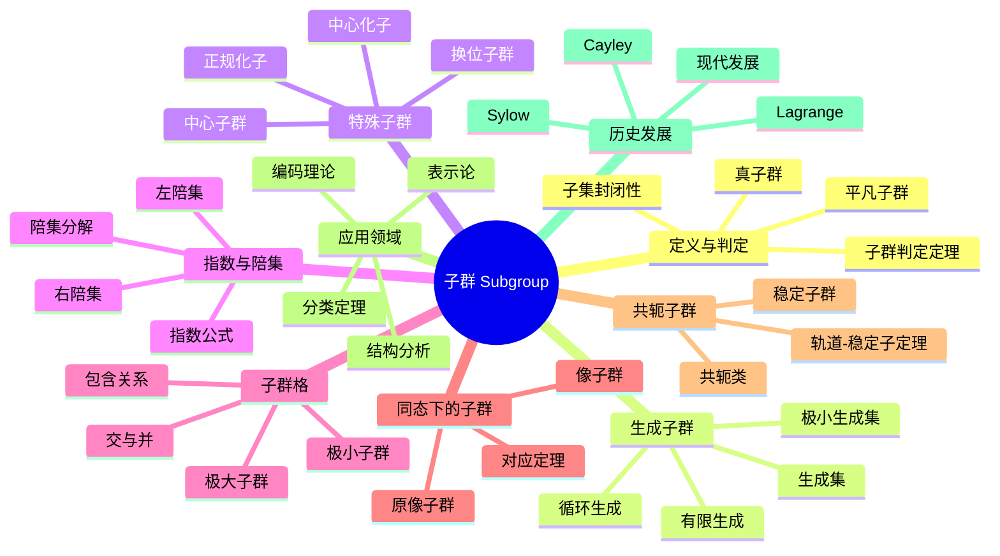

msc_primary: "00A99"
msc_secondary: ['00-00']
---

# 子群 思维导图

## 中心概念

子群是群的子结构，是群的一个非空子集，在群的运算下本身也构成群。子群是研究群结构的基本工具。

## 核心分支

### 定义与判定

- **定义**: 设 $(G, \cdot)$ 是群，$H \subseteq G$ 非空，若 $(H, \cdot)$ 也是群，则称 $H$ 是 $G$ 的子群
- **判定定理**: $H \leq G$ 当且仅当：$H \neq \emptyset$；$\forall a, b \in H: ab^{-1} \in H$
- **等价条件**: 对运算封闭且对取逆封闭
- **平凡子群**: $\{e\}$ 和 $G$ 本身

### 基本性质

- **交的性质**: 任意子群的交仍是子群
- **并的性质**: 两个子群的并一般不是子群
- **阶的关系**: 子群的阶整除群的阶（Lagrange定理）
- **指数**: $[G:H] = |G|/|H|$（有限群情形）

### 重要例子

- **循环子群**: $\langle a \rangle = \{a^n : n \in \mathbb{Z}\}$
- **中心**: $Z(G) = \{g \in G : \forall h \in G, gh = hg\}$
- **换位子群**: $[G,G] = \langle [a,b] = aba^{-1}b^{-1} \rangle$
- **稳定子群**: 群作用中的稳定子群

### 核心定理

- **Lagrange定理**: $H \leq G$ 有限，则 $|H|$ 整除 $|G|$
- **Cauchy定理**: 素数 $p$ 整除 $|G|$，则存在 $p$ 阶子群

- **Sylow定理**: Sylow $p$-子群的存在性和共轭性
- **对应定理**: 正规子群与商群子群的一一对应

### 相关概念

- **父概念**: [[群]]
- **子概念**: [[正规子群]]、[[Sylow定理]]、[[可解群]]
- **相邻概念**: [[群同态]]、[[商群]]、[[陪集]]

### 应用领域

- **结构分析**: 通过子群分析群的结构
- **分类定理**: 有限单群分类中的子群分析
- **表示论**: 诱导表示、限制表示
- **编码理论**: 群码、纠错码设计

### 历史发展

- **Lagrange (1771)**: 陪集分解和Lagrange定理
- **Cayley (1854)**: 群论的系统化，子群概念明确
- **Sylow (1872)**: Sylow定理，$p$-子群理论
- **现代**: 无限群、拓扑群的子群理论

---

**概念链接**: [[群]] [[正规子群]] [[商群]] [[群同态]] [[Sylow定理]]
