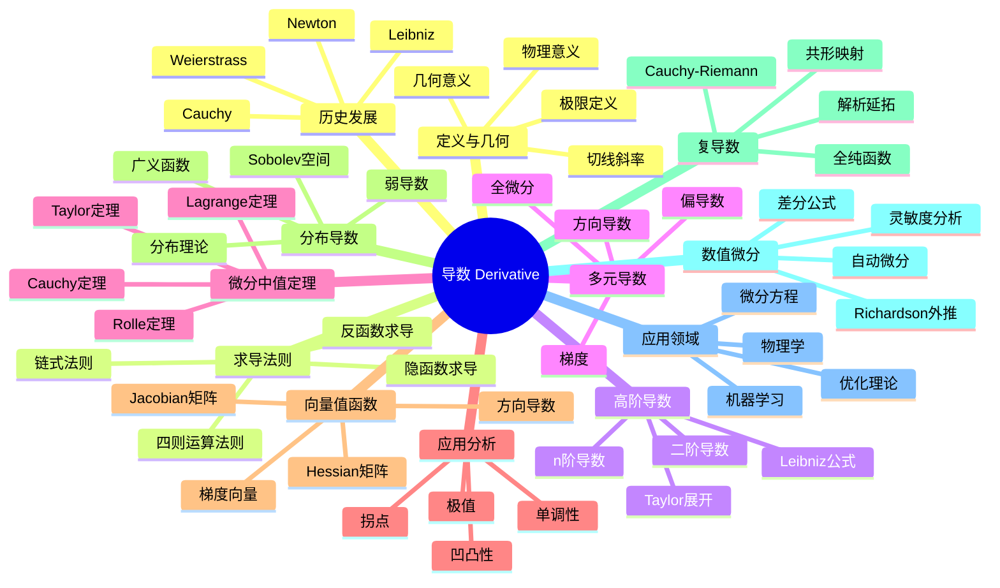

# 导数 思维导图

## 中心概念
导数是函数局部变化率的度量，是微积分的核心概念。它描述了函数在某点的瞬时变化趋势，是研究函数性质、优化问题和微分方程的基本工具。

## 核心分支

### 定义与公理
- **导数定义**: $f'(x) = \lim_{h \to 0} \frac{f(x+h) - f(x)}{h}$
- **几何意义**: 切线斜率
- **线性近似**: $f(x+h) \approx f(x) + f'(x)h$
- **可微性**: 导数存在 $\Rightarrow$ 连续（反之不成立）

### 基本性质
- **线性性**: $(af + bg)' = af' + bg'$
- **Leibniz法则**: $(fg)' = f'g + fg'$
- **链式法则**: $(f \circ g)' = (f' \circ g) \cdot g'$
- **反函数**: $(f^{-1})'(y) = \frac{1}{f'(f^{-1}(y))}$

### 重要例子
- **基本函数**: $(x^n)' = nx^{n-1}$，$(e^x)' = e^x$，$(\ln x)' = \frac{1}{x}$
- **三角函数**: $(\sin x)' = \cos x$，$(\cos x)' = -\sin x$
- **反三角函数**: $(\arcsin x)' = \frac{1}{\sqrt{1-x^2}}$
- **不可微函数**: $f(x) = |x|$ 在 $x=0$；Weierstrass函数处处不可微

### 核心定理
- **Rolle定理**: $f(a)=f(b)$ 且连续可微 $\Rightarrow$ $\exists c: f'(c)=0$
- **Lagrange中值定理**: $\exists c: f'(c) = \frac{f(b)-f(a)}{b-a}$（证明思路：Rolle定理应用）
- **Cauchy中值定理**: $\frac{f'(c)}{g'(c)} = \frac{f(b)-f(a)}{g(b)-g(a)}$
- **Taylor定理**: $f(x) = \sum_{k=0}^n \frac{f^{(k)}(a)}{k!}(x-a)^k + R_n(x)$

### 相关概念
- **父概念**: 极限、连续性
- **子概念**: 偏导数、方向导数、梯度、微分形式
- **相邻概念**: 积分、微分方程、优化

### 应用领域
- **优化理论**: 极值必要条件、梯度下降
- **微分方程**: 初值问题、边值问题
- **物理学**: 速度、加速度、力、通量
- **机器学习**: 反向传播、梯度优化

### 历史发展
- **创立者**: Isaac Newton (1665-1666) 和 Gottfried Wilhelm Leibniz (1674-1684) 独立发明
- **争议**: 优先权之争（牛顿-莱布尼茨之争）
- **严格化**:
  - 1823：Cauchy《无穷小计算教程概论》
  - 1861：Weierstrass严格定义
- **现代发展**: 分布导数、分数阶导数

### 参考资源
- **推荐教材**: Stewart《Calculus》、Spivak《Calculus on Manifolds》
- **相关论文**: Newton《Method of Fluxions》、Leibniz《Nova methodus pro maximis et minimis》
- **在线资源**: 3Blue1Brown微积分本质系列

---

**概念链接**: [[极限]] [[连续性]] [[积分]] [[微分方程]] [[优化理论]]
