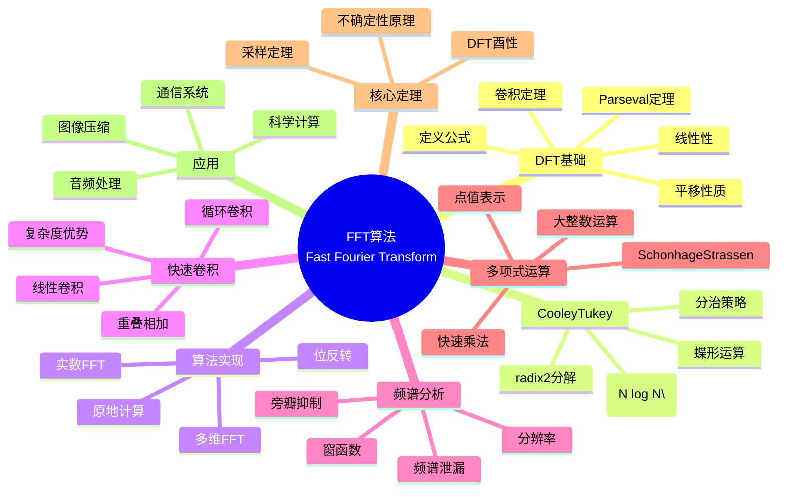

msc_primary: "00A99"
msc_secondary: ['00-XX']
---

# FFT算法 (Fast Fourier Transform)

## 中心概念精确定义

**快速傅里叶变换（Fast Fourier Transform, FFT）**是计算离散傅里叶变换（DFT）的高效算法，将复杂度从 $O(N^2)$ 降低到 $O(N \log N)$。这一突破使得傅里叶分析在信号处理、图像处理、通信系统和科学计算中得以广泛应用。

**离散傅里叶变换（DFT）**：
$$X_k = \sum_{n=0}^{N-1} x_n e^{-i 2\pi kn/N}, \quad k = 0, 1, ..., N-1$$

其中：
- $x_n$：时域/空域信号样本
- $X_k$：频域表示
- $\omega_N = e^{-i 2\pi/N}$：$N$ 次单位根

**逆DFT**：
$$x_n = \frac{1}{N}\sum_{k=0}^{N-1} X_k e^{i 2\pi kn/N}$$

**历史**：
- 1807年：Fourier提出热传导的三角级数表示
- 1965年：Cooley和Tukey发表FFT算法（实际Gauss早在1805年已知）

---

## 核心要素

### 1. DFT基本性质

**线性性**：$\text{DFT}(ax + by) = a\text{DFT}(x) + b\text{DFT}(y)$

**平移性质**：时域平移对应频域相位旋转
$$x_{n-m} \leftrightarrow X_k e^{-i 2\pi km/N}$$

**卷积定理**：时域卷积等于频域乘积
$$x * y \leftrightarrow X \cdot Y$$
$$x \cdot y \leftrightarrow \frac{1}{N} X * Y$$

**Parseval定理**：能量守恒
$$\sum_{n=0}^{N-1} |x_n|^2 = \frac{1}{N}\sum_{k=0}^{N-1} |X_k|^2$$

**周期性**：$X_{k+N} = X_k$，$x_{n+N} = x_n$

**共轭对称性**（实信号）：$X_{N-k} = X_k^*$

### 2. Cooley-Tukey FFT算法

**基本思想**：分治策略，将DFT分解为较小DFT的组合。

** radix-2分解**（$N = 2^m$）：

将序列分为偶数项和奇数项：
$$X_k = \sum_{n=0}^{N/2-1} x_{2n} \omega_N^{2nk} + \omega_N^k \sum_{n=0}^{N/2-1} x_{2n+1} \omega_N^{2nk}$$

即：
$$X_k = E_k + \omega_N^k O_k$$
$$X_{k+N/2} = E_k - \omega_N^k O_k$$

其中 $E_k$ 和 $O_k$ 是长度为 $N/2$ 的DFT。

**蝶形运算**：
$$
\begin{pmatrix} X_k \\ X_{k+N/2} \end{pmatrix} =
\begin{pmatrix} 1 & \omega_N^k \\ 1 & -\omega_N^k \end{pmatrix}
\begin{pmatrix} E_k \\ O_k \end{pmatrix}
$$

**复杂度**：$O(N \log N)$，比直接DFT的 $O(N^2)$ 大幅提升。

### 3. FFT变体与实现

**位反转（Bit Reversal）**：输入/输出重排序，实现原地计算。

**其他 radix**：
- radix-4：减少乘法次数
- Split-radix：radix-2和radix-4的混合
- Bluestein算法：任意长度N

**实数FFT**：利用对称性，同时计算两个实序列或一个实序列的快速算法。

**多维FFT**：
$$X_{k_1,k_2} = \sum_{n_1=0}^{N_1-1}\sum_{n_2=0}^{N_2-1} x_{n_1,n_2} \omega_{N_1}^{k_1 n_1} \omega_{N_2}^{k_2 n_2}$$

可分离为行变换和列变换。

### 4. 快速卷积与相关

**线性卷积 via FFT**：
1. 补零至长度 $N \geq L_1 + L_2 - 1$
2. FFT：$X = \text{FFT}(x)$，$Y = \text{FFT}(y)$
3. 点乘：$Z_k = X_k Y_k$
4. IFFT：$z = \text{IFFT}(Z)$

复杂度：$O(N \log N)$，优于直接卷积的 $O(L_1 L_2)$。

**重叠相加法/重叠保留法**：长序列的分块处理。

**相关计算**：
$$r_{xy}[m] = \sum_n x[n]y^*[n-m]$$
用FFT：$R_{xy} = X \cdot Y^*$，然后IFFT。

### 5. 窗函数与频谱分析

**频谱泄漏**：有限长采样导致频率分量扩散。

**窗函数**：乘性加权减少泄漏
- **矩形窗**：无加权，主瓣最窄，旁瓣最高
- **Hanning窗**：$w[n] = 0.5 - 0.5\cos(2\pi n/(N-1))$
- **Hamming窗**：$w[n] = 0.54 - 0.46\cos(2\pi n/(N-1))$
- **Blackman窗**：更宽主瓣，更低旁瓣

**选择权衡**：频率分辨率 vs 旁瓣抑制。

**频谱分析步骤**：
1. 加窗
2. FFT
3. 取模（幅度谱）或平方（功率谱）
4. 对数缩放（dB）

### 6. 快速多项式乘法

**问题**：计算两个多项式 $p(x) = \sum a_i x^i$ 和 $q(x) = \sum b_j x^j$ 的乘积。

**系数表示**：直接相乘 $O(n^2)$

**点值表示**：
1. 选 $N > \deg(p) + \deg(q)$ 个单位根 $\omega^k$
2. 计算 $p(\omega^k)$ 和 $q(\omega^k)$（FFT）
3. 点乘：$r(\omega^k) = p(\omega^k)q(\omega^k)$
4. 插值：从点值恢复系数（IFFT）

复杂度：$O(N \log N)$。

---

## 性质与定理

### 定理1：DFT的酉性

归一化DFT矩阵 $F$ 满足 $F^*F = I$，即DFT是酉变换。

### 定理2：FFT复杂度

Cooley-Tukey算法计算长度为 $N = 2^m$ 的DFT需要：
- 复数乘法：$O(N \log N)$
- 复数加法：$O(N \log N)$

### 定理3：卷积定理

时域循环卷积对应频域点乘：
$$\text{DFT}(x \circledast y) = \text{DFT}(x) \cdot \text{DFT}(y)$$

线性卷积可通过补零实现。

### 定理4：采样定理（Nyquist-Shannon）

若连续信号最高频率为 $f_{max}$，则采样频率 $f_s > 2f_{max}$ 时可完美重建。

FFT分析中，频率分辨率 $\Delta f = f_s/N$。

### 定理5：不确定性原理

时域和频域不能同时任意窄：
$$\Delta t \cdot \Delta f \geq \frac{1}{4\pi}$$

窗函数的主瓣宽度与频率分辨率直接相关。

---

## 典型例子

### 例子1：音频信号频谱分析

**任务**：分析音频信号的频率成分。

**步骤**：
1. 分帧（如1024点）
2. 加Hanning窗
3. FFT
4. 计算功率谱 $|X_k|^2$
5. 转换为dB：$10\log_{10}(|X_k|^2)$

**应用**：音高检测、均衡器、噪声分析。

### 例子2：图像压缩（JPEG）

**步骤**：
1. 图像分块（8x8）
2. 2D-DCT（FFT的实数变体）
3. 量化（高频分量粗量化）
4. 熵编码

**DCT与DFT关系**：DCT是DFT的对称延拓变体，避免边界不连续。

### 例子3：多项式乘法与大整数运算

**Schonhage-Strassen算法**：用FFT在 $O(n \log n \log \log n)$ 时间内乘大整数。

**思想**：
1. 将整数表示为多项式（基数为 $2^m$）
2. FFT计算多项式乘积
3. 进位处理得到整数结果

这是渐近最快的大整数乘法算法之一。

---

## 关联概念

### 上游概念
- **复分析**：单位根、欧拉公式
- **线性代数**：酉矩阵、循环矩阵
- **信号处理**：采样、卷积、滤波

### 下游概念
- **数字滤波器设计**：FIR/IIR设计
- **小波变换**：多分辨率分析
- **数论变换**：NTT（模运算FFT）
- **量子计算**：量子傅里叶变换

### 应用领域
- **通信系统**：调制解调、OFDM
- **图像处理**：滤波、压缩、配准
- **语音识别**：特征提取（MFCC）
- **雷达信号处理**：脉冲压缩
- **计算数学**：快速多项式运算
- **天体物理**：射电天文数据处理

---

## Mermaid 思维导图

---

## 参考文献

1. **Cooley, J.W. & Tukey, J.W.** (1965). "An Algorithm for the Machine Calculation of Complex Fourier Series"
2. **Brigham, E.O.** (1988). *The Fast Fourier Transform and Its Applications*, Prentice-Hall
3. **Oppenheim, A.V. & Schafer, R.W.** (2009). *Discrete-Time Signal Processing*, 3rd Ed., Pearson
4. **Van Loan, C.** (1992). *Computational Frameworks for the Fast Fourier Transform*, SIAM
5. **Press, W.H. et al.** (2007). *Numerical Recipes*, 3rd Ed., Cambridge University Press
6. **Strang, G.** (1993). "Wavelet Transforms Versus Fourier Transforms"
7. **MIT OpenCourseWare**: 6.003 Signal Processing

---

*本文档是FormalMath项目的一部分，对齐MIT信号处理课程体系。*
