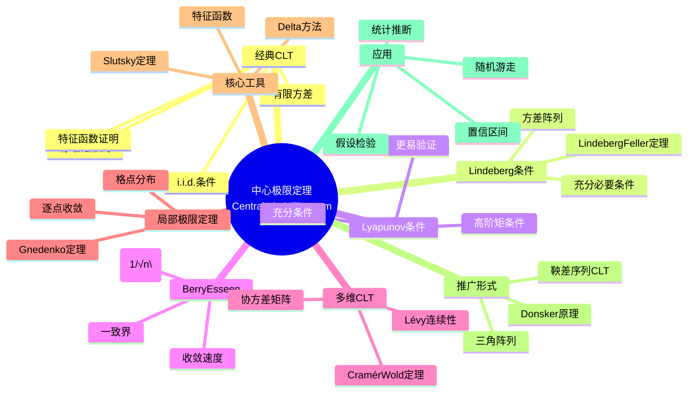

msc_primary: "00A99"
msc_secondary: ['00-XX']
---

# 中心极限定理 (Central Limit Theorem)

## 中心概念精确定义

**中心极限定理（Central Limit Theorem, CLT）**是概率论中最重要和最基本的定理之一，它阐明了在满足一定条件下，独立随机变量之和的标准化形式依分布收敛于正态分布。这一定理解释了为什么正态分布在自然界和社会科学中如此普遍出现，为统计推断提供了坚实的理论基础。

**经典形式**：设 $\{X_n\}_{n=1}^{\infty}$ 是独立同分布（i.i.d.）的随机变量序列，$E[X_1] = \mu$，$\text{Var}(X_1) = \sigma^2 < \infty$。令 $S_n = X_1 + \cdots + X_n$，则

$$\frac{S_n - n\mu}{\sigma\sqrt{n}} \xrightarrow{d} N(0,1) \quad \text{当} \quad n \to \infty$$

等价表述为样本均值的形式：
$$\frac{\bar{X}_n - \mu}{\sigma/\sqrt{n}} \xrightarrow{d} N(0,1)$$

**历史发展**：
- 1733年：De Moivre首次证明二项分布的正态近似（De Moivre-Laplace定理）
- 1812年：Laplace推广到一般情形
- 1901年：Lyapunov给出一般证明
- 1922年：Lindeberg给出更一般的条件

---

## 核心要素

### 1. 经典CLT (Classical CLT)

**定理陈述**：设 $\{X_n\}$ i.i.d.，$E[X_1] = \mu$，$\text{Var}(X_1) = \sigma^2 \in (0, \infty)$，则
$$Z_n = \frac{S_n - n\mu}{\sigma\sqrt{n}} \xrightarrow{d} Z \sim N(0,1)$$

**证明方法**：
- **特征函数法**：$\varphi_{Z_n}(t) \to e^{-t^2/2}$
- **矩母函数法**：$M_{Z_n}(t) \to e^{t^2/2}$
- **Lindeberg替换法**：逐步替换为独立正态变量

**实用形式**：对大的 $n$，$S_n \stackrel{\text{approx}}{\sim} N(n\mu, n\sigma^2)$

### 2. Lindeberg条件与Lindeberg-Feller定理

**Lindeberg条件**：设 $\{X_{nk}\}_{k=1}^n$ 是独立随机变量阵列，$E[X_{nk}] = 0$，$\text{Var}(X_{nk}) = \sigma_{nk}^2$，$s_n^2 = \sum_{k=1}^n \sigma_{nk}^2$。若对任意 $\epsilon > 0$：

$$\lim_{n \to \infty} \frac{1}{s_n^2}\sum_{k=1}^n E[X_{nk}^2 \cdot 1_{\{|X_{nk}| > \epsilon s_n\}}] = 0$$

则 Lindeberg-Feller CLT 成立：
$$\frac{\sum_{k=1}^n X_{nk}}{s_n} \xrightarrow{d} N(0,1)$$

**意义**：Lindeberg条件是CLT成立的充分必要条件（配合Feller条件）。

### 3. Lyapunov条件 (Lyapunov's Condition)

**Lyapunov条件**是Lindeberg条件的充分条件：存在 $\delta > 0$ 使得
$$\lim_{n \to \infty} \frac{1}{s_n^{2+\delta}}\sum_{k=1}^n E[|X_{nk}|^{2+\delta}] = 0$$

**Lyapunov CLT**：若上述条件成立，则
$$\frac{\sum_{k=1}^n X_{nk}}{s_n} \xrightarrow{d} N(0,1)$$

**比较**：Lyapunov条件更强但更易验证，因为只需检验高阶矩。

### 4. Berry-Esseen定理（CLT的收敛速度）

**定理陈述**：设 $\{X_n\}$ i.i.d.，$E[X_1] = 0$，$\text{Var}(X_1) = \sigma^2$，$\rho = E[|X_1|^3] < \infty$，则
$$\sup_{x \in \mathbb{R}} |P(Z_n \leq x) - \Phi(x)| \leq \frac{C\rho}{\sigma^3\sqrt{n}}$$

其中 $C$ 是常数（目前最好结果：$C < 0.4748$），$\Phi$ 是标准正态分布函数。

**意义**：给出了CLT收敛的精确速度，是 $O(1/\sqrt{n})$ 量级。

### 5. 多维CLT (Multivariate CLT)

设 $\{\mathbf{X}_n\}$ i.i.d.，$\mathbf{X}_n \in \mathbb{R}^d$，$E[\mathbf{X}_1] = \boldsymbol{\mu}$，$\text{Cov}(\mathbf{X}_1) = \Sigma$，则
$$\sqrt{n}(\bar{\mathbf{X}}_n - \boldsymbol{\mu}) \xrightarrow{d} N_d(\mathbf{0}, \Sigma)$$

**特征函数形式**：对任意 $\mathbf{t} \in \mathbb{R}^d$，
$$\sqrt{n} \mathbf{t}^T(\bar{\mathbf{X}}_n - \boldsymbol{\mu}) \xrightarrow{d} N(0, \mathbf{t}^T\Sigma\mathbf{t})$$

### 6. 局部极限定理 (Local Limit Theorems)

研究概率质量函数或密度函数的逐点收敛：

**Gnedenko局部极限定理**：设 $\{X_n\}$ i.i.d.，取值于整数格点，则在某些条件下
$$\sup_k \left|\sqrt{n\sigma^2} P(S_n = k) - \frac{1}{\sqrt{2\pi}}e^{-(k-n\mu)^2/(2n\sigma^2)}\right| \to 0$$

---

## 性质与定理

### 定理1：De Moivre-Laplace定理

设 $S_n \sim \text{Binomial}(n,p)$，则当 $n \to \infty$：
$$\frac{S_n - np}{\sqrt{np(1-p)}} \xrightarrow{d} N(0,1)$$

这是CLT的最早形式，也是二项分布的正态近似理论基础。

**连续性修正**：
$$P(a \leq S_n \leq b) \approx \Phi\left(\frac{b + 0.5 - np}{\sqrt{np(1-p)}}\right) - \Phi\left(\frac{a - 0.5 - np}{\sqrt{np(1-p)}}\right)$$

### 定理2：Lévy连续性定理

设 $\{\mu_n\}$ 是概率测度序列，$\varphi_n$ 是其特征函数，则 $\mu_n \xrightarrow{d} \mu$ 当且仅当 $\varphi_n(t) \to \varphi(t)$ 对所有 $t$ 成立，且 $\varphi$ 在 $t=0$ 连续。

这是用特征函数证明CLT的核心工具。

### 定理3：Slutsky定理

若 $X_n \xrightarrow{d} X$，$Y_n \xrightarrow{P} c$（常数），则：
1. $X_n + Y_n \xrightarrow{d} X + c$
2. $X_n Y_n \xrightarrow{d} cX$
3. $X_n / Y_n \xrightarrow{d} X/c$（若 $c \neq 0$）

**应用**：在CLT中用样本方差 $S_n^2$ 代替理论方差 $\sigma^2$。

### 定理4：Delta方法

设 $\sqrt{n}(X_n - \mu) \xrightarrow{d} N(0, \sigma^2)$，$g$ 在 $\mu$ 处可微，则
$$\sqrt{n}(g(X_n) - g(\mu)) \xrightarrow{d} N(0, [g'(\mu)]^2\sigma^2)$$

**高阶Delta方法**：若 $g'(\mu) = 0$ 但 $g''(\mu) \neq 0$，则收敛速度为 $n$ 而非 $\sqrt{n}$。

### 定理5：Cramér-Wold定理

设 $\{\mathbf{X}_n\}$ 是 $\mathbb{R}^d$ 中的随机向量序列，则 $\mathbf{X}_n \xrightarrow{d} \mathbf{X}$ 当且仅当对所有 $\mathbf{a} \in \mathbb{R}^d$，$\mathbf{a}^T\mathbf{X}_n \xrightarrow{d} \mathbf{a}^T\mathbf{X}$。

这是证明多维CLT的关键工具。

---

## 典型例子

### 例子1：二项分布的正态近似

**问题**：抛掷公平硬币1000次，求正面出现次数在480到520之间的概率。

**解**：$S_{1000} \sim \text{Binomial}(1000, 0.5)$
- $E[S_{1000}] = 500$
- $\text{Var}(S_{1000}) = 250$

使用CLT：
$$P(480 \leq S_{1000} \leq 520) \approx \Phi\left(\frac{520.5 - 500}{\sqrt{250}}\right) - \Phi\left(\frac{479.5 - 500}{\sqrt{250}}\right) \approx 0.79$$

**连续性修正**提高了近似精度。

### 例子2：统计推断中的CLT

**样本均值推断**：设 $X_1, ..., X_n$ i.i.d.，$E[X_1] = \mu$，$\text{Var}(X_1) = \sigma^2$，则
$$\frac{\bar{X}_n - \mu}{S_n/\sqrt{n}} \xrightarrow{d} t_{n-1} \approx N(0,1)$$

其中 $S_n^2$ 是样本方差。

**置信区间**：
$$\bar{X}_n \pm z_{\alpha/2} \cdot \frac{S_n}{\sqrt{n}}$$

是 $\mu$ 的近似 $100(1-\alpha)\%$ 置信区间。

**假设检验**：Z检验、T检验都基于CLT。

### 例子3：随机游走与Brown运动

**Donsker不变原理**：设 $\{X_n\}$ i.i.d.，$E[X_1] = 0$，$\text{Var}(X_1) = 1$，定义
$$W_n(t) = \frac{S_{\lfloor nt \rfloor}}{\sqrt{n}}, \quad t \in [0,1]$$

则在 $D[0,1]$ 空间中，$W_n \xrightarrow{d} W$，其中 $W$ 是标准Brown运动。

**意义**：这是泛函中心极限定理，表明随机游走的适当缩放收敛于Brown运动。

---

## 关联概念

### 上游概念
- **概率测度**：期望、方差、特征函数
- **大数定律**：LLN是CLT的必要条件
- **正态分布**：标准极限分布

### 下游概念
- **统计推断**：置信区间、假设检验
- **经验过程理论**：Donsker定理
- **随机分析**：Brown运动、随机微分方程
- **时间序列分析**：渐近理论
- **自助法（Bootstrap）**：重采样理论

### 应用领域
- **统计学**：大样本理论、渐近效率
- **计量经济学**：估计量的渐近分布
- **金融数学**：风险度量、期权定价
- **统计物理**：宏观系统的涨落理论
- **生物统计**：遗传学中的基因频率
- **信号处理**：噪声分析、检测理论

---

## Mermaid 思维导图

---

## 参考文献

1. **de Moivre, A.** (1733). *Approximatio ad Summam Terminorum Binomii*$(a+b)^n$ *in Seriem expansi*
2. **Laplace, P.S.** (1812). *Théorie Analytique des Probabilités*
3. **Lindeberg, J.W.** (1922). "Eine neue Herleitung des Exponentialgesetzes"
4. **Feller, W.** (1968). *An Introduction to Probability Theory and Its Applications*, Vol. 1, 3rd Ed., Wiley
5. **Billingsley, P.** (1999). *Convergence of Probability Measures*, 2nd Ed., Wiley
6. **van der Vaart, A.W.** (1998). *Asymptotic Statistics*, Cambridge University Press
7. **Durrett, R.** (2019). *Probability: Theory and Examples*, 5th Ed.
8. **MIT OpenCourseWare**: 18.443 Statistics for Applications

---

*本文档是FormalMath项目的一部分，对齐MIT概率统计课程体系。*
