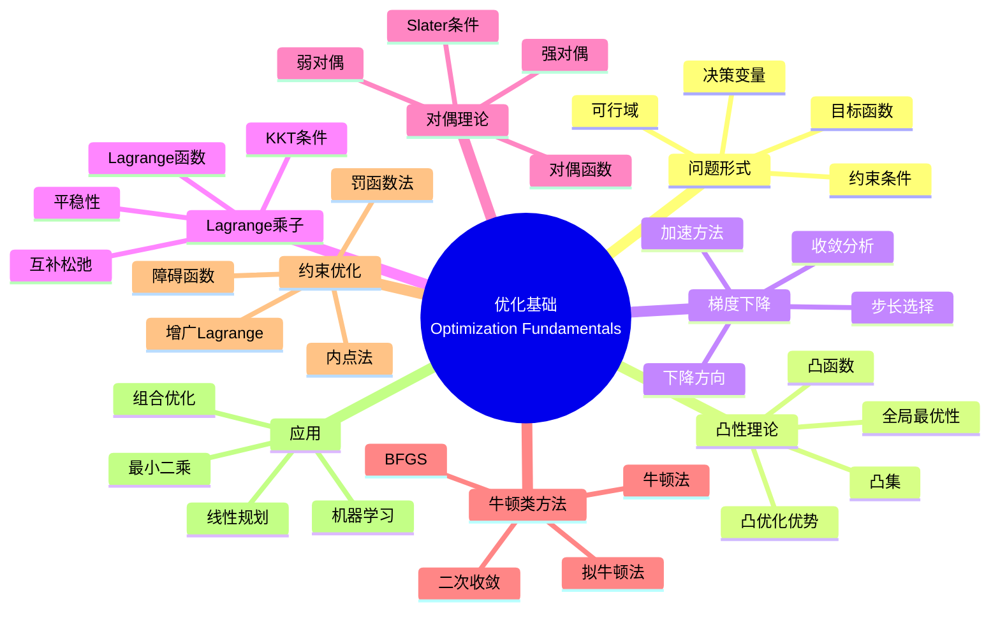

msc_primary: "00A99"
msc_secondary: ['00-00']
---

# 优化基础 (Optimization Fundamentals)

## 中心概念精确定义

**优化（Optimization）**是应用数学和计算科学的核心领域，研究如何找到使目标函数达到最优值（最小或最大）的决策变量值。优化问题的一般形式为：

$$\min_{x \in \mathcal{X}} f(x) \quad \text{subject to} \quad g_i(x) \leq 0, \, h_j(x) = 0$$

其中：
- $f: \mathbb{R}^n \to \mathbb{R}$：目标函数（Objective Function）
- $x \in \mathbb{R}^n$：决策变量（Decision Variables）
- $g_i(x) \leq 0$：不等式约束（Inequality Constraints）
- $h_j(x) = 0$：等式约束（Equality Constraints）
- $\mathcal{X} \subseteq \mathbb{R}^n$：可行域（Feasible Region）

**优化分类**：
- **线性规划（LP）**：$f, g_i, h_j$ 都是线性的
- **非线性规划（NLP）**：至少有一个函数是非线性的
- **凸优化**：$f$ 凸，$g_i$ 凸，$h_j$ 仿射
- **整数规划**：决策变量取整数值
- **组合优化**：离散可行域

---

## 核心要素

### 1. 凸性 (Convexity)

**凸集**：集合 $C \subseteq \mathbb{R}^n$ 是凸的，如果
$$\forall x, y \in C, \, \lambda \in [0,1]: \quad \lambda x + (1-\lambda)y \in C$$

**凸函数**：函数 $f: C \to \mathbb{R}$ 是凸的，如果
$$f(\lambda x + (1-\lambda)y) \leq \lambda f(x) + (1-\lambda)f(y)$$

严格凸：不等式严格成立（$x \neq y$，$\lambda \in (0,1)$）。

**凸函数判定**：
- 一阶条件：$f(y) \geq f(x) + \nabla f(x)^T(y-x)$
- 二阶条件：$\nabla^2 f(x) \succeq 0$（Hessian半正定）

**凸优化优势**：
- 局部最优 = 全局最优
- 存在高效算法
- 对偶理论完善

### 2. 梯度下降法 (Gradient Descent)

**基本思想**：沿负梯度方向迭代下降。

**算法**：
$$x_{k+1} = x_k - \alpha_k \nabla f(x_k)$$

其中 $\alpha_k > 0$ 是步长（学习率）。

**收敛性**（凸函数）：
- 固定步长：$f(x_k) - f^* \leq O(1/k)$
- 最优步长或回溯线搜索：相同收敛率
- 强凸函数：线性收敛 $O(\rho^k)$，$\rho < 1$

**加速梯度方法**：
- **Nesterov加速梯度**：$O(1/k^2)$ 收敛率
- **动量法**：$x_{k+1} = x_k - \alpha \nabla f(x_k) + \beta(x_k - x_{k-1})$

**随机梯度下降（SGD）**：
$$x_{k+1} = x_k - \alpha_k \nabla f_{i_k}(x_k)$$
适用于大规模机器学习问题。

### 3. Lagrange乘子法 (Lagrange Multipliers)

**等式约束优化**：
$$\min f(x) \quad \text{s.t.} \quad h(x) = 0$$

**Lagrange函数**：
$$\mathcal{L}(x, \lambda) = f(x) + \lambda^T h(x)$$

**一阶最优性条件（KKT必要条件）**：
$$\nabla_x \mathcal{L} = 0, \quad h(x) = 0$$

**不等式约束**：
$$\mathcal{L}(x, \lambda, \mu) = f(x) + \sum_i \lambda_i g_i(x) + \sum_j \mu_j h_j(x)$$

**KKT条件**：
1. **平稳性**：$\nabla_x \mathcal{L} = 0$
2. **原始可行性**：$g_i(x) \leq 0$，$h_j(x) = 0$
3. **对偶可行性**：$\lambda_i \geq 0$
4. **互补松弛性**：$\lambda_i g_i(x) = 0$

### 4. 对偶理论 (Duality Theory)

**Lagrange对偶函数**：
$$g(\lambda, \mu) = \inf_x \mathcal{L}(x, \lambda, \mu)$$

**对偶问题**：
$$\max_{\lambda \geq 0, \mu} g(\lambda, \mu)$$

**弱对偶**：对任意可行 $(x, \lambda, \mu)$，
$$g(\lambda, \mu) \leq f(x)$$

因此 $d^* \leq p^*$（对偶最优 $\leq$ 原始最优）。

**强对偶**：在凸问题和约束规范下，$d^* = p^*$。

**Slater条件**：对凸问题，若存在严格内点，则强对偶成立。

### 5. 牛顿法与拟牛顿法

**牛顿法**：利用二阶信息
$$x_{k+1} = x_k - [\nabla^2 f(x_k)]^{-1} \nabla f(x_k)$$

**收敛性**：局部二次收敛。

**阻尼牛顿法**：加入线搜索保证全局收敛。

**拟牛顿法**：避免计算Hessian及其逆。
- **BFGS**：用梯度信息近似Hessian逆
- **DFP**：早期拟牛顿方法
- **L-BFGS**：有限内存版本，适合大规模问题

**比较**：

| 方法 | 收敛速度 | 每次迭代计算 | 适用规模 |
|-----|---------|------------|---------|
| 梯度下降 | 线性 | $O(n)$ | 大规模 |
| 牛顿法 | 二次 | $O(n^3)$ | 中小规模 |
| 拟牛顿 | 超线性 | $O(n^2)$ | 中规模 |

### 6. 约束优化方法

**罚函数法**：将约束融入目标函数
$$\min_x f(x) + \rho P(x)$$

其中 $P(x)$ 是罚项（如 $P(x) = \sum_i \max(0, g_i(x))^2$）。

**障碍函数法（内点法）**：
$$\min_x f(x) - \mu \sum_i \log(-g_i(x))$$

**增广Lagrange法**：
$$\mathcal{L}_\rho(x, \lambda) = f(x) + \lambda^T h(x) + \frac{\rho}{2}\|h(x)\|^2$$

结合Lagrange乘子和罚函数的优点。

---

## 性质与定理

### 定理1：凸优化的全局最优性

设 $f$ 是凸函数，$\mathcal{X}$ 是凸集，则：
1. 任何局部最小值都是全局最小值
2. 若 $f$ 严格凸，则全局最小值唯一
3. $x^*$ 是最优解当且仅当 $\nabla f(x^*)^T(y - x^*) \geq 0$ 对所有 $y \in \mathcal{X}$

### 定理2：梯度下降的收敛率

设 $f$ 是凸且 $L$-光滑（$\|\nabla f(x) - \nabla f(y)\| \leq L\|x-y\|$），步长 $\alpha = 1/L$：
$$f(x_k) - f^* \leq \frac{2L\|x_0 - x^*\|^2}{k}$$

若 $f$ 还是 $\mu$-强凸：
$$f(x_k) - f^* \leq \left(1 - \frac{\mu}{L}\right)^k (f(x_0) - f^*)$$
条件数 $\kappa = L/\mu$ 决定收敛速度。

### 定理3：KKT最优性条件

对于凸优化问题，在约束规范下：
- KKT条件是充分必要条件
- 强对偶成立时，原始-对偶最优解满足KKT条件

### 定理4：牛顿法的局部收敛

设 $f$ 三阶连续可微，$x^*$ 是局部最小值且 $\nabla^2 f(x^*) \succ 0$，则从足够接近 $x^*$ 的初始点出发：
$$\|x_{k+1} - x^*\| \leq C\|x_k - x^*\|^2$$

即二次收敛。

### 定理5：强对偶与鞍点定理

对于凸优化问题满足Slater条件：
1. 强对偶成立：$p^* = d^*$
2. $(x^*, \lambda^*, \mu^*)$ 是Lagrange函数的鞍点：
$$\mathcal{L}(x^*, \lambda, \mu) \leq \mathcal{L}(x^*, \lambda^*, \mu^*) \leq \mathcal{L}(x, \lambda^*, \mu^*)$$

---

## 典型例子

### 例子1：线性规划

**标准形式**：
$$\min c^Tx \quad \text{s.t.} \quad Ax = b, \, x \geq 0$$

**单纯形法**：在可行域顶点间迭代，有限步收敛。

**内点法**：在可行域内部沿中心路径收敛到最优解，多项式时间复杂度。

**应用**：生产计划、运输问题、网络流、投资组合优化。

### 例子2：最小二乘问题

$$\min_x \|Ax - b\|^2$$

**闭式解**：$x^* = (A^TA)^{-1}A^Tb$（正规方程）

**梯度下降**：
$$x_{k+1} = x_k - 2\alpha A^T(Ax_k - b)$$

**计算比较**：
- 直接法：$O(n^3)$ 但精确
- 梯度下降：$O(n^2)$ 每次迭代，适合大规模
- 共轭梯度：$O(n^2)$ 有限步收敛

### 例子3：支持向量机（SVM）

**原始问题**：
$$\min_{w,b} \frac{1}{2}\|w\|^2 + C\sum_i \max(0, 1 - y_i(w^Tx_i + b))$$

**对偶问题**：
$$\max_\alpha \sum_i \alpha_i - \frac{1}{2}\sum_{i,j} \alpha_i \alpha_j y_i y_j x_i^T x_j$$
$$\text{s.t.} \quad 0 \leq \alpha_i \leq C, \quad \sum_i \alpha_i y_i = 0$$

**优势**：对偶问题可用核技巧，处理非线性分类。

---

## 关联概念

### 上游概念
- **线性代数**：矩阵运算、特征值、正定性
- **多元微积分**：梯度、Hessian、Taylor展开
- **凸分析**：凸集、凸函数、次梯度
- **实分析**：收敛性、连续性、紧致性

### 下游概念
- **凸优化**：SDP、锥优化、鲁棒优化
- **非凸优化**：全局优化、启发式算法
- **随机优化**：随机梯度、在线学习
- **变分优化**：Euler-Lagrange、最优控制
- **分布式优化**：ADMM、联邦学习

### 应用领域
- **机器学习**：参数学习、深度学习训练
- **运筹学**：资源分配、调度、物流
- **金融工程**：资产定价、风险管理
- **信号处理**：滤波、压缩感知
- **工程设计**：结构优化、控制设计
- **计算机视觉**：图像重建、配准

---

## Mermaid 思维导图

---

## 参考文献

1. **Lagrange, J.L.** (1788). *Mécanique Analytique*
2. **Karush, W.** (1939). "Minima of Functions of Several Variables with Inequalities as Side Constraints"
3. **Kuhn, H.W. & Tucker, A.W.** (1951). "Nonlinear Programming"
4. **Boyd, S. & Vandenberghe, L.** (2004). *Convex Optimization*, Cambridge University Press
5. **Nocedal, J. & Wright, S.J.** (2006). *Numerical Optimization*, 2nd Ed., Springer
6. **Bertsekas, D.P.** (2016). *Nonlinear Programming*, 3rd Ed., Athena Scientific
7. **MIT OpenCourseWare**: 6.079 Introduction to Convex Optimization

---

*本文档是FormalMath项目的一部分，对齐MIT优化课程体系。*
