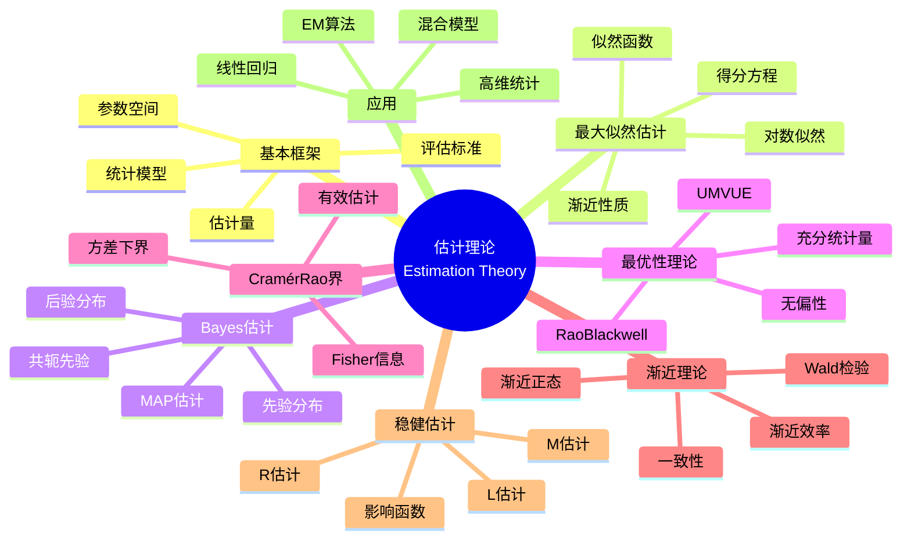

msc_primary: "00A99"
msc_secondary: ['00-XX']
---

# 估计理论 (Estimation Theory)

## 中心概念精确定义

**估计理论（Estimation Theory）**是数理统计的核心分支，研究如何基于观测数据对未知参数或分布进行推断。给定一个统计模型 $\{P_\theta: \theta \in \Theta\}$，估计理论关注构造**估计量（Estimator）**$\hat{\theta} = \hat{\theta}(X_1, ..., X_n)$ 来近似真实参数 $\theta$。

**基本框架**：
- **样本空间**：$\mathcal{X}$（观测值可能的集合）
- **参数空间**：$\Theta$（未知参数可能的集合）
- **统计模型**：$\{f(x|\theta): \theta \in \Theta\}$（给定参数下数据的分布）

- **估计量**：$\hat{\theta}: \mathcal{X}^n \to \Theta$（基于数据的函数）

**评估标准**：
- **偏差（Bias）**：$\text{Bias}(\hat{\theta}) = E[\hat{\theta}] - \theta$
- **方差（Variance）**：$\text{Var}(\hat{\theta}) = E[(\hat{\theta} - E[\hat{\theta}])^2]$
- **均方误差（MSE）**：$\text{MSE}(\hat{\theta}) = E[(\hat{\theta} - \theta)^2] = \text{Bias}^2 + \text{Variance}$

---

## 核心要素

### 1. 最大似然估计 (Maximum Likelihood Estimation, MLE)

**似然函数**：给定观测 $x = (x_1, ..., x_n)$，似然函数定义为
$$L(\theta|x) = f(x|\theta) = \prod_{i=1}^n f(x_i|\theta)$$

**对数似然**：通常使用 $\ell(\theta|x) = \log L(\theta|x)$。

**MLE定义**：
$$\hat{\theta}_{MLE} = \arg\max_{\theta \in \Theta} L(\theta|x) = \arg\max_{\theta \in \Theta} \ell(\theta|x)$$

**求解方法**：
- 求导：$\frac{\partial \ell(\theta|x)}{\partial \theta} = 0$（得分方程）

- 数值优化：Newton-Raphson、Fisher scoring、EM算法

**例子**：
- 正态分布：$\hat{\mu} = \bar{X}$，$\hat{\sigma}^2 = \frac{1}{n}\sum(X_i - \bar{X})^2$
- 二项分布：$\hat{p} = \frac{k}{n}$

### 2. Bayes估计 (Bayesian Estimation)

**Bayes范式**：将参数 $\theta$ 视为随机变量，赋予先验分布 $\pi(\theta)$。

**后验分布**：根据Bayes定理
$$\pi(\theta|x) = \frac{f(x|\theta)\pi(\theta)}{\int f(x|\theta')\pi(\theta')d\theta'} \propto L(\theta|x)\pi(\theta)$$

**Bayes估计量**：

| 损失函数 | Bayes估计 |
|---------|----------|
| 平方损失 $(\hat{\theta} - \theta)^2$ | 后验均值 $E[\theta|x]$ |
| 绝对损失 $\|\hat{\theta} - \theta\|$ | 后验中位数 |
| 0-1损失 | 后验众数（MAP） |

**MAP估计**：
$$\hat{\theta}_{MAP} = \arg\max_\theta \pi(\theta|x) = \arg\max_\theta [\ell(\theta|x) + \log \pi(\theta)]$$

**共轭先验**：当先验与后验属于同一分布族时，计算简便。
- Beta-Binomial
- Gamma-Poisson
- Normal-Normal

### 3. 无偏性与充分性

**无偏估计量**：若 $E[\hat{\theta}] = \theta$ 对所有 $\theta \in \Theta$ 成立。

**偏差-方差权衡**：MSE分解
$$\text{MSE}(\hat{\theta}) = \text{Bias}^2(\hat{\theta}) + \text{Var}(\hat{\theta})$$

有时有偏估计量可以有更小的MSE（如岭回归）。

**充分统计量**：统计量 $T(X)$ 称为充分的，如果 $X|T(X)$ 的分布不依赖于 $\theta$。

**因子分解定理**：$T(X)$ 充分当且仅当
$$f(x|\theta) = g(T(x), \theta) \cdot h(x)$$

**例子**：
- 正态分布：$T = (\bar{X}, S^2)$ 是 $(\mu, \sigma^2)$ 的充分统计量
- 二项分布：$T = \sum X_i$ 是 $p$ 的充分统计量

### 4. 最优性理论

**Rao-Blackwell定理**：设 $\hat{\theta}$ 是无偏估计，$T$ 是充分统计量，则
$$\tilde{\theta} = E[\hat{\theta}|T]$$

满足：
- $E[\tilde{\theta}] = \theta$（保持无偏）
- $\text{Var}(\tilde{\theta}) \leq \text{Var}(\hat{\theta})$（方差减小）

**完备性**：统计量 $T$ 称为完备的，若 $E_\theta[g(T)] = 0$ 对所有 $\theta$ 成立意味着 $g(T) = 0$ a.s.

**Lehmann-Scheffé定理**：若 $\hat{\theta}$ 是无偏估计，$T$ 是完备充分统计量，则 $\tilde{\theta} = E[\hat{\theta}|T]$ 是唯一的UMVUE（一致最小方差无偏估计）。

### 5. Cramér-Rao下界

**Fisher信息量**：
$$I(\theta) = E\left[\left(\frac{\partial \log f(X|\theta)}{\partial \theta}\right)^2\right] = -E\left[\frac{\partial^2 \log f(X|\theta)}{\partial \theta^2}\right]$$

**Cramér-Rao不等式**：在正则条件下，对任何无偏估计量 $\hat{\theta}$：
$$\text{Var}(\hat{\theta}) \geq \frac{1}{n I(\theta)}$$

**有效性**：达到Cramér-Rao下界的估计量称为有效的。

### 6. 渐近理论

**MLE的渐近性质**：在正则条件下，$\hat{\theta}_{MLE}$ 满足：
1. **一致性**：$\hat{\theta}_{MLE} \xrightarrow{P} \theta_0$
2. **渐近正态性**：$\sqrt{n}(\hat{\theta}_{MLE} - \theta_0) \xrightarrow{d} N(0, I(\theta_0)^{-1})$
3. **渐近效率**：达到Cramér-Rao下界

**稳健估计**：对模型偏离不敏感的估计方法。
- M-估计：最小化 $\sum \rho(X_i, \theta)$
- L-估计：基于顺序统计量的线性组合
- R-估计：基于秩的估计

---

## 性质与定理

### 定理1：MLE的不变性原理

若 $\hat{\theta}$ 是 $\theta$ 的MLE，则对任意函数 $g$，$g(\hat{\theta})$ 是 $g(\theta)$ 的MLE。

### 定理2：Rao-Blackwell-Lehmann-Scheffé定理

设 $T$ 是完备充分统计量，$\hat{\theta}$ 是 $\theta$ 的任意无偏估计，则 $\tilde{\theta} = E[\hat{\theta}|T]$ 是 $\theta$ 的唯一UMVUE。

### 定理3：MLE的大样本理论

在正则条件下：
1. $\hat{\theta}_n \xrightarrow{a.s.} \theta_0$（强一致性）
2. $\sqrt{n}(\hat{\theta}_n - \theta_0) \xrightarrow{d} N(0, I(\theta_0)^{-1})$
3. 似然比统计量：$2[\ell(\hat{\theta}_n) - \ell(\theta_0)] \xrightarrow{d} \chi^2_p$

### 定理4：Wald置信区间

基于MLE的渐近正态性，$\theta$ 的近似 $100(1-\alpha)\%$ 置信区间为：
$$\hat{\theta} \pm z_{\alpha/2} \cdot \frac{1}{\sqrt{nI(\hat{\theta})}}$$

### 定理5：Bayes估计的大样本性质（Bernstein-von Mises定理）

在温和条件下，当 $n \to \infty$ 时，后验分布趋近于正态分布：
$$\sqrt{n}(\theta - \hat{\theta}_{MLE})|X \xrightarrow{d} N(0, I(\theta_0)^{-1})$$

这表明先验的影响随样本量增大而消失。

---

## 典型例子

### 例子1：正态分布参数的估计

设 $X_1, ..., X_n$ i.i.d. $\sim N(\mu, \sigma^2)$。

**MLE**：
- $\hat{\mu}_{MLE} = \bar{X}$
- $\hat{\sigma}^2_{MLE} = \frac{1}{n}\sum(X_i - \bar{X})^2$（有偏）

**UMVUE**：
- $\hat{\mu} = \bar{X}$
- $S^2 = \frac{1}{n-1}\sum(X_i - \bar{X})^2$（无偏）

**Fisher信息**：
- $I(\mu) = \frac{1}{\sigma^2}$
- $I(\sigma^2) = \frac{1}{2\sigma^4}$

### 例子2：线性回归的估计

模型：$Y = X\beta + \varepsilon$，$\varepsilon \sim N(0, \sigma^2 I)$

**最小二乘估计（LSE）**：
$$\hat{\beta}_{LS} = (X^TX)^{-1}X^TY$$

**性质**：
- 无偏：$E[\hat{\beta}] = \beta$
- 协方差：$\text{Cov}(\hat{\beta}) = \sigma^2(X^TX)^{-1}$
- Gauss-Markov定理：BLUE（最佳线性无偏估计）

**MLE**：在高斯误差下，LSE = MLE。

**Ridge估计**（有偏）：
$$\hat{\beta}_{ridge} = (X^TX + \lambda I)^{-1}X^TY$$

### 例子3：高斯混合模型的EM算法

模型：$f(x) = \sum_{k=1}^K \pi_k N(x|\mu_k, \Sigma_k)$

**隐变量**：$z_i \in \{1, ..., K\}$ 表示第 $i$ 个样本的类别。

**EM算法**：
- **E步**：计算后验概率 $w_{ik} = P(z_i = k|x_i, \theta^{(t)})$

- **M步**：更新参数
  - $\pi_k^{(t+1)} = \frac{1}{n}\sum_i w_{ik}$
  - $\mu_k^{(t+1)} = \frac{\sum_i w_{ik}x_i}{\sum_i w_{ik}}$
  - $\Sigma_k^{(t+1)} = \frac{\sum_i w_{ik}(x_i - \mu_k)(x_i - \mu_k)^T}{\sum_i w_{ik}}$

---

## 关联概念

### 上游概念
- **概率论**：期望、方差、条件分布
- **大数定律与CLT**：估计量的一致性、渐近正态性
- **优化理论**：凸优化、数值优化

### 下游概念
- **假设检验**：似然比检验、Wald检验
- **贝叶斯推断**：后验计算、MCMC方法
- **非参数估计**：核密度估计、样条
- **高维统计**：Lasso、稀疏估计
- **稳健统计**：M-估计、影响函数

### 应用领域
- **计量经济学**：模型估计、工具变量
- **生物统计**：生存分析、临床试验
- **机器学习**：参数学习、深度学习
- **信号处理**：谱估计、滤波
- **金融工程**：波动率估计、风险模型

---

## Mermaid 思维导图

---

## 参考文献

1. **Fisher, R.A.** (1922). "On the Mathematical Foundations of Theoretical Statistics"
2. **Lehmann, E.L. & Casella, G.** (1998). *Theory of Point Estimation*, 2nd Ed., Springer
3. **Berger, J.O.** (1985). *Statistical Decision Theory and Bayesian Analysis*, 2nd Ed., Springer
4. **van der Vaart, A.W.** (1998). *Asymptotic Statistics*, Cambridge University Press
5. **Wasserman, L.** (2004). *All of Statistics*, Springer
6. **Hastie, T., Tibshirani, R., & Friedman, J.** (2009). *The Elements of Statistical Learning*, 2nd Ed., Springer
7. **MIT OpenCourseWare**: 18.443 Statistics for Applications

---

*本文档是FormalMath项目的一部分，对齐MIT概率统计课程体系。*
