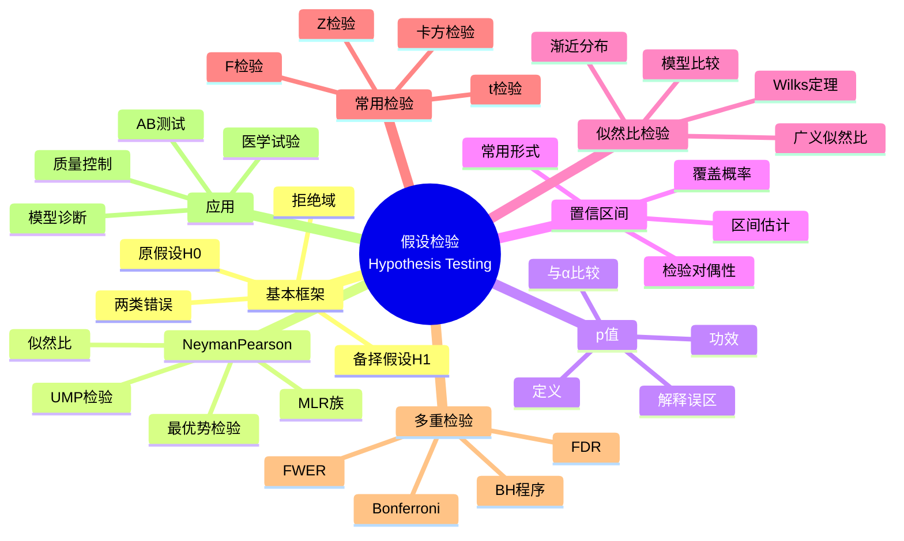

# 假设检验 (Hypothesis Testing)

## 中心概念精确定义

**假设检验（Hypothesis Testing）**是统计推断的核心方法之一，用于基于样本数据对关于总体参数的命题进行判断。其基本逻辑源于**反证法**和**小概率事件原理**：在假设成立的条件下，若观测到的事件概率极小，则有理由拒绝该假设。

**基本框架**：
- **原假设（Null Hypothesis）**：$H_0: \theta \in \Theta_0$（通常表示"无效应"或"无差异"）
- **备择假设（Alternative Hypothesis）**：$H_1: \theta \in \Theta_1$
- **拒绝域（Rejection Region）**：$R \subset \mathcal{X}$，当 $X \in R$ 时拒绝 $H_0$

**两类错误**：
- **第一类错误（Type I Error）**：$H_0$ 为真时拒绝，概率为 $\alpha = P(\text{拒绝 } H_0 | H_0 \text{ 真})$
- **第二类错误（Type II Error）**：$H_0$ 为假时接受，概率为 $\beta = P(\text{接受 } H_0 | H_1 \text{ 真})$
- **检验功效（Power）**：$1 - \beta = P(\text{拒绝 } H_0 | H_1 \text{ 真})$

---

## 核心要素

### 1. Neyman-Pearson理论

**Neyman-Pearson引理**：对于简单假设检验 $H_0: \theta = \theta_0$ vs $H_1: \theta = \theta_1$，似然比检验
$$\Lambda(x) = \frac{L(\theta_1|x)}{L(\theta_0|x)}$$

在显著性水平 $\alpha$ 下，拒绝域 $R = \{x: \Lambda(x) > c\}$ 是最优势（Most Powerful, MP）检验。

**一致最优势检验（Uniformly Most Powerful, UMP）**：若同一检验在所有 $\theta_1 \in \Theta_1$ 下都是MP的，则称为UMP检验。

**存在条件**：单调似然比（Monotone Likelihood Ratio, MLR）族保证UMP检验存在。

### 2. p值 (p-value)

**定义**：在 $H_0$ 成立条件下，检验统计量 $T$ 至少与观测值 $t_{obs}$ 一样极端的概率：
$$p = P(T \geq t_{obs} | H_0 \text{ 真})$$

**决策规则**：
- $p < \alpha$：拒绝 $H_0$
- $p \geq \alpha$：不拒绝 $H_0$

**注意**：p值不是 $H_0$ 为真的概率！

**p值的正确理解**：
- 是反对 $H_0$ 的证据强度度量
- 小p值表示若 $H_0$ 为真，观测结果不太可能发生
- 依赖于样本量和效应大小

### 3. 置信区间 (Confidence Interval)

**定义**：随机区间 $(L(X), U(X))$ 称为 $\theta$ 的 $100(1-\alpha)\%$ 置信区间，如果
$$P_\theta(L(X) \leq \theta \leq U(X)) = 1 - \alpha, \quad \forall \theta \in \Theta$$

**与假设检验的对偶性**：
- 接受域 $A(\theta_0) = \{x: \text{不拒绝 } H_0: \theta = \theta_0\}$
- 置信区间：$C(x) = \{\theta_0: x \in A(\theta_0)\}$

**常用置信区间**：
- 正态均值（已知方差）：$\bar{X} \pm z_{\alpha/2}\frac{\sigma}{\sqrt{n}}$
- 正态均值（未知方差）：$\bar{X} \pm t_{n-1, \alpha/2}\frac{S}{\sqrt{n}}$
- 比例：$\hat{p} \pm z_{\alpha/2}\sqrt{\frac{\hat{p}(1-\hat{p})}{n}}$

### 4. 似然比检验 (Likelihood Ratio Test, LRT)

**广义似然比统计量**：
$$\Lambda = \frac{\sup_{\theta \in \Theta_0} L(\theta|x)}{\sup_{\theta \in \Theta} L(\theta|x)} = \frac{L(\hat{\theta}_0|x)}{L(\hat{\theta}|x)}$$

其中 $\hat{\theta}_0$ 是 $H_0$ 下的约束MLE，$\hat{\theta}$ 是无约束MLE。

**Wilks定理**：在 $H_0$ 和正则条件下，当 $n \to \infty$：
$$-2\log\Lambda \xrightarrow{d} \chi^2_k$$

其中 $k = \dim(\Theta) - \dim(\Theta_0)$ 是约束个数。

**应用**：复合假设检验、模型选择（嵌套模型）。

### 5. 常用检验方法

| 检验名称 | 适用场景 | 检验统计量 | 零分布 |
|---------|---------|-----------|--------|
| Z检验 | 正态均值（方差已知） | $\frac{\bar{X} - \mu_0}{\sigma/\sqrt{n}}$ | $N(0,1)$ |
| t检验 | 正态均值（方差未知） | $\frac{\bar{X} - \mu_0}{S/\sqrt{n}}$ | $t_{n-1}$ |
| $\chi^2$检验 | 方差 | $\frac{(n-1)S^2}{\sigma_0^2}$ | $\chi^2_{n-1}$ |
| F检验 | 两方差比 | $\frac{S_1^2}{S_2^2}$ | $F_{n_1-1,n_2-1}$ |
| $\chi^2$拟合优度 | 分类数据 | $\sum\frac{(O-E)^2}{E}$ | $\chi^2_{k-1}$ |

### 6. 多重检验与校正

**问题**：进行 $m$ 个假设检验时，族错误率（Family-Wise Error Rate, FWER）膨胀。

**Bonferroni校正**：将显著性水平设为 $\alpha/m$。

**False Discovery Rate (FDR)**：
$$\text{FDR} = E\left[\frac{V}{R}\right]$$
其中 $V$ 是假阳性数，$R$ 是总拒绝数。

**Benjamini-Hochberg程序**：控制FDR于水平 $\alpha$。

---

## 性质与定理

### 定理1：Neyman-Pearson引理

对于简单假设 $H_0: \theta = \theta_0$ vs $H_1: \theta = \theta_1$，检验
$$\phi(x) = \begin{cases} 1 & \text{if } \Lambda(x) > c \\ \gamma & \text{if } \Lambda(x) = c \\ 0 & \text{if } \Lambda(x) < c \end{cases}$$

是在显著性水平 $E_{\theta_0}[\phi(X)] = \alpha$ 下的最优势检验。

### 定理2：Karlin-Rubin定理

若 $\{f(x|\theta)\}$ 具有关于统计量 $T(x)$ 的单调似然比，则对于 $H_0: \theta \leq \theta_0$ vs $H_1: \theta > \theta_0$，检验"拒绝当 $T(x) > c$"是UMP检验。

### 定理3：Wilks定理

在 $H_0$ 和正则条件下：
$$-2\log\Lambda_n \xrightarrow{d} \chi^2_k$$
其中 $k$ 是约束条件的个数。

### 定理4：Wald检验的渐近分布

基于MLE的Wald统计量：
$$W = (\hat{\theta} - \theta_0)^T [I(\hat{\theta})] (\hat{\theta} - \theta_0) \xrightarrow{d} \chi^2_p$$

### 定理5：Score检验（Rao检验）

定义得分函数 $U(\theta) = \frac{\partial \ell(\theta)}{\partial \theta}$，则在 $H_0$ 下：
$$S = U(\theta_0)^T I(\theta_0)^{-1} U(\theta_0) \xrightarrow{d} \chi^2_p$$

---

## 典型例子

### 例子1：正态均值的检验

设 $X_1, ..., X_n$ i.i.d. $\sim N(\mu, \sigma^2)$，检验 $H_0: \mu = \mu_0$ vs $H_1: \mu \neq \mu_0$。

**情形1**：$\sigma^2$ 已知（Z检验）
$$Z = \frac{\bar{X} - \mu_0}{\sigma/\sqrt{n}} \sim N(0,1) \text{ under } H_0$$

拒绝域：$|Z| > z_{\alpha/2}$

**情形2**：$\sigma^2$ 未知（t检验）
$$t = \frac{\bar{X} - \mu_0}{S/\sqrt{n}} \sim t_{n-1} \text{ under } H_0$$

拒绝域：$|t| > t_{n-1, \alpha/2}$

### 例子2：两样本t检验

比较两组均值：$X_1, ..., X_{n_1} \sim N(\mu_1, \sigma^2)$，$Y_1, ..., Y_{n_2} \sim N(\mu_2, \sigma^2)$。

**合并方差t检验**：
$$t = \frac{\bar{X} - \bar{Y}}{S_p\sqrt{\frac{1}{n_1} + \frac{1}{n_2}}} \sim t_{n_1+n_2-2}$$

其中 $S_p^2 = \frac{(n_1-1)S_1^2 + (n_2-1)S_2^2}{n_1+n_2-2}$

**Welch t检验**（方差不齐）：
$$t = \frac{\bar{X} - \bar{Y}}{\sqrt{\frac{S_1^2}{n_1} + \frac{S_2^2}{n_2}}}$$
近似自由度：$\nu = \frac{(S_1^2/n_1 + S_2^2/n_2)^2}{(S_1^2/n_1)^2/(n_1-1) + (S_2^2/n_2)^2/(n_2-1)}$

### 例子3：卡方拟合优度检验

检验观测频数是否服从某个理论分布。

**Pearson $\chi^2$统计量**：
$$\chi^2 = \sum_{i=1}^k \frac{(O_i - E_i)^2}{E_i} \xrightarrow{d} \chi^2_{k-1-p}$$

其中 $O_i$ 是观测频数，$E_i$ 是期望频数，$p$ 是估计参数个数。

**应用**：
- 遗传学：孟德尔定律检验
- 质量控制：产品缺陷分布
- 调查分析：偏好分布检验

---

## 关联概念

### 上游概念
- **概率分布**：正态、t、F、卡方分布
- **估计理论**：MLE、充分统计量
- **极限定理**：CLT、渐近理论

### 下游概念
- **贝叶斯假设检验**：贝叶斯因子、后验概率
- **序贯检验**：SPRT（序贯概率比检验）
- **非参数检验**：Kolmogorov-Smirnov、秩检验
- **模型选择**：AIC、BIC、交叉验证
- **因果推断**：随机化检验

### 应用领域
- **医学统计**：临床试验、药物有效性
- **质量工程**：过程控制、六西格玛
- **社会科学**：调查分析、实验设计
- **金融风控**：异常检测、欺诈识别
- **生物信息学**：差异表达分析
- **机器学习**：特征选择、模型比较

---

## Mermaid 思维导图

---

## 参考文献

1. **Neyman, J. & Pearson, E.S.** (1933). "On the Problem of the Most Efficient Tests of Statistical Hypotheses"
2. **Lehmann, E.L. & Romano, J.P.** (2005). *Testing Statistical Hypotheses*, 3rd Ed., Springer
3. **Casella, G. & Berger, R.L.** (2002). *Statistical Inference*, 2nd Ed., Duxbury
4. **Wasserman, L.** (2004). *All of Statistics*, Springer
5. **Benjamini, Y. & Hochberg, Y.** (1995). "Controlling the False Discovery Rate"
6. **Wilks, S.S.** (1938). "The Large-Sample Distribution of the Likelihood Ratio for Testing Composite Hypotheses"
7. **MIT OpenCourseWare**: 18.443 Statistics for Applications

---

*本文档是FormalMath项目的一部分，对齐MIT概率统计课程体系。*
