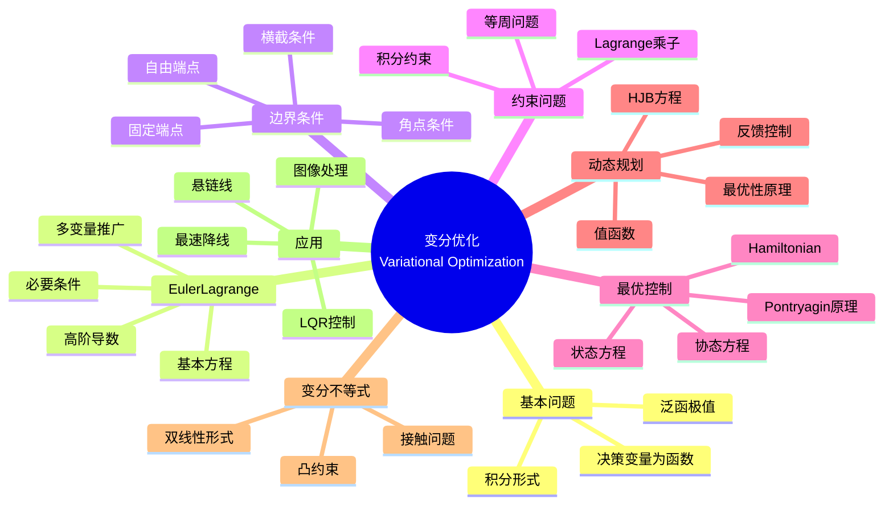

msc_primary: "00A99"
msc_secondary: ['00-00']
---

# 变分优化 (Variational Optimization)

## 中心概念精确定义

**变分优化（Variational Optimization）**是研究泛函极值问题的数学分支，它将函数的优化问题转化为求解微分方程。与有限维优化不同，变分问题中的"决策变量"本身就是函数或曲线。

**基本问题**：求泛函 $J[y]$ 的极值
$$J[y] = \int_a^b F(x, y(x), y'(x)) dx$$

其中：
- $y(x)$：待求函数
- $F(x, y, y')$：Lagrange函数（被积函数）
- $J[y]$：泛函（函数的函数）

**历史发展**：
- 1696年：Johann Bernoulli提出最速降线问题
- 1744年：Euler发表《寻找具有某种最大或最小性质的曲线的方法》
- 1755年：Lagrange引入变分符号，方法系统化
- 20世纪：最优控制理论的发展

---

## 核心要素

### 1. Euler-Lagrange方程

**基本形式**：若 $y(x)$ 使泛函 $J[y]$ 取极值，则满足
$$\frac{\partial F}{\partial y} - \frac{d}{dx}\frac{\partial F}{\partial y'} = 0$$

**推导思路**：考虑扰动 $y(x) + \epsilon \eta(x)$，由 $\frac{dJ}{d\epsilon}|_{\epsilon=0} = 0$ 导出。

**多变量情形**：$y = (y_1, ..., y_n)$，对每个 $y_i$ 有
$$\frac{\partial F}{\partial y_i} - \frac{d}{dx}\frac{\partial F}{\partial y_i'} = 0$$

**高阶导数**：若 $F$ 含 $y''$，则
$$\frac{\partial F}{\partial y} - \frac{d}{dx}\frac{\partial F}{\partial y'} + \frac{d^2}{dx^2}\frac{\partial F}{\partial y''} = 0$$

### 2. 边界条件与横截条件

**固定端点**：$y(a) = y_a$，$y(b) = y_b$

**自由端点**（自然边界条件）：
$$\frac{\partial F}{\partial y'}\bigg|_{x=a} = 0, \quad \frac{\partial F}{\partial y'}\bigg|_{x=b} = 0$$

**可变端点**：若端点沿曲线 $\phi(x, y) = 0$ 移动，则横截条件为
$$\left(F - y'\frac{\partial F}{\partial y'}\right)dx + \frac{\partial F}{\partial y'}dy = 0$$

沿边界曲线成立。

**角点条件**：允许 $y'$ 不连续的点，需满足 Weierstrass-Erdmann 条件。

### 3. 等周问题与约束

**等周问题**：在积分约束下求泛函极值
$$\min J[y] = \int_a^b F(x, y, y')dx \quad \text{s.t.} \quad \int_a^b G(x, y, y')dx = c$$

**解法**：引入Lagrange乘子 $\lambda$，构造 $H = F + \lambda G$，然后对 $H$ 应用Euler-Lagrange方程。

**经典例子**：Dido问题（固定周长求最大面积）的解是圆。

### 4. 最优控制理论

**问题形式**：
$$\min J = \phi(x(t_f), t_f) + \int_{t_0}^{t_f} L(x(t), u(t), t) dt$$
$$\text{s.t.} \quad \dot{x}(t) = f(x(t), u(t), t)$$

其中：
- $x(t) \in \mathbb{R}^n$：状态变量
- $u(t) \in \mathbb{R}^m$：控制变量
- $f$：系统动力学

**Pontryagin极大值原理**：定义Hamiltonian
$$H(x, u, p, t) = L(x, u, t) + p^T f(x, u, t)$$

最优控制满足：
1. **状态方程**：$\dot{x} = \frac{\partial H}{\partial p}$
2. **协态方程**：$\dot{p} = -\frac{\partial H}{\partial x}$
3. **极值条件**：$u^*(t) = \arg\min_u H$

### 5. Hamilton-Jacobi-Bellman方程

**动态规划方法**：定义值函数
$$V(x, t) = \min_u \left[\int_t^{t_f} L(x(s), u(s), s)ds + \phi(x(t_f), t_f)\right]$$

**HJB方程**：
$$-\frac{\partial V}{\partial t} = \min_u \left[L(x, u, t) + \nabla_x V \cdot f(x, u, t)\right]$$

终端条件：$V(x, t_f) = \phi(x, t_f)$

### 6. 变分不等式与推广

**变分不等式**：求 $u \in K$ 使得
$$a(u, v - u) \geq \langle f, v - u \rangle, \quad \forall v \in K$$

其中 $K$ 是凸集，$a(\cdot, \cdot)$ 是双线性形式。

**应用**：障碍问题、接触问题、自由边界问题。

---

## 性质与定理

### 定理1：Euler-Lagrange方程的必要性

若 $y^*(x) \in C^2[a,b]$ 是泛函 $J[y]$ 的极值点，且满足适当边界条件，则 $y^*$ 满足Euler-Lagrange方程。

### 定理2：Legendre条件

对于极小值，需要
$$\frac{\partial^2 F}{\partial y'^2} \geq 0$$

### 定理3：Pontryagin极大值原理

若 $(x^*, u^*)$ 是最优控制问题的解，则存在协态变量 $p^*(t)$ 使得HJB条件成立。

### 定理4：Hamilton-Jacobi方程与最优性

若值函数 $V$ 是HJB方程的解，则 $V(x_0, t_0)$ 给出最优代价。

### 定理5：直接法的存在性

在适当的凸性、强制性条件下，变分问题存在极小值点。

---

## 典型例子

### 例子1：最速降线问题（Brachistochrone）

**问题**：质点在重力作用下从A点到B点，求使时间最短的路径。

**解**：摆线（旋轮线）

**推导**：
$$T[y] = \int_0^a \sqrt{\frac{1 + y'^2}{2gy}} dx$$

应用Euler-Lagrange方程导出摆线方程。

### 例子2：悬链线问题

**问题**：均匀柔性链在重力作用下悬挂的形状。

**解**：双曲余弦曲线 $y = a \cosh(x/a)$

**推导**：最小化势能，满足约束（固定长度）。

### 例子3：线性二次调节器（LQR）

**问题**：
$$\min \int_0^{\infty} (x^TQx + u^TRu) dt, \quad \dot{x} = Ax + Bu$$

**解**：反馈控制 $u = -Kx$，其中 $K = R^{-1}B^TP$

$P$ 满足代数Riccati方程：$A^TP + PA - PBR^{-1}B^TP + Q = 0$

---

## 关联概念

### 上游概念
- **微积分**：微分、积分、链式法则
- **微分方程**：ODE、PDE
- **泛函分析**：函数空间、Sobolev空间

### 下游概念
- **最优控制**：MPC、微分博弈
- **力学分析**：分析力学、Lagrange力学
- **几何测度论**：极小曲面
- **图像处理**：变分法、水平集方法

### 应用领域
- **航天工程**：轨道优化、姿态控制
- **机器人学**：轨迹规划、最优控制
- **经济学**：最优增长模型
- **物理学**：最小作用量原理
- **图像处理**：图像分割、去噪
- **流体力学**：形状优化

---

## Mermaid 思维导图

---

## 参考文献

1. **Euler, L.** (1744). *Methodus inveniendi lineas curvas*
2. **Lagrange, J.L.** (1760). "Essai d'une nouvelle méthode pour déterminer les maxima et les minima des formules intégrales indéfinies"
3. **Pontryagin, L.S. et al.** (1962). *The Mathematical Theory of Optimal Processes*
4. **Bryson, A.E. & Ho, Y.C.** (1975). *Applied Optimal Control*, Hemisphere
5. **Gelfand, I.M. & Fomin, S.V.** (1963). *Calculus of Variations*, Prentice-Hall
6. **Evans, L.C.** (1983). *An Introduction to Mathematical Optimal Control Theory*, Lecture Notes
7. **MIT OpenCourseWare**: 16.323 Principles of Optimal Control

---

*本文档是FormalMath项目的一部分，对齐MIT优化课程体系。*
