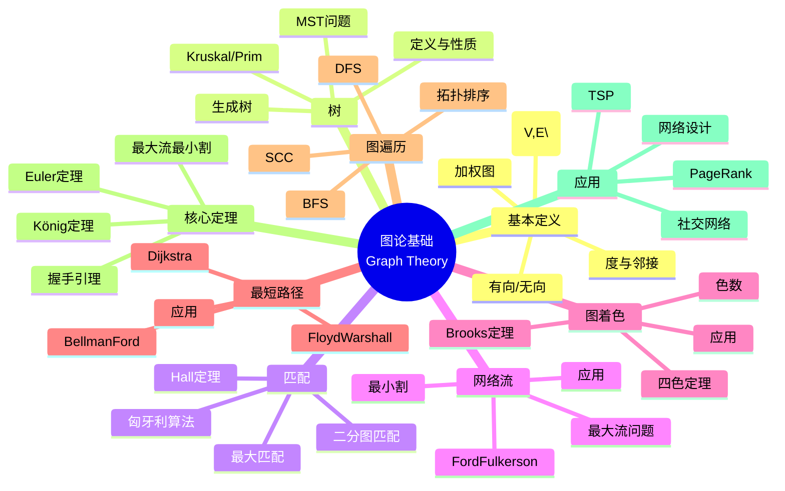

msc_primary: "00A99"
msc_secondary: ['00-XX']
---

# 图论基础 (Graph Theory Fundamentals)

## 中心概念精确定义

**图论（Graph Theory）**是研究图（由顶点和边组成的离散结构）的数学分支。图是描述对象间二元关系的强大工具，在计算机科学、运筹学、网络分析和生物信息学等领域有广泛应用。

**基本定义**：

**图** $G = (V, E)$ 由以下组成：

- **顶点集** $V$：对象的集合
- **边集** $E \subseteq V \times V$：对象间关系的集合

**图的类型**：

- **无向图**：边无序，$(u,v) = (v,u)$
- **有向图**：边有序，$\langle u,v \rangle \neq \langle v,u \rangle$
- **加权图**：边有权值 $w: E \to \mathbb{R}$
- **简单图**：无自环、无重边

**基本概念**：

- **邻接**：若 $(u,v) \in E$，称 $u$ 和 $v$ 相邻
- **度**：$\deg(v)$ = 与 $v$ 关联的边数
- **路径**：顶点序列 $v_0, v_1, ..., v_k$，相邻顶点间有边
- **连通**：任意两顶点间有路径

**历史**：1736年Euler解决哥尼斯堡七桥问题，标志图论诞生。

---

## 核心要素

### 1. 树 (Trees)

**定义**：无向连通无环图。

**等价刻画**：

- 连通且边数 = 顶点数 - 1
- 任意两点间有唯一路径
- 无环但加任意边产生环
- 连通但删任意边不连通

**生成树**：包含图中所有顶点的树。

**最小生成树（MST）**：加权图中权值和最小的生成树。

**经典算法**：

- **Kruskal算法**：按权值排序边，贪心选择不形成环的边，$O(E \log E)$
- **Prim算法**：从单点扩展，每次加最小权边，$O(E \log V)$（二叉堆）

**应用**：网络设计、聚类分析、近似算法。

### 2. 匹配 (Matching)

**定义**：边集 $M \subseteq E$，其中任意两边不共享顶点。

**类型**：

- **极大匹配**：不能再添加边的匹配
- **最大匹配**：边数最多的匹配
- **完美匹配**：覆盖所有顶点的匹配
- **带权最大匹配**：权和最大的匹配

**二分图匹配**：

- **二分图**：顶点可划分为两集合，边只在集合间
- **Hall定理**：二分图 $G=(X \cup Y, E)$ 有覆盖 $X$ 的匹配当且仅当对所有 $S \subseteq X$，$|N(S)| \geq |S|$

**算法**：

- **匈牙利算法**：$O(V^3)$ 求最大权匹配
- **增广路径算法**：$O(VE)$ 求最大基数匹配

**应用**：任务分配、婚姻问题、在线广告。

### 3. 网络流 (Network Flow)

**最大流问题**：在容量网络中求从源 $s$ 到汇 $t$ 的最大流量。

**形式化**：
$$\max \sum_{(s,v) \in E} f_{sv}$$
$$\text{s.t. } 0 \leq f_{uv} \leq c_{uv} \quad \text{(容量约束)}$$
$$\sum_{(u,v) \in E} f_{uv} = \sum_{(v,w) \in E} f_{vw} \quad \text{(守恒约束，除s,t外)}$$

**Ford-Fulkerson方法**：

- **增广路径**：沿路径增加流量
- **残差网络**：显示可增加流量的边
- **Edmonds-Karp**：用BFS找最短增广路径，$O(VE^2)$
- **Dinic算法**：分层网络阻塞流，$O(V^2E)$

**最大流最小割定理**：最大流值 = 最小割容量。

**应用**：运输网络、图像分割、网络可靠性。

### 4. 图着色 (Graph Coloring)

**顶点着色**：给顶点分配颜色，相邻顶点颜色不同。

**色数** $\chi(G)$：正常着色所需最少颜色数。

**基本结果**：

- **四色定理**：平面图 $\chi(G) \leq 4$
- **Brooks定理**：连通非完全非奇圈图，$\chi(G) \leq \Delta(G)$
- **贪心算法**：$\chi(G) \leq \Delta(G) + 1$

**边着色**：给边分配颜色，相邻边颜色不同。

- **Vizing定理**：$\Delta(G) \leq \chi'(G) \leq \Delta(G) + 1$

**应用**：调度问题、寄存器分配、频率分配。

### 5. 最短路径 (Shortest Paths)

**单源最短路径**：

- **Dijkstra算法**：非负权，$O((V+E)\log V)$
- **Bellman-Ford算法**：可处理负权，检测负环，$O(VE)$

**全对最短路径**：

- **Floyd-Warshall算法**：动态规划，$O(V^3)$
- **Johnson算法**：重加权 + Dijkstra，$O(V^2 \log V + VE)$

**关键路径**：最长路径问题（DAG上可解）。

**应用**：导航、网络路由、项目调度。

### 6. 图遍历与连通性

**深度优先搜索（DFS）**：

- 递归/栈实现
- 发现时间和完成时间
- 边分类：树边、后向边、前向边、交叉边
- 应用：拓扑排序、强连通分量

**广度优先搜索（BFS）**：

- 队列实现
- 层次遍历
- 应用：最短路径（无权图）、层次分析

**强连通分量（SCC）**：

- **Kosaraju算法**：两次DFS，$O(V+E)$
- **Tarjan算法**：一次DFS，$O(V+E)$

**双连通分量**：无关节点的最大子图。

---

## 性质与定理

### 定理1：握手引理

在任何无向图中：
$$\sum_{v \in V} \deg(v) = 2|E|$$

推论：奇度顶点数为偶数。

### 定理2：Euler回路判定

连通图有Euler回路当且仅当每个顶点度数为偶数。

连通图有Euler路径当且仅当恰有0或2个奇度顶点。

### 定理3：最大流最小割定理

网络中最大流值等于最小s-t割容量。

**证明思路**：

1. 任何流值 $\leq$ 任何割容量
2. 最大流对应的残差网络无增广路径
3. 残差网络定义了一个割达到流值

### 定理4：König定理

在二分图中，最大匹配的大小 = 最小顶点覆盖的大小。

等价表述：二分图的点覆盖数 = 匹配数。

### 定理5：四色定理

任何平面图可以用至多4种颜色正常顶点着色。

**历史**：1852年猜想，1976年Appel和Haken用计算机辅助证明。

---

## 典型例子

### 例子1：旅行商问题（TSP）

**问题**：访问所有城市一次并返回的最短路线。

**复杂度**：NP-hard。

**近似算法**：

- **MST启发式**：2-近似
- **Christofides算法**：1.5-近似（度量TSP）

**精确算法**：动态规划 $O(n^2 2^n)$，分支定界。

**应用**：物流、电路板钻孔、DNA测序。

### 例子2：PageRank算法

**问题**：网页重要性排序。

**模型**：随机冲浪者在网页间跳转。

**图模型**：网页 = 顶点，链接 = 有向边。

**数学**：求修正转移矩阵的平稳分布。

**计算**：幂迭代或代数方法。

### 例子3：社交网络分析

**图模型**：用户 = 顶点，关系 = 边。

**分析指标**：

- **度中心性**：连接数
- **介数中心性**：经过最短路径数
- **聚类系数**：邻居间连接密度
- **社区发现**：模块度优化、谱聚类

**算法**：

- Girvan-Newman（边介数）
- Louvain算法（模块度优化）
- 标签传播

---

## 关联概念

### 上游概念

- **离散数学**：集合、关系、组合
- **算法分析**：复杂度、数据结构
- **线性代数**：矩阵表示、特征值

### 下游概念

- **网络科学**：复杂网络、随机图
- **组合优化**：整数规划、近似算法
- **拓扑图论**：曲面嵌入、亏格
- **代数图论**：谱图理论
- **极值图论**：Turán理论、Ramsey理论

### 应用领域

- **计算机科学**：数据结构、编译器、网络协议
- **运筹学**：物流优化、资源分配
- **生物信息学**：系统发育、蛋白质网络
- **社会网络**：影响力分析、推荐系统
- **电路设计**：布线、VLSI设计
- **化学**：分子结构、反应网络

---

## Mermaid 思维导图

---

## 参考文献

1. **Euler, L.** (1736). "Solutio problematis ad geometriam situs pertinentis"
2. **Ford, L.R. & Fulkerson, D.R.** (1956). "Maximal Flow through a Network"
3. **Diestel, R.** (2017). *Graph Theory*, 5th Ed., Springer
4. **Cormen, T.H. et al.** (2022). *Introduction to Algorithms*, 4th Ed., MIT Press
5. **West, D.B.** (2001). *Introduction to Graph Theory*, 2nd Ed., Pearson
6. **Bondy, J.A. & Murty, U.S.R.** (2008). *Graph Theory*, Springer
7. **Easley, D. & Kleinberg, J.** (2010). *Networks, Crowds, and Markets*, Cambridge University Press
8. **MIT OpenCourseWare**: 6.042J Mathematics for Computer Science

---

*本文档是FormalMath项目的一部分，对齐MIT算法与离散数学课程体系。*
