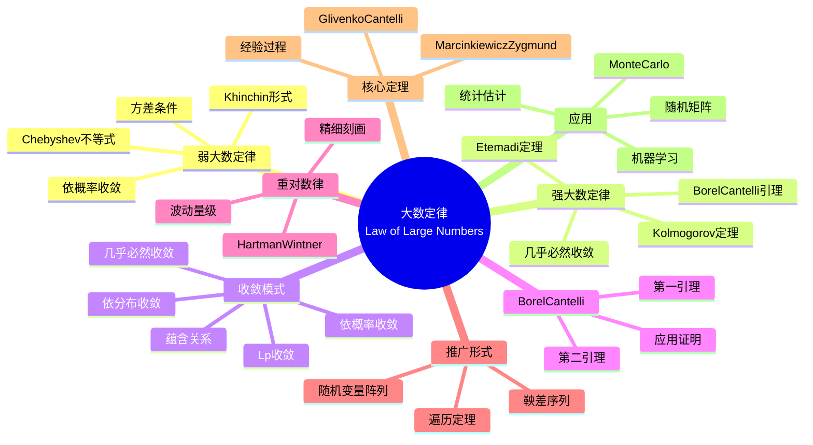

msc_primary: "00A99"
msc_secondary: ['00-XX']
---

# 大数定律 (Law of Large Numbers)

## 中心概念精确定义

**大数定律（Law of Large Numbers, LLN）**是概率论中最基本和最重要的定理之一，它阐明了在重复独立试验中，样本均值依某种意义收敛于理论期望值的规律。这一规律为频率解释概率、统计估计以及随机模拟提供了坚实的理论基础。

形式化地说，设 $\{X_n\}_{n=1}^{\infty}$ 是独立同分布（i.i.d.）的随机变量序列，$E[X_1] = \mu$，$S_n = X_1 + \cdots + X_n$。大数定律研究的是：

$$\bar{X}_n = \frac{S_n}{n} = \frac{X_1 + \cdots + X_n}{n}$$

的渐近行为。

**历史背景**：
- 1713年：Jacob Bernoulli首次证明二元情形的弱大数定律
- 1909年：Émile Borel证明强大数定律（Borel强大数定律）
- 1933年：Kolmogorov给出强大数定律的完整形式

---

## 核心要素

### 1. 弱大数定律 (Weak Law of Large Numbers, WLLN)

**定义**：若对任意 $\epsilon > 0$，
$$\lim_{n \to \infty} P\left(\left|\frac{S_n}{n} - \mu\right| \geq \epsilon\right) = 0$$

则称弱大数定律成立，记作 $\frac{S_n}{n} \xrightarrow{P} \mu$。

**经典条件**（Chebyshev形式）：设 $\{X_n\}$ i.i.d.，$E[X_1] = \mu$，$\text{Var}(X_1) = \sigma^2 < \infty$，则 WLLN 成立。

**证明要点**：
$$P\left(\left|\frac{S_n}{n} - \mu\right| \geq \epsilon\right) \leq \frac{\text{Var}(S_n/n)}{\epsilon^2} = \frac{\sigma^2}{n\epsilon^2} \to 0$$

**更弱条件**（Khinchin WLLN）：仅需 $E[|X_1|] < \infty$。

### 2. 强大数定律 (Strong Law of Large Numbers, SLLN)

**定义**：若
$$P\left(\lim_{n \to \infty} \frac{S_n}{n} = \mu\right) = 1$$
则称强大数定律成立，记作 $\frac{S_n}{n} \xrightarrow{a.s.} \mu$。

**Kolmogorov SLLN**：设 $\{X_n\}$ i.i.d.，则
$$\frac{S_n}{n} \xrightarrow{a.s.} \mu \quad \text{当且仅当} \quad E[|X_1|] < \infty$$

**证明工具**：
- Borel-Cantelli引理
- Kolmogorov三级数定理
- Kronecker引理

**收敛关系**：SLLN $\Rightarrow$ WLLN（但反之不成立）

### 3. 收敛模式 (Modes of Convergence)

大数定律涉及多种随机变量序列的收敛方式：

| 收敛类型 | 符号 | 定义 | 蕴含关系 |
|---------|------|------|---------|
| 几乎必然收敛 | $\xrightarrow{a.s.}$ | $P(\lim X_n = X) = 1$ | 最强 |
| 依概率收敛 | $\xrightarrow{P}$ | $P(|X_n - X| > \epsilon) \to 0$ | ↓ |
| $L^p$收敛 | $\xrightarrow{L^p}$ | $E[|X_n - X|^p] \to 0$ | ↓ |
| 依分布收敛 | $\xrightarrow{d}$ | $F_{X_n}(x) \to F_X(x)$ | 最弱 |

**重要关系**：
- $X_n \xrightarrow{a.s.} X \Rightarrow X_n \xrightarrow{P} X$
- $X_n \xrightarrow{L^p} X \Rightarrow X_n \xrightarrow{P} X$
- $X_n \xrightarrow{P} X \Rightarrow$ 存在子列 $X_{n_k} \xrightarrow{a.s.} X$

### 4. Borel-Cantelli引理

**第一Borel-Cantelli引理**：若 $\sum_{n=1}^{\infty} P(A_n) < \infty$，则 $P(A_n \text{ i.o.}) = 0$。

**第二Borel-Cantelli引理**：若 $\{A_n\}$ 独立且 $\sum_{n=1}^{\infty} P(A_n) = \infty$，则 $P(A_n \text{ i.o.}) = 1$。

其中 $A_n \text{ i.o.}$（infinitely often）$= \bigcap_{n=1}^{\infty} \bigcup_{m=n}^{\infty} A_m$。

**应用**：证明SLLN、研究极端值理论、随机级数收敛性。

### 5. 重对数律 (Law of the Iterated Logarithm, LIL)

大数定律的精细刻画：设 $\{X_n\}$ i.i.d.，$E[X_1] = 0$，$\text{Var}(X_1) = \sigma^2$，则
$$\limsup_{n \to \infty} \frac{S_n}{\sqrt{2n \log\log n}} = \sigma \quad \text{a.s.}$$
$$\liminf_{n \to \infty} \frac{S_n}{\sqrt{2n \log\log n}} = -\sigma \quad \text{a.s.}$$

**意义**：给出了 $S_n$ 波动的精确量级，填补了大数定律和中心极限定理之间的空白。

### 6. 一般化形式

**非独立情形**：
- 平稳遍历序列的遍历定理（Birkhoff遍历定理）
- 鞅差序列的大数定律
- 混合序列的大数定律

**随机变量阵列**：
- 二项阵列的Poisson收敛
- Lindeberg-Feller定理（CLT推广）

---

## 性质与定理

### 定理1：Chebyshev弱大数定律

设 $\{X_n\}$ 是两两不相关的随机变量序列，$E[X_n] = \mu_n$，$\text{Var}(X_n) = \sigma_n^2$。若
$$\frac{1}{n^2}\sum_{i=1}^n \sigma_i^2 \to 0$$
则
$$\frac{1}{n}\sum_{i=1}^n (X_i - \mu_i) \xrightarrow{P} 0$$

### 定理2：Kolmogorov强大数定律

设 $\{X_n\}$ i.i.d.，则以下等价：
1. $E[|X_1|] < \infty$

2. $\frac{S_n}{n} \xrightarrow{a.s.} E[X_1]$
3. $E[|X_1|] = \infty \Rightarrow \limsup \frac{|S_n|}{n} = +\infty$ a.s.

### 定理3：Marcinkiewicz-Zygmund SLLN

设 $\{X_n\}$ i.i.d.，$0 < p < 2$，则以下等价：
1. $E[|X_1|^p] < \infty$

2. $\frac{S_n - n\mu}{n^{1/p}} \xrightarrow{a.s.} 0$，其中 $\mu = E[X_1]$（当 $p \geq 1$）或 $\mu = 0$（当 $p < 1$）

特别地，当 $p = 1$ 时为通常的SLLN。

### 定理4：Etemadi强大数定律

设 $\{X_n\}$ 是同分布的（不必独立），两两独立，$E[|X_1|] < \infty$，则

$$\frac{S_n}{n} \xrightarrow{a.s.} E[X_1]$$

**意义**：在很弱的独立性假设下仍成立。

### 定理5：Glivenko-Cantelli定理（经验分布函数的一致性）

设 $\{X_n\}$ i.i.d.，分布函数为 $F$，经验分布函数为
$$F_n(x) = \frac{1}{n}\sum_{i=1}^n 1_{\{X_i \leq x\}}$$

则
$$\sup_{x \in \mathbb{R}} |F_n(x) - F(x)| \xrightarrow{a.s.} 0$$

这是数理统计中经验过程理论的基础。

---

## 典型例子

### 例子1：Monte Carlo积分

**问题**：计算 $I = \int_0^1 f(x) dx$，其中 $f$ 复杂难以解析积分。

**Monte Carlo方法**：
1. 生成 $U_1, U_2, ..., U_n$ i.i.d. $\sim \text{Uniform}(0,1)$
2. 估计 $\hat{I}_n = \frac{1}{n}\sum_{i=1}^n f(U_i)$

**理论保证**：由SLLN，$\hat{I}_n \xrightarrow{a.s.} E[f(U)] = I$。

**误差分析**：由CLT，$\sqrt{n}(\hat{I}_n - I) \xrightarrow{d} N(0, \sigma^2)$，其中 $\sigma^2 = \text{Var}(f(U))$。

**应用**：高维积分、金融衍生品定价、物理模拟。

### 例子2：经验频率的频率解释

**Bernoulli试验**：设 $\{X_n\}$ i.i.d. $\sim \text{Bernoulli}(p)$，$S_n = \sum_{i=1}^n X_i$ 为 $n$ 次试验中的成功次数。

**频率解释**：由SLLN
$$\frac{S_n}{n} \xrightarrow{a.s.} p$$

这为概率的频率解释提供了数学基础：事件的概率是其长期相对频率的极限。

**Bernoulli原始证明**（1713）：使用二项分布和 Stirling 公式，证明了对二元情形的 WLLN。

### 例子3：随机矩阵的特征值分布

**Wigner半圆律**：设 $W_n$ 是 $n \times n$ Wigner矩阵（对称，上三角元i.i.d.，均值为0，方差为1），则经验谱分布
$$\mu_n = \frac{1}{n}\sum_{i=1}^n \delta_{\lambda_i/\sqrt{n}}$$

依概率收敛于半圆分布：
$$\mu(dx) = \frac{1}{2\pi}\sqrt{4-x^2} \cdot 1_{|x| \leq 2} dx$$

这是大数定律在随机矩阵理论中的深刻应用。

---

## 关联概念

### 上游概念
- **概率测度**：期望、方差、收敛性
- **条件概率**：条件期望、鞅
- **实分析**：测度论、积分论

### 下游概念
- **中心极限定理**：渐近正态性
- **经验过程理论**：Glivenko-Cantelli类、Donsker定理
- **统计学习理论**：一致大数定律、泛化界
- **遍历理论**：Birkhoff遍历定理、动力系统
- **随机矩阵理论**：随机矩阵的极限谱分布

### 应用领域
- **统计学**：样本均值的一致性、最大似然估计的一致性
- **机器学习**：随机梯度下降的收敛性
- **金融数学**：风险度量的估计、投资组合优化
- **计算物理**：Monte Carlo模拟
- **信息论**：信源编码、数据压缩

---

## Mermaid 思维导图

---

## 参考文献

1. **Bernoulli, J.** (1713). *Ars Conjectandi*
2. **Kolmogorov, A.N.** (1933). *Foundations of the Theory of Probability*
3. **Borel, É.** (1909). "Les probabilités dénombrables et leurs applications arithmétiques"
4. **Durrett, R.** (2019). *Probability: Theory and Examples*, 5th Ed.
5. **Chung, K.L.** (2001). *A Course in Probability Theory*, 3rd Ed., Academic Press
6. **van der Vaart, A.W.** (1998). *Asymptotic Statistics*, Cambridge University Press
7. **MIT OpenCourseWare**: 18.175 Theory of Probability

---

*本文档是FormalMath项目的一部分，对齐MIT概率统计课程体系。*
