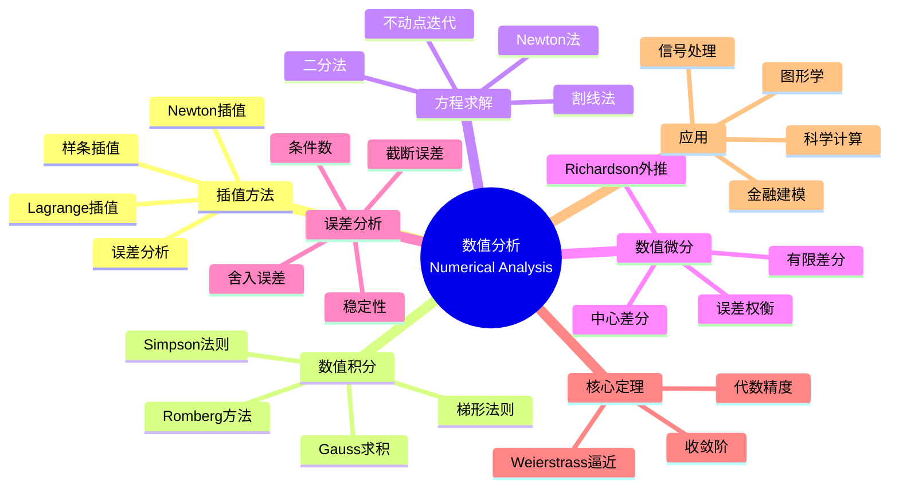

msc_primary: "00A99"
msc_secondary: ['00-XX']
---

# 数值分析 (Numerical Analysis)

## 中心概念精确定义

**数值分析（Numerical Analysis）**是研究用数值方法近似求解数学问题的学科，涵盖连续数学问题（如微分、积分、方程求解）的离散化算法设计与分析。核心关注算法的**收敛性**、**稳定性**和**计算效率**。

**基本问题类型**：
- **方程求解**：$f(x) = 0$
- **线性系统**：$Ax = b$
- **函数逼近**：插值、拟合
- **微积分**：数值微分、数值积分
- **微分方程**：ODE/PDE数值解

**核心指标**：
- **精度**：误差大小
- **收敛速度**：误差随计算量减小速率
- **稳定性**：对扰动的敏感度
- **计算复杂度**：时间和空间资源

---

## 核心要素

### 1. 插值方法 (Interpolation)

**问题**：给定数据点 $(x_i, y_i)$，$i=0,...,n$，求函数 $p(x)$ 使得 $p(x_i) = y_i$。

**Lagrange插值**：
$$p_n(x) = \sum_{i=0}^n y_i L_i(x), \quad L_i(x) = \prod_{j \neq i} \frac{x - x_j}{x_i - x_j}$$

**Newton插值**（差商形式）：
$$p_n(x) = f[x_0] + f[x_0,x_1](x-x_0) + \cdots + f[x_0,...,x_n](x-x_0)\cdots(x-x_{n-1})$$

**误差分析**：
$$f(x) - p_n(x) = \frac{f^{(n+1)}(\xi)}{(n+1)!}\prod_{i=0}^n (x - x_i)$$

**Runge现象**：等距节点高次插值可能发散，需用Chebyshev节点。

### 2. 样条插值 (Spline Interpolation)

**三次样条**：分段三次多项式，具有连续一阶和二阶导数。

**条件**：
- 插值条件：$S(x_i) = y_i$
- 连续性：$S \in C^2[a,b]$
- 边界条件（选一）：
  - 自然样条：$S''(x_0) = S''(x_n) = 0$
  - 固定边界：给定 $S'(x_0), S'(x_n)$
  - 周期边界

**优势**：避免Runge现象，计算稳定。

### 3. 数值积分 (Numerical Integration)

**Newton-Cotes公式**：基于等距节点
- **梯形法则**：$\int_a^b f(x)dx \approx \frac{b-a}{2}[f(a) + f(b)]$，误差 $O(h^3)$
- **Simpson法则**：$\int_a^b f(x)dx \approx \frac{b-a}{6}[f(a) + 4f(\frac{a+b}{2}) + f(b)]$，误差 $O(h^5)$

**复化公式**：将区间细分，应用基本公式
- 复化梯形：误差 $O(h^2)$
- 复化Simpson：误差 $O(h^4)$

**Gauss求积**：最优节点选择，$n$ 点公式达到 $2n-1$ 次代数精度。

**Romberg积分**：Richardson外推加速梯形公式。

**自适应积分**：根据局部误差自动调整步长。

### 4. 方程求解方法

**二分法**：
- 基于介值定理
- 收敛速度：线性，每次迭代误差减半
- 优点：简单、稳健
- 缺点：收敛慢、不能求重根

**Newton法**：
$$x_{n+1} = x_n - \frac{f(x_n)}{f'(x_n)}$$

- 收敛速度：局部二次收敛
- 需要计算导数
- 对初值敏感

**割线法**：
$$x_{n+1} = x_n - f(x_n)\frac{x_n - x_{n-1}}{f(x_n) - f(x_{n-1})}$$

- 超线性收敛（阶约1.618）
- 不需要计算导数

**不动点迭代**：$x_{n+1} = g(x_n)$，收敛要求 $|g'(x^*)| < 1$。

### 5. 数值微分

**有限差分公式**：
- 向前差分：$f'(x) \approx \frac{f(x+h) - f(x)}{h}$
- 向后差分：$f'(x) \approx \frac{f(x) - f(x-h)}{h}$
- 中心差分：$f'(x) \approx \frac{f(x+h) - f(x-h)}{2h}$，误差 $O(h^2)$

**高阶导数**：
$$f''(x) \approx \frac{f(x+h) - 2f(x) + f(x-h)}{h^2}$$

**Richardson外推**：提高精度。

**挑战**：截断误差与舍入误差的权衡（$h$ 太小舍入误差增大）。

### 6. 误差分析

**误差来源**：
- **截断误差**：方法本身的近似
- **舍入误差**：有限精度算术
- **传播误差**：输入数据误差

**条件数**：衡量问题对扰动的敏感度
$$\kappa = \left|\frac{\text{相对输出误差}}{\text{相对输入误差}}\right|$$

**稳定性**：算法不应放大误差。
- 前向稳定：计算解接近精确解
- 后向稳定：计算解是邻近问题的精确解

---

## 性质与定理

### 定理1：Weierstrass逼近定理

对任意连续函数 $f \in C[a,b]$ 和 $\epsilon > 0$，存在多项式 $p$ 使得
$$\|f - p\|_\infty < \epsilon$$

### 定理2：插值多项式唯一性

给定 $n+1$ 个不同节点，存在唯一的次数不超过 $n$ 的多项式通过这些点。

### 定理3：Newton法局部收敛

设 $f \in C^2$，$x^*$ 是单根，则从充分接近 $x^*$ 的初值出发，Newton法二次收敛：
$$|e_{n+1}| \leq C|e_n|^2$$

### 定理4：Gauss求积最优性

$n$ 点Gauss求积公式具有 $2n-1$ 次代数精度，这是最优的。

### 定理5：收敛阶与效率指数

若 $|e_{n+1}| \approx C|e_n|^p$，则收敛阶为 $p$，效率指数为 $p^{1/k}$（$k$ 是每步函数计算次数）。

---

## 典型例子

### 例子1：计算圆周率

**Archimedes方法**：用多边形逼近圆

**数值积分法**：
$$\pi = 4\int_0^1 \sqrt{1-x^2}dx$$

用Simpson法则或Gauss求积计算。

**Machin公式**：
$$\frac{\pi}{4} = 4\arctan\frac{1}{5} - \arctan\frac{1}{239}$$

用Taylor级数计算反正切。

### 例子2：非线性方程求解

**Kepler方程**：$M = E - e\sin E$，求偏近点角 $E$。

用Newton法：
$$E_{n+1} = E_n - \frac{E_n - e\sin E_n - M}{1 - e\cos E_n}$$

在天体力学中广泛应用。

### 例子3：数值积分应用

**计算正态分布概率**：
$$P(a < Z < b) = \frac{1}{\sqrt{2\pi}}\int_a^b e^{-x^2/2}dx$$

无解析解，需数值积分。

**Gauss-Hermite求积**特别适合这种积分。

---

## 关联概念

### 上游概念
- **数学分析**：极限、连续性、微分、积分
- **线性代数**：矩阵运算、特征值
- **逼近理论**：最佳逼近、正交多项式

### 下游概念
- **数值线性代数**：矩阵分解、迭代法
- **ODE/PDE数值解**：有限差分、有限元
- **优化算法**：梯度法、牛顿法
- **计算几何**：曲线曲面造型

### 应用领域
- **科学与工程计算**：物理模拟、工程设计
- **金融工程**：衍生品定价、风险计算
- **计算机图形学**：曲线曲面、动画
- **信号处理**：滤波、频谱分析
- **数据科学**：插值、平滑、特征提取

---

## Mermaid 思维导图

---

## 参考文献

1. **Burden, R.L. & Faires, J.D.** (2010). *Numerical Analysis*, 9th Ed., Brooks/Cole
2. **Atkinson, K.E.** (1989). *An Introduction to Numerical Analysis*, 2nd Ed., Wiley
3. **Trefethen, L.N.** (2019). *Approximation Theory and Approximation Practice*, SIAM
4. **Gautschi, W.** (2012). *Numerical Analysis*, 2nd Ed., Birkhäuser
5. **Quarteroni, A., Sacco, R., & Saleri, F.** (2007). *Numerical Mathematics*, 2nd Ed., Springer
6. **MIT OpenCourseWare**: 18.330 Introduction to Numerical Analysis

---

*本文档是FormalMath项目的一部分，对齐MIT数值分析课程体系。*
