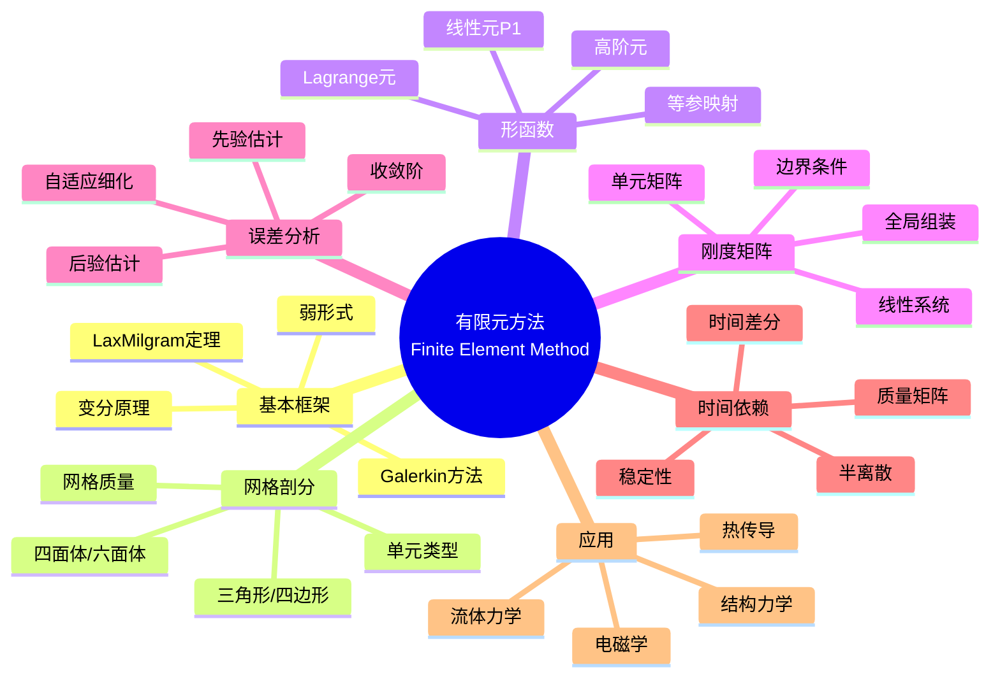

# 有限元方法 (Finite Element Method)

## 中心概念精确定义

**有限元方法（Finite Element Method, FEM）**是求解偏微分方程（PDE）的强大数值技术，通过将连续问题离散化为有限维代数问题来近似求解。它特别适合处理复杂几何形状和非均匀材料问题，是工程计算和物理模拟的主流方法。

**基本框架**：
1. **变分形式**：将PDE转化为弱形式或变分问题
2. **区域离散**：将求解域剖分为有限单元
3. **函数逼近**：在每个单元上用简单函数（通常是多项式）逼近解
4. **代数方程**：组装全局刚度矩阵，求解线性系统

**模型问题（Poisson方程）**：
$$-\nabla^2 u = f \quad \text{in } \Omega$$
$$u = g \quad \text{on } \partial\Omega_D$$
$$\frac{\partial u}{\partial n} = h \quad \text{on } \partial\Omega_N$$

**历史发展**：
- 1943年：Courant提出分片线性逼近思想
- 1956年：Turner等用于结构分析
- 1960年代：Clough正式命名"有限元方法"
- 至今：发展为处理复杂物理现象的多物理场工具

---

## 核心要素

### 1. 弱形式与变分原理 (Weak Form & Variational Principle)

**强形式**：要求解在经典意义下满足PDE（需要高阶光滑性）。

**弱形式**：通过积分降低光滑性要求。

**推导步骤**（以Poisson方程为例）：
1. 乘以测试函数 $v$（在边界上为零）
2. 在区域上积分：$-\int_\Omega v \nabla^2 u d\Omega = \int_\Omega vf d\Omega$
3. 分部积分：$\int_\Omega \nabla v \cdot \nabla u d\Omega = \int_\Omega vf d\Omega + \int_{\partial\Omega_N} vh ds$

**抽象形式**：求 $u \in V$ 使得
$$a(u, v) = L(v), \quad \forall v \in V$$

其中：
- $a(\cdot, \cdot)$：双线性形式（能量内积）
- $L(\cdot)$：线性泛函
- $V$：Sobolev空间 $H^1(\Omega)$

**Lax-Milgram定理**：保证弱解的存在唯一性。

### 2. 网格剖分与单元类型 (Meshing & Element Types)

**一维单元**：线段，节点在端点

**二维单元**：
- **三角形单元**：灵活适应复杂边界
- **四边形单元**：适合规则区域，高精度

**三维单元**：
- **四面体单元**：最灵活
- **六面体单元**：规则区域效率高
- **棱柱、金字塔**：过渡区域

**网格质量指标**：
- 单元长宽比（Aspect ratio）
- 最小角
- Jacobian行列式

**自适应网格细化**：根据误差估计局部加密网格（h-细化）或提高多项式次数（p-细化）。

### 3. 形函数与逼近 (Shape Functions & Approximation)

**局部逼近**：在单元 $K$ 上
$$u_h(x) = \sum_{i=1}^{n_K} u_i N_i(x)$$

其中 $N_i$ 是形函数，满足 $N_i(x_j) = \delta_{ij}$。

**Lagrange单元**（以三角形P1为例）：
$$N_1 = \frac{a_1 + b_1x + c_1y}{2A}, \quad N_2 = ..., \quad N_3 = ...$$

其中 $A$ 是三角形面积。

**高阶单元**：
- P2（二次）：边中点增加节点
- P3（三次）：更多内部节点

**等参元**：用相同形函数表示几何映射和场变量逼近。

### 4. 刚度矩阵组装 (Assembly of Stiffness Matrix)

**单元刚度矩阵**：
$$A^K_{ij} = \int_K \nabla N_i \cdot \nabla N_j dK$$

**单元载荷向量**：
$$b^K_i = \int_K N_i f dK$$

**全局组装**：
$$A = \sum_K A^K, \quad b = \sum_K b^K$$

**边界条件处理**：
- **Dirichlet**：直接代入已知值，修改矩阵
- **Neumann**：自然边界条件，已包含在弱形式中
- **Robin**：混合边界条件

### 5. 误差分析与收敛性 (Error Analysis & Convergence)

**误差分解**：
$$\|u - u_h\| \leq \|u - \Pi_h u\| + \|\Pi_h u - u_h\|$$

其中 $\Pi_h u$ 是插值逼近。

**先验误差估计**（Poisson方程，P1元）：
$$\|u - u_h\|_{H^1} \leq Ch|u|_{H^2}$$
$$\|u - u_h\|_{L^2} \leq Ch^2|u|_{H^2}$$

**收敛阶**：
- 能量范数：$O(h^k)$，$k$ 是多项式次数
- $L^2$范数：$O(h^{k+1})$（ Aubin-Nitsche技巧）

**后验误差估计**：基于计算解估计误差，指导自适应细化。

### 6. 时间依赖问题

**抛物型方程**（热方程）：
$$\frac{\partial u}{\partial t} - \nabla^2 u = f$$

**半离散**：空间用FEM离散，得到ODE系统
$$M\frac{d\mathbf{u}}{dt} + A\mathbf{u} = \mathbf{b}$$

其中 $M$ 是质量矩阵。

**全离散**：时间用差分格式
- **向前Euler**：一阶显式
- **向后Euler**：一阶隐式，无条件稳定
- **Crank-Nicolson**：二阶精度，无条件稳定

---

## 性质与定理

### 定理1：Lax-Milgram定理

设 $a(\cdot, \cdot)$ 是有界、强制的双线性形式，$L$ 是有界线性泛函，则变分问题存在唯一解，且满足稳定性估计：
$$\|u\|_V \leq \frac{1}{\alpha}\|L\|_{V'}$$

### 定理2：Céa引理

Galerkin逼近的拟最优性：
$$\|u - u_h\|_V \leq \frac{M}{\alpha} \inf_{v_h \in V_h} \|u - v_h\|_V$$

即离散解在子空间 $V_h$ 中最佳逼近常数倍范围内。

### 定理3：插值误差估计

对于Lagrange插值 $\Pi_h$ 和光滑函数 $u$：
$$\|u - \Pi_h u\|_{H^m(K)} \leq Ch^{k+1-m}|u|_{H^{k+1}(K)}$$

其中 $k$ 是多项式次数。

### 定理4：先验误差估计

对于Poisson方程的P1有限元解：
$$\|u - u_h\|_{H^1(\Omega)} \leq Ch|u|_{H^2(\Omega)}$$

对于凸区域：
$$\|u - u_h\|_{L^2(\Omega)} \leq Ch^2|u|_{H^2(\Omega)}$$

### 定理5： inf-sup条件（混合问题）

对于Stokes等 saddle point 问题，需要离散 inf-sup 条件（Ladyzhenskaya-Babuška-Brezzi条件）保证稳定性：
$$\inf_{q_h} \sup_{v_h} \frac{b(v_h, q_h)}{\|v_h\|_V \|q_h\|_Q} \geq \beta > 0$$

---

## 典型例子

### 例子1：一维杆件拉伸

**问题**：杆件 $[0,L]$，弹性模量 $E$，截面积 $A$，轴向力 $f$，求位移 $u$。

**PDE**：
$$-\frac{d}{dx}\left(EA\frac{du}{dx}\right) = f$$

**弱形式**：求 $u \in H^1$，$u(0) = 0$，使得
$$\int_0^L EA\frac{du}{dx}\frac{dv}{dx}dx = \int_0^L vf dx + v(L)F$$

**FEM求解**：
1. 剖分 $[0,L]$ 为单元
2. P1形函数
3. 组装刚度矩阵（三对角）
4. 求解线性系统

### 例子2：二维热传导

**问题**：平板 $\Omega$ 上的稳态温度分布，边界有热源和热沉。

**PDE**：
$$-\nabla \cdot (k \nabla T) = Q$$

**FEM求解**：
1. 三角形网格剖分
2. P1或P2单元
3. 处理变系数 $k(x,y)$
4. 自适应网格（温度梯度大处加密）

### 例子3：结构力学分析

**线弹性问题**：
$$-\nabla \cdot \sigma = f$$
$$\sigma = C : \varepsilon, \quad \varepsilon = \frac{1}{2}(\nabla u + \nabla u^T)$$

**FEM实现**：
- 向量值问题（位移 $u$ 是向量）
- 应变-位移矩阵 $B$
- 应力-应变矩阵 $D$（本构关系）
- 刚度矩阵：$K = \int B^T D B d\Omega$

**商业软件**：ANSYS, ABAQUS, COMSOL 的核心求解器。

---

## 关联概念

### 上游概念
- **泛函分析**：Sobolev空间、弱导数、迹定理
- **偏微分方程**：椭圆、抛物、双曲型方程
- **数值分析**：线性代数、数值积分
- **变分法**：Euler-Lagrange方程

### 下游概念
- **高阶FEM**：谱元、hp-FEM
- **间断Galerkin方法**：处理间断解
- **等几何分析**：CAD与FEM结合
- **多尺度方法**：处理材料异质性
- **模型降阶**：快速求解参数化问题

### 应用领域
- **结构工程**：应力分析、振动模态
- **流体力学**：CFD、Navier-Stokes求解
- **热传导**：传热分析、热应力
- **电磁学**：电磁场分布、天线设计
- **地质力学**：油藏模拟、地震波传播
- **生物医学**：生物力学、血流分析

---

## Mermaid 思维导图

---

## 参考文献

1. **Courant, R.** (1943). "Variational Methods for the Solution of Problems of Equilibrium and Vibrations"
2. **Clough, R.W.** (1960). "The Finite Element Method in Plane Stress Analysis"
3. **Ciarlet, P.G.** (2002). *The Finite Element Method for Elliptic Problems*, SIAM
4. **Brenner, S.C. & Scott, L.R.** (2008). *The Mathematical Theory of Finite Element Methods*, 3rd Ed., Springer
5. **Hughes, T.J.R.** (2012). *The Finite Element Method: Linear Static and Dynamic Finite Element Analysis*, Dover
6. **Ern, A. & Guermond, J.L.** (2021). *Finite Elements II: Galerkin Approximation, Elliptic and Mixed PDEs*, Springer
7. **MIT OpenCourseWare**: 16.920J Numerical Methods for Partial Differential Equations

---

*本文档是FormalMath项目的一部分，对齐MIT计算科学与工程课程体系。*
