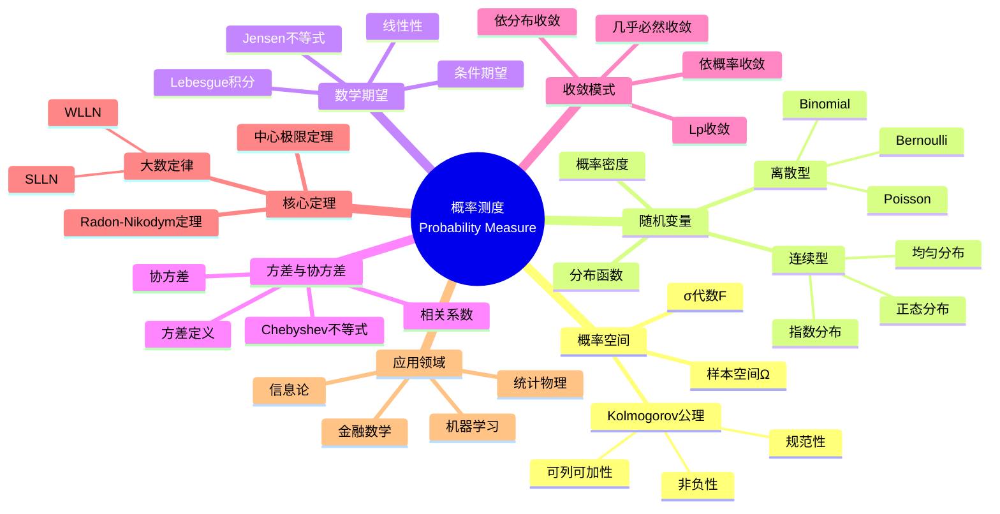

msc_primary: "00A99"
msc_secondary: ['00-XX']
---

# 概率测度 (Probability Measure)

## 中心概念精确定义

**概率测度**是定义在可测空间 $(\Omega, \mathcal{F})$ 上的集函数 $P: \mathcal{F} \to [0,1]$，满足以下三条公理（Kolmogorov公理，1933）：

1. **非负性**：$\forall A \in \mathcal{F}, P(A) \geq 0$
2. **规范性**：$P(\Omega) = 1$
3. **可列可加性**：对任意互不相容的事件序列 $\{A_n\}_{n=1}^{\infty}$，有
   $$P\left(\bigcup_{n=1}^{\infty} A_n\right) = \sum_{n=1}^{\infty} P(A_n)$$

概率测度为随机现象提供了严格的数学基础，使得我们可以对不确定性进行量化分析。它是现代概率论的基石，由苏联数学家Andrey Kolmogorov在其1933年的著作《概率论基础》中首次公理化。

---

## 核心要素

### 1. 概率空间 (Probability Space)

概率空间是概率论的基本框架，由三元组 $(\Omega, \mathcal{F}, P)$ 组成：

- **样本空间 $\Omega$**：所有可能结果的集合
- **$\sigma$-代数 $\mathcal{F}$**：可测事件的集合，满足：
  - $\Omega \in \mathcal{F}$
  - 若 $A \in \mathcal{F}$，则 $A^c \in \mathcal{F}$
  - 若 $\{A_n\} \subset \mathcal{F}$，则 $\bigcup_{n=1}^{\infty} A_n \in \mathcal{F}$
- **概率测度 $P$**：满足Kolmogorov公理的集函数

**典型概率空间例子**：

- 离散空间：掷硬币 $\Omega = \{H, T\}$
- 连续空间：$[0,1]$ 上的均匀分布
- 无限序列：Bernoulli试验的无穷序列

### 2. 随机变量 (Random Variable)

随机变量是定义在概率空间上的可测函数 $X: \Omega \to \mathbb{R}$，满足：
$$\forall B \in \mathcal{B}(\mathbb{R}), \quad X^{-1}(B) \in \mathcal{F}$$

**分类**：

- **离散型**：取值可数，如Poisson分布、二项分布
- **连续型**：有概率密度函数，如正态分布、指数分布
- **混合型**：既有离散部分又有连续部分

**关键概念**：

- 分布函数：$F_X(x) = P(X \leq x)$
- 概率密度：$f_X(x) = \frac{d}{dx}F_X(x)$（若存在）
- 生成 $\sigma$-代数：$\sigma(X) = \{X^{-1}(B) : B \in \mathcal{B}(\mathbb{R})\}$

### 3. 数学期望 (Expectation)

随机变量 $X$ 的期望定义为其关于概率测度的Lebesgue积分：

$$E[X] = \int_{\Omega} X(\omega) dP(\omega)$$

**计算方法**：

- 离散型：$E[X] = \sum_{i} x_i P(X = x_i)$
- 连续型：$E[X] = \int_{-\infty}^{\infty} x f_X(x) dx$

**期望的性质**：

- 线性性：$E[aX + bY] = aE[X] + bE[Y]$
- 单调性：若 $X \leq Y$ a.s.，则 $E[X] \leq E[Y]$
- Jensen不等式：若 $\varphi$ 凸，则 $\varphi(E[X]) \leq E[\varphi(X)]$

### 4. 方差与协方差 (Variance and Covariance)

**方差**：衡量随机变量偏离期望的程度
$$\text{Var}(X) = E[(X - E[X])^2] = E[X^2] - (E[X])^2$$

**协方差**：衡量两个随机变量的线性相关性
$$\text{Cov}(X,Y) = E[(X - E[X])(Y - E[Y])] = E[XY] - E[X]E[Y]$$

**相关系数**：
$$\rho_{X,Y} = \frac{\text{Cov}(X,Y)}{\sqrt{\text{Var}(X)\text{Var}(Y)}} \in [-1, 1]$$

### 5. 条件概率 (Conditional Probability)

在事件 $B$ 发生的条件下，事件 $A$ 发生的概率：
$$P(A|B) = \frac{P(A \cap B)}{P(B)}, \quad P(B) > 0$$

**Bayes定理**：
$$P(A|B) = \frac{P(B|A)P(A)}{P(B)}$$

**全概率公式**：若 $\{B_i\}$ 是 $\Omega$ 的划分，则
$$P(A) = \sum_{i} P(A|B_i)P(B_i)$$

### 6. 收敛模式 (Convergence Modes)

随机变量序列的不同收敛方式：

| 收敛类型 | 符号 | 定义 |
|---------|------|------|
| 几乎必然收敛 | $X_n \xrightarrow{a.s.} X$ | $P(\lim_{n\to\infty} X_n = X) = 1$ |
| 依概率收敛 | $X_n \xrightarrow{P} X$ | $\forall \epsilon > 0, P(|X_n - X| > \epsilon) \to 0$ |
| $L^p$收敛 | $X_n \xrightarrow{L^p} X$ | $E[|X_n - X|^p] \to 0$ |
| 依分布收敛 | $X_n \xrightarrow{d} X$ | $F_{X_n}(x) \to F_X(x)$ 在连续点 |

---

## 性质与定理

### 定理1：概率测度的基本性质

对于任意概率空间 $(\Omega, \mathcal{F}, P)$：

1. $P(\emptyset) = 0$
2. $P(A^c) = 1 - P(A)$
3. 单调性：若 $A \subseteq B$，则 $P(A) \leq P(B)$
4. 容斥原理：$P(A \cup B) = P(A) + P(B) - P(A \cap B)$
5. 上连续性：若 $A_n \downarrow A$，则 $P(A_n) \downarrow P(A)$
6. 下连续性：若 $A_n \uparrow A$，则 $P(A_n) \uparrow P(A)$

### 定理2：Chebyshev不等式

对于任意随机变量 $X$ 具有有限期望 $\mu$ 和方差 $\sigma^2$，以及任意 $k > 0$：
$$P(|X - \mu| \geq k\sigma) \leq \frac{1}{k^2}$$

更一般形式：若 $\varphi$ 是正值递增函数，则
$$P(|X| \geq a) \leq \frac{E[\varphi(|X|)]}{\varphi(a)}$$

### 定理3：大数定律

**弱大数定律（WLLN）**：设 $\{X_n\}$ i.i.d.，$E[X_1] = \mu$，则
$$\frac{S_n}{n} = \frac{X_1 + \cdots + X_n}{n} \xrightarrow{P} \mu$$

**强大数定律（SLLN）**：在上述条件下
$$\frac{S_n}{n} \xrightarrow{a.s.} \mu$$

### 定理4：中心极限定理（CLT）

设 $\{X_n\}$ i.i.d.，$E[X_1] = \mu$，$\text{Var}(X_1) = \sigma^2 < \infty$，则
$$\frac{S_n - n\mu}{\sigma\sqrt{n}} \xrightarrow{d} N(0,1)$$

等价表述：
$$\frac{\bar{X}_n - \mu}{\sigma/\sqrt{n}} \xrightarrow{d} N(0,1)$$

### 定理5：Radon-Nikodym定理

若 $Q \ll P$（$Q$ 关于 $P$ 绝对连续），则存在唯一（a.s.）的非负可测函数 $f$，使得
$$Q(A) = \int_A f dP, \quad \forall A \in \mathcal{F}$$

记 $f = \frac{dQ}{dP}$ 为Radon-Nikodym导数。

---

## 典型例子

### 例子1：Bernoulli试验与二项分布

**场景**：独立重复进行 $n$ 次成功概率为 $p$ 的试验。

设 $X_i \sim \text{Bernoulli}(p)$ i.i.d.，则 $S_n = \sum_{i=1}^n X_i \sim \text{Binomial}(n,p)$。

- 期望：$E[S_n] = np$
- 方差：$\text{Var}(S_n) = np(1-p)$
- 概率质量函数：$P(S_n = k) = \binom{n}{k} p^k (1-p)^{n-k}$

**应用**：质量控制、民意调查、遗传学。

### 例子2：正态分布（Gaussian分布）

$X \sim N(\mu, \sigma^2)$ 具有密度函数：
$$f(x) = \frac{1}{\sqrt{2\pi}\sigma} \exp\left(-\frac{(x-\mu)^2}{2\sigma^2}\right)$$

**性质**：

- 期望 $E[X] = \mu$，方差 $\text{Var}(X) = \sigma^2$
- 线性变换：$aX + b \sim N(a\mu + b, a^2\sigma^2)$
- 独立正态变量之和仍为正态

**中心极限定理意义**：大量独立微小随机因素之和近似服从正态分布。

### 例子3：Poisson过程与指数分布

**Poisson过程**：计数过程 $\{N(t), t \geq 0\}$ 满足：

- $N(0) = 0$
- 独立增量
- $N(t+s) - N(s) \sim \text{Poisson}(\lambda t)$

**相关分布**：

- 等待时间 $T_1 \sim \text{Exponential}(\lambda)$，密度 $f(t) = \lambda e^{-\lambda t}$
- 等待 $k$ 个事件的等待时间 $\Gamma(k, \lambda)$ 分布

**应用**：呼叫中心到达、放射性衰变、网络流量建模。

---

## 关联概念

### 上游概念

- **测度论**：$\sigma$-代数、可测函数、Lebesgue积分
- **实分析**：收敛性、函数空间、泛函分析
- **组合数学**：计数原理、排列组合

### 下游概念

- **随机过程**：马尔可夫链、鞅、Brown运动
- **数理统计**：估计理论、假设检验、回归分析
- **随机分析**：Itô积分、随机微分方程
- **信息论**：熵、互信息、信道容量

### 应用领域

- **金融数学**：期权定价、风险度量、投资组合优化
- **机器学习**：贝叶斯推断、概率图模型、强化学习
- **信号处理**：滤波、检测、估计
- **生物信息学**：序列分析、系统发育、群体遗传学
- **统计物理**：相变、临界现象、随机介质

---

## Mermaid 思维导图

---

## 参考文献

1. **Kolmogorov, A.N.** (1933). *Foundations of the Theory of Probability*
2. **Durrett, R.** (2019). *Probability: Theory and Examples*, 5th Ed., Cambridge University Press
3. **Billingsley, P.** (2012). *Probability and Measure*, Anniversary Ed., Wiley
4. **Williams, D.** (1991). *Probability with Martingales*, Cambridge University Press
5. **MIT OpenCourseWare**: 6.041 Probabilistic Systems Analysis and Applied Probability
6. **MIT OpenCourseWare**: 18.175 Theory of Probability

---

*本文档是FormalMath项目的一部分，对齐MIT概率统计课程体系。*
