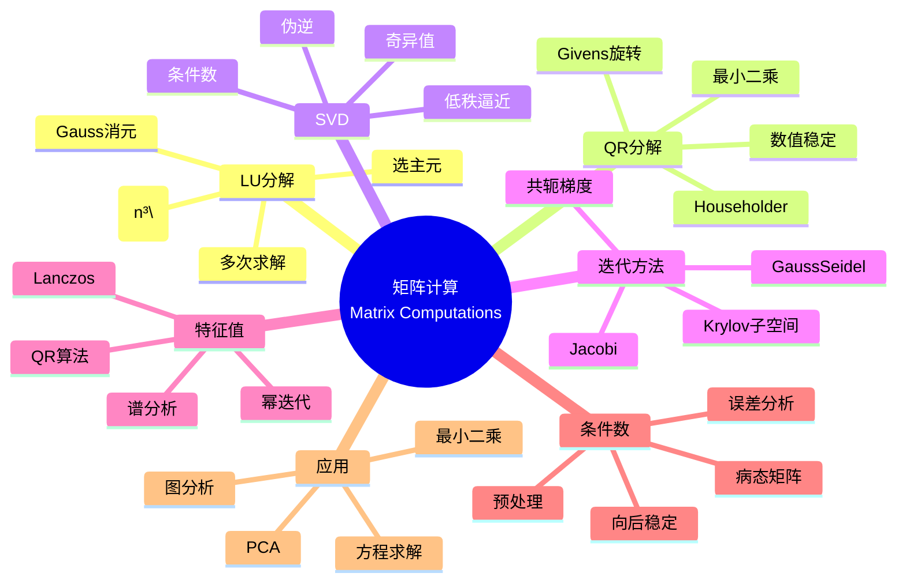

msc_primary: "00A99"
msc_secondary: ['00-XX']
---

# 矩阵计算 (Matrix Computations)

## 中心概念精确定义

**矩阵计算（Matrix Computations）**，又称数值线性代数，是研究矩阵问题高效、稳定算法的设计与分析的科学。它是科学计算的核心基础，广泛应用于工程、物理、数据科学和机器学习等领域。

**基本问题类型**：
- **线性方程组**：$Ax = b$，$A \in \mathbb{R}^{n \times n}$
- **最小二乘问题**：$\min_x \|Ax - b\|^2$

- **特征值问题**：$Ax = \lambda x$
- **奇异值分解**：$A = U\Sigma V^T$

**核心原则**：
- **效率**：减少计算量和存储需求
- **稳定性**：控制舍入误差积累
- **可靠性**：处理病态问题

---

## 核心要素

### 1. LU分解 (LU Decomposition)

**定义**：将方阵 $A$ 分解为下三角矩阵 $L$ 和上三角矩阵 $U$ 的乘积
$$A = LU$$

**带选主元的LU分解（PLU）**：
$$PA = LU$$
其中 $P$ 是置换矩阵，用于数值稳定性。

**算法**：Gauss消元
- 复杂度：$O(n^3)$
- 存储：原地分解，$L$ 和 $U$ 存储在 $A$ 的位置

**求解方程组**：
1. $PA = LU$ 分解
2. 解 $Ly = Pb$（前代）
3. 解 $Ux = y$（回代）

**应用**：
- 多次求解同系数矩阵的方程组
- 计算行列式：$\det(A) = \pm \prod u_{ii}$
- 计算逆矩阵

### 2. QR分解 (QR Decomposition)

**定义**：将矩阵 $A \in \mathbb{R}^{m \times n}$（$m \geq n$）分解为
$$A = QR$$
其中 $Q \in \mathbb{R}^{m \times m}$ 正交（$Q^TQ = I$），$R \in \mathbb{R}^{m \times n}$ 上三角。

**计算方法**：
- **Gram-Schmidt正交化**：理论直观，数值不稳定
- **Householder变换**：反射变换，数值稳定
- **Givens旋转**：平面旋转，适合稀疏矩阵

**Householder反射**：
$$H = I - 2\frac{vv^T}{v^Tv}$$
将向量反射到坐标轴方向。

**求解最小二乘**：
$$\min_x \|Ax - b\|^2 = \min_x \|Rx - Q^Tb\|^2$$

**优势**：数值稳定，适合病态问题。

### 3. 奇异值分解 (SVD)

**定义**：$A \in \mathbb{R}^{m \times n}$ 的SVD为
$$A = U\Sigma V^T$$

其中：
- $U \in \mathbb{R}^{m \times m}$：左奇异向量（正交）
- $\Sigma \in \mathbb{R}^{m \times n}$：对角矩阵，奇异值 $\sigma_1 \geq \sigma_2 \geq \cdots \geq 0$
- $V \in \mathbb{R}^{n \times n}$：右奇异向量（正交）

**性质**：
- 非零奇异值个数 = 矩阵秩
- 条件数：$\kappa(A) = \sigma_1 / \sigma_r$
- Frobenius范数：$\|A\|_F = \sqrt{\sum \sigma_i^2}$

**低秩逼近**：
$$A_k = \sum_{i=1}^k \sigma_i u_i v_i^T$$
是 $A$ 的最佳秩-$k$ 逼近（Frobenius范数意义）。

**伪逆**：$A^+ = V\Sigma^+ U^T$，其中 $\Sigma^+$ 将非零奇异值取倒数。

### 4. 迭代方法 (Iterative Methods)

**适用场景**：大型稀疏矩阵，直接法太昂贵。

**经典迭代法**：
- **Jacobi**：$x^{(k+1)} = D^{-1}(b - (L+U)x^{(k)})$
- **Gauss-Seidel**：$x^{(k+1)} = (D+L)^{-1}(b - Ux^{(k)})$
- **SOR（逐次超松弛）**：引入松弛因子 $\omega$

**收敛条件**：谱半径 $\rho(G) < 1$，其中 $G$ 是迭代矩阵。

**Krylov子空间方法**：
- **共轭梯度（CG）**：对称正定矩阵
- **GMRES**：一般非对称矩阵
- **BiCGSTAB**：非对称矩阵的稳定版本

**预处理**：改善收敛性
$$M^{-1}Ax = M^{-1}b$$
其中 $M \approx A$ 且易求逆。

### 5. 特征值计算

**幂迭代**：求主导特征值
$$v_{k+1} = \frac{Av_k}{\|Av_k\|}$$

**逆迭代**：求最接近移位 $\mu$ 的特征值
$$v_{k+1} = \frac{(A-\mu I)^{-1}v_k}{\|(A-\mu I)^{-1}v_k\|}$$

**QR算法**：
$$A_0 = A, \quad A_{k+1} = R_k Q_k \text{ where } A_k = Q_k R_k$$

在适当条件下，$A_k$ 收敛到上三角矩阵（特征值在对角线上）。

**Lanczos/Arnoldi算法**：大型稀疏矩阵的部分特征值。

### 6. 条件数与稳定性

**矩阵条件数**：
$$\kappa(A) = \|A\| \cdot \|A^{-1}\|$$

- $\kappa(A) \approx 1$：良态
- $\kappa(A) \gg 1$：病态
- 对于2-范数：$\kappa_2(A) = \sigma_{max}/\sigma_{min}$

**误差分析**：
$$\frac{\|\Delta x\|}{\|x\|} \leq \kappa(A) \frac{\|\Delta b\|}{\|b\|}$$

**向后稳定性**：算法给出邻近问题的精确解。
- 带选主元的LU分解是向后稳定的
- QR分解是向后稳定的

---

## 性质与定理

### 定理1：LU分解存在性

若 $A$ 的所有顺序主子式非零，则 $A$ 存在唯一的LU分解（$L$ 对角元为1）。

### 定理2：QR分解存在性

任意矩阵 $A \in \mathbb{R}^{m \times n}$（$m \geq n$）存在QR分解。若 $A$ 列满秩且 $R$ 对角元为正，则分解唯一。

### 定理3：SVD存在性（Eckart-Young-Mirsky定理）

任意矩阵 $A \in \mathbb{R}^{m \times n}$ 存在SVD。且 $A_k = \sum_{i=1}^k \sigma_i u_i v_i^T$ 是最佳秩-$k$ 逼近：
$$\min_{\text{rank}(B) = k} \|A - B\|_2 = \sigma_{k+1}$$

### 定理4：迭代法收敛性

经典迭代法收敛当且仅当迭代矩阵的谱半径小于1。对于对称正定矩阵，Gauss-Seidel收敛，且比Jacobi快。

### 定理5：共轭梯度收敛

对于 $n \times n$ 对称正定矩阵，CG最多 $n$ 步收敛到精确解。实际中，收敛速度依赖于条件数和特征值分布。

---

## 典型例子

### 例子1：线性方程组求解

**Hilbert矩阵**：著名病态矩阵
$$H_{ij} = \frac{1}{i+j-1}$$

即使中等规模（$n=10$），条件数 $\kappa(H) \approx 10^{13}$，需要高精度或正则化。

**求解策略**：
- 小矩阵：LU分解
- 病态矩阵：QR分解或SVD
- 大型稀疏：迭代法

### 例子2：最小二乘拟合

**多项式拟合**：给定数据 $(x_i, y_i)$，拟合 $p(x) = \sum_{j=0}^m a_j x^j$。

设计矩阵 $A_{ij} = x_i^j$，解正规方程 $A^TA\beta = A^Ty$ 或用QR分解。

**数值建议**：用QR或SVD而非直接解正规方程（条件数平方）。

### 例子3：主成分分析（PCA）

**数据矩阵**：$X \in \mathbb{R}^{n \times p}$（$n$ 样本，$p$ 特征）

**步骤**：
1. 中心化：$\tilde{X} = X - \bar{X}$
2. SVD：$\tilde{X} = U\Sigma V^T$
3. 主成分：$V$ 的列
4. 投影：$Z = \tilde{X}V_k$（降维到 $k$ 维）

---

## 关联概念

### 上游概念
- **线性代数**：向量空间、线性变换、特征理论
- **数值分析**：浮点运算、误差分析
- **数学分析**：范数、收敛性

### 下游概念
- **优化算法**：牛顿法、内点法
- **微分方程数值解**：离散化系统
- **机器学习**：矩阵分解、推荐系统
- **图算法**：PageRank、谱聚类

### 应用领域
- **结构力学**：有限元分析
- **信号处理**：滤波、谱估计
- **计算机视觉**：图像配准、三维重建
- **数据挖掘**：潜在语义分析
- **量子化学**：Hartree-Fock计算

---

## Mermaid 思维导图

---

## 参考文献

1. **Golub, G.H. & Van Loan, C.F.** (2013). *Matrix Computations*, 4th Ed., Johns Hopkins University Press
2. **Trefethen, L.N. & Bau, D.** (1997). *Numerical Linear Algebra*, SIAM
3. **Demmel, J.W.** (1997). *Applied Numerical Linear Algebra*, SIAM
4. **Saad, Y.** (2003). *Iterative Methods for Sparse Linear Systems*, 2nd Ed., SIAM
5. **Higham, N.J.** (2002). *Accuracy and Stability of Numerical Algorithms*, 2nd Ed., SIAM
6. **Stewart, G.W.** (1998). *Matrix Algorithms*, SIAM
7. **MIT OpenCourseWare**: 18.335 Introduction to Numerical Methods

---

*本文档是FormalMath项目的一部分，对齐MIT数值线性代数课程体系。*
