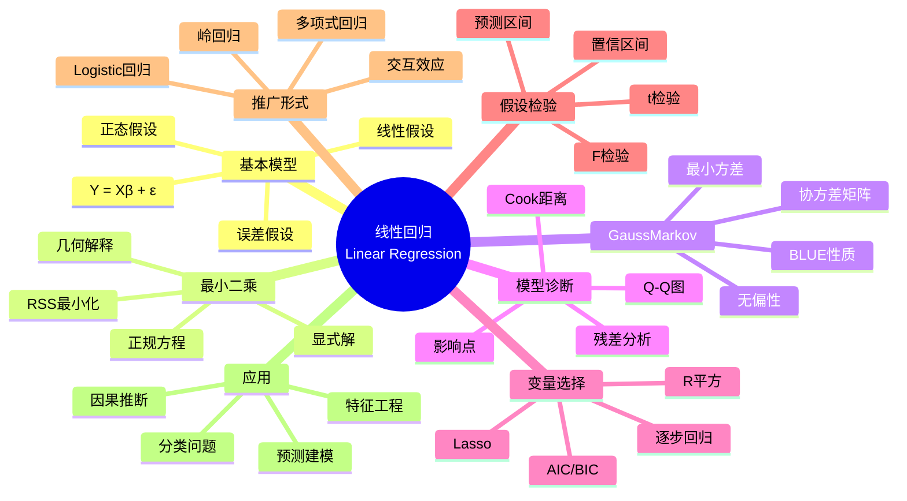

msc_primary: "00A99"
msc_secondary: ['00-00']
---

# 线性回归 (Linear Regression)

## 中心概念精确定义

**线性回归（Linear Regression）**是统计学中最基础、应用最广泛的建模方法之一，它通过线性函数描述一个因变量（响应变量）与一个或多个自变量（解释变量）之间的关系。

**基本模型**：
$$Y = X\beta + \varepsilon$$

其中：
- $Y \in \mathbb{R}^n$：响应变量向量
- $X \in \mathbb{R}^{n \times p}$：设计矩阵（包含$p$个预测变量）
- $\beta \in \mathbb{R}^p$：待估参数向量（回归系数）
- $\varepsilon \in \mathbb{R}^n$：随机误差项

**关键假设**：
1. **线性性**：$E[Y|X] = X\beta$

2. **独立性**：$\varepsilon_i$ 相互独立
3. **同方差性**：$\text{Var}(\varepsilon_i) = \sigma^2$（常数）
4. **正态性**（可选）：$\varepsilon \sim N(0, \sigma^2 I)$

**历史背景**：
- 1805年：Legendre提出最小二乘法
- 1809年：Gauss提出正态误差理论
- 19世纪末：Galton研究遗传学中的回归现象

---

## 核心要素

### 1. 最小二乘估计 (Ordinary Least Squares, OLS)

**目标**：最小化残差平方和（RSS）
$$\hat{\beta}_{OLS} = \arg\min_\beta \|Y - X\beta\|^2 = \arg\min_\beta \sum_{i=1}^n (y_i - x_i^T\beta)^2$$

**正规方程**：
$$X^TX\hat{\beta} = X^TY$$

**显式解**：
$$\hat{\beta}_{OLS} = (X^TX)^{-1}X^TY$$

（要求 $X^TX$ 可逆，即 $X$ 列满秩）

**几何解释**：$\hat{Y} = X\hat{\beta}$ 是 $Y$ 在 $X$ 列空间上的正交投影。

### 2. Gauss-Markov定理

**定理陈述**：在经典线性模型假设下（线性性、独立性、同方差、零均值误差），OLS估计量是**最佳线性无偏估计（BLUE）**：

1. **线性性**：$\hat{\beta}$ 是 $Y$ 的线性函数
2. **无偏性**：$E[\hat{\beta}] = \beta$
3. **最佳性**：在所有线性无偏估计中，$\text{Var}(\hat{\beta})$ 最小

**OLS的协方差矩阵**：
$$\text{Cov}(\hat{\beta}) = \sigma^2(X^TX)^{-1}$$

**估计**：$\hat{\sigma}^2 = \frac{RSS}{n-p} = \frac{\|Y - X\hat{\beta}\|^2}{n-p}$

### 3. 模型诊断 (Model Diagnostics)

**残差分析**：
- **残差**：$e_i = y_i - \hat{y}_i$
- **标准化残差**：$r_i = \frac{e_i}{\hat{\sigma}\sqrt{1-h_{ii}}}$
- **学生化残差**：考虑第 $i$ 个观测被剔除后的方差估计

**诊断图**：
1. **残差 vs 拟合值图**：检验异方差、非线性
2. **Q-Q图**：检验正态性
3. **残差 vs 预测变量图**：检验模型设定
4. **Cook距离**：识别强影响点

**影响度量**：
- **杠杆值（Leverage）**：$h_{ii} = x_i^T(X^TX)^{-1}x_i$
- **Cook距离**：$D_i = \frac{r_i^2}{p} \cdot \frac{h_{ii}}{1-h_{ii}}$

### 4. 变量选择与模型比较

**$R^2$（决定系数）**：
$$R^2 = 1 - \frac{RSS}{TSS} = 1 - \frac{\sum(y_i - \hat{y}_i)^2}{\sum(y_i - \bar{y})^2}$$

问题：随变量增加而增加，可能过拟合。

**调整$R^2$**：
$$R^2_{adj} = 1 - \frac{RSS/(n-p)}{TSS/(n-1)}$$

**信息准则**：
- **AIC**：$AIC = n\log(\frac{RSS}{n}) + 2p$
- **BIC**：$BIC = n\log(\frac{RSS}{n}) + p\log(n)$

**变量选择方法**：
- **向前选择**：逐步加入最显著变量
- **向后剔除**：逐步剔除最不显著变量
- **逐步回归**：双向选择
- **Lasso**：$\min_\beta \|Y - X\beta\|^2 + \lambda\|\beta\|_1$

### 5. 多元线性回归的推广

**多项式回归**：
$$Y = \beta_0 + \beta_1 X + \beta_2 X^2 + \cdots + \beta_k X^k + \varepsilon$$

**交互效应**：
$$Y = \beta_0 + \beta_1 X_1 + \beta_2 X_2 + \beta_{12} X_1 X_2 + \varepsilon$$

**广义线性模型（GLM）**：
$$g(E[Y|X]) = X\beta$$

- 恒等连接：线性回归
- Logit连接：Logistic回归
- Log连接：Poisson回归

### 6. 假设检验与推断

**单个系数的t检验**：
$$t = \frac{\hat{\beta}_j - \beta_{j0}}{SE(\hat{\beta}_j)} \sim t_{n-p}$$

其中 $SE(\hat{\beta}_j) = \hat{\sigma}\sqrt{[(X^TX)^{-1}]_{jj}}$

**整体显著性F检验**：
$$F = \frac{(TSS - RSS)/p}{RSS/(n-p)} = \frac{R^2/p}{(1-R^2)/(n-p)} \sim F_{p,n-p}$$

**置信区间**：
$$\hat{\beta}_j \pm t_{n-p, \alpha/2} \cdot SE(\hat{\beta}_j)$$

**预测区间**：考虑参数估计不确定性和新观测的随机误差。

---

## 性质与定理

### 定理1：Gauss-Markov定理

在经典线性回归假设下，OLS估计量 $\hat{\beta}_{OLS}$ 是BLUE：
1. $E[\hat{\beta}] = \beta$
2. 对任意其他线性无偏估计 $\tilde{\beta}$，$\text{Var}(\hat{\beta}) - \text{Var}(\tilde{\beta})$ 是半正定矩阵

### 定理2：OLS的正态理论

若 $\varepsilon \sim N(0, \sigma^2 I)$，则：
1. $\hat{\beta} \sim N(\beta, \sigma^2(X^TX)^{-1})$
2. $\frac{(n-p)\hat{\sigma}^2}{\sigma^2} \sim \chi^2_{n-p}$
3. $\hat{\beta}$ 与 $\hat{\sigma}^2$ 独立

### 定理3：Cochran定理

设 $Y \sim N(\mu, \sigma^2 I)$，$A_1, ..., A_k$ 是对称幂等矩阵，$\sum A_i = I$，则二次型 $Y^TA_iY$ 独立且服从非中心卡方分布。

这是F检验的理论基础。

### 定理4：Frisch-Waugh-Lovell定理

对于多元回归 $Y = X_1\beta_1 + X_2\beta_2 + \varepsilon$，$\beta_2$ 的OLS估计等价于：
1. 将 $Y$ 对 $X_1$ 回归，取残差 $\tilde{Y}$
2. 将 $X_2$ 对 $X_1$ 回归，取残差 $\tilde{X}_2$
3. 将 $\tilde{Y}$ 对 $\tilde{X}_2$ 回归

这称为**偏回归**或**残差化**。

### 定理5：岭回归的最优性

对于岭估计 $\hat{\beta}_{ridge} = (X^TX + \lambda I)^{-1}X^TY$，存在某个 $\lambda$ 使得
$$\text{MSE}(\hat{\beta}_{ridge}) < \text{MSE}(\hat{\beta}_{OLS})$$

当 $X^TX$ 接近奇异时，岭回归改善数值稳定性。

---

## 典型例子

### 例子1：简单线性回归

模型：$Y = \beta_0 + \beta_1 X + \varepsilon$

**OLS估计**：
$$\hat{\beta}_1 = \frac{\sum(x_i - \bar{x})(y_i - \bar{y})}{\sum(x_i - \bar{x})^2} = \frac{S_{xy}}{S_{xx}}$$
$$\hat{\beta}_0 = \bar{y} - \hat{\beta}_1\bar{x}$$

**相关系数**：
$$r = \frac{S_{xy}}{\sqrt{S_{xx}S_{yy}}}, \quad R^2 = r^2$$

**应用**：身高与体重、广告投入与销售额、学习时间与考试成绩。

### 例子2：多元回归：房价预测

预测变量：
- $X_1$：房屋面积（平方英尺）
- $X_2$：卧室数量
- $X_3$：浴室数量
- $X_4$：地段评分

模型：
$$\text{Price} = \beta_0 + \beta_1 \text{Area} + \beta_2 \text{Bedrooms} + \beta_3 \text{Bathrooms} + \beta_4 \text{Location} + \varepsilon$$

**解释**：
- $\hat{\beta}_1$：面积每增加1平方英尺，房价平均增加 $\hat{\beta}_1$ 美元（其他变量固定）
- $R^2$：模型解释了房价变异的百分之多少

### 例子3：Logistic回归：分类问题

二分类问题：$Y \in \{0, 1\}$

**模型**：
$$P(Y=1|X) = \frac{1}{1 + e^{-X\beta}} = \sigma(X\beta)$$

**Logit变换**：
$$\log\frac{P(Y=1|X)}{1-P(Y=1|X)} = X\beta$$

**估计**：最大似然估计（无闭式解，需迭代优化）。

**应用**：信用评分、疾病诊断、客户流失预测。

---

## 关联概念

### 上游概念
- **线性代数**：矩阵运算、投影、特征分解
- **概率统计**：期望、方差、协方差、正态分布
- **优化理论**：最小二乘、凸优化

### 下游概念
- **广义线性模型**：指数族、连接函数
- **回归诊断**：影响分析、异方差处理
- **正则化方法**：Lasso、Ridge、Elastic Net
- **非参数回归**：核回归、样条
- **时间序列回归**：ARIMA、协整
- **贝叶斯回归**：MCMC、共轭先验

### 应用领域
- **计量经济学**：因果关系分析、政策评估
- **生物统计**：剂量反应、生存分析
- **机器学习**：特征工程、基线模型
- **金融分析**：因子模型、风险归因
- **社会科学**：调查研究、实验分析
- **工程领域**：信号处理、系统辨识

---

## Mermaid 思维导图

---

## 参考文献

1. **Legendre, A.M.** (1805). *Nouvelles méthodes pour la détermination des orbites des comètes*
2. **Gauss, C.F.** (1809). *Theoria Motus Corporum Coelestium*
3. **Galton, F.** (1886). "Regression Towards Mediocrity in Hereditary Stature"
4. **Seber, G.A.F. & Lee, A.J.** (2003). *Linear Regression Analysis*, 2nd Ed., Wiley
5. **Hastie, T., Tibshirani, R., & Friedman, J.** (2009). *The Elements of Statistical Learning*, 2nd Ed., Springer
6. **Weisberg, S.** (2005). *Applied Linear Regression*, 3rd Ed., Wiley
7. **MIT OpenCourseWare**: 18.443 Statistics for Applications

---

*本文档是FormalMath项目的一部分，对齐MIT概率统计课程体系。*
