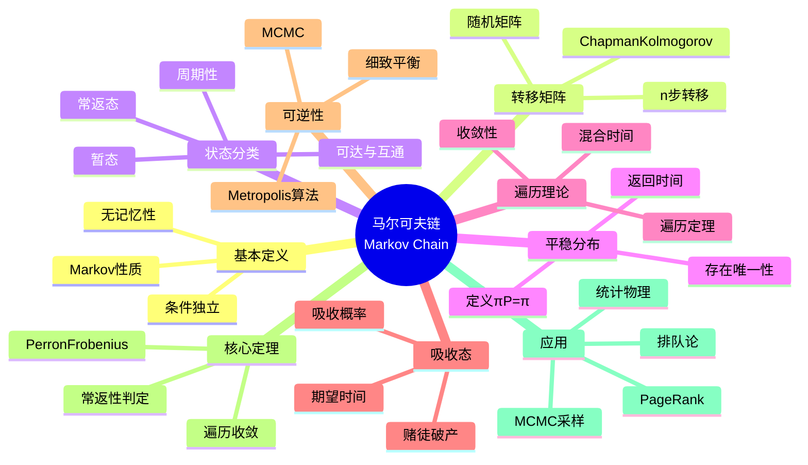

msc_primary: "00A99"
msc_secondary: ['00-00']
---

# 马尔可夫链 (Markov Chain)

## 中心概念精确定义

**马尔可夫链（Markov Chain）**是一类具有"无记忆性"的随机过程，其核心特征是：在给定当前状态的条件下，未来的演化与过去的历史无关。这一性质称为**马尔可夫性质**，它以俄国数学家Andrey Markov（1856-1922）命名。

**形式化定义**：设 $\{X_n\}_{n=0}^{\infty}$ 是定义在概率空间 $(\Omega, \mathcal{F}, P)$ 上、取值于可数状态空间 $\mathcal{S}$ 的随机过程。若对任意 $n \geq 0$，任意状态 $i_0, i_1, ..., i_{n+1} \in \mathcal{S}$：

$$P(X_{n+1} = i_{n+1} | X_n = i_n, X_{n-1} = i_{n-1}, ..., X_0 = i_0) = P(X_{n+1} = i_{n+1} | X_n = i_n)$$

则称 $\{X_n\}$ 为**马尔可夫链**。

**等价表述**：给定现在，过去与未来条件独立。

---

## 核心要素

### 1. 转移矩阵 (Transition Matrix)

**一步转移概率**：
$$p_{ij} = P(X_{n+1} = j | X_n = i), \quad i, j \in \mathcal{S}$$

**转移矩阵** $P = (p_{ij})$ 满足：
- $p_{ij} \geq 0$（非负性）
- $\sum_{j \in \mathcal{S}} p_{ij} = 1$（行和为1）

这样的矩阵称为**随机矩阵（Stochastic Matrix）**。

**$n$步转移概率**：
$$p_{ij}^{(n)} = P(X_{n+m} = j | X_m = i)$$

**Chapman-Kolmogorov方程**：
$$p_{ij}^{(n+m)} = \sum_{k \in \mathcal{S}} p_{ik}^{(n)} p_{kj}^{(m)}$$

矩阵形式：$P^{(n)} = P^n$（矩阵的$n$次幂）

### 2. 状态分类 (State Classification)

**可达与互通**：
- 状态 $j$ **可达**于 $i$（记 $i \to j$）：存在 $n \geq 0$ 使得 $p_{ij}^{(n)} > 0$
- 状态 $i$ 与 $j$ **互通**（记 $i \leftrightarrow j$）：$i \to j$ 且 $j \to i$

互通是等价关系，将状态空间划分为**等价类**。

**常返与暂态**：
- **常返态（Recurrent）**：从 $i$ 出发最终返回的概率为1，即 $P_i(T_i < \infty) = 1$
- **暂态（Transient）**：从 $i$ 出发最终返回的概率小于1

**判定准则**：$i$ 常返 $\Leftrightarrow$ $\sum_{n=0}^{\infty} p_{ii}^{(n)} = \infty$

**周期**：状态 $i$ 的周期 $d(i) = \gcd\{n \geq 1: p_{ii}^{(n)} > 0\}$
- 若 $d(i) = 1$，称 $i$ 为**非周期的（Aperiodic）**
- 若 $d(i) > 1$，称 $i$ 为**周期的（Periodic）**

### 3. 平稳分布 (Stationary Distribution)

**定义**：概率分布 $\pi = (\pi_j)_{j \in \mathcal{S}}$ 称为**平稳分布**，如果：
$$\pi P = \pi$$

即 $\pi_j = \sum_{i \in \mathcal{S}} \pi_i p_{ij}$ 对所有 $j$ 成立。

**解释**：若 $X_0 \sim \pi$，则 $X_n \sim \pi$ 对所有 $n$ 成立。

**存在唯一性定理**：
- 不可约、正常返的马尔可夫链存在唯一的平稳分布
- $\pi_j = \frac{1}{E_j[T_j]}$（期望返回时间的倒数）

### 4. 遍历定理 (Ergodic Theorem)

**基本遍历定理**：设 $\{X_n\}$ 是不可约、正常返的马尔可夫链，平稳分布为 $\pi$，则对任意函数 $f$ 满足 $\sum_j |f(j)|\pi_j < \infty$：

$$\frac{1}{n}\sum_{k=0}^{n-1} f(X_k) \xrightarrow{a.s.} \sum_j f(j)\pi_j$$

**遍历马尔可夫链**：不可约、正常返、非周期的马尔可夫链称为遍历的。

**收敛定理**：若 $\{X_n\}$ 遍历，则对任意初始分布：
$$\lim_{n \to \infty} P(X_n = j) = \pi_j$$

**收敛速度**：在温和条件下，$|p_{ij}^{(n)} - \pi_j| \leq C\rho^n$，其中 $\rho < 1$。

### 5. 吸收态与吸收概率

**吸收态**：若 $p_{ii} = 1$，则称 $i$ 为**吸收态**。

**吸收链**：每个状态要么吸收，要么可达某个吸收态。

**吸收概率**：设 $a_i$ 为从 $i$ 出发最终被吸收态 $A$ 吸收的概率，则：
$$a_i = \sum_{j \in \mathcal{S}} p_{ij} a_j$$

边界条件：$a_A = 1$（若 $A$ 是目标吸收态），$a_B = 0$（其他吸收态）。

**期望吸收时间**：设 $t_i$ 为从 $i$ 出发到吸收的期望时间，则：
$$t_i = 1 + \sum_{j \in \mathcal{S}} p_{ij} t_j$$

### 6. 可逆性与细致平衡

**细致平衡条件**：若分布 $\pi$ 满足
$$\pi_i p_{ij} = \pi_j p_{ji}, \quad \forall i, j$$

则称链关于 $\pi$ **可逆（Reversible）**，$\pi$ 是平稳分布。

**意义**：在平稳状态下，$i \to j$ 的流等于 $j \to i$ 的流。

**Metropolis-Hastings算法**：构建可逆马尔可夫链进行Monte Carlo采样。

---

## 性质与定理

### 定理1：Chapman-Kolmogorov方程

对任意 $n, m \geq 0$：
$$P^{(n+m)} = P^{(n)} P^{(m)}$$

即
$$p_{ij}^{(n+m)} = \sum_{k \in \mathcal{S}} p_{ik}^{(n)} p_{kj}^{(m)}$$

这是马尔可夫链理论的基础方程。

### 定理2：常返性判定定理

状态 $i$ 是：
- **常返的**：$\sum_{n=0}^{\infty} p_{ii}^{(n)} = \infty$
- **暂态的**：$\sum_{n=0}^{\infty} p_{ii}^{(n)} < \infty$

对于有限状态空间，所有状态都是常返的。

### 定理3：平稳分布存在性定理

不可约马尔可夫链：
- 若正常返，则存在唯一的平稳分布 $\pi$，且 $\pi_j = 1/E_j[T_j] > 0$
- 若零常返或暂态，则不存在平稳分布

### 定理4：遍历收敛定理

设 $\{X_n\}$ 是不可约、非周期、正常返的马尔可夫链，平稳分布为 $\pi$，则对任意 $i, j$：
$$\lim_{n \to \infty} p_{ij}^{(n)} = \pi_j$$

且收敛是几何级的。

### 定理5：Perron-Frobenius定理（有限状态空间）

设 $P$ 是有限不可约、非周期随机矩阵，则：
1. 1 是 $P$ 的单重特征值
2. 所有其他特征值满足 $|\lambda| < 1$

3. 对应于特征值1的左特征向量是平稳分布

---

## 典型例子

### 例子1：简单随机游走

**定义**：$\mathcal{S} = \mathbb{Z}$，$p_{i,i+1} = p$，$p_{i,i-1} = q = 1-p$。

**性质**：
- 不可约
- 周期为2
- **常返性**：当 $p = q = 1/2$ 时，所有状态常返（零常返）；当 $p \neq q$ 时，所有状态暂态

**赌徒破产问题**：在 $\{0, 1, ..., N\}$ 上，0和 $N$ 为吸收态。
- 破产概率：$u_i = \frac{(q/p)^i - (q/p)^N}{1 - (q/p)^N}$（$p \neq q$）
- 破产概率：$u_i = 1 - i/N$（$p = q$）

### 例子2：Ehrenfest扩散模型

**模型**：$2d$ 个粒子分布在两个容器中，每次随机选择一个粒子移到另一个容器。

状态 $X_n$：容器A中的粒子数，$\mathcal{S} = \{0, 1, ..., 2d\}$。

**转移概率**：
$$p_{i,i+1} = 1 - \frac{i}{2d}, \quad p_{i,i-1} = \frac{i}{2d}$$

**平稳分布**：$\pi_i = \binom{2d}{i} 2^{-2d}$（二项分布）

**意义**：说明系统趋向均匀分布，但存在涨落。

### 例子3：PageRank算法

**Google PageRank**：将网页看作图的节点，链接看作有向边。

**随机冲浪模型**：
- 以概率 $\alpha$ 随机点击链接
- 以概率 $1-\alpha$ 跳转到随机页面

**转移矩阵**：
$$P = \alpha D + (1-\alpha) \frac{1}{n}\mathbf{1}\mathbf{1}^T$$

其中 $D$ 是基于链接的转移矩阵，$\alpha \approx 0.85$。

**PageRank**：平稳分布 $\pi$ 的分量 $\pi_i$ 表示页面 $i$ 的重要性。

---

## 关联概念

### 上游概念
- **概率测度**：条件概率、期望
- **随机过程**：离散时间随机过程
- **矩阵论**：特征值、特征向量、Perron-Frobenius理论

### 下游概念
- **连续时间马尔可夫链**：转移速率、生成元
- **马尔可夫决策过程**：最优控制、动态规划
- **隐马尔可夫模型**：观测序列、Baum-Welch算法
- **马尔可夫链Monte Carlo (MCMC)**：Metropolis-Hastings、Gibbs采样
- **鞅理论**：鞅问题、Feller过程

### 应用领域
- **搜索引擎**：PageRank算法
- **统计物理**：Ising模型、相变
- **生物信息学**：DNA序列分析、系统发育
- **金融数学**：信用风险、评级迁移
- **机器学习**：MCMC方法、强化学习
- **排队论**：排队网络、性能分析
- **语言学**：自然语言处理、文本生成

---

## Mermaid 思维导图

---

## 参考文献

1. **Markov, A.A.** (1906). "Rasprostranenie zakona bol'shih chisel na velichiny, zavisyaschie drug ot druga"
2. **Norris, J.R.** (1997). *Markov Chains*, Cambridge University Press
3. **Levin, D.A., Peres, Y., & Wilmer, E.L.** (2009). *Markov Chains and Mixing Times*, AMS
4. **Bremaud, P.** (1999). *Markov Chains: Gibbs Fields, Monte Carlo Simulation, and Queues*, Springer
5. **Grinstead, C.M. & Snell, J.L.** (1997). *Introduction to Probability*, 2nd Rev. Ed., AMS
6. **Mitzenmacher, M. & Upfal, E.** (2005). *Probability and Computing*, Cambridge University Press
7. **MIT OpenCourseWare**: 6.041 Probabilistic Systems Analysis

---

*本文档是FormalMath项目的一部分，对齐MIT概率统计课程体系。*
