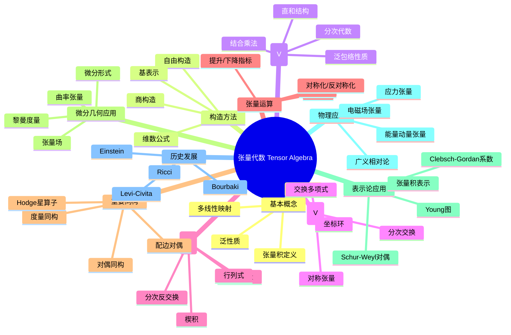

msc_primary: "00A99"
msc_secondary: ['00-00']
---

# 张量代数 思维导图

## 中心概念
张量代数是向量空间上所有张量的代数结构，包含张量积、对称代数和反对称（外）代数。它是多元线性代数的基础，在微分几何、物理和表示论中有广泛应用。

## 核心分支

### 定义与公理
- **张量积**: $V \otimes W$ 是双线性映射 $V \times W \to U$ 的泛对象
- **张量代数**: $T(V) = \bigoplus_{n=0}^\infty V^{\otimes n}$，配备连接乘法
- **对称代数**: $\text{Sym}(V) = T(V)/I$，$I$ 由 $v \otimes w - w \otimes v$ 生成
- **外代数**: $\Lambda(V) = T(V)/J$，$J$ 由 $v \otimes v$ 生成

### 基本性质
- **泛性质**: $T(V)$ 是从 $V$ 到结合代数的自由函子
- **分次结构**: $T(V) = \bigoplus T^n(V)$ 是 $\mathbb{N}$-分次代数
- **维数**: $\dim(V^{\otimes n}) = (\dim V)^n$
- **基**: 若 $\{e_i\}$ 是 $V$ 的基，则 $\{e_{i_1} \otimes \cdots \otimes e_{i_n}\}$ 是 $T^n(V)$ 的基

### 重要例子
- **矩阵代数**: $M_n(F) \cong F^n \otimes (F^n)^*$
- **对称代数**: $\text{Sym}(V) \cong F[x_1, \ldots, x_n]$（多项式环）
- **外代数**: $\Lambda^k(F^n)$ 是 $k$-形式空间
- **克利福德代数**: $T(V)/\langle v \otimes v - Q(v) \rangle$

### 核心定理
- **泛性质定理**: 张量积表示多线性映射（证明思路：泛对象构造）
- **对称代数泛性质**: $\text{Sym}(V)$ 是到交换代数的自由函子
- **外代数泛性质**: $\Lambda(V)$ 是到反交换代数的自由函子
- **Schur-Weyl对偶**: $V^{\otimes n}$ 分解为 $GL(V)$ 和 $S_n$ 的不可约表示直和

### 相关概念
- **父概念**: 线性代数、多元线性映射
- **子概念**: Clifford代数、Hopf代数、李超代数
- **相邻概念**: 微分几何、表示论、同调代数

### 应用领域
- **微分几何**: 张量场、微分形式、曲率
- **物理学**: 广义相对论、连续介质力学、电磁学
- **表示论**: 张量积分解、Young表理论
- **代数几何**: 切丛、余切丛、向量丛

### 历史发展
- **早期发展**: Ricci 和 Levi-Civita 发展张量分析 (1900)
- **关键发展**:
  - 1915：Einstein 用张量语言表述广义相对论
  - 1940年代：Bourbaki 代数化张量理论
  - 1970年代：超对称与张量范畴
- **现代研究**: 张量网络、量子张量范畴

### 参考资源
- **推荐教材**: Greub《Multilinear Algebra》、Bourbaki《Algebra》
- **相关论文**: Einstein《Die Feldgleichungen der Gravitation》(1915)
- **在线资源**: Manifolds Atlas、nLab

---

**概念链接**: [[向量空间]] [[线性映射]] [[Clifford代数]] [[Hopf代数]] [[微分几何]]
