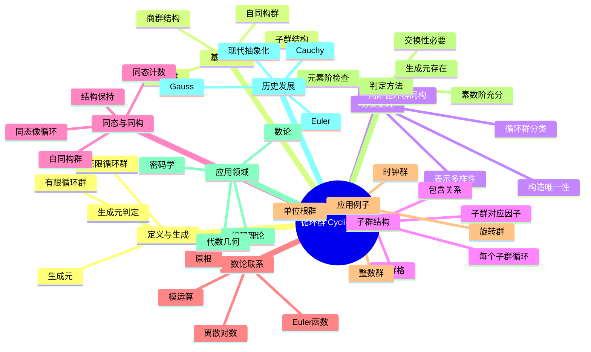

msc_primary: "00A99"
msc_secondary: ['00-XX']
---

# 循环群 思维导图

## 中心概念
循环群是由单个元素生成的群，是最简单的群结构。所有循环群要么是无限循环群（同构于整数加法群），要么是有限循环群（同构于整数模n加法群）。

## 核心分支

### 定义与生成
- **定义**: 群 $G$ 称为循环群，若存在 $g \in G$ 使得 $G = \langle g \rangle = \{g^n : n \in \mathbb{Z}\}$
- **无限循环群**: 同构于 $(\mathbb{Z}, +)$，由 $1$ 或 $-1$ 生成
- **有限循环群**: 同构于 $(\mathbb{Z}/n\mathbb{Z}, +)$，阶为 $n$
- **生成元**: $g$ 是生成元当且仅当 $g$ 的阶等于群的阶（有限情形）或无限（无限情形）

### 基本性质
- **交换性**: 所有循环群都是交换群
- **子群结构**: 循环群的每个子群都是循环群
- **商群结构**: 循环群的商群也是循环群
- **自同构群**: $\text{Aut}(\mathbb{Z}/n\mathbb{Z}) \cong (\mathbb{Z}/n\mathbb{Z})^\times$，阶为 $\varphi(n)$

### 分类定理
- **基本定理**: 所有同阶的循环群互相同构
- **无限情形**: 所有无限循环群同构于 $\mathbb{Z}$
- **有限情形**: $n$ 阶循环群同构于 $\mathbb{Z}/n\mathbb{Z}$
- **生成元计数**: 有限 $n$ 阶循环群有 $\varphi(n)$ 个生成元

### 子群结构
- **子群对应**: $\mathbb{Z}/n\mathbb{Z}$ 的子群与 $n$ 的正因子一一对应
- **子群阶**: $n$ 阶循环群对每个 $d|n$ 有唯一的 $d$ 阶子群

- **子群格**: 同构于 $n$ 的因子格的倒置
- **包含关系**: 子群包含关系对应因子的整除关系

### 核心定理
- **Lagrange定理**: 子群阶整除群阶（循环群情形完全可逆）
- **Euler定理**: $a^{\varphi(n)} \equiv 1 \pmod{n}$（循环群的语言表述）
- **原根存在**: $\mathbb{Z}/p\mathbb{Z}$ 的乘法群循环当 $p$ 是素数
- **同态基本定理**: 循环群的同态像仍是循环群

### 重要例子
- **整数加法群**: $(\mathbb{Z}, +) = \langle 1 \rangle$，无限循环群
- **单位根群**: $n$ 次单位根 $\mu_n = \{e^{2\pi ik/n} : k = 0, \ldots, n-1\}$
- **旋转群**: 正 $n$ 边形的旋转对称群，$n$ 阶循环
- **时钟算术**: 模12或模24的加法群

### 相关概念
- **父概念**: [[群]]、[[交换群]]
- **子概念**: [[原根]]、[[Euler函数]]、[[离散对数]]
- **相邻概念**: [[群同态]]、[[群同构]]、[[子群]]

### 应用领域
- **密码学**: RSA、Diffie-Hellman密钥交换的群论基础
- **编码理论**: 循环码的代数结构
- **数论**: 原根、指标理论
- **傅里叶分析**: 离散傅里叶变换的循环群基础

### 历史发展
- **Euler (1760s)**: 模幂运算，原根研究
- **Gauss (1801)**: 《算术研究》中系统研究循环群
- **Cauchy (1840s)**: 置换群中的循环结构
- **现代**: 循环群作为最简单的群结构原型

---

**概念链接**: [[群]] [[交换群]] [[子群]] [[群同态]] [[原根]]
