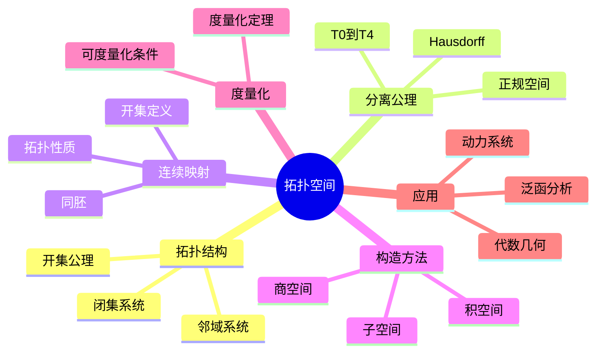

# 拓扑空间 思维导图

## 中心概念

### 精确定义
**拓扑空间** $(X, \tau)$ 是集合 $X$ 配以子集族 $\tau$（开集族），满足：(1) $\emptyset, X \in \tau$；(2) 任意并封闭；(3) 有限交封闭。拓扑结构刻画"近邻"、"极限"、"连续"等概念而不依赖度量。

### 直观理解
拓扑学被称为"橡皮几何"，研究在连续变形下保持不变的性质。拓扑空间提供了一个抽象的框架，在其中可以讨论点的"邻近"、序列的"收敛"、映射的"连续"——这是分析学、几何学的基础。

---

## 第一层分支：核心要素

### 拓扑结构
- **开集**：定义拓扑的基本元素
- **闭集**：开集的补集
- **开集公理**：空集和全集是开集；任意并封闭；有限交封闭
- **拓扑的粗细**：$\tau_1 \subseteq \tau_2$ 称 $\tau_1$ 较细，$\tau_2$ 较粗

### 开集与闭集
- **开集运算**：任意并、有限交保持开集性质
- **闭集运算**：任意交、有限并保持闭集性质
- **既开又闭（clopen）**：连通性研究的关键
- **稠密集**：闭包为全空间的子集

### 邻域系统
- **邻域**：包含某点的开集（或包含开集）
- **邻域基**：$\mathcal{B}_x$，使得每个邻域包含基中某元素
- **局部基公理**：描述拓扑的等价方式
- **第一可数**：每点有可数的邻域基
- **第二可数**：空间有可数的拓扑基

### 连续映射
- **开集定义**：$f^{-1}(U)$ 开 $\Leftrightarrow$ $U$ 开
- **邻域定义**：$f(N(x)) \subseteq N(f(x))$
- **闭集刻画**：$f^{-1}(F)$ 闭 $\Leftrightarrow$ $F$ 闭
- **复合连续性**：连续映射的复合仍连续
- **同胚**：双射双向连续，记作 $X \cong Y$

---

## 第二层分支：性质与定理

### 重要性质

#### 1. 构造拓扑的方法
- **度量诱导**：度量球的任意并生成拓扑
- **子空间拓扑**：$\tau_Y = \{Y \cap U : U \in \tau_X\}$
- **积拓扑**：乘积空间上的最粗使投影连续的拓扑
- **商拓扑**：商空间上的最细使商映射连续的拓扑

#### 2. 分离公理（Tychonoff分离公理）
- **$T_0$（Kolmogorov）**：任意两点至少一个有不包含另一点的邻域
- **$T_1$**：单点集是闭集
- **$T_2$（Hausdorff）**：任意两点有不交邻域（唯一极限）
- **$T_3$（正则）**：$T_1$ + 点和闭集可用不交邻域分离
- **$T_4$（正规）**：$T_1$ + 不交闭集可用不交邻域分离
- **关系**：$T_4 \Rightarrow T_3 \Rightarrow T_2 \Rightarrow T_1 \Rightarrow T_0$

### 核心定理

#### 1. Urysohn引理与Tietze扩张
- **Urysohn引理**：正规空间中，不交闭集可用连续函数完全分离
  - 即：$A \cap B = \emptyset$ 闭 $\Rightarrow$ $\exists f: X \to [0,1]$，$f|_A = 0$，$f|_B = 1$

- **Tietze扩张定理**：正规空间中，闭子集上的连续函数可连续扩张到全空间

#### 2. 紧致性与连续映射
- **紧致连续像**：紧空间的连续像是紧的
- **连通连续像**：连通空间的连续像是连通的
- **Hausdorff空间中的连续双射**：紧致到Hausdorff的连续双射是同胚

#### 3. 度量化定理
- **Urysohn度量化定理**：第二可数的正则空间可度量化
- **Nagata-Smirnov度量化定理**：有sigma局部有限基的拓扑空间可度量化
- **紧致Hausdorff空间**：可度量化 $\Leftrightarrow$ 第二可数

#### 4. Tychonoff定理
- **内容**：任意多紧致空间的积空间紧致
- **等价于**：选择公理
- **应用**：证明乘积空间的紧性

---

## 第三层分支：例子与应用

### 典型例子

#### 1. 度量拓扑
- **欧氏空间**：$\mathbb{R}^n$ 的标准拓扑
- **离散度量**：$d(x,y) = 1$（若 $x \neq y$），诱导离散拓扑
- **平凡度量**：仅一个开集（全集），诱导平凡拓扑

#### 2. 标准拓扑空间
- **离散拓扑**：所有子集都开
- **平凡拓扑**：仅 $\emptyset$ 和 $X$ 开
- **余有限拓扑**：开集为 $\emptyset$ 或余有限集
- **余可数拓扑**：开集为 $\emptyset$ 或余可数集

#### 3. 重要拓扑空间
- **Sierpinski空间**：两点 $\{0,1\}$，开集 $\{\emptyset, \{1\}, \{0,1\}\}$
- **长直线**：不可度量化的一维流形
- **Zariski拓扑**：代数簇上的拓扑（闭集是代数集）

### 反例

#### 1. 非Hausdorff空间
- **Zariski拓扑**：一般代数簇上
- **概形的非闭点**：如 $\operatorname{Spec}(\mathbb{Z})$ 的泛点
- **函数空间的点态收敛拓扑**

#### 2. 非正规空间
- **Niemytzki平面**：$T_{3.5}$ 但非 $T_4$
- **Sorgenfrey平面**：Sorgenfrey线的平方

### 应用场景

#### 1. 分析学
- **弱拓扑**：Banach空间的对偶弱拓扑
- **弱*拓扑**：对偶空间上的弱*拓扑
- **分布理论**：测试函数空间的拓扑

#### 2. 代数几何
- **Zariski拓扑**：代数簇的拓扑
- **概形**：局部环化空间
- **平展拓扑**：代数几何中的Grothendieck拓扑

#### 3. 泛函分析
- **算子拓扑**：强算子拓扑、弱算子拓扑
- **C*代数**：Gelfand表示
- **谱理论**：Banach代数上的拓扑

#### 4. 动力系统
- **符号动力**：符号空间上的移位映射
- **拓扑熵**：刻画动力系统的复杂性
- **结构稳定性**：小扰动下拓扑共轭

---

## 第四层分支：关联概念

### 相似概念

#### 一致空间
- **定义**：带有"一致结构"的集合
- **一致连续**：不依赖具体度量的连续性
- **完备化**：一致空间的完备化

#### 邻近空间
- **定义**：描述集合间"邻近"关系
- **关系**：一致空间、拓扑空间的推广

### 对偶概念

#### 余拓扑（闭集系统）
- **定义**：用闭集公理定义拓扑
- **等价性**：开集和闭集互为补，定义等价

### 推广概念

####  locales与frames
- **frame**：完备格满足分配律（开集的代数）
- **locale**：frame的对偶范畴
- **动机**：无点拓扑学，构造主义数学

####  Grothendieck拓扑
- **覆叠**：推广开集覆盖的概念
- **景（site）**：范畴配以Grothendieck拓扑
- **层（sheaf）**：满足下降条件的预层
- **应用**：代数几何、代数拓扑中的上同调理论

####  非交换拓扑
- **C*代数**：非交换的"函数空间"
- **Connes几何**：非交换微分几何
- **量子空间**：非交换代数对应的几何对象

---

## Mermaid思维导图

---

**参考章节**：拓扑学 - 第1章 拓扑空间与连续映射  
**关联文件**：紧致性-思维导图.md、连通性-思维导图.md
