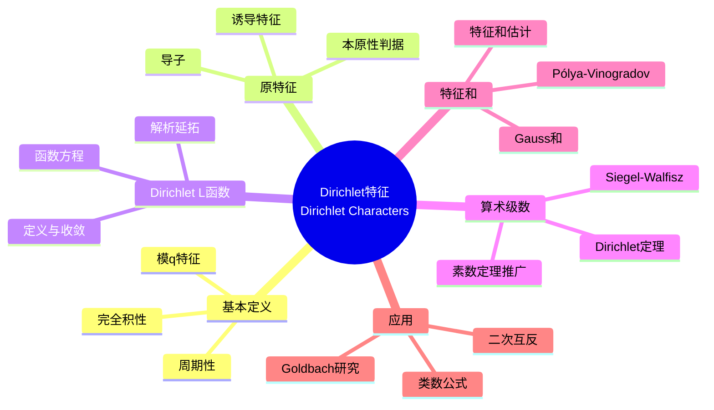

msc_primary: "00A99"
msc_secondary: ['00-XX']
---

# Dirichlet 特征 (Dirichlet Characters)

## 思维导图

---

## 一、中心概念精确定义

### 1.1 Dirichlet 特征的定义

**定义**：设 $q$ 为正整数。模 $q$ 的 **Dirichlet 特征** 是函数 $\chi: \mathbb{Z} \to \mathbb{C}$ 满足：

1. **完全积性**：$\chi(mn) = \chi(m)\chi(n)$ 对所有 $m, n \in \mathbb{Z}$
2. **周期性**：$\chi(n + q) = \chi(n)$ 对所有 $n \in \mathbb{Z}$
3. **消失条件**：若 $\gcd(n, q) > 1$，则 $\chi(n) = 0$

**主特征**：
$$\chi_0(n) = \begin{cases} 1 & \text{if } \gcd(n, q) = 1 \\ 0 & \text{if } \gcd(n, q) > 1 \end{cases}$$

### 1.2 特征的基本性质

**像的取值**：对模 $q$ 的特征 $\chi$，
$$\chi(n) \in \mu_{\phi(q)} = \{z \in \mathbb{C} : z^{\phi(q)} = 1\}$$

当 $\gcd(n, q) = 1$ 时，$\chi(n)$ 是单位根。

**特征群**：模 $q$ 的所有特征构成群 $\widehat{(\mathbb{Z}/q\mathbb{Z})^\times}$，同构于 $(\mathbb{Z}/q\mathbb{Z})^\times$，阶为 $\phi(q)$。

---

## 二、核心要素

### 2.1 原特征与本原特征

**导子（Conductor）**：特征 $\chi$ 模 $q$ 的导子是最小的 $q^* | q$ 使得存在模 $q^*$ 的特征 $\chi^*$ 满足：

$$\chi(n) = \chi^*(n) \cdot \mathbf{1}_{\gcd(n,q)=1}$$

**原特征（Primitive Character）**：若 $q^* = q$，则 $\chi$ 称为模 $q$ 的原特征。

**诱导特征**：若 $q^* | q$，则模 $q^*$ 的特征 $\chi^*$ 诱导模 $q$ 的特征：

$$\chi(n) = \begin{cases} \chi^*(n) & \text{if } \gcd(n, q) = 1 \\ 0 & \text{if } \gcd(n, q) > 1 \end{cases}$$

**本原性判据**：$\chi$ 是模 $q$ 的原特征当且仅当对所有真因子 $d | q$，存在 $n \equiv 1 \pmod{d}$ 使得 $\gcd(n, q) = 1$ 且 $\chi(n) \neq 1$。

### 2.2 Dirichlet L-函数

**定义**：对特征 $\chi$ 模 $q$，Dirichlet L-函数定义为：
$$L(s, \chi) = \sum_{n=1}^{\infty} \frac{\chi(n)}{n^s} = \prod_p \left(1 - \frac{\chi(p)}{p^s}\right)^{-1}$$

对 $\text{Re}(s) > 1$ 绝对收敛。

**欧拉乘积**：反映特征的积性与素数的联系。

**解析延拓**：
- 若 $\chi \neq \chi_0$，$L(s, \chi)$ 可解析延拓到整个复平面
- $L(s, \chi_0)$ 与 $\zeta(s)$ 相差有限个Euler因子

**函数方程**：对原特征 $\chi$ 模 $q$，
$$\Lambda(s, \chi) = q^{s/2} \Gamma_{\chi}(s) L(s, \chi)$$

满足 $\Lambda(s, \chi) = \varepsilon(\chi) \Lambda(1-s, \overline{\chi})$，其中 $|\varepsilon(\chi)| = 1$。

### 2.3 特征的正交关系

**第一正交关系**：对模 $q$ 的特征，
$$\frac{1}{\phi(q)} \sum_{\chi \pmod{q}} \chi(n) = \begin{cases} 1 & \text{if } n \equiv 1 \pmod{q} \\ 0 & \text{otherwise} \end{cases}$$

**第二正交关系**：对 $a, b \in (\mathbb{Z}/q\mathbb{Z})^\times$，
$$\frac{1}{\phi(q)} \sum_{a=1}^{q} \chi(a) \overline{\psi}(a) = \begin{cases} 1 & \text{if } \chi = \psi \\ 0 & \text{otherwise} \end{cases}$$

**应用**：正交关系是将求和限制到算术级数的关键工具。

### 2.4 Gauss 和

**定义**：对模 $q$ 的特征 $\chi$，Gauss 和定义为：
$$\tau(\chi) = \sum_{n=1}^{q} \chi(n) e^{2\pi i n/q}$$

**性质**：
- $|\tau(\chi)| = \sqrt{q}$ 对原特征成立

- $\tau(\chi)\tau(\overline{\chi}) = \chi(-1)q$

**二次 Gauss 和**：对 Legendre 符号 $\left(\frac{\cdot}{p}\right)$，
$$\tau = \sum_{n=1}^{p} \left(\frac{n}{p}\right) e^{2\pi i n/p} = \begin{cases} \sqrt{p} & \text{if } p \equiv 1 \pmod{4} \\ i\sqrt{p} & \text{if } p \equiv 3 \pmod{4} \end{cases}$$

### 2.5 特征和估计

**Pólya-Vinogradov 不等式**：对模 $q$ 的非主原特征 $\chi$，
$$\left| \sum_{n \leq x} \chi(n) \right| \ll \sqrt{q} \ln q$$

**Burgess 界**：对任意 $\varepsilon > 0$，
$$\sum_{n \leq x} \chi(n) \ll x^{1 - 1/r} q^{(r+1)/4r^2 + \varepsilon}$$

其中 $r \geq 2$，这在短区间估计中优于 Pólya-Vinogradov。

---

## 三、性质与定理

### 定理 3.1：Dirichlet 定理（1837）

若 $\gcd(a, q) = 1$，则算术级数 $a + q\mathbb{Z}$ 包含无穷多个素数。

**证明概要**：
1. 考虑 $L(1, \chi)$ 对非主特征 $\chi$
2. 证明 $L(1, \chi) \neq 0$
3. 利用正交关系：
$$\sum_{p \equiv a \pmod{q}} \frac{1}{p^s} = \frac{1}{\phi(q)} \sum_{\chi} \overline{\chi}(a) \log L(s, \chi) + O(1)$$

### 定理 3.2：$L(1, \chi)$ 的非零性

对非主特征 $\chi$ 模 $q$，$L(1, \chi) \neq 0$。

**证明方法**：
- 对复特征：利用 $\prod_{\chi} L(s, \chi)$ 的 Dirichlet 级数非负
- 对实特征（二次特征）：利用类数公式

### 定理 3.3：算术级数素数定理

设 $\gcd(a, q) = 1$，则：
$$\pi(x; q, a) = \sum_{\substack{p \leq x \\ p \equiv a \pmod{q}}} 1 \sim \frac{1}{\phi(q)} \cdot \frac{x}{\ln x}$$

**等分布性**：素数在允许剩余类中均匀分布。

### 定理 3.4：Siegel-Walfisz 定理

对任意 $A > 0$，存在 $c_A > 0$ 使得：
$$\pi(x; q, a) = \frac{\text{li}(x)}{\phi(q)} + O(x \exp(-c_A \sqrt{\ln x}))$$

对 $q \leq (\ln x)^A$ 一致成立。

**Siegel 零点问题**：定理中的常数 $c_A$ 不可有效计算，这与可能的实零点（Siegel 零点）有关。

### 定理 3.5：L-函数的零点分布

**Page 定理**：存在绝对常数 $c > 0$ 使得对模 $q \leq Q$ 的所有特征，至多存在一个实特征 $\tilde{\chi}$ 使得 $L(s, \tilde{\chi})$ 有实零点 $\tilde{\beta} > 1 - c/\ln Q$。

---

## 四、典型例子

### 例子 4.1：Legendre 符号

设 $p$ 为奇素数，**Legendre 符号**模 $p$ 定义为：
$$\left(\frac{n}{p}\right) = \begin{cases} 0 & \text{if } p | n \\ 1 & \text{if } n \text{ 是模 } p \text{ 二次剩余} \\ -1 & \text{if } n \text{ 是模 } p \text{ 二次非剩余} \end{cases}$$

这是模 $p$ 的实原特征，取值于 $\{-1, 0, 1\}$。

**对应的 L-函数**：
$$L\left(s, \left(\frac{\cdot}{p}\right)\right) = \sum_{n=1}^{\infty} \frac{(n/p)}{n^s}$$

### 例子 4.2：模 4 特征

模 4 有两个特征：

**主特征** $\chi_0$：

| $n$ | 1 | 2 | 3 | 4 |
|-----|---|---|---|---|
| $\chi_0(n)$ | 1 | 0 | 1 | 0 |

**非主特征** $\chi_1$（对应于 Legendre 符号 $(\frac{-1}{\cdot})$）：

| $n$ | 1 | 2 | 3 | 4 |
|-----|---|---|---|---|
| $\chi_1(n)$ | 1 | 0 | -1 | 0 |

**对应的 L-函数**：
$$L(s, \chi_1) = 1 - \frac{1}{3^s} + \frac{1}{5^s} - \frac{1}{7^s} + \cdots = \beta(s)$$

其中 $\beta(1) = \pi/4$（Leibniz 公式）。

### 例子 4.3：模 5 特征

模 5 有 $\phi(5) = 4$ 个特征。设 $g = 2$ 是 $(\mathbb{Z}/5\mathbb{Z})^\times$ 的生成元，则特征由 $\chi(2) = \zeta_4^k$ 决定，其中 $\zeta_4 = i$，$k = 0, 1, 2, 3$。

| $n$ | 1 | 2 | 3 | 4 |
|-----|---|---|---|---|
| $\chi_0(n)$ | 1 | 1 | 1 | 1 |
| $\chi_1(n)$ | 1 | $i$ | $-i$ | $-1$ |
| $\chi_2(n) = (n/5)$ | 1 | $-1$ | $-1$ | 1 |
| $\chi_3(n)$ | 1 | $-i$ | $i$ | $-1$ |

**验证 Dirichlet 定理**：
$$\sum_{p \leq x} \chi_2(p) = \sum_{\substack{p \leq x \\ p \equiv 1, 4 \pmod{5}}} 1 - \sum_{\substack{p \leq x \\ p \equiv 2, 3 \pmod{5}}} 1 = O(x \exp(-c\sqrt{\ln x}))$$

表明素数在模 5 的四个剩余类中均匀分布。

---

## 五、关联概念

### 5.1 直接关联

| 概念 | 关联描述 |
|------|----------|
| **算术级数** | Dirichlet 特征是研究算术级数中素数的基本工具 |
| **L-函数** | 特征对应的解析函数，推广了 Riemann ζ 函数 |
| **二次互反律** | Legendre 符号与 Gauss 和密切相关 |
| **类数公式** | $L(1, \chi)$ 与二次域的类数直接相关 |

### 5.2 扩展关联

| 概念 | 关联描述 |
|------|----------|
| **代数数论** | 特征与数域的 Galois 群表示对应 |
| **模形式** | Dirichlet 特征的模推广产生 Hecke 特征 |
| **自守形式** | 特征理论在高维的推广（Hecke 特征、Grossencharakter） |
| **代数几何** | 特征与 étale 上同调的联系（Weil 猜想） |

### 5.3 应用领域

- **密码学**：二次剩余在加密算法中的应用
- **计算数论**：素性测试中的特征和计算
- **物理**：量子混沌与 L-函数的联系

---

## 六、深入阅读与参考

### 推荐教材

1. **Davenport, H.** - *Multiplicative Number Theory* (3rd ed., Springer, 2000)
   - 第1-9章系统介绍 Dirichlet 特征和 L-函数

2. **Iwaniec, H. & Kowalski, E.** - *Analytic Number Theory* (AMS, 2004)
   - 第2-4章现代视角

3. **Washington, L. C.** - *Introduction to Cyclotomic Fields* (Springer, 1997)
   - 特征理论与分圆域的联系

4. **Apostol, T. M.** - *Introduction to Analytic Number Theory* (Springer, 1976)
   - 适合入门的经典教材

### 经典论文

- **Dirichlet, P. G. L.** (1837) - "Beweis des Satzes, dass jede unbegrenzte arithmetische Progression..."
- **de la Vallée Poussin, C. J.** (1896) - "Recherches analytiques sur la théorie des nombres premiers"

---

## 七、总结

Dirichlet 特征是解析数论的核心工具，其意义在于：

1. **算术级数**：证明素数在等差数列中的无穷性和等分布
2. **解析方法**：L-函数提供了研究数论问题的解析工具
3. **代数结构**：特征群反映了剩余类乘法的对偶结构
4. **深刻联系**：与代数数论、代数几何、表示论的广泛联系

**未解决问题**：
- Siegel 零点的存在性
- L-函数的 Grand Riemann 假设
- 特征和的最佳估计（Burgess 界的改进）

---

*文档版本：1.0*  
*创建日期：2026年4月*  
*对齐标准：MIT 18.782 Introduction to Arithmetic Geometry*
